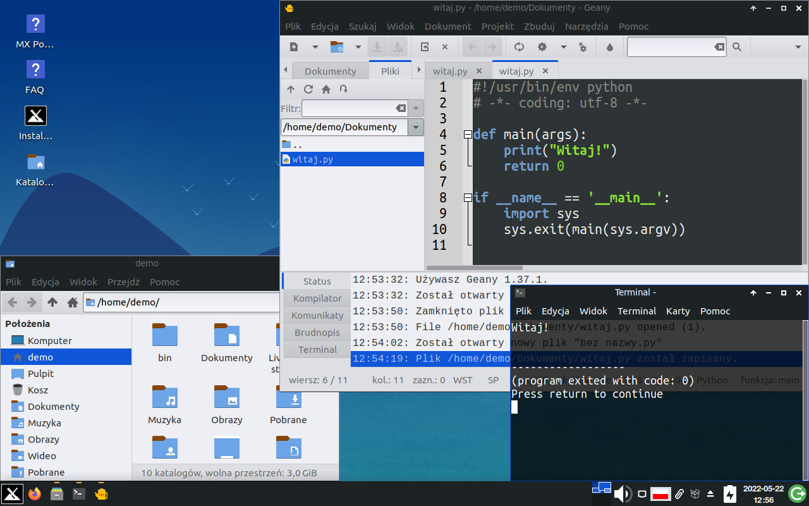
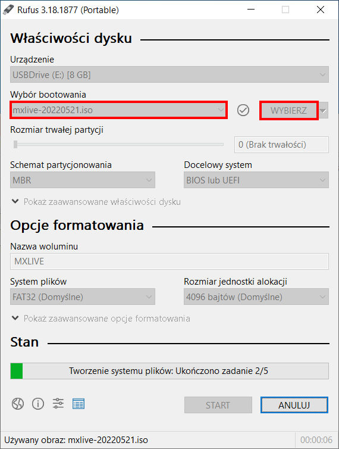
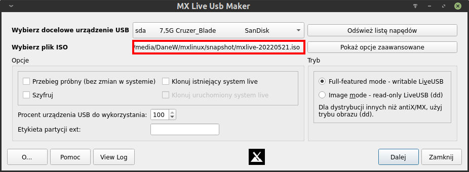
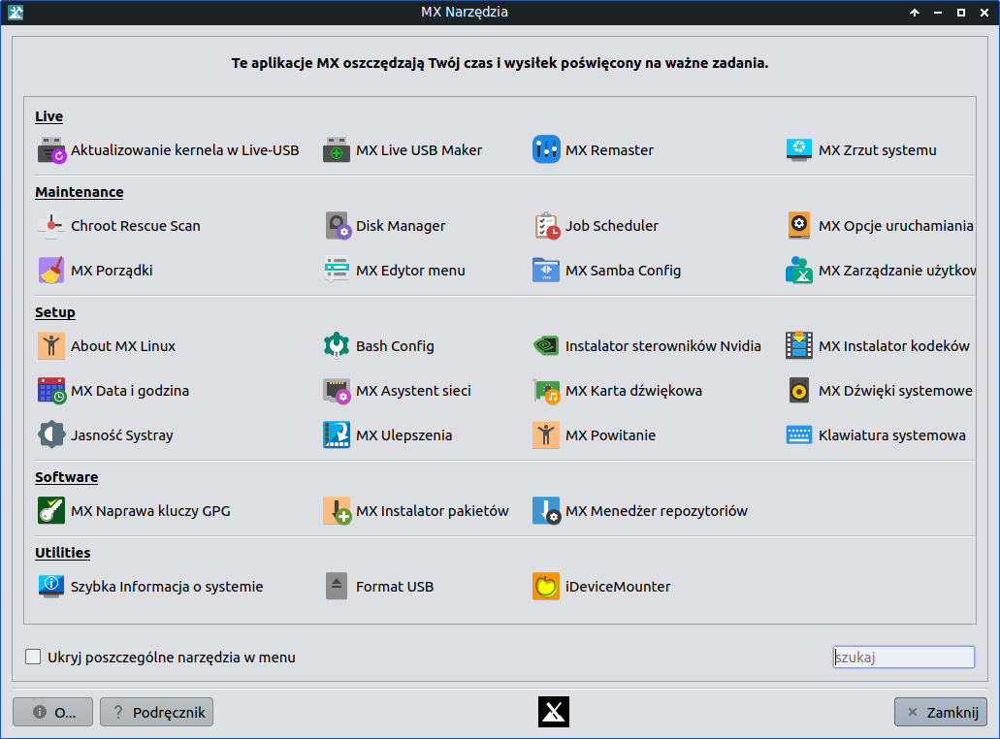
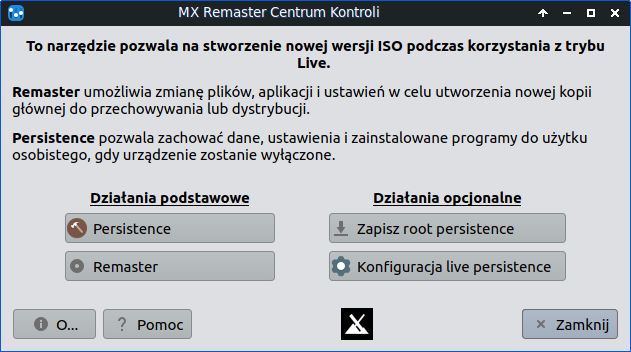
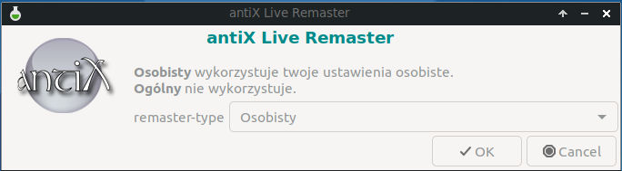
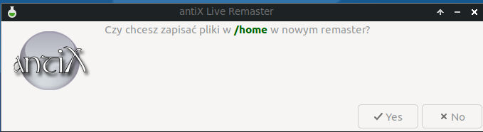
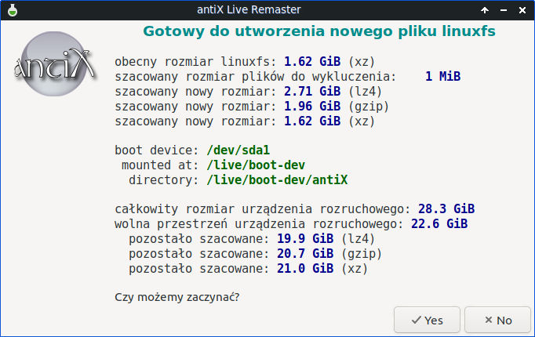
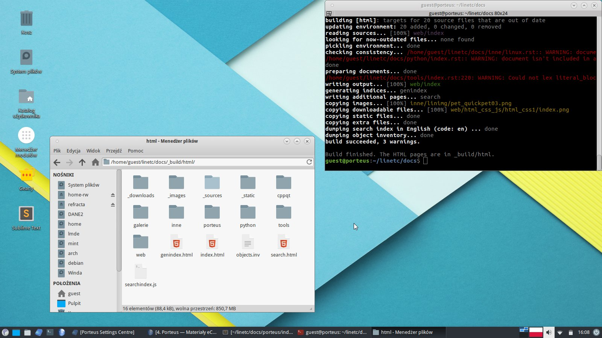

.. _linux-live:

Linux Live USB
##############

Klucz USB z systemem w wersji *live* pozwala na uruchomienie
komputera, testowanie i pracę bez ingerowania w dane na
twardym dysku (np. inne systemy). Dystrybucje *live* można zainstalować
w maszynie wirtualnej lub na dysku twardym.

Do realizacji scenariuszy i codziennej pracy, dla nauczycieli i uczniów proponujemy dystrybucję
**MX Linux** (opartą na Debianie). System zawiera wszystkie wymagane narzędzia,
umożliwia doinstalowywanie programów i pakietów, po wstępnej konfiguracji pozwala na zapisywanie ustawień,
skryptów i dokumentów.

   MXLinux 22.01 XFCE 64-bit

.. _usb-creator:

W systemie Windows
==================

* Pobieramy :term:`obraz iso` `MXLinux2201.iso <https://drive.google.com/drive/folders/1gS8hcC0J8m47VkNdoPlrNxrejdEW8Yqa?usp=sharing>`_ (2,49GB).
* Pobieramy program `Rufus <https://rufus.akeo.ie/>`_.
* Wpinamy pendrajwa o pojemności min. 4 GB.
* Uruchamiamy *Rufusa*, upewniamy się, że na liście "Urządzenie" wybrany jest właściwy pendrajw,
  klikamy przycisk "Wybierz" i wskazujemy ściągnięty obraz iso.
  Klikamy "Start" i czekamy na napis "Gotowe".

W Linuksie
==========

* Pobieramy :term:`obraz iso` `MXLinux2201.iso <https://drive.google.com/drive/folders/1gS8hcC0J8m47VkNdoPlrNxrejdEW8Yqa?usp=sharing>`_ (2,49GB).
* Pobieramy archiwum programu `live-usb-maker-qt-21.11 appimage <https://github.com/dolphinoracle/lum-qt-appimage/releases>`_
  i rozpakowujemy go w dowolnym katalogu.
* Wpinamy pendrajwa o pojemności min. 4 GB.
* Rozpakowany program uruchamiamy w terminalu:

  .. code-block:: bash

      ~$ sudo ./live-usb-maker-qt-21.11glibc2.28-x86_64.AppImage

* Po uruchomieniu programu klikamy przycisk "Wybierz" i wskazujemy ściągnięty obraz iso.
  Klikamy "Dalej" i czekamy na nagranie obrazu.

MX Linux Live USB
=================

Login i hasło domyślnego użytkownika to: **demo**.

Ustawienie języka
-----------------

Po uruchomieniu komputera z przygotowanego klucza USB zobaczymy menu startowe bootmenedżera:

* wybieramy pozycję **Language - Keyboard - Timezone** / **Language** / **lang=pl_PL: Polski - Polish**.
* wracamy do głównego menu **Back to main menu**, wybieramy **Advanced Options** / **Save options:** / **grubsave Save options (LiveUSB only) -> GRUB menu**.
  Dzięki temu ustawienia języka zostaną zapamiętane.

Zapamiętywanie zmian
--------------------

MX Linux Live USB może być aktualizowany, można również instalować w nim dodatkowe programy,
np. środowiska IDE do programowania. Zmiany mogą być zapamiętywane po włączeniu odpowiednich
opcji *persistence* dostępnych w menu startowym bootmenedżera: **Advanced Options / Persistence option:**.
Możemy zapamiętywać zmiany w systemie (**root**) lub / i w katalogu użytkownika (**home**).

* Proponujemy wybrać **persist_all**, następnie wracamy do głównego menu i uruchamiamy system.
* Podczas startu wyświetlą się prośby o utworzenie plików `rootfs` i `homefs`, w których zapisywane będą zmiany.
  W zależności od rozmiarów klucza USB można zaakceptować rozmiary domyślne lub wybrać niestandardowe, np. 2GB.
* Na ewentualne pytanie, czy utworzyć *live-usb swap file* (plik wymiany) możemy odpowiedzieć "nie".
* Na ewentualne pytanie, czy skopiować pliki do *home persistence* odpowiadamy "tak".
* W razie potrzeby podajemy nowe hasła dla użytkownika *root* i *demo*.

.. note::

   W zależności od sposobu utworzenia klucza USB z Linuksem Live maksymalny rozmiar plików przechowujących
   zmiany może być ograniczony przez wykorzystywany system plików, np. FAT32 obsługuje pliki do 4GB.
   Jeżeli korzystamy z systemu EXT4, ogranicza nas tylko rozmiar klucza USB.

   Niezależnie od trybu *persistence* pliki zapisane w katalogu `Live-usu-storage` zapisywane są na pendrajwie.

Remastering
-----------

Opcja *persistence* uwzględniająca zmiany w *root*, czyli utworzenie pliku `rootfs`, pozwala zapamiętywać
zaktualizowane i dodane pakiety, ale jesteśmy ograniczeni rozmiarem wspomnianego pliku.
**Remastering** pozwala zaktualizować wersję live, czyli zapisać aktualny stan systemu na Linux Live USB
i zwolnić miejsce zajmowane przez zmiany zapisane w trybie *persistence*.

* Uruchamiamy aplikację MX Narzędzia i wybieramy MX Remaster.

* W oknie "MX Remaster Centrum Kontroli" klikamy "Remaster".

* Jako "remaster-type" wybieramy "Osobisty".

* Na pytanie, czy chcemy zapisać pliki w `/home` klikamy "Yes".

* W oknie podsumowującym klikamy "Yes".

Po zakończeniu operacji na pendrajwie w katalogu :file:`antiX` zostanie utworzony nowy plik :file:`linuxfs`.
Poprzednią wersję zapisaną w pliku :file:`linuxfs.old` można usunąć, aby zwolnić miejsce na pendrajwie.

Materiały archiwalne
====================

Zalecamy używanie dystrybucji MX Linux Live, poniżej zamieszczamy jednak linki
do obrazu iso dystrybucji Porteus przygotowanej na potrzeby realizacji projektu KzK w 2018 r.

  - `porteus322XFCE.iso <https://drive.google.com/open?id=0B1zG9cfNyT7WakRQN1BWUEV4UFk>`_ (597MB)

   Porteus 3.2.2 XFCE 64-bit

.. note::

  Wszystkie wersje zawierają edytor Geany. Dodatkowe programy w postaci modułów
  (np. IDE SublimeText3, PyCharm Professional) są albo w obrazie
  albo do pobrania i dodania.

Zobacz również:

  - `Pierwsze uruchomienie Porteusa <http://linetc.readthedocs.io/pl/latest/porteus/index.html#pierwsze-uruchomienie>`_,
  - `Moduły w Porteusie <http://linetc.readthedocs.io/pl/latest/porteus/index.html#moduly>`_,

.. toctree::
    :maxdepth: 2
    :numbered:

    live_vb.rst
    problemy.rst
    opcje.rst
    lxpup.rst
