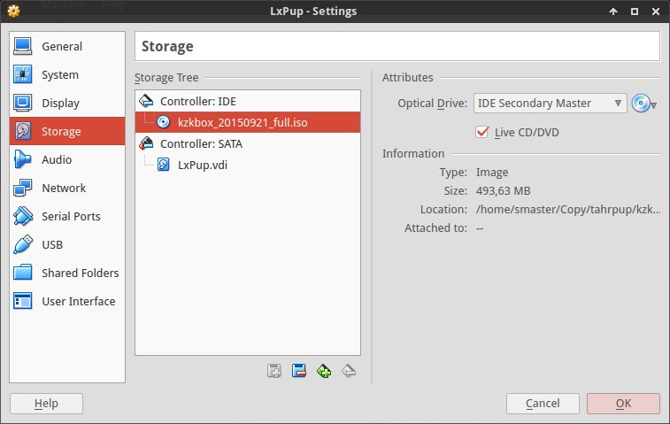
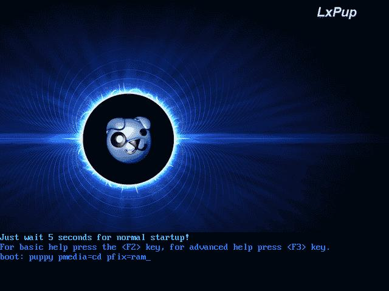
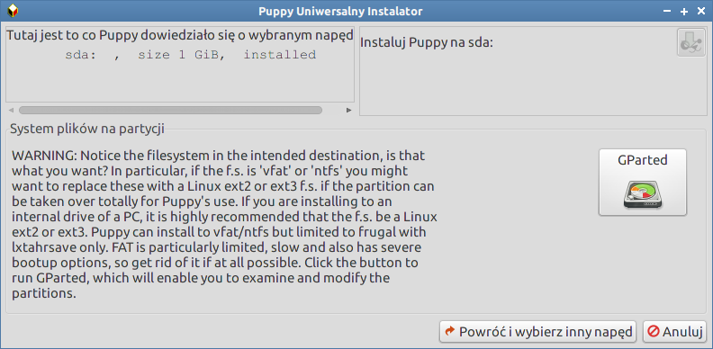
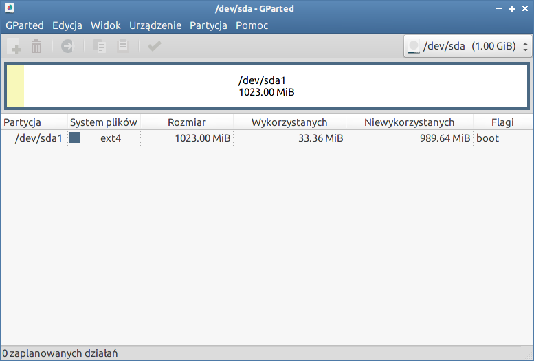
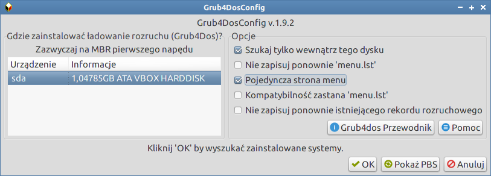
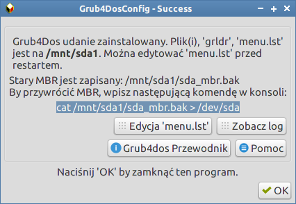
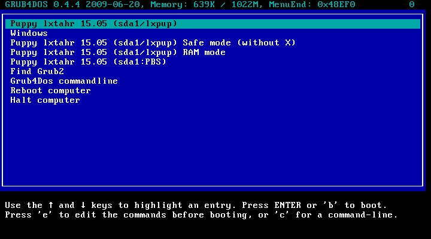

W maszynie wirtualnej
#####################

Dystrybucję *LxPupXenial* łatwo uruchomić w dowolnym systemie za pomocą tzw. maszyny wirtualnej.

1) Pobieramy program `VirtualBox <https://www.virtualbox.org/wiki/Downloads>`_ w wersji
   dla naszego systemu  i instalujemy.
2) Pobieramy `maszynę wirtualną z LxPupXenial <https://www.dropbox.com/s/vp2wt429buh4iw1/KzK_Linux.ova?dl=0>`_
   (1,1 GB) w formacie OVA.
3) Uruchamiamy VirtualBox, wybieramy polecenie "Plik/Importuj urządzenie wirtualne"
   i wskazujemy ściągnięty w poprzednim kroku plik. Po zaimportowaniu maszyny klikamy "Uruchom".

*LxPupXenial* można też zainstalować w VirtualBoksie samemu. Aby to zrobić, uruchamiamy aplikację
i tworzymy nową maszynę wirtualną:

* nazwa – np. "LxPup", typ – *Linux*, wersja – *Ubuntu (32-bit)*;
* rozmiar pamięci – min. 1024MB
* tworzymy dysk twardy VDI o stałym rozmiarze min. 2048MB

Po utworzeniu maszyny w sekcji "Storage" jako dysk rozruchowy wskazujemy
ściągnięty :term:`obraz iso` dystrybucji, np. ``kzkbox20160922_full.iso``:

Uruchamiamy maszynę, ale na ekranie rozruchowym systemu podajemy dodatkowe
parametry uruchomieniowe: ``puppy pmedia=cd pfix=ram``:

Po uruchomieniu systemu zamykamy kreatora konfiguracji, w przypadku problemów z rozdzielczością
przechodzimy do trybu pełnoekranowego (:kbd:`HOST+F` lub menu *View/Full screen Mode*)
i uruchamiamy instalatora poleceniem *Start/Konfiguracja/Puppy uniwersalny instalator*.

1) W oknie "Instaluj" wybieramy *Uniwersalny instalator*;
2) W kolejnym wybieramy *Wewnętrzny (IDE lub SATA) dysk twardy*;
3) Następnie wskazujemy dysk *sda ATA VBOX HARDDISK* za pomocą ikony;
4) Kolejne okno umożliwi uruchomienie edytora GParted, za pomocą którego
   założymy i sformatujemy partycję systemową;

5) W edytorze GParted wybieramy kolejno:

   a) w menu *Urządzenie/Utwórz tablicę partycji*, kolejne okno potwierdzamy *Zastosuj*;
   b) Klikamy nieprzydzielone miejsce prawym klawiszem i wybieramy *Nowa*, wybieramy
      "Partycja główna" i system "Ext4", zatwierdzamy *Dodaj*;
   c) Następnie wybieramy *Edycja/Zastosuj wszystkie działania* lub klikamy ikonę "zielonego ptaszka";
   d) Na koniec klikamy utworzoną partycję prawym klawiszem, wybieramy *Zarządzaj flagami*,
      zaznaczamy opcję "boot" i zatwierdzamy *Zamknij*; w efekcie powinniśmy zobaczyć
      co następuje:

6) Po zamknięciu edytora GParted, ponownie wskazujemy dysk "sda",
   a w kolejnym, powtórzonym oknie klikamy ikonę w prawym górnym rogu obok
   napisu "Instaluj Puppy na sda1";
7) W kolejnym oknie potwierdzamy instalację przyciskiem *OK*;
8) W następnym klikamy przycisk *CD*, aby wskazać położenie plików systemowych,
   i jeszcze raz potwierdzamy przyciskiem "OK";
9) W kolejnym oknie wybieramy *OSZCZĘDNY* tryb instalacji – system będzie zachowywał się
   tak, jakby był zainstalowany na pendrajwie; następne wyjaśnienia potwierdzamy *OK*;
10) Podajemy nazwę katalogu, w którym znajdą się pliki systemowe, np. "lxpup";
11) Po skopiowaniu plików wybieramy instalację bootmenedżera *grub4dos* przyciskiem *Tak*;
12) W oknie instalacyjnym Grub4Dos zaznaczamy opcje zgodnie ze zrzutem:

13) W kolejnym oknie zatwierdzamy listę wykrytych systemów *OK*,
    a w następnym potwierdzamy instalację bootmenedżera w MBR;
14) Na koniec zamykamy informację o udanej instalacji:

Zamykamy LxPup (*Start/Zamknij*), usuwamy plik obrazu iso z wirtualnego napędu
i możemy uruchomić LxPupTahr w maszynie wirtualnej:

System zainstalowany w ten sposób działa tak samo jak zainstalowany na kluczu USB,
a więc wymaga potwierdzenia konfiguracji wstępnej i utworzenia pliku zapisu.
Zob.: :ref:`Pierwsze uruchomienie <lxpup>`!!!

.. tip::

  Za pomocą VirtualBoksa można zainstalować dowolną inną dystrybucję Linuksa
  z pobranego obrazu *iso*. Taka instalacja zadziała jak "normalny" system,
  a więc umożliwi aktualizację i instalację oprogramowania, a także zapis
  tworzonych dokumentów.

.. tip::

  W przypadku problemów z działaniem myszy w wirtualnym systemie,
  warto spróbować wyłączyć ewentualną automatyczną integrację kursora
  za pomocą skrótu :kbd:`HOST+I`. Klawisz ``HOST`` to wskazany w menu
  *File/Preferences/Input/Virtual Machine* klawisz umożliwiający
  sterowanie wirtualną maszyną. Dla polskiej klawiatury można
  ustawić np. prawy CTRL.