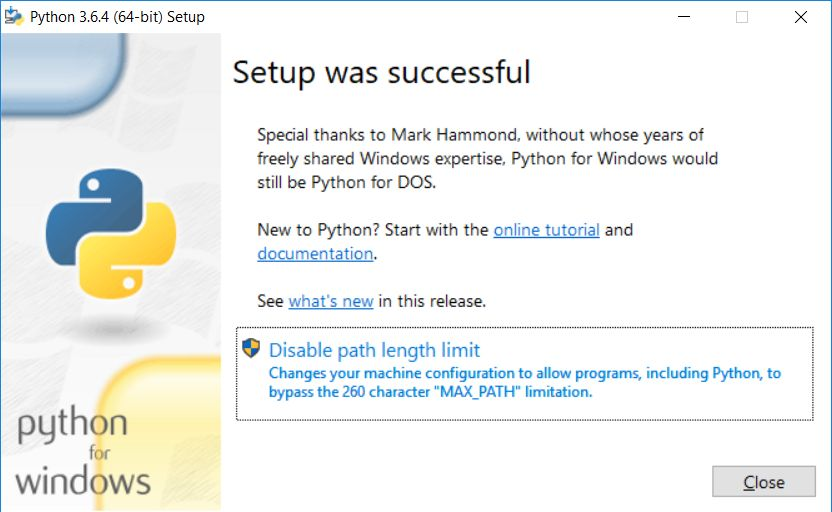

.. _windows-env:

Przygotowanie systemu Windows
#############################

.. _python-ins:

Interpreter Pythona
===================

.. note::

  Przed rozpoczęciem instalacji Pythona zaktualizuj sytem.

Na stronie `Python Releases for Windows <https://www.python.org/downloads/windows/>`_
klikamy link *Last Python 3 Release - ...* i pobieramy instalator
:file:`Windows executable installer` w wersji *x86-64* (64-bitowej).

.. tip::

    Podczas instalacji zaznaczamy opcję "Add Python.exe to Path" i wybieramy "Customize installation".

Na końcu instalacji można aktywować opcję "Disable path length limit".

Podczas pierwszego uruchomienia możemy zobaczyć komunikat zapory systemowej.
Zezwalamy na dostęp wybierając sieci prywatne:

Narzędzia
==========

Git
----

Podstawowego klienta w wersji 64-bitowej pobieramy ze strony
`Downloading Git <https://git-scm.com/download/win>`_ i instalujemy, zaznaczając wszystkie opcje.

:ref:`Alternatywna metoda instalacji <git-install>`, jak również zasady pracy z repozytoriami
omówione zostały w osobnym :ref:`dokumencie <git-howto>`. Gorąco zachęcamy do jego przejrzenia.

Rozszerzona konsola
-------------------

W wierszu poleceń wydajemy następujące polecenia:

.. code-block:: bat

    pip install ipython qtconsole pyqt5

.. _sqlite3-win:

SQLite3
-------

Ze strony `SQLite Download Page <http://https://www.sqlite.org/download.html>`_,
z sekcji *Precompiled Binaries for Windows* ściągamy powłokę dla 64-bitowej wersji Windows.
Przykładowe archiwum :file:`sqlite-dll-win64-x64-3380500.zip` należy rozpakować,
najlepiej do katalogu systemowego (:file:`C:\\Windows\\System32`),
żeby był dostępny z każdej lokalizacji.

.. _pyqt-win:

Biblioteki
==========

.. tip::

    W przypadku bibliotek warto rozważyć instalację
    w :ref:`środowisku wirtualnym <pve>` dostępną dla zwykłego użytkownika.

PyQt
-----

*Qtconsole* wymaga bibliotek PyQt. W 64-bitowej wersji Windowsa w wierszu poleceń wydajemy polecenie:

.. code-block:: bat

    pip install python-qt5

.. _pygame-win:

PyGame
-------

Jest to moduł wymagany m.in. przez scenariusze gier. W przypadku Windows 32-bitowego ze strony
`PyGame <http://pygame.org>`_ pobieramy plik
`pygame-1.9.1.win32-py2.7.msi <http://pygame.org/ftp/pygame-1.9.1.win32-py2.7.msi>`_
i instalujemy:

.. figure:: img/pygame_windows01.jpg

W przypadku wersji 64-bitowej wchodzimy na stronę
`http://www.lfd.uci.edu/~gohlke/pythonlibs <http://www.lfd.uci.edu/~gohlke/pythonlibs>`_
i pobieramy pakiet ``pygame‑1.9.3‑cp36‑cp36m‑win_amd64.whl`` (dla Pythona 3.6).
Następnie otwieramy terminal w katalogu z zapisanym pakietem i wydajemy polecenie:

.. code-block:: bat

    pip install pygame-1.9.2b1-cp27-cp27m-win_amd64.whl

.. _matplotlib-win:

Matplotlib
----------

Wejdź na stronę `http://www.lfd.uci.edu/~gohlke/pythonlibs <http://www.lfd.uci.edu/~gohlke/pythonlibs>`_
i pobierz pakiety ``numpy`` oraz ``matplotlib`` w formacie ``whl`` dostosowane do wersji Pythona i Windows.
Np. jeżeli mamy *Pythona 3.6.x* i *Windows 64-bit*, pobierzemy:
``numpy‑1.13.1+mkl‑cp36‑cp36m‑win_amd64.whl`` i ``matplotlib‑2.0.2‑cp36‑cp36m‑win_amd64.whl``.
Następnie otwieramy terminal w katalogu z pobranymi pakietami i instalujemy:

.. code-block:: bat

    pip install numpy‑1.13.1+mkl‑cp36‑cp36m‑win_amd64.whl
    pip matplotlib‑2.0.2‑cp36‑cp36m‑win_amd64.whl

.. note::

    Oficjalne kompilacje **matplotlib** dla Windows dostępne są w serwisie
    `Sourceforge matplotlib <http://sourceforge.net/projects/matplotlib/files/matplotlib>`_.

.. _webapps-win:

Frameworki WWW
--------------

Instalacja bibliotek wymaganych do scenariuszy *Aplikacje WWW*:

.. code-block:: bat

    pip install flask flask-wtf peewee sqlalchemy flask-sqlalchemy django

Brak Pythona?
=============

Jeżeli nie możemy wywołać interpretera lub instalatora ``pip`` w wierszu poleceń,
oznacza to zazwyczaj, że zapomnieliśmy zaznaczyć opcji "Add Python.exe to Path" podczas
instalacji interpretera. Najprościej zainstalować go jeszcze raz z zaznaczoną
opcją.

Można też samemu rozszerzyć zmienną systemową ``PATH`` swojego użytkownika
o ścieżkę do ``python.exe``. Najwygodniej wykorzystać konsolę PowerShell:

.. code-block:: posh

    [Environment]::SetEnvironmentVariable("Path", "$env:Path;C:\Python36\;C:\Python36\Scripts\", "User")

Ewentualnie, jeśli posiadamy uprawnienia administracyjne, możemy zmienić zmienną ``PATH`` wszystkim użytkownikom:

.. code-block:: posh

    $CurrentPath=[Environment]::GetEnvironmentVariable("Path", "Machine")
    [Environment]::SetEnvironmentVariable("Path", "$CurrentPath;C:\Python36\;C:\Python36\Scripts\", "Machine")

Jeżeli nie mamy dostępu do konsoli PowerShell, w oknie "Uruchamianie" (:kbd:`WIN+R`)
wpisujemy polecenie wywołujące okno "Zmienne środowiskowe" – można je również
uruchomić z okna właściwości komputera:

.. code-block:: bat

    rundll32 sysdm.cpl,EditEnvironmentVariables

.. figure:: img/winpath01.jpg
.. figure:: img/winpath02.jpg

Następnie klikamy przycisk "Nowa" i dopisujemy ścieżkę do katalogu z Pythonem, np.:
``PATH=%PATH%;C:\Python36\;C:\Python36\Scripts\``; w przypadku zmiennej systemowej
klikamy "Edytuj", a ścieżki ``C:\Python36\;C:\Python36\Scripts\`` dopisujemy po średniku.
Dla pojedynczej sesji (do momentu przelogowania się) możemy użyć polecenia w konsoli tekstowej:

.. code-block:: bat

    set PATH=%PATH%;c:\Python36\;c:\Python36\Scripts\

.. warning::

    W powyższych przykładach założono, że Python zainstalowany został w katalogu
    :file:`C:\Python36`, co nie jest opcją domyślną.
