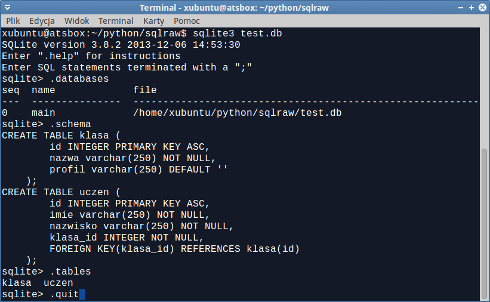
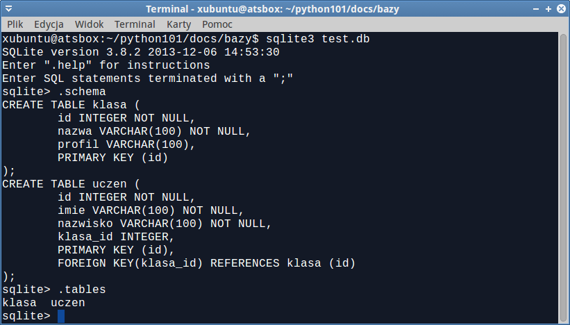

Bazy danych w Pythonie
#######################

Tworzenie i zarządzanie bazami danymi za pomocą Pythona z wykorzystaniem
wbudowanego modułu `sqlite3 DB-API`_, a także zewnętrznych bibliotek ORM:
`Peewee`_ oraz `SQLAlchemy`_

.. _sqlite3 DB-API: https://docs.python.org/2/library/sqlite3.html
.. _Peewee: http://peewee.readthedocs.org/en/latest/index.html
.. _SQLAlchemy: http://www.sqlalchemy.org

.. note::

    Poniższe przykłady wykorzystywać będą prostą, wydajną, stosowaną
    zarówno w prostych, jak i zaawansowanych projektach, `bazę danych SQLite3`_.
    Gdy zajdzie potrzeba, można je jednak wyorzystać w pracy z innymi
    bazami, takimi jak np. MySQL, MariaDB czy PostgresSQL.
    Do testowania baz danych SQLite można wykorzystać przygotowane przez
    jej twórców konsolowe narzędzie `sqlite3`_. W linuksach opartych na Debianie
    (m. in. Ubuntu i pochodne) instalujemy je poleceniem typu:
    ``apt-get install sqlite3``; w systemach Windows natomiast rozpakowujemy
    z pobranego `archiwum`_.

.. _bazę danych SQLite3: http://www.sqlite.org/
.. _sqlite3: http://www.sqlite.org/cli.html
.. _archiwum: http://www.sqlite.org/download.html

SQL
*****************

Jak wiadomo, do obsługi bazy danych wykorzystywany jest strukturalny
język zapytań `SQL`_. Jest on m.in. przedmiotem nauki na lekcjach informatyki
na poziomie rozszerzonym w szkołach ponadgimnazjalnych. Używając Pythona
można łatwo i efektywnie pokazać używanie SQL-a, zarówno z poziomu wiersza
poleceń, jak również z poziomu aplikacji internetowych WWW. Na początku
zajmiemy się skryptem konsolowym, co pozwala przećwiczyć "surowe" polecenia SQL-a.

.. _SQL: http://pl.wikipedia.org/wiki/SQL

Połączenie z bazą
==================

W ulubionym edytorze tworzymy plik `sqlraw.py` i umieszczamy w nim poniższy kod:

.. raw:: html

    
Kod nr 

.. literalinclude:: sqlraw01.py
    :linenos:

Przede wszystkim importujemy moduł `sqlite3` do obsługi baz SQLite3. Następnie w zmiennej ``con``
tworzymy połączenie z bazą danych przechowywaną w pliku na dysku (``test.db``, nazwa pliku
jest dowolona) lub w pamięci, jeśli podamy ``':memory:'``. Kolejna instrukcja ustawia właściwość
``row_factory`` na wartość ``sqlite3.Row``, aby możliwy był dostęp do kolumn (pól tabel) nie tylko
przez indeksy, ale również przez nazwy. Jest to bardzo przydatne podczas odczytu danych.

Aby móc wykonywać operacje na bazie, potrzebujemy obiektu tzw. kursora, tworzymy go
poleceniem ``cur = con.cursor()``. I tyle potrzeba, żeby rozpocząć pracę z bazą.
Skrypt możemy uruchomić poleceniem podanym niżej, ale na razie nic się jeszcze nie stanie...

.. code:: bash

    ~ $ python sqlraw.py

Model bazy
=====================

Zanim będziemy mogli wykonywać podstawowe operacje na bazie danych określane skrótem
:term:`CRUD` – *Create* (tworzenie), *Read* (odczyt), *Update* (aktualizacja), *Delete* (usuwanie) -
musimy utworzyć tabele i relacje między nimi według zaprojektowanego schematu.
Do naszego pliku dopisujemy więc następujący kod:

.. raw:: html

    
Kod nr 

.. literalinclude:: sqlraw02.py
    :linenos:
    :lineno-start: 16
    :lines: 16-

Jak widać pojedyncze polecenia SQL-a wykonujemy za pomocą metody ``.execute()`` obiektu kursora.
Warto zwrócić uwagę, że w zależności od długości i stopnia skomplikowania instrukcji SQL,
możemy je zapisywać w różny sposób. Proste polecenia podajemy w cudzysłowach, bardziej
rozbudowane lub kilka instrukcji razem otaczamy potrójnymi cudzysłowami. Ale uwaga:
wiele instrukcji wykonujemy za pomocą metody ``.executescript()``.

Powyższe polecenia SQL-a tworzą dwie tabele. Tabela "klasa" przechowuje nazwę i profil klasy,
natomiast tabela "uczen" zawiera pola przechowujące imię i nazwisko ucznia oraz identyfikator
klasy (pole "klasa_id", tzw. klucz obcy), do której należy uczeń. Między tabelami zachodzi
relacja jeden-do-wielu, tzn. do jednej klasy może chodzić wielu uczniów.

Po wykonaniu wprowadzonego kodu w katalogu ze skryptem powinien pojawić się plik ``test.db``,
czyli nasza baza danych. Możemy sprawdzić jej zawartość przy użyciu wspomnianego interpretera
``sqlite3`` (``sqlite3.exe`` w Windows).

.. note::

    W katalogu z bazą danych wydajemy polecenie ``sqlite3 test.db``, w ten sposób wczytujemy
    bazę do interpretera. Do dyspozycji mamy polecenia:

    - ``.databases`` – pokazuje aktualną bazę danych;
    - ``.schema`` – pokazuje schemat bazy danych, czyli polecenia SQL tworzące tabele i relacje;
    - ``.table`` – pokaże tabele w bazie;
    - ``.quit`` – wychodzimy z powłoki interpretera.

    Możemy również wydawać wszelkie polecenia SQL-a operujące na bazie, np.
    ``SELECT * FROM klasa;`` – polecenia te zawsze kończymy średnikiem.

Wstawianie danych
=====================

Do skryptu dopisujemy poniższy kod:

.. raw:: html

    
Kod nr 

.. literalinclude:: sqlraw03.py
    :linenos:
    :lineno-start: 36
    :lines: 36-

Do wstawiania pojedynczych rekordów używamy odpowiednich poleceń SQL-a jako
argumentów wspominanej metody ``.execute()``, możemy też dodawać wiele rekordów
na raz posługując się funkcją ``.executemany()``. Zarówno w jednym, jak i drugim
przypadku wartości pól nie należy umieszczać bezpośrednio w zapytaniu SQL
ze względu na możliwe błędy lub ataki typu `SQL injection <http://pl.wikipedia.org/wiki/SQL_injection>` ("wstrzyknięcia" kodu SQL).
Zamiast tego używamy zastępników (ang. *placeholder*) w postaci znaków zapytania.
Wartości przekazujemy w tupli lub tuplach jako drugi argument.

Warto zwrócić uwagę, na trudności wynikające z relacyjnej struktury bazy danych.
Aby dopisać informacje o uczniach do tabeli "Uczeń", musimy znać identyfikator
(klucz podstawowy) klasy. Bezpośrednio po zapisaniu danych klasy, możemy go uzyskać
dzięki funkcji ``.lastrowid()``, która zwraca ostatni *rowid* (unikalny identyfikator rekordu),
ale tylko po wykonaniu pojedynczego polecenia *INSERT*. W innych przypadkach
trzeba wykonać kwerendę SQL z odpowiednim warunkiem *WHERE*, w którym również
stosujemy zastępniki.

Metoda ``.fechone()`` kursora zwraca listę zawierającą pola wybranego rekordu.
Jeżeli interesuje nas pierwszy, i w tym wypadku jedyny, element tej listy dopisujemy ``[0]``.

.. note::

    - Wartość ``NULL`` w poleceniach SQL-a i ``None`` w tupli z danymi uczniów
      odpowiadające kluczom głównym umieszczamy po to, aby baza danych utworzyła
      je automatycznie. Można by je pominąć, ale wtedy w poleceniu wstawiania danych
      musimy wymienić nazwy pól,
      np. ``INSERT INTO klasa (nazwa, profil) VALUES (?, ?), ('1C', 'biologiczny')``.

    - Jeżeli podajemy jedną wartość w tupli jako argument metody .execute(), musimy
      pamiętać o umieszczeniu dodatkowgo przecinka, np. ``('1A',)``, ponieważ
      w ten sposób tworzymy w Pythonie 1-elementowe tuple. W przypadku wielu
      wartości przecinek nie jest wymagany.

Metoda ``.commit()`` zatwierdza, tzn. zapisuje w bazie danych, operacje danej transakcji,
czyli grupy operacji, które albo powinny zostać wykonane razem, albo powinny
zostać odrzucone ze względu na naruszenie zasad `ACID`_ (Atomicity, Consistency,
Isolation, Durability – Atomowość, Spójność, Izolacja, Trwałość).

.. _ACID: http://pl.wikipedia.org/wiki/Transakcja_%28informatyka%29

Pobieranie danych
====================

Pobieranie danych (czyli :term:`kwerenda`) wymaga polecenia *SELECT* języka SQL.
Dopisujemy więc do naszego skryptu funkcję, która wyświetli listę uczniów oraz
klas, do których należą:

.. raw:: html

    
Kod nr 

.. literalinclude:: sqlraw04.py
    :linenos:
    :lineno-start: 57
    :lines: 57-

Funkcja ``czytajdane()`` wykonuje zapytanie SQL pobierające wszystkie dane z dwóch
powiązanych tabel: "uczen" i "klasa". Wydobywamy *id ucznia*, *imię* i *nazwisko*,
a także *nazwę* klasy na podstawie warunku w klauzuli *WHERE*. Wynik, czyli wszystkie
pasujące rekordy zwrócone przez metodę ``.fetchall()``, zapisujemy w zmiennej ``uczniowie``
w postaci tupli. Jej elementy odczytujemy w pętli ``for`` jako listę ``uczen``.
Dzięki ustawieniu właściwości ``.row_factory`` połączenia z bazą na ``sqlite3.Row``
odczytujemy poszczególne pola podając nazwy zamiast indeksów, np. ``uczen['imie']``.

Modyfikacja i usuwanie danych
=============================

Do skryptu dodajemy jeszcze kilka linii:

.. raw:: html

    
Kod nr 

.. literalinclude:: sqlraw05.py
    :linenos:
    :lineno-start: 67
    :lines: 67-

Aby zmienić przypisanie ucznia do klasy, pobieramy identyfikor klasy za pomocą
metody ``.execute()`` i polecenia *SELECT* SQL-a z odpowiednim warunkiem.
Póżniej konstruujemy zapytanie *UPDATE* wykorzystując zastępniki i wartości
przekazywane w tupli (zwróć uwagę na dodatkowy przecinek(!)) – w efekcie zmieniamy
przypisanie ucznia do klasy.

Następnie usuwamy dane ucznia o identyfikatorze 3, używając polecenia SQL
*DELETE*. Wywołanie funkcji ``czytajdane()`` wyświetla zawartość bazy po zmianach.

Na koniec zamykamy połącznie z bazą, wywołując metodę ``.close()``, dzięki
czemu zapisujemy dokonane zmiany i zwalniamy zarezerwowane przez skrypt zasoby.

Dane z pliku
=================

Dane z tabel w bazach MS Accessa lub LibreOffice Base'a możemy eksportować
do formatu *csv*, czyli pliku tekstowego, w którym każda linia repreazentuje
pojedynczy rekord, a wartości pól oddzielone są jakimś separatorem, najczęściej
przecinkiem. Załóżmy więc, że mamy plik ``uczniowie.csv`` zawierający dane uczniów
w formacie: ``Jan,Nowak,2``.

Przed metodą ``.close()`` zamykającą połączenie z bazą dopiszmy następujący kod:

.. raw:: html

    
Kod nr 

.. literalinclude:: sqlraw06.py
    :linenos:
    :lineno-start: 77
    :lines: 77-95

Na początku funkcji ``czytaj_dane()`` sprawdzamy, czy istnieje plik
podany jako argumet. Wykorzystujemy metodę ``isfile()`` z modułu ``os``,
który należy wcześniej zaimportować. Następnie w konstrukci ``with``
otwieramy plik i wczytujemy jego treść do zmiennej ``zawartosc``.
Pętla ``for`` pobiera kolejne linie, które oczyszczamy ze znaków końca linii
(``.replace('\n','')``) i dekodujemy jako zapisane w standardzie *utf-8*.
Poszczególne wartości oddzielone przecinkiem wyodrębniamy (``.split(',')``)
do tupli, którą dodajemy do zdefiniowanej wcześniej tablicy (``dane.append()``).
Na koniec funkcja zwraca listę przekształconą na tuplę (a więc zagnieżdzone tuple),
która po przypisaniu do zmiennej ``uczniowie`` użyta zostanie, dokładnie
tak jak robiliśmy to już wczesniej, jako argument metody ``.executemany()``.

.. note::

    Znaki w pliku wejściowym powinny być zakodowane w standardzie ``utf-8``.

Poćwicz sam
============

    Postaraj się przedstawioną aplikację wyposażyć w konsolowy interfejs,
    który umożliwi operacje odczytu, zapisu, modyfikowania i usuwania rekordów.
    Dane powinny być pobierane z klawiatury od użytkownika.

    Zobacz, jak zintegrować obsługę bazy danych przy użyciu modułu *sqlite3*
    Pythona z aplikacją internetową na przykładzie scenariusza "ToDo".

Systemy ORM
*********************

Znajomość języka SQL jest oczywiście niezbędna, aby korzystać z wszystkich
możliwości baz danych, niemniej w wielu niespecjalistycznych projektach można
je obsługiwać inaczej, tj. za pomocą systemów ORM (ang. Object-Relational Mapping
– mapowanie obiektowo-relacyjne). Pozwalają one traktować tabele w sposób
obiektowy, co bywa wygodniejsze w budowaniu logiki aplikacji.

Używanie systemów ORM, takich jak :term:`Peewee` czy :term:`SQLAlchemy`,
w prostych projektach sprowadza się do schematu, który poglądowo można opisać
w trzech krokach:

1. Nawiązanie połączenia z bazą
2. Deklaracja modelu opisującego bazę i utworzenie struktury bazy
3. Wykonywanie operacji :term:`CRUD`

Poniżej spróbujemy pokazać, jak operacje wykonywane przy użyciu wbudowanego
w Pythona modułu sqlite3, zrealizować przy użyciu technik ORM.

.. note::

    Wyjaśnienia podanego niżej kodu są w wielu miejscach uproszczone.
    Ze względu na przejrzystość i poglądowość instrukcji nie wgłębiamy
    się w techniczne różnice w implementacji technik ORM w obydwu
    rozwiązaniach. Poznanie ich interfejsu jest wystarczające, aby
    efektywnie obsługiwać bazy danych. Co ciekawe, dopóki używamy
    bazy SQLite3, systemy ORM można traktować jako swego rodzaju
    nakładkę na owmówiony wyżej moduł *sqlite3* wbudowany w Pythona.

Połączenie z bazą
==================

.. raw:: html

    
Peewee nr 

.. literalinclude:: ormpw01.py
    :linenos:

.. raw:: html

    
SQLAlchemy nr 

.. literalinclude:: ormsa01.py
    :linenos:

W jednym i drugim przypadku importujemy najpierw potrzebne klasy.
Następnie tworzymy instancje ``baza`` służące do nawiązania połączeń
z bazą przechowywaną w pliku ``test.db``. Jeżeli zamiast nazwy pliku,
podamy ``:memory:`` bazy umieszczone zostaną w pamięci RAM (przydatne
podczas testowania).

.. note::

    Moduły ``os`` i ``sys`` nie są niezbędne do działania prezentowanego kodu,
    ale można z nich skorzystać, kiedy chcemy sprawdzić obecność pliku na
    dysku (``os.path.ispath()``) lub zatrzymać wykonywanie skryptu w dowolnym
    miejscu (``sys.exit()``). W podanych przykładach usuwamy plik bazy,
    jeżeli znajduje się na dysku, aby zapewnić bezproblemowe działanie
    kompletnych skryptów.

Model danych i baza
====================

Przez model rozumiemy tutaj definicje tablic, pól, ich typów oraz wzajemnych
relacji za pomocą podejścia obiektowego, czyli deklaracji klas i ich właściwości (atrybutów).
Wzajemne powiązanie klas i ich właściwości z tabelami i kolumnami w bazie stanowi
właśnie istotę mapowania relacyjno-obiektowego, a systemy ORM zapewniają
mechanizmy obsługujące te związki.

.. raw:: html

    
Peewee nr 

.. literalinclude:: ormpw02.py
    :linenos:
    :lineno-start: 12
    :lines: 12-29

.. raw:: html

    
SQLAlchemy nr 

.. literalinclude:: ormsa02.py
    :linenos:
    :lineno-start: 14
    :lines: 14-34

W obydwu przypadkach deklarowanie modelu opiera się na pewnej "klasie" podstawowej,
którą nazwaliśmy ``BazaModel``. Dziedzicząc z niej, deklarujemy następnie
własne klasy o nazwach *Klasa* i *Uczen* reprezentujące tabele w bazie.
Właściwości tych klas odpowiadają kolumnom; w SQLAlchemy używamy nawet
klasy o nazwie ``Column()``, która wyraźnie wskazuje na rodzaj tworzonego atrybutu.
Obydwa systemy wymagają określenia *typu danych* definiowanych pól. Służą temu odpowiednie
klasy, np. ``CharField()`` lub ``String()``. Możemy również definiować dodatkowe
cechy pól, takie jak np. nie zezwalanie na wartości puste (``null=False`` lub ``nullable=False``)
lub określenie wartości domyślnych (``default=''``).

Warto zwrócić uwagę, na sposób określania relacji. W *Peewee* używamy
konstruktora klasy: ``ForeignKeyField(Klasa, related_name = 'uczniowie')``.
Przyjmuje on nazwę klasy powiązanej, z którą tworzymy relację, i nazwę atrybutu
określającego relację zwrotną w powiązanej klasie. Dzięki temu
wywołanie w postaci ``Klasa.uczniowie`` da nam dostęp do obiektów
reprezentujących uczniów przypisanych do danej klasy. Zuważmy, że *Peewee*
nie wymaga definiowania kluczy głównych, są tworzone automatycznie
pod nazwą ``id``.

W SQLAlchemy dla odmiany nie tylko jawnie określamy klucze główne
(``primary_key=True``), ale i podajemy nazwy tabel (``__tablename__ = 'klasa'``).
Klucz obcy oznaczamy odpowiednim parametrem w klasie definiującej pole
(``Column(Integer, ForeignKey('klasa.id'))``). Relację zwrotną
tworzymy za pomocą konstruktora ``relationship('Uczen', backref='klasa')``,
w którym podajemy nazwę powiązanej klasy i nazwę atrybutu tworzącego
powiązanie. W tym wypadku wywołanie typu ``uczen.klasa`` udostępni obiekt
reprezentujący klasę, do której przypisano ucznia.

Po zdefiniowaniu przemyślanego modelu, co jest relatywnie najtrudniejsze,
trzeba przetestować działanie mechanizmów ORM w praktyce, czyli utworzyć
tabele i kolumny w bazie. W Peewee łączymy się z bazą i wywołujemy
metodę ``.create_tables()``, której podajemy nazwy klas reprezentujących
tabele. Dodatkowy parametr ``True`` powoduje sprawdzenie przed utworzeniem,
czy tablic w bazie już nie ma. SQLAlchemy wymaga tylko wywołania metody
``.create_all()`` kontenera *metadata* zawartego w klasie bazowej.

Podane kody można już uruchomić, oba powinny utworzyć bazę ``test.db``
w katalogu, z którego uruchamiamy skrypt.

.. note::

    Wspominaliśmy już o interpreterze ``sqlite3`` pozwalającym pracować
    w konsoli z bazą. Warto go wykorzystać i sprawdzić, jak wygląda
    kod tworzący tabele wygenerowany przez ORM-y. Poniżej przykład
    ilustrujący SQLAlchemy.

Operacje CRUD
=================

Wstawianie i odczytywanie danych
---------------------------------

Podstawowe operacje wykonywane na bazie, np, wstawianie i odczytywanie danych,
w Peewee wykonywane są za pomocą obiektów reprezentujących rekordy
zdefiniowanych tabel oraz ich metod. W SQLAlchemy oprócz obiektów
wykorzystujemy metody sesji, w ramach której komunikujemy się z bazą.

.. raw:: html

    
Peewee nr 

.. literalinclude:: ormpw03.py
    :linenos:
    :lineno-start: 31
    :lines: 31-57

.. raw:: html

    
SQLAlchemy nr 

.. literalinclude:: ormsa03.py
    :linenos:
    :lineno-start: 36
    :lines: 36-60

Dodawanie informacji w systemach ORM polega na utworzeniu instancji odpowiedniego
obiektu i podaniu w jego konstruktorze wartości atrybutów reprezentujących pola rekordu:
``Klasa(nazwa = '1A', profil = 'matematyczny')``. Utworzony rekord zapisujemy metodą
``.save()`` obiektu w Peewee lub metodą ``.add()`` :ref:`sesji <sesja>` w SQLAlchemy.
Można również dodawać wiele rekordów na raz. Peewee oferuje metodę ``.insert_many()``,
która jako parametr przyjmuje listę słowników zawierających dane w formacie
"klucz":"wartość", przy czym kluczem jest nazwa pola klasy (tabeli).
SQLAlchemy ma metodę ``.add_all()`` wymagającą listy konstruktorów obiektów,
które chcemy dodać.

Zanim dodamy pierwsze informacje sprawdzamy, czy w tabeli *klasa* są jakieś wpisy, a więc
wykonujemy prostą kwerendę zliczającą. Peewee używa
metod odpowiednich obiektów: ``Klasa().select().count()``, natomiast
SQLAlchemy korzysta metody ``.query()`` sesji, która pozwala pobierać dane
z określonej jako klasa tabeli. Obydwa rozwiązania umożliwiają łańcuchowe
wywoływanie charakterytycznych dla kwerend operacji poprzez "doklejanie"
kolejnych metod, np. ``sesja.query(Klasa).count()``.

Tak właśnie konstruujemy kwerendy warunkowe. W Peewee definiujemy warunki jako
prametry metody ``.where(Klasa.nazwa == '1A')``. Podobnie w SQLAlchemy,
tyle, że metody sesji inaczej się nazywają i przyjmują postać
``.filter_by(nazwa = '1A')`` lub ``.filter(Klasa.nazwa == '1A')``. Pierwsza
wymaga podania warunku w formacie "klucz"="wartość", druga w postaci
wyrażenia SQL (należy uważać na użycie poprawnego operatora ``==``).

Pobieranie danych z wielu tabel połączonych relacjami może być w porównaniu
do zapytań SQL-a bardzo proste. W zależności od ORM-a wystarcza polecenie:
``Uczen.select()`` lub ``sesja.query(Uczen).all()``, ale przy próbie
odczytu klasy, do której przypisano ucznia (``uczen.klasa.nazwa``),
wykonane zostanie dodatkowe zapytanie, co nie jest efektywne.
Dlatego lepiej otwarcie wskazywać na powiązania między obiektami,
czyli w zależności od ORM-u używać:
``Uczen.select().join(Klasa)`` lub ``sesja.query(Uczen).join(Klasa).all()``.
Tak właśnie postępujemy w bliźniaczych funkcjach ``czytajdane()``, które
pokazują, jak pobierać i wyświetlać wszystkie rekordy z tabel powiązanych
relacjami.

Systemy ORM oferują pewne ułatwiania w zależności od tego, ile rekordów lub pól
i w jakiej formie chcemy wydobyć. Metody w Peewee:

    - ``.get()`` - zwraca pojedynczy rekord pasujący do zapytania lub wyjątek ``DoesNotExist``, jeżeli go brak;
    - ``.first()`` - zwróci z kolei pierwszy rekord ze wszystkich pasujących.

Metody SQLAlchemy:

    - ``.get(id)`` - zwraca pojedynczy rekord na podstawie podanego identyfikatora;
    - ``.one()`` - zwraca pojedynczy rekord pasujący do zapytania lub wyjątek ``DoesNotExist``, jeżeli go brak;
    - ``.scalar()`` - zwraca pierwszy element pierwszego zwróconego rekordu lub wyjątek ``MultipleResultsFound``;
    - ``.all()`` - zwraca pasujące rekordy w postaci listy.

.. _sesja:

.. note::

    Mechanizm sesji jest unikalny dla SQLAlchemy, pozwala m. in. zarządzać
    transakcjami i połączeniami z wieloma bazami. Stanowi "przechowalnię"
    dla tworzonych obiektów, zapamiętuje wykonywane na nich operacje,
    które mogą zostać zapisane w bazie lub w razie potrzeby odrzucone.
    W prostych aplikacjach wykorzystuje się jedną instancję sesji,
    w bardziej złożonych można korzystać z wielu.
    Instancja sesji (``sesja = BDSesja()``) tworzona jest na podstawie klasy, która z kolei
    powstaje przez wywołanie konstruktora z opcjonalnym parametrem
    wskazującym bazę: ``BDSesja = sessionmaker(bind=baza)``. Jak pokazano
    wyżej, obiekt sesji zawiera metody pozwalające komunikować się
    z bazą. Warto również zauważyć, że po wykonaniu wszystkich zamierzonych
    operacji w ramach sesji zapisujemy dane do bazy wywołując polecenie
    ``sesja.commit()``.

Modyfikowanie i usuwanie danych
--------------------------------

Systemy ORM ułatwiają modyfikowanie i usuwanie danych z bazy, ponieważ
operacje te sprowadzają się do zmiany wartości pól klasy reprezentującej
tabelę lub do usunięcia instancji danej klasy.

.. raw:: html

    
Peewee nr 

.. literalinclude:: ormpw04.py
    :linenos:
    :lineno-start: 59
    :lines: 59-

.. raw:: html

    
SQLAlchemy nr 

.. literalinclude:: ormsa04.py
    :linenos:
    :lineno-start: 62
    :lines: 62-

Załóżmy, że chcemy zmienić przypisanie ucznia do klasy. W obydwu systemach
tworzymy więc obiekt reprezentujący ucznia o identyfikatorze "2". Stosujemy
omówione wyżej metody zapytań. W następnym kroku modyfikujemy odpowiednie
pole tworzące relację z tabelą "klasy", do którego przypisujemy
pobrany w zapytaniu obiekt (Peewee) lub identyfikator (SQLAlchemy).
Różnice, tzn. przypisywanie obiektu lub identyfikatora, wynikają ze sposobu
definiowania modeli w obu rozwiązanich.

Usuwanie jest jeszcze prostsze. W Peewee wystarczy do zapytania zwracającego
obiekt reprezentujący ucznia o podanym id "dokleić" odpowiednią metodę:
``Uczen.select().where(Uczen.id == 3).get().delete_instance()``.
W SQLAlchemy korzystamy jak zwykle z metody sesji, której przekazujemy
obiekt reprezentujący ucznia: ``sesja.delete(sesja.query(Uczen).get(3))``.

Po zakończeniu operacji wykonywanych na danych powinniśmy pamiętać o zamknięciu
połączenia, robimy to używając metody obiektu bazy ``baza.close()`` (Peewee)
lub sesji ``sesja.close()`` (SQLAlchemy). UWAGA: operacje dokonywane
podczas sesji w SQLAlchemy muszą zostać zapisane w bazie, dlatego przed
zamknięciem połączenia trzeba umieścić polecenie ``sesja.commit()``.

Materiały
**************

1. `Moduł sqlite3 Pythona`_
2. `Baza SQLite3`_
3. `Język SQL`_
4. `Peewee (ang.)`_
5. `Tutorial Peewee (ang.)`_
6. `SQLAlchemy ORM Tutorial (ang.)`_
7. `Tutorial SQLAlchemy (ang.)`_

.. _Moduł sqlite3 Pythona: https://docs.python.org/2/library/sqlite3.html
.. _Baza SQLite3: http://www.sqlite.org/
.. _Język SQL: http://pl.wikipedia.org/wiki/SQL
.. _Peewee (ang.): http://peewee.readthedocs.org/en/latest/index.html
.. _Tutorial Peewee (ang.): http://www.blog.pythonlibrary.org/2014/07/17/an-intro-to-peewee-another-python-orm/
.. _SQLAlchemy ORM Tutorial (ang.): http://www.sqlalchemy.org/
.. _Tutorial SQLAlchemy (ang.): http://www.pythoncentral.io/introductory-tutorial-python-sqlalchemy/

Słownik
===============

.. glossary::

    SQL
        strukturalny język zapytań używany do tworzenia i zarządzania bazą danych.

    SQLite3
        silnik bezserwerowej, nie wymagającej dodatkowej konfiguracji, transakcyjnej bazy danych
        implementującej standard SQL.

    CRUD
        skrót opisujący podstawowe operacje na bazie danych z wykorzystaniem języka SQL,
        *Create* (tworzenie) odpowiada zapytaniom *INSERT*, *Read* (odczyt) - zapytaniom
        *SELECT*, *Update* (aktualizacja) - *UPDATE*, *Delete* (usuwanie) - *DELETE*.

    Transakcja
        zbiór powiązanych logicznie operacji na bazie danych, który powinien być
        albo w całości zapisany, albo odrzucony ze względu na naruszenie zasad
        spójności (ACID).

    ACID
        Atomicity, Consistency, Isolation, Durability – Atomowość, Spójność, Izolacja, Trwałość;
        zasady określające kryteria poprawnego zapisu danych w bazie.
        Zob.: http://pl.wikipedia.org/wiki/ACID

    kwerenda
        Zapytanie do bazy danych zazwyczaj w oparciu o dodatkowe kryteria,
        którego celem jest wydobycie z bazy określonych danych lub ich modyfikacja.

    obiekt
        podstawowe pojęcie programowania obiektowego, struktura zawierająca
        dane i metody (funkcje), za pomocą których wykonuje ṣię na nich operacje.

    klasa
        definicja obiektu zawierająca opis struktury danych i jej interfejs
        (metody).

    instancja
        obiekt stworzony na podstawie klasy.

    konstruktor
        metoda wywoływana podczas tworzenia instancji (obiektu) klasy, zazwyczaj
        przyjmuje jako argumenty inicjalne wartości zdefiniowanych w klasie atrybutów.

    ORM
        (ang. Object-Relational Mapping) – mapowanie obiektowo-relacyjne,
        czyli sposób odwzorowania obiektów na struktury bazy danych.

    Peewee
        prosty i mały system ORM, wspiera Pythona w wersji 2 i 3, obsługuje
        bazy SQLite3, MySQL, Posgresql.

    SQLAlchemy
        rozbudowany zestaw narzędzi i system ORM umożliwiający wykorzystanie
        wszystkich możliwości SQL-a, obsługuje bazy SQLite3, MySQL, Postgresql,
        Oracle, MS SQL Server i inne.

Zadania dodatkowe
==================

    Spróbuj dodać do bazy korzystając z systemu Peewee lub SQLAlchemy
    wiele rekordów na raz pobranych z pliku. W tym celu zmodyfikuj
    funkcję opisaną wcześniej przy omawianiu modułu *sqlite3* Pythona.

    Postaraj się przedstawione aplikacje wyposażyć w konsolowy interfejs,
    który umożliwi operacje odczytu, zapisu, modyfikowania i usuwania rekordów.
    Dane powinny być pobierane z klawiatury od użytkownika.

    Przedstawione rozwiązania warto użyć w aplikacjach internetowych
    jako relatywnie szybki i łatwy sposób obsługi danych. Zobacz,
    jak to zrobić na przykładzie scenariusza aplikacji "Quiz 2".

Źródła
============

* :download:`sqlraw.zip <sqlraw.zip>`
* :download:`orm.zip <orm.zip>`

Kolejne wersje tworzenego kodu znajdziesz w katalogu ``~/python101/docs/bazy``.
Uruchamiamy je wydając polecenia:

.. code-block:: bash

    ~/python101$ cd docs/bazy
    ~/python101/docs/bazy$ python sqlraw0x.py
    ~/python101/docs/bazy$ python ormpw0x.py
    ~/python101/docs/bazy$ python ormsa0x.py

\- gdzie *x* jest numerem kolejnej wersji kodu.

Metryka
===========

:Autorzy: Robert Bednarz (ecg@ecg.vot.pl)

:Utworzony: |date| o |time|

.. |date| date::
.. |time| date:: %H:%M

.. raw:: html

    

.. include:: ../copyright.rst
