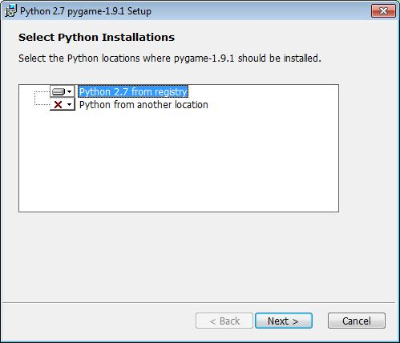
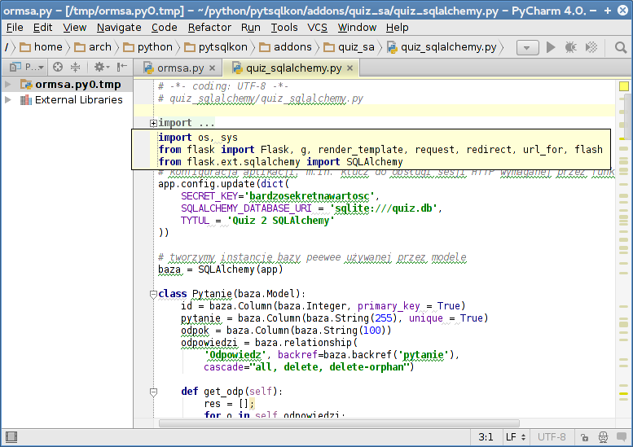

System i oprogramowanie
========================

System operacyjny
--------------------------

Nasze materiały zakładają wykorzystanie systemu :term:`Linux` i języka :term:`Python` w wersji 2.7.x,
który jest częścią wszystkich desktopowych dystrybucji. Oprócz interpretera języka, który
wystarcza do zapoznania się z podstawami, potrzebne są biblioteki wykorzystywane
w bardziej zaawansowanych przykładach, takich jak gry, aplikacje internetowe
czy obsługa baz danych za pomocą systemów ORM.

Przygotowane scenariusze zakładają również, że pracujemy w **katalogu domowym** użytkownika.
W systemach linuksowych jest to folder o nazwie użytkownika zalogowanego
znajdujący w katalogu ``/home``, np. ``/home/xubuntu``. W poleceniach wydawanych
w terminalu ścieżkę do tego katalogu symbolizuje znak ``~``. :term:`Terminal`
to inaczej konsola tekstowa, której w Linuksie często używa się, aby szybciej
wykonywać wiele operacji. W polecanym systemie uruchomimy ją za pomocą skrótu :kbd:`Win+T`.
Niekiedy podawany kod zawierać będzie sekwencje typu ``~/quiz2$``. Oznacza to,
że dane polecenie należy wykonać w katalogu ``quiz2`` znajdującym się
w katalogu domowym użytkownika. Znak ``$`` oznacza, że komendy wydajemy
jako zwykły użytkownik.

.. note::

    Omówione założenia nie znaczą, że materiału nie da się przećwiczyć
    na innych systemach, np. MS Windows. Da się, wystarczy doinstalować
    interpreter Pythona i potrzebne biblioteki, co zostanie omówione
    dalej.

Najwygodniej pracować w systemie zainstalowanym na stałe. Polecamy
`Xubuntu`_ 14.04 LTS. To :term:`dystrybucja Linuksa` będąca odmianą `Ubuntu`_ opartą o tradycyjne,
proste i wydajne :term:`środowisko graficzne` `XFCE`_. Instalacja i obsługa tego systemu
są intuicyjne. Aby zainstalować system, trzeba pobrać :term:`obraz iso`
z wybranego serwera wskazanego na stronie http://xubuntu.org/getxubuntu,
a następnie wypalić go na płycie DVD za pomocą dowolnego programu do nagrywania
płyt w systemie Linux lub MS Windows, można go też wgrać na klucz USB.

.. note::

    Xubuntu jest jedną z wielu dystrybucji Linuksa. Scenariusze można
    realizować w oparciu o dowolną dystrybucję, wystarczy doinstalować
    potrzebne biblioteki i korzystać z Pythona 2. Scenariusze testowano
    m. in. na takich dystrybucjach, jak: Debian (Wheezy, Jessie), który
    *nota-bene* jest podstawą Ubuntu, i Arch Linux. Środowisko graficzne
    nie ma oczywiście znaczenia.

Tryb *live*
-----------------------

Płyta LiveDVD lub klucz startowy USB z systemem w wersji *live* pozwalają
na uruchomienie komputera, testowanie i pracę bez ingerowania w dane
zgromadzone na twardym dysku (np. inne systemy). Mogą posłużyć również do
instalacji lub odzyskiwania danych.

W "czystym" systemie *live* można przećwiczyć scenariusze podstawowe,
pozostałe wymagają doinstalowania bibliotek. Zmiany dokonane w systemie,
np. doinstalowanie bibliotek, nie są zachowywane, można natomiast zapisywać
na dysku lub pendrajwie pliki tworzone przez użytkownika.

W ramach programu `Koduj z Klasą`_ przekazywaliśmy pamięci USB zawierające
spersonalizowaną odmianę Xubuntu pod nazwą `SRU`_, która zawierała wszystkie
potrzebne biblioteki. Obraz ostatniej wersji ma numer 37 i można go
pobrać z podanego adresu. Projekt ten nie jest w tym momencie dalej rozwijany.
Można jednak z niego nadal korzystać, oparty jest bowiem właśnie na Xubuntu
w wersji 14.04 LTS, która wspierana będzie do roku 2019.
Polecamy go zwłaszcza w przypadku, kiedy nie chcemy instalować linuksa
na dysku twardym, a chcemy mieć możliwość przećwiczenia wszystkich scenariuszy.

.. note::

    Ponieważ materiał nt. ORM-ów dodany został już po przygotowaniu
    ostatniej wersji SRU, do jego testowania potrzebne jest doinstalowanie
    po każdym uruchomieniu (!) odpowiednich bibliotek. Omawiamy to
    poniżej.

.. _SRU: http://sru.e-swoi.pl/sru-test-37.iso
.. _Koduj z Klasą: http://kodujzklasa.pl

.. _usb-creator:

Rozruchowy klucz USB
---------------------

Klucz USB umożliwiający uruchomienie komputera można przygotować na kilka
sposobów:

1. na podstawie obrazu *iso*;
2. poprzez zainstalowanie systemu bezpośrednio na pendrajwie;
3. w opraciu o gotowy klucz startowy USB - sporządzenie kopii.

.. tip::

    Poniższe instrukcje powinny działać na wszystkich nośnikach podłączanych
    przez USB, a więc kartach pamięci, dyskach twardych itp.

Nagrywamy obraz *iso*
^^^^^^^^^^^^^^^^^^^^^^^^

Przygotowując klucz USB w oparciu o obraz *iso*, postępujemy następująco:

1. Pobieramy :term:`obraz iso` (np. `SRU v.37`_ lub `Xubuntu 14.04.1 32-bit`_) systemu i zapisujemy na dysku.

.. _SRU v.37: http://sru.e-swoi.pl/sru-test-37.iso
.. _Xubuntu 14.04.1 32-bit: http://se.archive.ubuntu.com/mirror/cdimage.ubuntu.com/xubuntu/releases/14.04/release/xubuntu-14.04.1-desktop-i386.iso

2. W systemie z rodziny Ubuntu instalujemy program **usb-creator-gtk**. Można
   to zrobić przez "Centrum oprogramowania" lub w terminalu:

.. code-block:: bash

    ~$ sudo apt-get update && sudo apt-get install usb-gtk-creator

W systemach MS Windows proponujemy instalację programu `Linux Live USB Creator`_.
Można też skorzystać z programu `Universal USB Installer`_, który polecany
jest w instrukcji zamieszczonej na stronach `producenta Ubuntu`_.

.. _Linux Live USB Creator: http://www.linuxliveusb.com/en/download
.. _Universal USB Installer: http://www.pendrivelinux.com/universal-usb-installer-easy-as-1-2-3/#button
.. _producenta Ubuntu: http://www.ubuntu.com/download/desktop/create-a-usb-stick-on-windows

3. Podpinamy pendrajw docelowy o pojemności min. 4GB. Napęd powienien zawierać
   przynajmniej 1 partycję główną Fat32, wtedy do przechowywania danych użytkownika
   wykorzystany zostanie specjalny plik "casper-rw".

.. note::
    Jeżeli korzystamy z obrazu systemu opartego na Ubuntu, możemy na pendrajwie
    utworzyć dwie partycje: pierwszą podstawową Fat32 o pojemności min. 3GB
    i dowolonej etykiecie np. "linux"; oraz drugą typu Ext4 o dowolnej pojemności,
    ale obowiązkowej etykiecie "home-rw".
    Czynności te można wykonać przy użyciu programu **gparted**, który zainstalujemy
    za pomocą "Centrum oprogramowania" lub w terminalu: ``sudo apt-get update &&
    sudo apt-get install gparted``. Niestety za pomocą standardowych narzędzi
    MS Windows nie utworzymy partycji Ext4. Ostateczny układ partycji powinien
    wyglądać tak jak na poniższym zrzucie:

.. figure:: img/sru_usb08.png

4. Po przygotowaniu pendrajwa uruchamiamy kreator dysku usb poleceniem ``usb-creator-gtk``
   wydanym w terminalu. (Jeżeli pracujemy w Xubuntu ze środowiskiem XFCE4 możemy użyć
   również menu programów (:kbd:`CTRL+ESC`) lub okna uruchamiania programów (:kbd:`ALT+F2`).)
   Przycisk "Inny" w górnej części okna pozwoli wskazać :term:`obraz iso`
   wybranego systemu, dalej upewniamy się, że w polu "Nośnik docelowy"
   widnieje nazwa partycji podstawowej naszego pendrajwa (np. /dev/sdb1, zwróćmy też uwagę
   na etykietę!), na koniec wybieramy opcję "Przechowywanie pracy..." jeżeli dane użytkownika
   mają być przechowywane w pliku i na pendrajwie nie tworzyliśmy dodatkowej partycji,
   w przeciwnym wypadku zaznaczamy opcję drugą "Porzucone podczas wyłączania...", która
   mimo nazwy spowoduje zapisywanie ustawień na dodatkowej partycji ext4 o etykiecie "home-rw".

.. figure:: img/sru_usb09.png

    W środowisku MS Windows po instalacji i uruchomieniu programu "Lnux Live USB Creator"
    polecamy kliknąć przycisk "Opcje" i wybrać polski język interfejsu, następnie konfigurujemy
    ustawienia zgodnie z podanym zrzutem, czyli wskazujemy klucz USB, wybieramy obraz iso
    i określamy rozmiar pliku "casper-rw". Podstawowa instalacja Xubuntu 14.04 zajmuje
    na pendrajwie ok. 1,2 GB, a więc resztę miejsca można przeznaczyć na nasze dane.

.. figure:: img/lluc.jpg

5. Pozostaje naciśnięcie, w zależności od programu, przycisku "Utwórz..." lub ikony błyskawicy
   i uzbrojenie się w cierpliwość, po rozpakowaniu plików na partycję główną program może
   poprosić o wpisanie hasła, aby wgrać sektor rozruchowy. W systemach ubuntopodobnych
   podajemy hasło naszego użytkownika, w MS Windows - jeżeli trzeba - hasło administratora.

Tak przygotowane pendrajwy przechowują zmiany, tzn. pliki utworzone przez
użytkownika. Dodatkowo, jeżeli zaznaczyliśmy "Przechowywanie pracy" lub "Persystencję",
czyli utworzenie pliku "casper-rw" zachowane zostaną zainstalowane przez nas
biblioteki czy programy, co pozwoli na takich systemach zrealizować wszystkie
przygotowane przez nas scenariusze.

.. tip::

    Niżej pokazujemy, jak zainstalować dodatkowe biblioteki.
    Dodatkowe materiały na temat przygotowywania nośników USB, w tym galerię ilustrującą
    kolejne kroki znajdziecie w serwisie eCG_.

.. _eCG: http://ecg.vot.pl/?id=usb-boot

System na kluczu USB
^^^^^^^^^^^^^^^^^^^^^^

Jeżeli dysponujemy startowym nośnikiem z systemem Xubuntu (lub innym),
możemy uruchomić normalną instalację, podpiąć nośnik USB, założyć na nim
(w trakcie instalacji) partycję Ext4 i wskazać ją jako miejsce instalacji
systemu. Trzeba również zainstalować menedżer startowy GRUB w MBR takiego napędu.

.. tip::

    Załóżmy, że uruchamiamy Xubuntu z płyty DVD na komputerze z jednym twardym dyskiem.
    Instalator oznaczy go jako ``sda(x)``, a podłączony klucz USB jako ``sdb(x)``,
    co poznać będzie można po rozmiarze i obecnych na nich partycjach.
    Na dysku ``sdb`` tworzymy co najmniej jedną partycję Ext4, jako cel
    instalacji systemu, czyli punkt montowania katalogu głównego ``/``
    wskazujemy partycję ``/dev/sdb1``, natomiast jako miejsce instalacji GRUB-a
    wybieramy ``/dev/sdb``.

Po uruchomieniu tak zainstalowanego systemu wszystkie dokonywane zmiany będą zapamiętywane.
Można system aktualizować, można instalować nowe oprogramowanie i zapisywać
swoje pliki.

Kopia klucza USB
^^^^^^^^^^^^^^^^^^

Jeżeli dysponujemy już nośnikiem startowym USB, możemy łatwo go skopiować.
Żeby operację przyśpieszyć, zwłaszcza jeśli chcemy wykonać kilka kopii,
warto na początku utworzyć obraz danych zawartych na pendrajwie.
W Linuksie posługujemy się poleceniem ``dd`` wydanym w katalogu domowym:

.. code-block:: bash

    ~$ sudo dd if=/dev/sdb of=obrazusb.img bs=1M

Ciąg ``/dev/sdb`` w powyższym poleceniu oznacza napęd źródłowy, ``obrazusb.img``
to dowolna nazwa pliku, do którego zapisujemy odczytaną zawartość.

.. note::

    Linux oznacza wykryte napędy jako ``/dev/sd[a-z]``, a więc pierwszy dysk twardy
    oznaczony zostanie jako ``sda``. Po podłączeniu klucza USB otrzyma on nazwę
    ``sdb``. Kolejny podłączony napęd USB będzie dostępny jako ``sdc``.
    Nazwę napędu USB możemy sprawdzić po wydaniu podanych niżej poleceń.
    Pierwsze z nich wyświetli w końcowych liniach ostatnio dodane napędy
    w postaci ciągu typu ``sdb:sdb1``. Podobne wyniki powinno zwrócić
    polecenie drugie.

.. code-block:: bash

    ~$ mount | grep /dev/sd
    ~$ dmesg | grep /dev/sd

Po utworzeniu obrazu podłączamy napęd docelowy i dokładnie ustalamy jego oznaczenie,
ponieważ wcześniejesze **dane z napędu docelowego zostaną usunięte**. Jeżeli napęd
został zamontowany, czyli jego zawartość została automatycznie pokaza w menedżerze
plików, musimy go odmontować za pomocą polecenia ``Odmontuj`` (nie mylić z ``Wysuń``!).
Następnie wydajemy polecenie:

.. code-block:: bash

    ~$ sudo dd if=obrazusb.img of=/dev/sdc bs=4M; sync

Etap tworzenia obrazu na dysku możemy pominąć. Po podłączeniu napędu
źródłowego i docelowego, ustaleniu ich nazw i ewentualnym odmontowaniu
napędu przeznaczenia, możemy wydać polecenie:

.. code-block:: bash

    ~$ sudo dd if=/dev/sdb of=/dev/sdc bs=4M; sync

- gdzie ``sdb`` to nazwa napędu źródłowego, a ``sdc`` to oznaczenie napędu docelowego.

W MS Windows możemy użyć np. narzędzia `Image USB`_ lub 'USB Image Tool'_.
Za ich pomocą utworzymy obraz, który później nagramy na wskazane klucze.

.. _Image USB: http://www.osforensics.com/tools/write-usb-images.html
.. _USB Image Tool: http://www.alexpage.de/usb-image-tool/download/

Windows 8 i BIOS UEFI
-------------------------

Niestety, uruchomienie płyt Live DVD lub startowych kluczy USB z systemem
Xubuntu (SRU) na nowszych (od 2012 r.) komputerach z biosem UEFI i systemem Windows 8
bywa kłopotliwe. Odpowiada za to mechanizm `secure boot`_, który w teorii
ma zapewniać większe bezpieczeństwo, a w praktyce utrudnia użytkownikom
takich komputerach korzystanie z niektórych kart graficznych czy innych systemów,
włączając w to `poprzednie wersje Windows`_.

Najprościej jest omawiane zabezpieczenie wyłączyć według instrukcji:

- `pomoc Ubuntu`_
- `pomoc Microsoft`_
- `wsparcie HP`_

.. _secure boot: http://en.wikipedia.org/wiki/Unified_Extensible_Firmware_Interface#Secure_boot
.. _poprzednie wersje Windows: http://technet.microsoft.com/en-us/library/dn481258.aspx
.. _pomoc Ubuntu: https://help.ubuntu.com/community/UEFI#SecureBoot
.. _pomoc Microsoft: http://technet.microsoft.com/en-us/library/dn481258.aspx
.. _wsparcie HP: http://h10025.www1.hp.com/ewfrf/wc/document?cc=pl&lc=pl&dlc=pl&docname=c03679388

Drugim rozwiązaniem jest użycie oprogramowania VirtualBox, dzięki któremu
można tworzyć wirtualne maszyny i instalować na nich wybrane systemy i aplikacje.
Można też uruchamiać gotowe obrazy maszyn wirtualnych, np. w formacie OVA.
Po ściągnięciu obrazu i uruchomieniu VirtualBoksa wydajemy polecenie "Plik/Importuj
urządzenie proghramowe" i postepujemy według wskazówek wyświetlanych przez kreatora.
Po wykonanym imporcie, możemy uruchomić maszynę w VirtualBoksie.
Po imporcie plik OVA można skasować.

* `VirtualBox - wersja dla Windows <http://download.virtualbox.org/virtualbox/4.3.8/VirtualBox-4.3.8-92456-Win.exe>`_
* `Maszyna wirtualna SRU <http://www.cyfrowaszkola.waw.pl/_python/SRU_FWIOO.ova>`_

Interpreter i biblioteki
---------------------------

Podstawą szkolenia jest, jak zaznaczono na początku, interpreter Pythona w wersji 2.7.x,
który standardowo dostępny jest w dystrybucjach linuksowych. Siła tego języka
tkwi m. in. w wielu rozszerzeniach zapewnianych przez instalację dodatkowych
modułów.

Instalacja w Linuksie
^^^^^^^^^^^^^^^^^^^^^^

W systemach opierających się na Debianie (m. in. wszystkie wersje Ubuntu,
LinuxMint itd.), korzystamy z menedżera pakietów ``apt-get``:

.. code-block:: bash

    ~$ sudo apt-get install ipython python-pip python-virtualenv git
    ~$ sudo apt-get install python-flask python-django python-pygame

W pierwszej kolejności zainstalowane zostaną narzędzia, czyli rozrzerzona
konsola ``ipython``, instalator modułów ``pip`` czy narzędzie pozwalające
ściągnąć i używać niniejszych materiałów, czyli ``git``.

Biblioteki potrzebne do obsługi baz danych za pomocą ORM-ów można
zainstalować za pomocą menedżera systemowego lub (w razie niedostępności
danego pakietu) instalora Pythona:

.. code-block:: bash

    ~$ sudo apt-get install python-peewee python-sqlalchemy python-flask-sqlalchemy
    ~$ sudo pip install peewee sqlalchemy flask-sqlalchemy

W innych systemach linuksowych należy korzystać z dedykowanych
menedżerów systemowych (np. ``pacman`` w Arch Linuksie) lub wspomnianego
instalatora Pythona (``pip``).

.. note::

    Uwaga: nazwy pakietów w różnych dystrybucjach mogą się nieco różnić od podanych.
    Obok wersji 2.x rozwijana jest wersja 3.x Pythona, która nie w pełni
    jest kompatybilna z poprzednią. Różnic nie ma aż tak wiele, podane
    kody można więc łatwo dostosować.

Instalacja w MS Windows
^^^^^^^^^^^^^^^^^^^^^^^

Punktem wyjścia jest instalacja interpretera Pythona. Można to szybko zrobić
za pomocą konsoli PowerShell (oznaczonej niebieską ikoną i niebieskim tłem). Wystarczy skopiować
poniższy kod linia po linii, wkleić i wykonać:

.. code-block:: posh

    (new-object System.Net.WebClient).DownloadFile("https://www.python.org/ftp/python/2.7.8/python-2.7.8.msi", "$pwd\python-2.7.8.msi")
    msiexec /i python-2.7.8.msi TARGETDIR=C:\Python27
    [Environment]::SetEnvironmentVariable("Path", "$env:Path;C:\Python27\;C:\Python27\Scripts\", "User")
    (new-object System.Net.WebClient).DownloadFile("https://raw.github.com/pypa/pip/master/contrib/get-pip.py", "$pwd\get-pip.py")
    C:\Python27\python.exe get-pip.py virtualenv

Jeżeli w naszej wersji Windows nie ma PowerShella, ściągamy `interpreter Pythona`_
i instalujemy ręcznie, pamiętając o zaznaczeniu opcji "Add Python.exe to Path".

.. _interpreter Pythona: https://www.python.org/downloads/

.. figure:: img/python_windows01.jpg

Następnie instalujemy program ``pip`` do zarządzania dodatkowymi bibliotekami za pomocą polecenia:

.. code-block:: bash

    python -c "exec('try: from urllib2 import urlopen \nexcept: from urllib.request import urlopen');f=urlopen('https://raw.github.com/pypa/pip/master/contrib/get-pip.py').read();exec(f)"

Gdyby jakieś wywołania pythona nie działały, warto ustawić zmienną systemową ``PATH`` tak,
aby zawierała ścieżki do interpretera i polecenia ``pip``:

.. code-block:: bat

    set PATH=%PATH%;c:\Python27\;c:\Python27\Scripts\

Pozostaje instalacja bibliotek wymaganych przez scenariusze.
Moduł wymagany przez gry pobieramy z katalogu `/arch/` zawartego w repozytorium
lub ze strony `PyGame`_ i instalujemy:

.. _PyGame: http://pygame.org/ftp/pygame-1.9.1.win32-py2.7.msi

Pozostałe biblioteki instalujemy za pomocą polecenia ``pip``:

.. code-block:: bash

    pip install flask django
    pip install peewee sqlalchemy flask-sqlalchemy

Jeżeli chcemy pod Windowsem korzystać z mechanizmów oferowanych przez serwis
GitHub, musimy zainstalować odpowiedniego :ref:`klienta <git-install>`. Zagadnienia te omówione
zostały w osobnym :ref:`dokumencie <git-howto>`. Instalacja Git-a
nie jest wymagana, aby pracować na przygotowanych scenariuszach.

.. note::

    Pamiętaj, by zmieniać znaki `/` (slash) na `\\` (backslash) w ścieżkach
    podawanych w scenariuszach, natomiast w miejscu komend systemu Linux
    użyj odpowiedników z Windows.

Edytory kodu
-------------

Skrypty Pythona można zapisywać w dowolnym edytorze tekstu, ale oczywiście
wygodniej jest używać programów, które potrafią przynajmniej odpowiednio
podświetlać kod. Proponujemy do wyboru proste

Geany
^^^^^^^^^^

`Geany <http://www.geany.org>`_ to proste i lekkie środowisko IDE dostępne na licencji
`GNU General Public Licence <http://pl.wikipedia.org/wiki/GNU_General_Public_License>`_.
Geany oferuje kolorowanie składni dla najpopularniejszych języków,
m.in. C, C++, C#, Java, PHP, HTML, Python, Perl i Pascal,
wsparcie dla kodowania w ponad 50 standardach, dopełnianie poleceń, mechanizmy automatycznego zamykanie tagów dla HTML\XML,
auto-wcięć, pracy na kartach i wiele, wiele więcej. Podczas pisania kodu przydatny okazuje się brudnopis,
pozwalający tworzyć dowolne notatki, a także możliwość kompilacji plików źródłowych
bezpośrednio z poziomu programu.

Instalacja
*****************

W systemach linuksowych korzystamy z dedykowanych menedżerów, np. w Xubuntu
(i innych debianopochodnych) wystarczy wpisać w terminalu:

.. code-block:: bash

    ~$ sudo apt-get install geany geany-plugins

W MS Windows ściągamy i instalujemy `pełną wersję binarną Geany <http://www.geany.org/Download/Releases>`_
przeznaczoną dla tych systemów. *Pełna* oznacza tutaj, ze zwaiera biblioteki
GTK wykorzystywane przez program. Podczas standardowej instalacji można
zmienić katalog docelowy, np. na ``C:\Geany``.

Zanim rozpoczniemy pracę w edytorze, warto dostosować kilka ustawień.

W menu `Narzędzia/Menedżer wtyczek` zaznaczamy pozycję "Addons" (dostępna
po zainstalowaniu wtyczek), a następnie "Przeglądarka plików".
Zanim wyjdziemy z okna naciskamy przycisk "Preferencje" i na zakładce
"Przeglądarka plików" zaznaczamy opcję "Podążanie za ścieżką do bieżącego pliku".
Dzięki temu w panelu bocznym w zakładce "Pliki" zobaczymy listę katalogów i plików,
które łatwo możemy otwierać.

W menu `Edycja/Preferencje` :kbd:`CTRL+ALT+P` w zakładce `Edytor/Wcięcia` jako
"Typ" wcięć wybieramy opcję "spacje".

Jeżeli pracujemy ze skryptem Pythona, uruchomimy go naciskając klawisz F5
(lub `Zbuduj/Wykonaj`). Wcięcia wstawiają się automatycznie lub poprzez
naciśnięcie klawisza :kbd:`TAB`. Jeżeli chcielibyśmy wciąć od razu cały blok kodu,
zaznaczamy go i również używamy :kbd:`TAB` lub :kbd:`CTRL+I`, zmniejszenie wcięcia uzyskamy
naciskając :kbd:`CTRL+U`.

.. figure:: img/geany_windows01.jpg

PyCharm
^^^^^^^^^^^^^^^

PyCharm to profesjonalne, komercyjne środowisko programistyczne dostępne
za darmo do celów szkoleniowych. Interfejs nie został na razie spolszczony.

To IDE doskonale wspiera proces uczenia się. Dzięki nawigacji po kodzie,
podpowiedziom oraz wykrywaniu błędów niemal na bieżąco, uczniowie mniej
czasu będą spędzać na szukaniu problemów, a więcej na poznawaniu tajników
programowania.

Instalacja
***********

Zarówno w systemach Linux, jak i MS Windows najlepiej pobrać
ostatnią wersję testową, czyli  `Professional Edition <http://www.jetbrains.com/pycharm/download/>`_
ze strony producenta. Wersja linuksowa to archiwum, które trzeba rozpakować,
czyli przenieść z katalogu ``Pobrane`` do np. w katalogu domowego, kliknąć
prawym klawiszem i wybrać polecenie ``Rozpakuj tutaj``.
W systemach Linux alternatywnie można użyć poleceń w terminalu:

.. code-block:: bash

    $ wget http://download.jetbrains.com/python/pycharm-professional-4.0.3.tar.gz -O - | tar -xz
    $ ./pycharm-4.0.3/bin/pycharm.sh

Jak widać, program zostanie zainstalowany w katalogu domowym użytkownika,
a uruchamiamy go drugim z podanych poleceń.

Wersję pod Windows instalujemy standardowo.

Bezpłatna licencja
*******************

Każdy nauczyciel może wystąpić o klucz licencyjny przy pomocy `formularza
<http://www.jetbrains.com/eforms/classroomRequest.action?licenseRequest=PCP04LS#>`_
dostępnego na stronie producenta.

Polski słownik ortograficzny
****************************

W programie możemy włączyć sprawdzanie polskiej pisowni, jednak potrzebne
jest wskazanie pliku słownika. Pod linuksem możemy sobie wyprowadukować słownik dla PyCharm komendą:

.. code-block:: bash

    $ aspell --lang pl dump master | aspell --lang pl expand | tr ' ' '\n' > polish.dic
    $ sudo mv polish.dic ``/usr/share/dictionaries-common/``

W ustawieniach :kbd:`Ctrl+Alt+S` szukamy `spell` i dodajemy
``custom dictionaries folder`` wskazując na ``/usr/share/dictionaries-common/``
(lokalizacja w Xubuntu).

Materiały
------------------

Pojęcia
^^^^^^^^^^

.. glossary::

    Python
        język programowania wysokiego poziomu, wyposażony w wiele bibliotek
        standardowych, jak i dodatkowych. Cechuje go łatwość uczenia się,
        czytelność i zwięzłość kodu, a także dynamiczne typowanie.
        Jako język skryptowy, wymaga interpretera. Czytaj więcej o `Pythonie <http://pl.wikipedia.org/wiki/Python>`_

    Linux
        rodzina uniksopodobnych systemów operacyjnych opartych na jądrze Linux.
        Linux jest jednym z przykładów wolnego i otwartego oprogramowania
        (FLOSS): jego kod źródłowy może być dowolnie wykorzystywany,
        modyfikowany i rozpowszechniany. Źródło: `Wikipedia <http://pl.wikipedia.org/wiki/Linux>`_

    dystrybucja Linuksa
        określona wersja systemu operacyjnego oparta na jądrze Linux, udostępniana
        zazwyczaj w formie obrazów *iso*. Najbardziej znane to: `Debian`_,
        `Ubuntu`_ i jego odmiany (np. `Xubuntu`_), `Linux Mint`_, `Arch Linux`_, `Slackware`_,
        `Fedora`_, `Open Suse`_. Czytaj więcej o `dystrybucjach Linuksa <http://pl.wikipedia.org/wiki/Dystrybucja_Linuksa>`_

    obraz iso
        format zapisu danych dysków CD/DVD, tzw. hybrydowe obrazy iso, wykorzystywane
        do udostępniania dystrybucji linuksowych, umożliwiają uruchmianie
        systemu zarówno z płyt optycznych, jak i napędów USB.

    środowisko graficzne
        w systemach linuksowych zestaw oprogramowania tworzący GUI, czyli graficzny
        interfejs użytkownika, często zawiera domyślny wybór aplikacji przeznaczonych
        do wykonywania typowych zadań. Najpopularnijesze środowiska to `XFCE`_,
        `Gnome`_, `KDE`_, `LXDE`_, `Cinnamon`_, `Mate`_.

    terminal
        inaczej zwany konsolą tekstową, wierszem poleceń itp. Program umożliwiający
        wykonywanie operacji w powłoce tekstowej systemu za pomocą wpisywanych poleceń.
        W Linuksach rolę powłoki pełni najczęściej `Bash`_, w Ubuntu zastępuje ją mniejszy
        i szybszy odpowiednik, czyli Dash.

.. _Debian: https://www.debian.org/index.pl.html
.. _Ubuntu: http://ubuntu.pl
.. _Xubuntu: http://xubuntu.org/
.. _Linux Mint: http://pl.wikipedia.org/wiki/Linux_Mint
.. _Arch Linux: http://archlinux.pl
.. _Slackware: http://pl.wikipedia.org/wiki/Slackware
.. _Fedora: https://getfedora.org/pl/workstation
.. _Open Suse: https://pl.opensuse.org/Witamy_w_openSUSE.org
.. _Gnome: http://pl.wikipedia.org/wiki/GNOME
.. _KDE: http://pl.wikipedia.org/wiki/KDE
.. _LXDE: http://pl.wikipedia.org/wiki/LXDE
.. _Cinnamon: http://en.wikipedia.org/wiki/Cinnamon_%28software%29
.. _Mate: http://pl.wikipedia.org/wiki/MATE
.. _XFCE: http://www.xfce.org/
.. _Bash: http://pl.wikipedia.org/wiki/Bash

Metryka
^^^^^^^

:Autorzy: Robert Bednarz (ecg@ecg.vot.pl), `Janusz Skonieczny <https://plus.google.com/+JanuszSkonieczny/>`_

:Utworzony: |date| o |time|

.. |date| date::
.. |time| date:: %H:%M

.. raw:: html

    

.. include:: copyright.rst
