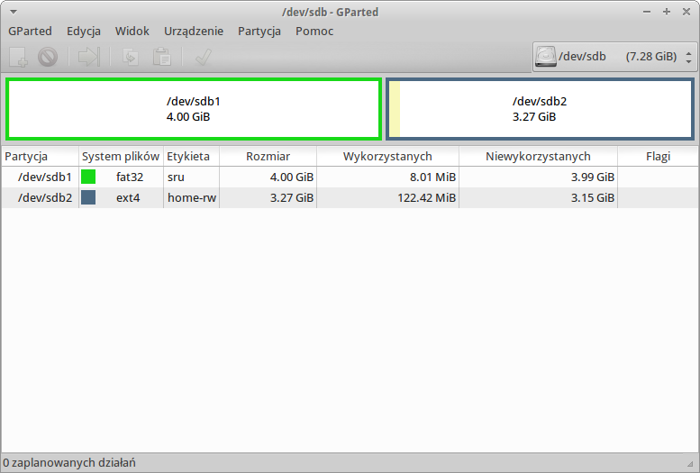
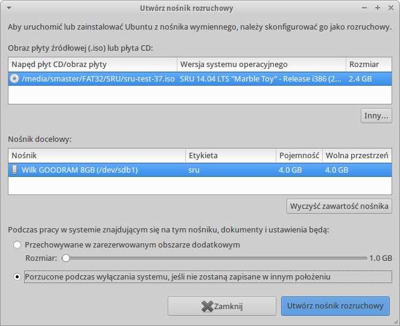

Środowisko systemowe i wymagane oprogramowanie
==============================================

Postaraliśmy się by każdy z uczestników szkolenia `Koduj z Klasą`_ otrzymał
gotowe środowisko, dzięki unifikacji minimalizujemy liczbę problemów
konfiguracyjnych. Przygotowanie swojego środowiska nie wymaga
dużych nakładów pracy, wystarczy wykonać kilka krótkich instrukcji, by
dostosować swój komputer na potrzeby tego szkolenia.

.. _Koduj z Klasą: http://kodujzklasa.pl

Szkolny Remix Ucznia (SRU)
--------------------------

Nasze materiały zakładają wykorzystanie Szkolnego Remixu Ucznia (SRU)
ze względu na jego gotowość do realizacji celów szkoleniowych niemal z pudełka.
W podanej niżej lokalizacji znajdziecie :term:`obraz iso`, który można wykorzystać
do przygotowania nośnika uruchomieniowego i instalacyjnego (zobacz niżej).

http://sru.e-swoi.pl

Przykłady zakładają jednakową ścieżkę do katalogu domowego użytkownika,
którą w przypadku innych instalacji należy dostosować:

.. code-block:: bash

    /home/sru

LiveCD lub uruchomienie z Pendrive
^^^^^^^^^^^^^^^^^^^^^^^^^^^^^^^^^^   

Środowisko SRU jest przygotowane do uruchomienia bez instalacji na komputerach
z wykorzystaniem tzw. Live CD. W ramach programu Koduj z Klasą przekazujemy
pamięci USB zawierające SRU i umożliwiające uruchomienie systemu bez instalacji.

.. note::
    Pamięci USB zwykle są tak przygotowane że pomiędzy uruchomieniami
    zapamiętywane są tylko zmiany w katalogu domowym. Dzięki temu użytkownicy
    nie mogą popsuć konfiguracji systemu i nie są w stanie instalować
    nowego oprogramowania.

.. _usb-creator:

Przygotowanie rozruchowych kluczy USB
^^^^^^^^^^^^^^^^^^^^^^^^^^^^^^^^^^^^^

Klucze USB z systemem SRU (czy inną opartą na Ubuntu dystrybucją) umożliwiające
uruchamianie systemu w trybie live, zapamiętywanie dokumentów i ustawień użytkownika
można przygotować na podstawie posiadanego już klucza lub na podstawie obrazu
iso dystrybucji.

W celu utworzenia kopii klucza USB uruchamiamy komputer za jego pomocą i podłączamy
pendrajw docelowy, najlepiej o takiej samej lub trochę większej pojemności.
Zazwyczaj zostanie on otworzony w menedżerze plików, ale należy go odmontować
klikając jego nazwę w menedżerze po lewej stronie i wybierając "Odmontuj".
Następnie wydajemy w terminalu polecenie:

.. code-block:: bash

    sru@srustation:~$ sudo dd if=/dev/sdb of=/dev/sdc bs=1M; sync

.. note::
    Uwaga: w typowej konfiguracji z jednym dyskiem twardym napęd rozruchowy
    i jednocześnie źródłowy przyjmie nazwę ``/dev/sdb``, natomiast pierwszy dodatkowy
    klucz USB, czyli napęd docelowy, ``/dev/sdc``. Jednak w innych konfiguracjach
    (z większą ilością dysków twardych) nazwy napędów mogą być inne.
    Trzeba sprawdzić zwłaszcza nazwę klucza docelowego, ponieważ jego
    zawartość zostaje całkowicie nadpisana. Można to zrobić zaraz po podłączeniu
    pendrajwa, wydając podane niżej polecenie i szukając ciągu typu ``sdb:sdb1``
    (``sdc`` itd.).

.. code-block:: bash

    sru@srustation:~$ dmesg | grep sd
    
Przygotowując klucz USB w oparciu o obraz systemu SRU, postępujemy następująco:

1. Pobieramy `obraz iso`_ systemu i zapisujemy na dysku.
2. Otwieramy "Centrum oprogramowania" i instalujemy program **usb-creator-gtk**,
   czynność tę można wykonać nieco szybciej w terminalu:

.. code-block:: bash

    sru@srustation:~$ sudo apt-get update && sudo apt-get install usb-gtk-creator

3. Podpinamy pendrajw docelowy o pojemności min. 4GB. Napęd powienien zawierać
   przynajmniej 1 partycję główną Fat32, wtedy do przechowywania danych użytkownika
   wykorzystany zostanie specjalny plik "casper-rw".

.. note::
    Możemy też utworzyć dwie partycje: pierwszą podstawową Fat32 o pojemności
    min. 3GB i etykiecie np. "SRU"; oraz drugą Ext4 o dowolnej pojemności i obowiązkowej
    etykiecie "home-rw".
    Czynności te można wykonać przy użyciu programu **gparted**, który zainstalujemy
    za pomocą "Centrum oprogramowania" lub w terminalu: ``sudo apt-get update &&
    sudo apt-get install gparted``. Ostateczny układ partycji powinien wyglądać tak
    jak na poniższym zrzucie:

.. _obraz iso: http://sru.e-swoi.pl/sru-test-37.iso

4. Po przygotowaniu pendrajwa uruchamiamy kreator dysku usb poleceniem ``usb-creator-gtk``
   wydanym w terminalu albo w menu programów (CTRL+ESC) lub oknie uruchamiania programów
   (ALT+F2 w środowisku XFCE). Przycisk "Inny" w górnej części okna pozwoli wskazać
   :term:`obraz iso` systemu SRU (lub innego), dalej upewniamy się, że w polu "Nośnik docelowy"
   widnieje nazwa partycji podstawowej naszego pendrajwa (np. /dev/sdb1, zwróćmy też uwagę
   na etykietę!), na koniec wybieramy opcję "Przechowywanie pracy..." jeżeli dane użytkownika
   mają być przechowywane w pliku i na pendrajwie nie tworzyliśmy dodatkowej partycji,
   w przeciwnym wypadku zaznaczamy opcję drugą "Porzucone podczas wyłączania...", która
   mimo nazwy spowoduje zapisywanie ustawień na dodatkowej partycji ext4 o etykiecie "home-rw".
   

5. Pozostaje naciśnięcie przycisku "Utwórz..." i uzbrojenie się w cierpliwość,
   po rozpakowaniu plików na partycję główną program poprosi o wpisanie hasła,
   aby wgrać sektor rozruchowy. W systemach ubuntopodobnych (w tym SRU)
   podajemy hasło naszego użytkownika.
   
Dodatkowe materiały na temat przygotowywania nośników USB, w tym galerię ilustrującą
kolejne kroki znajdziecie w serwisie eCG_.

.. _eCG: http://ecg.vot.pl/?id=usb-boot

Dla komputerów z systemem Windows 8 i BIOS UEFI
^^^^^^^^^^^^^^^^^^^^^^^^^^^^^^^^^^^^^^^^^^^^^^^

Aby używać Szkolny Remiks Ucznia jako maszynę wirtualną bez konieczności startu z USB,
zainstalujcie Virtualbox, a następnie pobierzcie plik OVA i po prostu kliknijcie na niego dwa razy.
Następnie postępujcie wg wskazówek wyświetlanych przez VirtualBox. Po wykonanym imporcie, 
będziecie mogli po prostu uruchomić maszynę w Virtualbox. 

Po imporcie plik OVA można skasować, aby nie zabierał już miejsca. Nie będzie więcej potrzebny.
pamięci USB zawierające SRU i umożliwiające uruchomienie systemu bez instalacji.

Niezbędne pakiety:

* `Virtualbox - wersja dla Windows <http://download.virtualbox.org/virtualbox/4.3.8/VirtualBox-4.3.8-92456-Win.exe>`_
* `Maszyna wirtualna SRU <http://www.cyfrowaszkola.waw.pl/_python/SRU_FWIOO.ova>`_

Brakujące komponenty
^^^^^^^^^^^^^^^^^^^^

W starszych wersjach SRU lub w innych systemach linuksowych może brakować
oprogramowania przydatnego podczas szkolenia, można i warto je doinstalować.

Pobranie przykładów na komputerze uruchomionym z pomocą LiveCD lub Pendrive SRU
wymaga wcześniejszej instalacji narzędzia GIT, w terminalu (Win+T) wydajemy
polecenie:

.. code-block:: bash

    $ sudo apt-get install git

W innych systemach linuksowych doinstalowujemy również pakiety z wykorzystywanymi
w szkoleniu bibliotekami:

.. code-block:: bash

    $ sudo apt-get install ipython python-pip python-virtualenv
    $ sudo apt-get install python-flask python-django python-pygame

Podane przykłady odnoszą się do systemów opartych na Debianie i Ubuntu,
wykorzystujących menedżer `apt`. W pozostałych systemach (np. Arch Linux)
stosujemy dedykowane menedżery i ewentualnie sprawdzamy nazwy pakietów.

Środowisko Windows
------------------

Po zainstolawaniu interpretera Pythona, dodatkowych modułów i wymaganych
biblitek wszystkie scenariusze można bez problemu realizować w środowisku
Windows, chociaż pamiętać należy, że przykłady w szkoleniu wykorzystują
polecenia, notację ścieżek charakterytyczne dla Linuksa.

.. note::
    Pamiętaj, by zmieniać znaki `/` (slash) na `\\` (backslash) w ścieżkach,
    natomiast w miejscu komend systemu Linux użyj odpowiedników z Windows.

Instalacja Python 2.7 pod Windows
^^^^^^^^^^^^^^^^^^^^^^^^^^^^^^^^^

Możemy szybko zainstalować Python z pomocą konsoli PowerShell (taka niebieska):

.. code-block:: posh

    (new-object System.Net.WebClient).DownloadFile("https://www.python.org/ftp/python/2.7.8/python-2.7.8.msi", "$pwd\python-2.7.8.msi")
    msiexec /i python-2.7.8.msi TARGETDIR=C:\Python27
    [Environment]::SetEnvironmentVariable("Path", "$env:Path;C:\Python27\;C:\Python27\Scripts\", "User")
    (new-object System.Net.WebClient).DownloadFile("https://raw.github.com/pypa/pip/master/contrib/get-pip.py", "$pwd\get-pip.py")
    C:\Python27\python.exe get-pip.py virtualenv

Pozostałe biblioteki dystrybuowane w wersjach binarnych musimy zainstalować
z katalogu `/arch/` w repo, inne instalujemy za pomocą polecenia ``pip``:

.. code-block:: bash

    pip install -r requirements.txt

Jak nie ma PowerShell
^^^^^^^^^^^^^^^^^^^^^

Jeśli nie mamy PowerShella, pozostaje ręcznie sciągnąć plik instalacyjny
interpretera:

https://www.python.org/downloads/

A następnie zainstalować program ``pip`` przy użyciu świeżo zainstalowanego Pythona :)

.. code-block:: bash

    python -c "exec('try: from urllib2 import urlopen \nexcept: from urllib.request import urlopen');f=urlopen('https://raw.github.com/pypa/pip/master/contrib/get-pip.py').read();exec(f)"

Ponadto możemy ustawić zmienną systemową, by za każdym razerm nie używać pełnej ścieżki.

.. code-block:: bat

    set PATH=%PATH%;c:\Python27\;c:\Python27\Scripts\

Środowisko programistyczne Geany
----------------------------------

Geany to profesjonalne środowisko środowisko OpenSource, a więc dostępne na licencji  GNU General Public Licence. To oznacza, że każdy użytkownik posiada:

* wolność uruchamiania programu, w dowolnym celu (wolność 0)
* wolność analizowania programu oraz dostosowywania go do swoich potrzeb (wolność 1)
* wolność rozpowszechniania kopii programu (wolność 2)
* wolność udoskonalania programu i publicznego rozpowszechniania własnych ulepszeń, dzięki czemu może z nich skorzystać cała społeczność (wolność 3).

Geany oferuje kolorowanie składni dla najpopularniejszych języków,
m.in. C, C++, C#, Java, PHP, HTML, Python, Perl i Pascal, 
wsparcie dla kodowania w ponad 50 standardach, dopełnianie poleceń, mechanizm automatycznego zamykanie tagów dla HTML\XML, 
auto-wcięć, pracy na kartach i wiele, wiele więcej. Podczas pisania kodu przydatny okazuje się brudnopis, 
pozwalający tworzyć dowolne notatki, a także możliwość kompilacji plików źródłowych 
bezpośrednio z poziomu programu. Podczas programowania w Pythonie warto dostosować
kilka ustawień tego programu.

W menu `Narzędzia/Menedżer wtyczek` zaznaczamy wtyczki "Addons" i "Przeglądarka
plików". Zanim wyjdziemy z okna naciskamy przycisk "Preferencje" i na zakłądce
"Przeglądarka plików" zaznaczamy opcję "Podążanie za ścieżką do bieżącego pliku".
Dzięki temu w panelu bocznym w zakładce "Pliki" zobaczymy listę katalogów i plików,
które łatwo możemy otwierać.

W menu `Edycja/Preferencje` (CTRL+ALT+P) w zakładce "Edytor/Wcięcia" jako
"Typ" wcięć wybieramy opcję "spacje".

Jeżeli pracujemy ze skryptem Pythona, uruchomimy go naciskając klawisz F5
(lub `Zbuduj/Wykonaj`). Wcięcia wstawiają się automatycznie lub poprzez
naciśnięcie klawisza TAB. Jeżeli chcielibyśmy wciąć od razu cały blok kodu,
zaznaczamy go i również używamy TAB.

Środowisko programistyczne PyCharm
----------------------------------

PyCharm to profesjonalne, komercyjne środowisko programistyczne dostępne za darmo
do celów szkoleniowych.

To IDE doskonale wspiera proces uczenia się. Dzięki nawigacji po kodzie,
podpowiedziom oraz wykrywaniu błędów niemal na bieżąco uczniowie mniej
czasu będą spędzać na szukaniu problemów a więcej na poznawaniu tajników
programowania.

Szybka instalacja na systemach linux
^^^^^^^^^^^^^^^^^^^^^^^^^^^^^^^^^^^^

Instalacja wersji testowej na systemach Linux wymaga pobrania i rozpakowania archiwum:

.. code-block:: bash

    wget http://download.jetbrains.com/python/pycharm-professional-3.4.1.tar.gz -O - | tar -xz
    ./pycharm-3.4.1/bin/pycharm.sh

Ręczna instalacja
^^^^^^^^^^^^^^^^^

Na systemach Windows możemy zainstalować PyCharm po `pobraniu pliku instalacyjnego
ze strony producenta z pomocą przeglądarki <http://www.jetbrains.com/pycharm/download/>`_.

Jak zdobyć bezpłatną licencję
^^^^^^^^^^^^^^^^^^^^^^^^^^^^^

Każdy nauczyciel może wystąpić o klucz licencyjny przy pomocy `formularza
dostępnego na stronie producenta <http://www.jetbrains.com/eforms/classroomRequest.action?licenseRequest=PCP04LS#>`_

Polski słownik ortograficzny
^^^^^^^^^^^^^^^^^^^^^^^^^^^^

W programie możemy włączyć sprawdzanie polskiej pisowni, jednak potrzebne
jest wskazanie pliku słownika. Pod linuksem możemy sobie wyprowadukować słownik dla PyCharm komendą:

    aspell --lang pl dump master | aspell --lang pl expand | tr ' ' '\n' > polish.dic
    sudo mv polish.dic ``/usr/share/dictionaries-common/``

W ustawieniach :kbd:`Ctrl+Alt+S` szukamy `spell` i dodajemy
``custom dictionaries folder`` wskazując na ``/usr/share/dictionaries-common/`` (lokalizacja w SRU).

Pojęcia
^^^^^^^^^^^^^

.. glossary::

    Obraz iso
        format zapisu danych dysków CD/DVD, tzw. hybrydowe obrazy iso, wykorzystywane
        do udostępniania dystrybucji linuksowych, umożliwiają uruchmianie
        systemu zarówno z płyt optycznych, jak i napędów USB.

.. include:: copyright.rst
