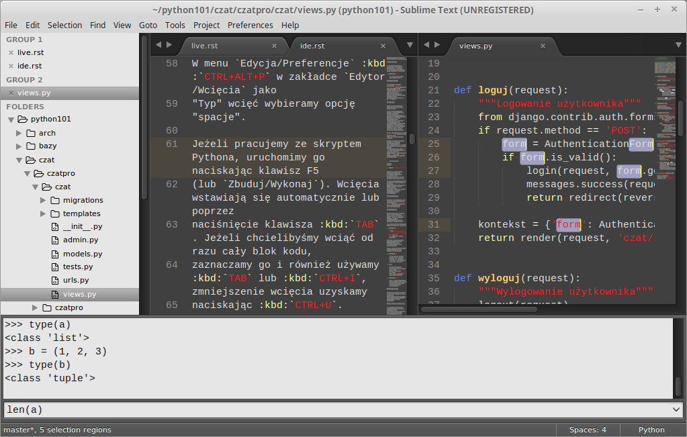

IDE – edytory kodu
##################

Skrypty Pythona można zapisywać w dowolnym edytorze tekstu, ale oczywiście
wygodniej jest używać programów, które potrafią przynajmniej odpowiednio
podświetlać kod.

.. contents:: Spis treści
    :backlinks: none

.. _geany-python:

Geany
=====================

.. figure:: img/geany_windows01.jpg

`Geany <http://www.geany.org>`_ to proste i lekkie środowisko IDE dostępne na licencji
`GNU General Public Licence <http://pl.wikipedia.org/wiki/GNU_General_Public_License>`_.
Geany oferuje kolorowanie składni dla najpopularniejszych języków,
m.in. C, C++, C#, Java, PHP, HTML, Python, Perl i Pascal,
wsparcie dla kodowania w ponad 50 standardach, dopełnianie poleceń, mechanizmy automatycznego zamykanie tagów dla HTML\XML,
auto-wcięć, pracy na kartach i wiele, wiele więcej. Podczas pisania kodu przydatny okazuje się brudnopis,
pozwalający tworzyć dowolne notatki, a także możliwość kompilacji plików źródłowych
bezpośrednio z poziomu programu.

Instalacja Linux
----------------

W systemach linuksowych korzystamy z dedykowanych menedżerów, np. w Xubuntu
(i innych debianopochodnych) wystarczy wpisać w terminalu:

.. code-block:: bash

    ~$ sudo apt-get install geany geany-plugins

Instalacja Windows
------------------

W MS Windows ściągamy i instalujemy `pełną wersję binarną Geany <http://www.geany.org/Download/Releases>`_
przeznaczoną dla tych systemów. *Pełna* oznacza tutaj, ze zwaiera biblioteki
GTK wykorzystywane przez program. Podczas standardowej instalacji można
zmienić katalog docelowy, np. na ``C:\Geany``.

Konfiguracja
------------

Zanim rozpoczniemy pracę w edytorze, warto dostosować kilka ustawień.

W menu `Narzędzia/Menedżer wtyczek` zaznaczamy pozycję "Addons" (dostępna
po zainstalowaniu wtyczek), a następnie "Przeglądarka plików".
Zanim wyjdziemy z okna naciskamy przycisk "Preferencje" i na zakładce
"Przeglądarka plików" zaznaczamy opcję "Podążanie za ścieżką do bieżącego pliku".
Dzięki temu w panelu bocznym w zakładce "Pliki" zobaczymy listę katalogów i plików,
które łatwo możemy otwierać.

W menu `Edycja/Preferencje` :kbd:`CTRL+ALT+P` w zakładce `Edytor/Wcięcia` jako
"Typ" wcięć wybieramy opcję "spacje".

Jeżeli pracujemy ze skryptem Pythona, uruchomimy go naciskając klawisz F5
(lub `Zbuduj/Wykonaj`). Wcięcia wstawiają się automatycznie lub poprzez
naciśnięcie klawisza :kbd:`TAB`. Jeżeli chcielibyśmy wciąć od razu cały blok kodu,
zaznaczamy go i również używamy :kbd:`TAB` lub :kbd:`CTRL+I`, zmniejszenie wcięcia uzyskamy
naciskając :kbd:`CTRL+U`.

.. _pycharm-python:

PyCharm
=======

.. figure:: img/pyCharm4.png

PyCharm to profesjonalne, komercyjne środowisko programistyczne dostępne
za darmo do celów szkoleniowych. Interfejs nie został na razie spolszczony.

To IDE doskonale wspiera proces uczenia się. Dzięki nawigacji po kodzie,
podpowiedziom oraz wykrywaniu błędów niemal na bieżąco, uczniowie mniej
czasu będą spędzać na szukaniu problemów, a więcej na poznawaniu tajników
programowania.

Instalacja Windows
------------------

Zarówno w systemach Linux, jak i MS Windows najlepiej pobrać
ostatnią wersję `Professional Edition <http://www.jetbrains.com/pycharm/download/>`_
ze strony producenta.

Instalacja Linux
----------------

Wersja linuksowa to archiwum, które trzeba rozpakować,
czyli przenieść z katalogu ``Pobrane`` do np. w katalogu domowego, kliknąć
prawym klawiszem i wybrać polecenie ``Rozpakuj tutaj``.

W systemach Linux alternatywnie można użyć poleceń w terminalu:

.. code-block:: bash

    ~$ wget http://download.jetbrains.com/python/pycharm-professional-5.0.1.tar.gz -O - | tar -xz
    ~$ ./pycharm-5.0.1/bin/pycharm.sh

Jak widać, program zostanie zainstalowany w katalogu domowym użytkownika,
a uruchamiamy go drugim z podanych poleceń.

Jeśli w naszym systemie brakuje środowiska Java Run Time, musimy je doinstalować:

.. code-block:: bash

    ~$ sudo apt-get install openjdk-7-jre # Debian i pochodne, np. (X)Ubuntu
    ~# pacman -S jre7-openjdk # Arch Linux i pochodne

.. note::

    Aby poprawić wygląd czcionek w PyCharm, warto w pliku :file:`~/.bashrc` (Debian i pochodne)
    lub :file:`~/.bash_profile` (Arch Linux i pochodne) dodać poniższą linię:

.. code-block:: bash

    export _JAVA_OPTIONS='-Dawt.useSystemAAFontSettings=on -Dswing.defaultlaf=com.sun.java.swing.plaf.gtk.GTKLookAndFeel'

Bezpłatna licencja
------------------

Każdy nauczyciel może wystąpić o klucz licencyjny przy pomocy `formularza
<https://www.jetbrains.com/buy/classroom/?product=pycharm>`_
dostępnego na stronie producenta.

Polski słownik ortograficzny
----------------------------

W programie możemy włączyć sprawdzanie polskiej pisowni, jednak potrzebne
jest wskazanie pliku słownika. Pod linuksem możemy sobie wyprodukować słownik dla PyCharm komendą:

.. code-block:: bash

    aspell --lang pl dump master | aspell --lang pl expand | tr ' ' '\n' > polish.dic
    sudo mv polish.dic ``/usr/share/dictionaries-common/``

W ustawieniach :kbd:`Ctrl+Alt+S` szukamy `spell` i dodajemy
``custom dictionaries folder`` wskazując na ``/usr/share/dictionaries-common/``
(lokalizacja w Xubuntu).

Sublime Text 3
===============

Profesjonalny edytor dla programistów, dzięki systemowi dodatków można go skonfigurować
jako środowisko IDE do programowania w dowolnym języku. Poza konfigurowalnością zaletą
jest szybkość działania i małe użycie zasobów systemowych.

Unikalne cechy:

* Wygodne otwieranie plików: :kbd:`CTRL+P`
* Wielokrotna selekcja i edycja: po zaznaczeniu zmiennej :kbd:`CTRL+D`, :kbd:`CTRL+D`... itd.
* Lista wszystkich poleceń z menu: :kbd:`CTRL+SHIFT+P`
* Równoczesna edycja kilku plików: *View/Layout*

Instalacja Linux
-----------------

W Debianie i systemach na nim opartych, czyli (X)Ubuntu czy Linux Mint, wchodzimy na stronę
`Sublime Text 3 <http://www.sublimetext.com/3>`_ i pobieramy archiwum *Ubuntu 64 bit*
lub *Ubuntu 32 bit* zgodne z naszą wersją systemu.
Następnie instalujemy wydając polecenie w terminalu w katalogu z pobranym plikiem, np.:

.. code-block:: bash

    sudo dpkg -i sublime-text_build-3083_amd64.deb

W Arch Linux i systemach na nim opartych, np. Manjaro Linux, edytor dostępny jest w repozytoriach
AUR (Arch User Repository), można go zainstalować np. przy użyciu pomocniczego narzędzia
``pacaur``:

.. code-block:: bash

    pacaur -S sublime-text-dev

Instalacja Windows
------------------

Po wejściu na stronę `Sublime Text 3 <http://www.sublimetext.com/3>`_ pobieramy archiwum
dla wersji 32- lub 64-bitowej. Dalej instalujemy w standardowy sposób uruchamiając
dwukrotnym kliknięciem pobrany plik.

Konfiguracja
------------

Konfiguracja edytora polega na zainstalowaniu kilku dodatków i zmianie niektórych ustawień. Aby uprościć sprawę, wystarczy pobrać przygotowane przez nas `archiwum st3.zip <https://copy.com/9WzmbHVn8T8UxsSN/tahrpup/st3.zip?download=1>`_ i rozpakować do odpowiedniego katalogu:

* w systemie Linux ściągnięte archiwum rozpakowujemy do katalogu :file:`~/.config`, np. za pomocą menedżera plików (uwaga: katalog *.config* jest ukryty i warto użyć skrótu :kbd:`CTRL+H`) lub polecenia w terminalu:

.. code-block:: bash

    unzip st3.zip -d ~/.config

* w systemie Windows pobrane archiwum wypakowujemy do podkatalogu :file:`C:\\Użytkownicy\\nazwa_użytkownika\\Dane palikacji` i zmieniamy nazwę folderu :file:`sublime-text-3` na :file:`Sublime Text 3`.

Przygotowane ustawienia zawierają:

* `Package Control <https://packagecontrol.io/installation#st3>`_ – menedżer pakietów dla ST3. Po zainstalowaniu skrót :kbd:`CTRL+SHIFT+P` wywołuje listę, w które wpisujemy "install" i wybieramy *Package Control: Install Package*, teraz możemy wskazać pakiet do zainstalowania.
* Globalne ustawienia edytora zdefiniowane w *Preferences >Settings – User*.
* Ustawienia dla wybranego języka programowania dostępne są po wybraniu *Preferences > Settings – More > Syntax Specific – User*, plik należy zapisać pod nazwą *LANGUAGE.sublime-settings*, np. *Python.sublime-settings* w podkatalogu :file:`Packages/User`.
* `Anaconda <https://packagecontrol.io/packages/Anaconda>`_ – podstawowy dodatek do programowania w Pythonie (autouzupełniania, sprawdzanie składni, podgląd dokumentacji itp.).
* `Emmet <https://packagecontrol.io/packages/Emmet>`_ – oferuje skróty ułatwiające tworzenie dokumentów HTML i CSS.
* `SublimeREPL <https://packagecontrol.io/packages/SublimeREPL>`_ – pozwala uruchamiać interpreter Pythona w edytorze za pomocą skrótu :kbd:`CTRL+SHIFT+R` lub :kbd:`CTRL+B`.
* `Color Picker <https://packagecontrol.io/packages/ColorPicker>`_ – dodaje próbnik kolorów wywoływany skrótem :kbd:`CTRL+SHIFT+C`.
* `GitSavvy <https://packagecontrol.io/packages/GitSavvy>`_ – obsługa git-a i GitHub-a.
* `Restructured Text Improved <https://packagecontrol.io/packages/RestructuredText%20Improved>`_ – podświetlanie składni dokumentów RST.
* `Restructured Text (RST) Snippets <https://packagecontrol.io/packages/Restructured%20Text%20%28RST%29%20Snippets>`_ – skróty formatujące dokumenty RST.

.. tip::

    Samodzielna instalacja powyższych dodatków po zainstalowaniu *Package Control* nie nastręcza problemów. Z kolei dostosowanie ustawień wymaga zapoznania się z `dokumentacją ST3 <http://sublime-text-unofficial-documentation.readthedocs.org/en/latest/reference/settings.html>`_ i dodatków, aby wiedzieć, co i w jaki sposób chcemy zmieniać.
