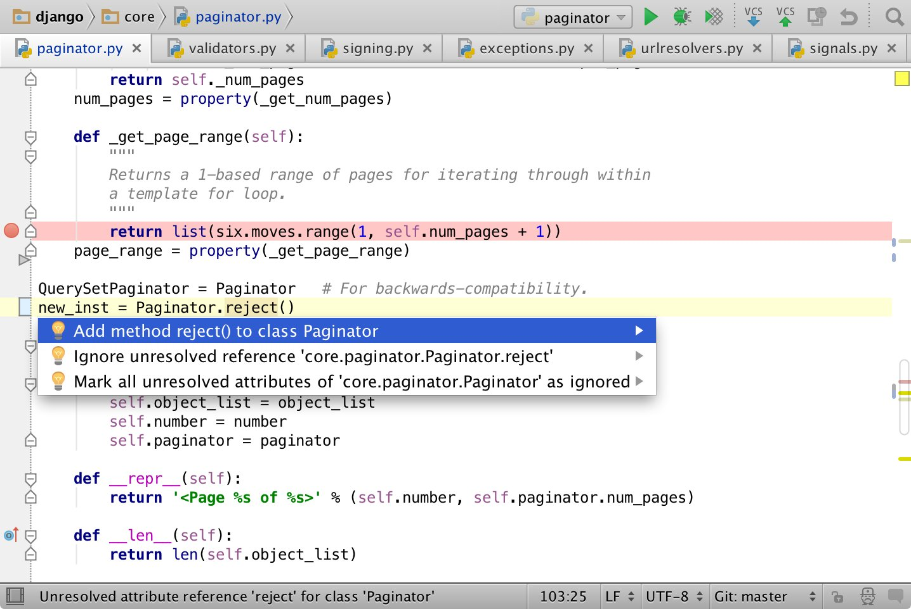

.. _ide:

IDE – edytory kodu
##################

Skrypty Pythona można zapisywać w dowolnym edytorze tekstu, ale oczywiście
wygodniej jest używać programów, które potrafią przynajmniej odpowiednio
podświetlać kod.

.. _geany-python:

Geany
=====================

.. figure:: ide/geany_win.jpg

`Geany <http://www.geany.org>`_ to proste i lekkie środowisko IDE dostępne na
licencji `GNU General Public Licence <http://pl.wikipedia.org/wiki/GNU_General_Public_License>`_.
Geany oferuje kolorowanie składni, wsparcie standardów kodowania,
dopełnianie poleceń, automatyczne zamykanie tagów, auto-wcięcia,
pracę w kartach itd. Ma wbudowany podręczny notatnik oraz
kompilowanie, budowanie i uruchamianie tworzonego kodu.

W Linuksie
----------------

W systemach linuksowych korzystamy z dedykowanych menedżerów, np. w Xubuntu
(i innych debianopochodnych) wystarczy wpisać w terminalu:

.. code-block:: bash

    ~$ sudo apt-get install geany geany-plugins

W Windows
------------------

W MS Windows ściągamy i instalujemy
`pełną wersję binarną Geany <http://www.geany.org/Download/Releases>`_
przeznaczoną dla tych systemów. *Pełna* oznacza tutaj, ze zawiera biblioteki
GTK wykorzystywane przez program. Podczas standardowej instalacji można
zmienić katalog docelowy, np. na ``C:\Geany``.

Konfiguracja
------------

Zanim rozpoczniemy pracę w edytorze, warto dostosować kilka ustawień.

W menu `Narzędzia/Menedżer wtyczek` zaznaczamy pozycję "Addons" (dostępna
po zainstalowaniu wtyczek), a następnie "Przeglądarka plików".
Zanim wyjdziemy z okna naciskamy przycisk "Preferencje" i na zakładce
"Przeglądarka plików" zaznaczamy opcję "Podążanie za ścieżką do bieżącego pliku".
Dzięki temu w panelu bocznym w zakładce "Pliki" zobaczymy listę katalogów i plików,
które łatwo możemy otwierać.

W menu `Edycja/Preferencje` :kbd:`CTRL+ALT+P` w zakładce `Edytor/Wcięcia` jako
"Typ" wcięć wybieramy opcję "spacje".

Jeżeli pracujemy ze skryptem Pythona, uruchomimy go naciskając klawisz F5
(lub `Zbuduj/Wykonaj`). Wcięcia wstawiają się automatycznie lub poprzez
naciśnięcie klawisza :kbd:`TAB`. Jeżeli chcielibyśmy wciąć od razu cały blok kodu,
zaznaczamy go i również używamy :kbd:`TAB` lub :kbd:`CTRL+I`, zmniejszenie wcięcia uzyskamy
naciskając :kbd:`CTRL+U`.

.. _pycharm-python:

PyCharm
=======

PyCharm to profesjonalne, komercyjne środowisko programistyczne dostępne
za darmo do celów szkoleniowych. Interfejs nie został na razie spolszczony.

To IDE doskonale wspiera proces uczenia się. Udostępnia nawigację po kodzie,
podpowiedzi, wykrywa błędy i ma wbudowanych wiele innych udogodnień.

**Zarówno w systemach Linux, jak i MS Windows pobieramy
ostatnią wersję** `Professional Edition <http://www.jetbrains.com/pycharm/download/>`_
ze strony producenta.

W Linuksie
-----------

Wersja linuksowa to archiwum, które trzeba rozpakować. W terminalu wydajemy polecenia:

.. code-block:: bash

    ~$ sudo tar xzf pycharm-professional-2016.3.2.tar.gz -C /opt
    ~$ sudo ln -s /opt/pycharm-2016.3.2/bin/pycharm.sh /usr/bin/pycharm

Program zostanie rozpakowany do katalogu :file:`/opt/pycharm-wersja`,
przy czym "wersja" to ciąg typu ``2016.3.2`` odczytany z nazwy archiwum.
Drugie polecenie utworzy skrót pozwalający uruchamiać edytor za pomocą polecenia
``pycharm`` w terminalu.

.. note::

    PyCharm wykorzystuje środowisko Java, które dostarczane jest razem z nim w wersji 64-bitowej.
    Jeżeli czcionki w programie są nieczytelne, można w pliku :file:`~/.bashrc` (Debian i pochodne)
    lub :file:`~/.bash_profile` (Arch Linux i pochodne) dodać poniższą linię:

.. code-block:: bash

    export _JAVA_OPTIONS='-Dawt.useSystemAAFontSettings=on -Dswing.defaultlaf=com.sun.java.swing.plaf.gtk.GTKLookAndFeel'

W Windows
------------------

Zainstaluj pobrany plik.

Bezpłatna licencja
------------------

Każdy nauczyciel może wystąpić o klucz licencyjny przy pomocy `formularza
<https://www.jetbrains.com/buy/classroom/?product=pycharm>`_
dostępnego na stronie producenta.

Polski słownik
--------------

W programie możemy włączyć sprawdzanie polskiej pisowni.
Pobieramy archiwum :download:`polish-dic.tgz <ide/polish-dic.tgz>`,
następnie wydajemy polecenie w terminalu:

.. code-block:: bash

    ~$ sudo tar xzf polish-dic.tgz -C /

– które wypakuje słownik ``polish.dic`` do katalogu :file:`/usr/share/dictionaries-common/`.
Na koniec w ustawieniach programu (:kbd:`Ctrl+Alt+S`) wyszukujemy `Spelling`, klikamy
zakładkę `Dictionaries` i znak `+` przy `Custom Dictionaries Folder` i wskazujemy
katalog :file:`/usr/share/dictionaries-common/`.

.. tip::

    W Linuksie plik :file:`polish.dic` można wygenerować poleceniem:
    ``aspell --lang pl dump master | aspell --lang pl expand | tr ' ' '\n' > polish.dic``

.. _st3-python:

Sublime Text 3
===============

.. figure:: ide/st3.jpg

Profesjonalny edytor dla programistów, dzięki systemowi dodatków można go
skonfigurować jako środowisko IDE do programowania w dowolnym języku.
Zaletą jest również szybkość działania i małe użycie zasobów
systemowych.

Unikalne cechy:

* Wygodne otwieranie plików: :kbd:`CTRL+P`
* Wielokrotna selekcja i edycja: po zaznaczeniu zmiennej :kbd:`CTRL+D`,
  :kbd:`CTRL+D`... itd.
* Lista wszystkich poleceń z menu: :kbd:`CTRL+SHIFT+P`
* Równoczesna edycja kilku plików: *View/Layout*

W Linuksie
-----------------

W Debianie i systemach na nim opartych ((X)Ubuntu, Linux Mint),
wchodzimy na stronę `Sublime Text 3 <http://www.sublimetext.com/3>`_,
pobieramy wersję *Ubuntu 64 bit* lub *Ubuntu 32 bit* i dwa razy klikamy zapisany plik:

.. figure:: ide/gdebi.jpg

– albo instalujemy wydając polecenie w terminalu w katalogu z pobranym
pakietem, np.:

.. code-block:: bash

    ~$ sudo dpkg -i sublime-text_build-3126_amd64.deb

W Arch Linux i systemach na nim opartych (*Manjaro*, *Antergos*), edytor
instalujemy z repozytorium AUR przy użyciu pomocniczego narzędzia
``pacaur`` lub ``yaourt``, np.:

.. code-block:: bash

    ~$ pacaur -S sublime-text-dev

Następnie pobieramy :download:`archiwum zip <ide/st3.zip>`
i wypakowujemy do katalogu :file:`~/.config` za pomocą menedżera archiwów
albo polecenia w terminalu:

.. code-block:: bash

    ~$ unzip st3.zip -d ~/.config

.. tip::

    Katalog :file:`~/.config` to ukryty katalog w katalogu domowym
    użytkownika. W menedżerze plików możemy włączyć wyświetlanie katalogów
    ukrytych skrótem :kbd:`CTRL+H`.

W Windows
------------------

Po wejściu na stronę `Sublime Text 3 <http://www.sublimetext.com/3>`_
pobieramy archiwum dla wersji 32- lub 64-bitowej. Instalujemy standardowo
dwukrotnie klikając pobrany plik.

Następnie pobieramy :download:`archiwum zip <ide/st3.zip>`, wypakowujemy do katalogu
:file:`C:\\Użytkownicy\\nazwa_użytkownika\\Dane aplikacji` i zmieniamy nazwę folderu
:file:`sublime-text-3` na :file:`Sublime Text 3`.

**Przygotowane ustawienia zawierają m.in.:**

* `Package Control <https://packagecontrol.io/installation#st3>`_ – menedżer pakietów dla ST3. Po zainstalowaniu skrót :kbd:`CTRL+SHIFT+P` wywołuje listę, w które wpisujemy "install" i wybieramy *Package Control: Install Package*, teraz możemy wskazać pakiet do zainstalowania.
* Globalne ustawienia edytora zdefiniowane w *Preferences >Settings – User*.
* Ustawienia dla wybranego języka programowania dostępne są po wybraniu *Preferences > Settings – More > Syntax Specific – User*, plik należy zapisać pod nazwą *LANGUAGE.sublime-settings*, np. *Python.sublime-settings* w podkatalogu :file:`Packages/User`.
* `Anaconda <https://packagecontrol.io/packages/Anaconda>`_ – podstawowy dodatek do programowania w Pythonie
  (autouzupełniania, sprawdzanie składni, podgląd dokumentacji itp.), dostępny w menu podręcznym podczas
  edycji plików ".py".
* `Emmet <https://packagecontrol.io/packages/Emmet>`_ – oferuje skróty ułatwiające tworzenie dokumentów HTML i CSS.
* `SublimeREPL <https://packagecontrol.io/packages/SublimeREPL>`_ – pozwala uruchamiać kod Pythona
  w edytorze za pomocą skrótu :kbd:`CTRL+SHIFT+R` lub :kbd:`CTRL+B`.
* `Color Picker <https://packagecontrol.io/packages/ColorPicker>`_ –
  dodaje próbnik kolorów wywoływany skrótem :kbd:`CTRL+SHIFT+C`.
* `GitSavvy <https://packagecontrol.io/packages/GitSavvy>`_ – obsługa git-a i GitHub-a dostępna po wciśnięciu
  :kbd:`CTRL+SHIFT+P` i wpisaniu "git".
* `Restructured Text Improved <https://packagecontrol.io/packages/RestructuredText%20Improved>`_
  – podświetlanie składni dokumentów RST.
* `Restructured Text (RST) Snippets <https://packagecontrol.io/packages/Restructured%20Text%20%28RST%29%20Snippets>`_
  – skróty formatujące dokumenty RST.

.. tip::

    Samodzielna instalacja powyższych dodatków po zainstalowaniu *Package Control* jest prosta.
    Z kolei dostosowanie ustawień wymaga zapoznania się z `dokumentacją ST3 <http://sublime-text-unofficial-documentation.readthedocs.org/en/latest/reference/settings.html>`_
    i dodatków, aby wiedzieć, co i w jaki sposób chcemy zmieniać.

