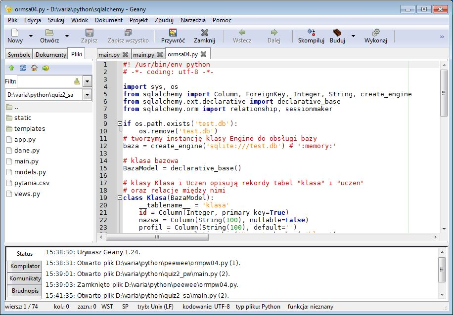
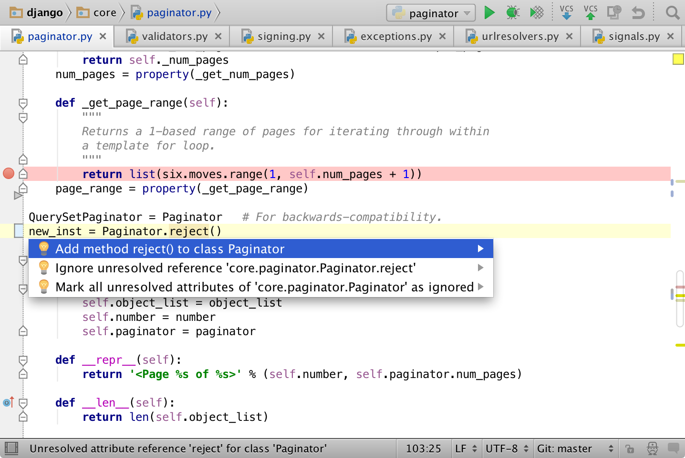

IDE – edytory kodu
##################

Skrypty Pythona można zapisywać w dowolnym edytorze tekstu, ale oczywiście
wygodniej jest używać programów, które potrafią przynajmniej odpowiednio
podświetlać kod.

.. contents:: Spis treści
    :backlinks: none

.. _geany-python:

Geany
=====================

`Geany <http://www.geany.org>`_ to proste i lekkie środowisko IDE dostępne na licencji
`GNU General Public Licence <http://pl.wikipedia.org/wiki/GNU_General_Public_License>`_.
Geany oferuje kolorowanie składni dla najpopularniejszych języków,
m.in. C, C++, C#, Java, PHP, HTML, Python, Perl i Pascal,
wsparcie dla kodowania w ponad 50 standardach, dopełnianie poleceń, mechanizmy automatycznego zamykanie tagów dla HTML\XML,
auto-wcięć, pracy na kartach i wiele, wiele więcej. Podczas pisania kodu przydatny okazuje się brudnopis,
pozwalający tworzyć dowolne notatki, a także możliwość kompilacji plików źródłowych
bezpośrednio z poziomu programu.

Instalacja Linux
----------------

W systemach linuksowych korzystamy z dedykowanych menedżerów, np. w Xubuntu
(i innych debianopochodnych) wystarczy wpisać w terminalu:

.. code-block:: bash

    ~$ sudo apt-get install geany geany-plugins

Instalacja Windows
------------------

W MS Windows ściągamy i instalujemy `pełną wersję binarną Geany <http://www.geany.org/Download/Releases>`_
przeznaczoną dla tych systemów. *Pełna* oznacza tutaj, ze zwaiera biblioteki
GTK wykorzystywane przez program. Podczas standardowej instalacji można
zmienić katalog docelowy, np. na ``C:\Geany``.

Konfiguracja
------------

Zanim rozpoczniemy pracę w edytorze, warto dostosować kilka ustawień.

W menu `Narzędzia/Menedżer wtyczek` zaznaczamy pozycję "Addons" (dostępna
po zainstalowaniu wtyczek), a następnie "Przeglądarka plików".
Zanim wyjdziemy z okna naciskamy przycisk "Preferencje" i na zakładce
"Przeglądarka plików" zaznaczamy opcję "Podążanie za ścieżką do bieżącego pliku".
Dzięki temu w panelu bocznym w zakładce "Pliki" zobaczymy listę katalogów i plików,
które łatwo możemy otwierać.

W menu `Edycja/Preferencje` :kbd:`CTRL+ALT+P` w zakładce `Edytor/Wcięcia` jako
"Typ" wcięć wybieramy opcję "spacje".

Jeżeli pracujemy ze skryptem Pythona, uruchomimy go naciskając klawisz F5
(lub `Zbuduj/Wykonaj`). Wcięcia wstawiają się automatycznie lub poprzez
naciśnięcie klawisza :kbd:`TAB`. Jeżeli chcielibyśmy wciąć od razu cały blok kodu,
zaznaczamy go i również używamy :kbd:`TAB` lub :kbd:`CTRL+I`, zmniejszenie wcięcia uzyskamy
naciskając :kbd:`CTRL+U`.

.. _pycharm-python:

PyCharm
=======

PyCharm to profesjonalne, komercyjne środowisko programistyczne dostępne
za darmo do celów szkoleniowych. Interfejs nie został na razie spolszczony.

To IDE doskonale wspiera proces uczenia się. Dzięki nawigacji po kodzie,
podpowiedziom oraz wykrywaniu błędów niemal na bieżąco, uczniowie mniej
czasu będą spędzać na szukaniu problemów, a więcej na poznawaniu tajników
programowania.

Instalacja Windows
------------------

Zarówno w systemach Linux, jak i MS Windows najlepiej pobrać
ostatnią wersję `Professional Edition <http://www.jetbrains.com/pycharm/download/>`_
ze strony producenta.

Instalacja Linux
----------------

Wersja linuksowa to archiwum, które trzeba rozpakować,
czyli przenieść z katalogu ``Pobrane`` do np. w katalogu domowego, kliknąć
prawym klawiszem i wybrać polecenie ``Rozpakuj tutaj``.

W systemach Linux alternatywnie można użyć poleceń w terminalu:

.. code-block:: bash

    wget http://download.jetbrains.com/python/pycharm-professional-4.5.tar.gz -O - | tar -xz
    ./pycharm-4.5/bin/pycharm.sh

Jak widać, program zostanie zainstalowany w katalogu domowym użytkownika,
a uruchamiamy go drugim z podanych poleceń.

Jeśli w naszym systemie brakuje oprogramowania JAVA to musimy zainstalować Open JDK:

.. code-block:: bash

    sudo apt-get install openjdk-7-jre

Lub zamiast Open JDK zainstalować wersję firmy Oracle. W systemach Ubuntu
i pochodnych używamy poleceń:

.. code-block:: bash

    sudo apt-get install python-software-properties
    sudo add-apt-repository ppa:webupd8team/java
    sudo apt-get update
    sudo apt-get install oracle-java8-installer

Bezpłatna licencja
------------------

Każdy nauczyciel może wystąpić o klucz licencyjny przy pomocy `formularza
<http://www.jetbrains.com/eforms/classroomRequest.action?licenseRequest=PCP04LS#>`_
dostępnego na stronie producenta.

Polski słownik ortograficzny
----------------------------

W programie możemy włączyć sprawdzanie polskiej pisowni, jednak potrzebne
jest wskazanie pliku słownika. Pod linuksem możemy sobie wyprodukować słownik dla PyCharm komendą:

.. code-block:: bash

    aspell --lang pl dump master | aspell --lang pl expand | tr ' ' '\n' > polish.dic
    sudo mv polish.dic ``/usr/share/dictionaries-common/``

W ustawieniach :kbd:`Ctrl+Alt+S` szukamy `spell` i dodajemy
``custom dictionaries folder`` wskazując na ``/usr/share/dictionaries-common/``
(lokalizacja w Xubuntu).
