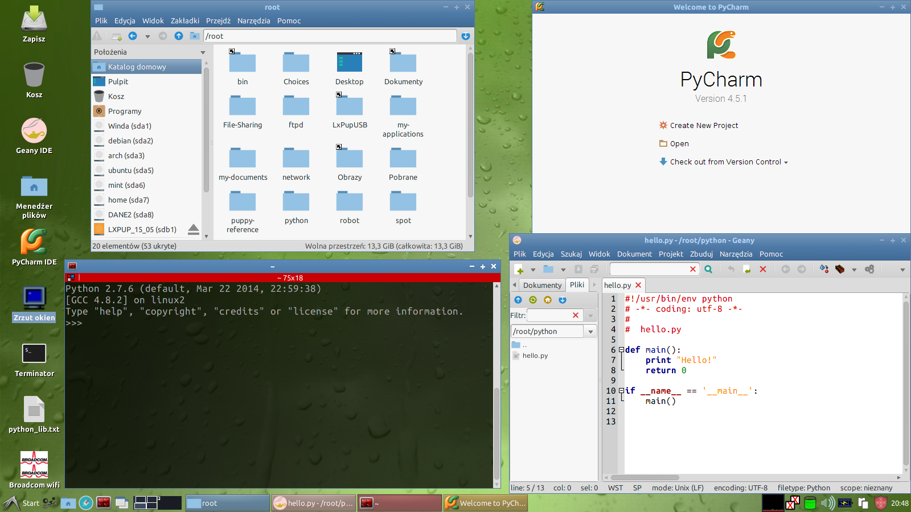
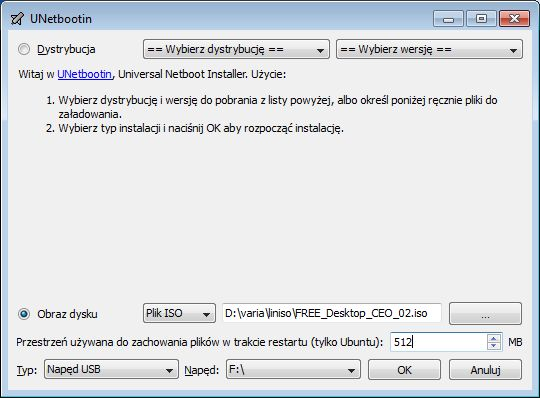

.. _linux-live:

Linux Live
###########

Live CD/USB
============

Płyta LiveDVD lub klucz startowy USB z systemem w wersji *live* pozwalają
na uruchomienie komputera, testowanie i pracę bez ingerowania w dane
zgromadzone na twardym dysku (np. inne systemy). Dystrybujce *live* można
zainstalować na dysku twardym lub wykorzystać do odzyskiwania danych.

.. note::

    Przygotowanie bootowalnej płyty sprowadza się do pobrania obrazu *iso*
    (zob. :term:`obraz iso`) wybranej dystrybucji i nagrania jej za pomocą
    dowolnego programu na nośniku.  Niestety, tak przygotowany system
    nie zapamięta żadnych zmian konfiguracyjnych ani plików użytkownika,
    chyba że zapiszemy je na dysku twardym lub pendrajwie.

W "czystym" systemie *live* można przećwiczyć scenariusze podstawowe,
pozostałe wymagają doinstalowania bibliotek. Dlatego najlepszym rozwiązaniem
jest przygotowanie klucza Live USB z plikiem zapisu (tzw. tryb persystencji)
przechowującym dokonywane w systemie zmiany (doinstalowane programy, konfiguracja
i pliki użytkownika).

.. _dystrybucje:

Polecane dystrybucje
---------------------

* `LxPupTahr 15.05.01 <http://lx-pup.weebly.com/>`_ – system zaprojektowany
  od podstaw jako *live* z możliwością zapisywania zmian. Oparty na stabilnym
  Ubuntu 14.04 LTS. Środowisko graficzne LXDE. Zawiera wszystkie dodatkowe
  narzędzia i wymagane biblioteki. **Polecany do realizowania scenariuszy na warsztatach.**

   System LxPupTahr

* `Xubutnu 14.04.2 LTS <http://xubuntu.org/>`_ – ostatnia stabilna wersja Ubuntu,
  wspierana do roku 2019. Środowisko graficzne XFCE. Wymaga doinstalowania
  narzędzi i bibliotek.

* `Szkolny Remiks Ucznia v.37 <Szkolny Remiks Ucznia: http://sru.e-swoi.pl>`_
  – to spersonalizowana wersja stabilnego Xubuntu (zob. wyżej), środowisko XFCE.
  Zawiera dużo dodatkowego oprogramowania. Wymaga doinstalowania części narzędzi i bibliotek.

* `FREE_DESKTOP v.02 <http://cyfrowaszkola.waw.pl/free_desktop-edukacyjny-remiks-dla-wszystkich/>`_
  – dostosowana do potrzeb edukacyjnych wersja stabilnego Ubuntu 12.04 z
  środowiskiem XFCE. Zawiera dużo dodatkowego oprogramowania. Wymaga
  doinstalowania części narzędzi i bibliotek.

.. _Koduj z Klasą: http://kodujzklasa.pl

.. _usb-creator:

W Windows
===================

Klucz Live USB
---------------

* Pobieramy :term:`obraz iso` wybranej :ref:`dystrybucji <dystrybucje>`:

  - `LxPupTahr <https://copy.com/9WzmbHVn8T8UxsSN/tahrpup/kzkbox_20150920.iso?download=1>`_ (320MB)
  - `LxPupTahr Full <https://copy.com/9WzmbHVn8T8UxsSN/tahrpup/kzkbox_20150920_full.iso?download=1>`_ (520MB, zawiera edytory PyCharm Professional i SublimeText 3)
  - `Xubuntu <http://se.archive.ubuntu.com/mirror/cdimage.ubuntu.com/xubuntu/releases/14.04/release/xubuntu-14.04.2-desktop-i386.iso>`_ (975MB)
  - `SRU v.37 32-bit <http://iso.sru.e-swoi.pl/SRU_MT-14.04-37.iso>`_ (2,4GB)
  - `FREE_DESKTOP_CEO <http://cyfrowaszkola.waw.pl/_pliki/FREE_Desktop_CEO_02.iso>`_ (2,1GB)

* W przypadku *LxPupTahr* pobieramy program `Rufus <https://rufus.akeo.ie/>`_.
  Dla pozostałych: `program Unetbootin <http://unetbootin.sourceforge.net/unetbootin-windows-latest.exe>`_.

* Wpinamy pendrajwa o pojemności min. 2GB dla dystrybucji *LxPupTahr*, 4GB – dla pozostałych.
  Pendrajw powinien mieć przynajmniej jedną główną i aktywną partycję FAT32 – tak jest zazwyczaj.

* *LxPupTahr*: po uruchomieniu *Rufusa* z uprawnieniami administratora z listy "Urządzenie" wybierz pendrajwa,
  zaznacz opcję "Utwórz bootowalny dysk używając" -> "Obraz ISO", kliknij ikonę obok
  i wskaż ściągnięty obraz iso, wybierz "Opcje formatowania" i zaznacz
  "Dodaj łatkę dla starych biosów"; kliknij "Start" i poczekaj do 5 min.
  na napis "Gotowe".

.. figure:: img/rufus02.jpg

.. tip::

    Jeżeli wybrałeś system *LxPupTahr*, przeczytaj :ref:`Pierwsze uruchomienie <lxpuptahr>`!

* *Xubuntu*, *SRU*, *FREE DESKTOP*: po uruchomieniu programu *Unetbootin*
  zaznaczamy opcję "Obraz dysku", klikamy przycisk "..." i wskazujemy
  pobrany obraz. W polu "Przestrzeń używana do zachowania plików..."
  wpisujemy min. ``512``. W polu "Napęd:" wskazujemy pendrajwa i klikamy "OK".
  Czekamy w zależności od wybranej dystrybucji i prędkości klucza USB od 5-25 minut.

.. figure:: img/unetbootin_win_lxpup.jpg

Linux na maszynie wirtualnej
----------------------------

Jeżelli nie działa klucz USB, Linuksa łatwo uruchomić w Windowsie za pomocą
tzw. maszyny wirtualnej.

* Ściągamy i instalujemy program `VirtualBox <http://download.virtualbox.org/virtualbox/4.3.8/VirtualBox-4.3.8-92456-Win.exe>`_.
* Pobieramy `obraz maszyny wirtualnej SRU <http://www.cyfrowaszkola.waw.pl/_python/SRU_FWIOO.ova>`_ (format OVA).
* Uruchamiamy VirtualBoksa wydajemy polecenie "Plik/Importuj urządzenie programowe"
  i postepujemy według wskazówek wyświetlanych przez kreatora. Po wykonanym imporcie
  możemy uruchomić maszynę w VirtualBoksie, a plik OVA skasować.

Zmiany i utworzone dokumenty w tak uruchomionym systemie są zachowywane.

.. tip::

    Za pomocą VirtualBoksa można zainstalować dowolną inną dystrybucję Linuksa
    z pobranego obrazu *iso*.

W Linuksie
===========

* W Ubuntu i pochodnych instalujemy program `Unetbootin <http://unetbootin.sourceforge.net>`_ poleceniami:

.. code-block:: bash

    ~$ sudo apt-add-repository ppa:gezakovacs/ppa
    ~$ sudo apt-get update
    ~$ sudo apt-get install unetbootin

* W Debianie Jessie 8 ściągamy pakiet `unetbootin_608-1_i386.deb <http://ftp.pl.debian.org/debian/pool/main/u/unetbootin/unetbootin_608-1_i386.deb>`_,
  a następnie w katalogu z pobranym plikiem wydajemy polecenia jako root:

.. code-block:: bash

    ~# dpkg -i unetbootin_608-1_i386.deb
    ~# apt-get install -f

*  W Arch Linuksie i pochodnych jako root wydajemy polecenia:

.. code-block:: bash

    ~# pacman -Syu
    ~# pacman -S unetbootin

* Wpinamy pendrajwa o pojemności min. 4GB dla dystrybucji *SRU* (*Xubuntu*). Pendrajw
  powinien mieć przynajmniej jedną główną i aktywną partycję FAT32 – tak jest zazwyczaj.
* Po uruchomieniu programu "Unetbootin" zaznaczamy opcję "Obraz dysku", klikamy
  przycisk "..." i wskazujemy pobrany obraz.
* Jeżeli wybraliśmy *LxPupTahr*, przechodzimy do następnego punktu.
  Jeżeli wybraliśmy obraz *Xubuntu*, *SRU* lub *FREE_DESKTOP*, w polu "Przestrzeń
  używana do zachowania plików..." wpisujemy min. ``512``.
* Upewniamy się, że w polu "Napęd:" wyświetlona jest litera przydzielona
  właściwemu pendrajwowi i klikamy "OK". Czekamy w zależności od wybranej
  dystrybucji i prędkości klucza USB od 1-20 minut.

.. note::

    Jeżeli nagrywamy obraz *Xubuntu*, *SRU* lub *FREE_DESKTOP* możemy na pendrajwie
    utworzyć dodatkową partycję typu Ext4 o dowolnej pojemności, ale obowiązkowej
    etykiecie "home-rw". Zostanie ona wykorzystana jako miejsce montowania
    i zapisywania plików użytkownika. W takim wypadku pole "Przestrzeń używana
    do zachowania plików..." pozostawiamy puste!

    Dodatkową partycję utworzysz przy użyciu programu **gparted**. Instalacja:
    ``sudo apt-get update && sudo apt-get install gparted``.
    Niestety za pomocą standardowych narzędzi MS Windows nie utworzymy partycji Ext4.
    Ostateczny układ partycji powinien wyglądać tak jak na poniższym zrzucie:

.. figure:: img/sru_usb08.png

Materiały
========================

.. toctree::
    :maxdepth: 2
    :numbered:

    problemy.rst
    opcje.rst
    lxpup.rst
