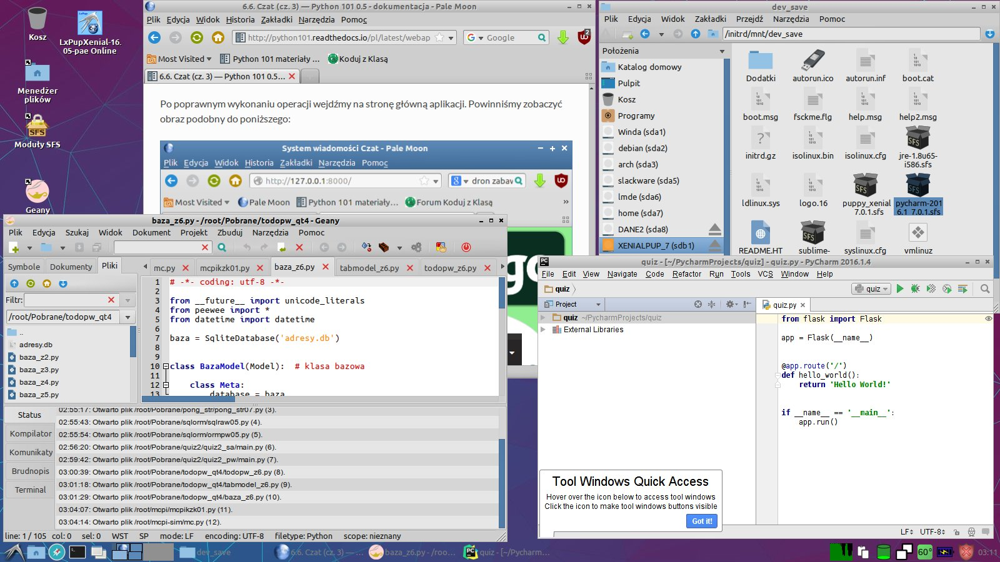
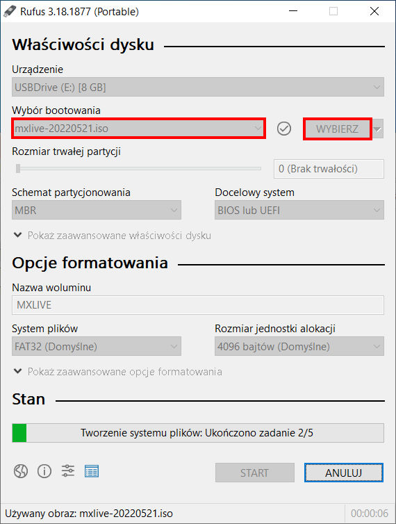
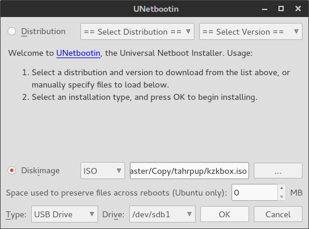
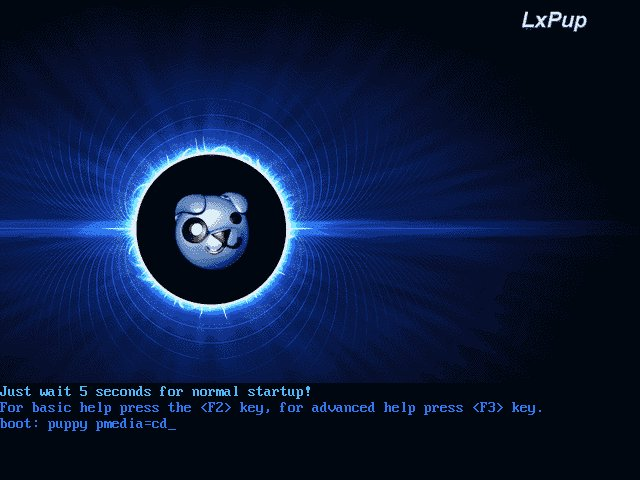
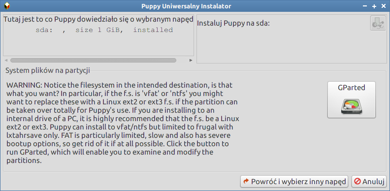
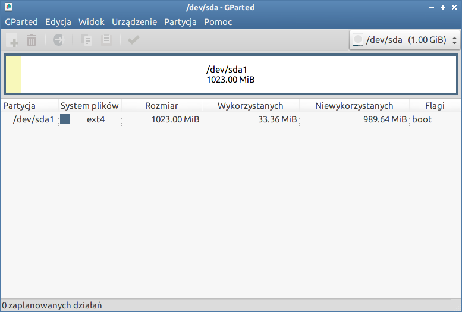
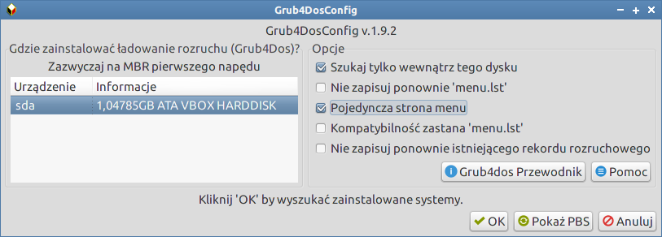

.. _linux-live:

Linux Live
###########

Klucz Live USB
===============

Klucz startowy USB z systemem w wersji *live* pozwala na uruchomienie
komputera, testowanie i pracę bez ingerowania w dane zgromadzone na
twardym dysku (np. inne systemy). Dystrybujce *live* można zainstalować
również w maszynie wirtualnej, na dysku twardym lub wykorzystać do odzyskiwania danych.

.. note::

    Bootowalna płyta CD/DVD z systemem Linux w wersji *live* nie nadaje się do realizacji scenariuszy.

**Na potrzeby szkoleń**, **do realizacji scenariuszy**, **dla nauczycieli i uczniów**
przygotowaliśmy specjalną wersję dystrybucji `LxPup <http://lx-pup.weebly.com/>`_,
opartej na stabilnym wydaniu Ubuntu Xenial Xerus 16.04,
wykorzystującą środowisko graficzne `LXDE <http://lxde.org/>`_.
Nasz system zawiera wszystkie dodatkowe narzędzia i biblioteki, pozwala doinstalowywać
programy, zapisuje ustawienia i utworzone dokumenty.

   Dostosowany system LxPupXenial 7.0.1

.. _usb-creator:

W Windows
===================

* Pobieramy :term:`obraz iso`:

  - `LxPupXenial Full <https://drive.google.com/open?id=0B1zG9cfNyT7WUExnbTNkTWtnZFE>`_
    (705MB, zawiera edytory Geany 1.25, PyCharm Professional 2016.2, SublimeText 3 oraz Etherpad)
  - lub: `LxPupXenial Base <https://drive.google.com/open?id=0B1zG9cfNyT7WN2JCZEZMNTJnMjg>`_
    (412MB, zawiera edytor Geany 1.25 oraz Etherpad, łatwo dodać :ref:`PyCharm i/lub Sublime Text 3<sfs-pet>`)

* Do wgrania *LxPupXenial* pobieramy program `Rufus <https://rufus.akeo.ie/>`_.

* Wpinamy pendrajwa o pojemności min. 2GB.
  Pendrajw powinien mieć przynajmniej jedną główną i aktywną partycję FAT32 – tak jest zazwyczaj.

* Po uruchomieniu *Rufusa* z uprawnieniami administratora z listy "Urządzenie" wybierz pendrajwa,
  zaznacz opcję "Utwórz bootowalny dysk używając" -> "Obraz ISO", kliknij ikonę obok
  i wskaż ściągnięty obraz iso. Następnie wybierz "Opcje formatowania" i zaznacz
  "Dodaj łatkę dla starych biosów"; kliknij "Start" i poczekaj do 5 min. na napis "Gotowe".

.. tip::

  Po nagraniu systemu *LxPupXenial*, koniecznie przeczytaj :ref:`Pierwsze uruchomienie <lxpup>`!!!
  Jeżeli pobrałeś wersję BASE, przeczytaj, jak łatwo :ref:`dodawać programy <sfs-pet>` (np. profesjonalne edytory kodu).

W Linuksie
===========

Aby przygotować pendrajw w systemie Linux, pobieramy wybrany :ref:`obraz iso <usb-creator>`, następnie:

* instalujemy program `Unetbootin <http://unetbootin.sourceforge.net>`_, w Ubuntu i pochodnych:

.. code-block:: bash

    ~$ sudo apt-add-repository ppa:gezakovacs/ppa
    ~$ sudo apt-get update
    ~$ sudo apt-get install unetbootin

- W Debianie Jessie 8 ściągamy pakiet `unetbootin_608-1_i386.deb <http://ftp.pl.debian.org/debian/pool/main/u/unetbootin/unetbootin_608-1_i386.deb>`_, a następnie w katalogu z pobranym plikiem wydajemy polecenia jako root:

.. code-block:: bash

    ~# dpkg -i unetbootin_608-1_i386.deb
    ~# apt-get install -f

- W Arch Linuksie i pochodnych jako root wydajemy polecenia:

.. code-block:: bash

    ~# pacman -Syu
    ~# pacman -S unetbootin

* Wpinamy pendrajwa o pojemności min. 2GB.
  Pendrajw powinien mieć przynajmniej jedną główną i aktywną partycję FAT32 – tak jest zazwyczaj.
* Po uruchomieniu programu "Unetbootin" zaznaczamy opcję "Obraz dysku", klikamy
  przycisk "..." i wskazujemy pobrany obraz.
* Upewniamy się, że w polu "Napęd:" wyświetlona jest litera przydzielona
  właściwemu pendrajwowi i klikamy "OK". Czekamy w zależności od wybranej
  dystrybucji i prędkości klucza USB od 1-20 minut.

.. note::

  Pendrajw z systemem live można przygotować również w oparciu o inne
  systemy niż LxPup. Zobacz materiał :ref:`Linux-live USB – różne systemy <dystrybucje>`.

W maszynie wirtualnej
=====================

Dystrybucję *LxPupXenial* łatwo uruchamiać w Windows lub w Linuksie za pomocą tzw. maszyny wirtualnej.

1) Pobieramy program `VirtualBox <https://www.virtualbox.org/wiki/Downloads>`_ w wersji
   dla naszego systemu  i instalujemy.
2) Pobieramy `maszynę wirtualną z LxPupXenial <https://www.dropbox.com/s/vp2wt429buh4iw1/KzK_Linux.ova?dl=0>`_
   (1,1 GB) w formacie OVA.
3) Uruchamiamy VirtualBox, wybieramy polecenie "Plik/Importuj urządzenie wirtualne" i wskazujemy ściągnięty
   w poprzednim kroku plik. Po zaimportowaniu maszyny klikamy "Uruchom".

*LxPupXenial* można też zainstalować w VirtualBoksie samemu. Aby to zrobić, uruchamiamy aplikację
i tworzymy nową maszynę wirtualną:

* nazwa – np. "LxPup", typ – *Linux*, wersja – *Ubuntu (32-bit)*;
* rozmiar pamięci – min. 1024MB
* tworzymy dysk twardy VDI o stałym rozmiarze min. 2048MB

Po utworzeniu maszyny w sekcji "Storage" jako dysk rozruchowy wskazujemy ściągnięty :term:`obraz iso` dystrybucji,
np. ``kzkbox20160922_full.iso``:

.. figure:: vboximg/vbox05.jpg

Uruchamiamy maszynę, ale na ekranie rozruchowym systemu podajemy dodatkowe
parametry uruchomieniowe: ``puppy pmedia=cd pfix=ram``:

Po uruchomieniu systemu zamykamy kreatora konfiguracji, w przypadku problemów z rozdzielczością
przechodzimy do trybu pełnoekranowego (:kbd:`HOST+F` lub menu *View/Full screen Mode*)
i uruchamiamy instalatora poleceniem *Start/Konfiguracja/Puppy uniwersalny instalator*.

1) W oknie "Instaluj" wybieramy *Uniwersalny instalator*;
2) W kolejnym wybieramy *Wewnętrzny (IDE lub SATA) dysk twardy*;
3) Następnie wskazujemy dysk *sda ATA VBOX HARDDISK* za pomocą ikony;
4) Kolejne okno umożliwi uruchomienie edytora GParted, za pomocą którego
   założymy i sformatujemy partycję systemową;

5) W edytorze GParted wybieramy kolejno:

   a) w menu *Urządzenie/Utwórz tablicę partycji*, kolejne okno potwierdzamy *Zastosuj*;
   b) Klikamy nieprzydzielone miejsce prawym klawiszem i wybieramy *Nowa*, wybieramy
      "Partycja główna" i system "Ext4", zatwierdzamy *Dodaj*;
   c) Następnie wybieramy *Edycja/Zastosuj wszystkie działania* lub klikamy ikonę "zielonego ptaszka";
   d) Na koniec klikamy utworzoną partycję prawym klawiszem, wybieramy *Zarządzaj flagami*,
      zaznaczamy opcję "boot" i zatwierdzamy *Zamknij*; w efekcie powinniśmy zobaczyć
      co następuje:

6) Po zamknięciu edytora GParted, ponownie wskazujemy dysk "sda",
   a w kolejnym, powtórzonym oknie klikamy ikonę w prawym górnym rogu obok
   napisu "Instaluj Puppy na sda1";
7) W kolejnym oknie potwierdzamy instalację przyciskiem *OK*;
8) W następnym klikamy przycisk *CD*, aby wskazać położenie plików systemowych,
   i jeszcze raz potwierdzamy przyciskiem "OK";
9) W kolejnym oknie wybieramy *OSZCZĘDNY* tryb instalacji – system będzie zachowywał się
   tak, jakby był zainstalowany na pendrajwie; następne wyjaśnienia potwierdzamy *OK*;
10) Podajemy nazwę katalogu, w którym znajdą się pliki systemowe, np. "lxpup";
11) Po skopiowaniu plików wybieramy instalację bootmenedżera *grub4dos* przyciskiem *Tak*;
12) W oknie instalacyjnym Grub4Dos zaznaczamy opcje zgodnie ze zrzutem:

13) W kolejnym oknie zatwierdzamy listę wykrytych systemów *OK*,
    a w następnym potwierdzamy instalację bootmenedżera w MBR;
14) Na koniec zamykamy informację o udanej instalacji:

.. figure:: vboximg/puppy_vb12.png

Zamykamy LxPup (*Start/Zamknij*), usuwamy plik obrazu iso z wirtualnego napędu
i możemy uruchomić LxPupTahr w maszynie wirtualnej:

.. figure:: vboximg/vbox07.jpg

System zainstalowany w ten sposób działa tak samo jak zainstalowany na kluczu USB,
a więc wymaga potwierdzenia konfiguracji wstępnej i utworzenia pliku zapisu.
Zob.: :ref:`Pierwsze uruchomienie <lxpup>`!!!

.. tip::

  Za pomocą VirtualBoksa można zainstalować dowolną inną dystrybucję Linuksa
  z pobranego obrazu *iso*. Taka instalacja zadziała jak "normalny" system,
  a więc umożliwi aktualizację i instalację oprogramowania, a także zapis
  tworzonych dokumentów.

.. tip::

  W przypadku problemów z działaniem myszy w wirtualnym systemie,
  warto spróbować wyłączyć ewentualną automatyczną integrację kursora
  za pomocą skrótu :kbd:`HOST+I`. Klawisz ``HOST`` to wskazany w menu
  *File/Preferences/Input/Virtual Machine* klawisz umożliwiający
  sterowanie wirtualną maszyną. Dla polskiej klawiatury można
  ustawić np. prawy CTRL.

Materiały
========================

.. toctree::
    :maxdepth: 2
    :numbered:

    lxpup.rst
    problemy.rst
    opcje.rst
