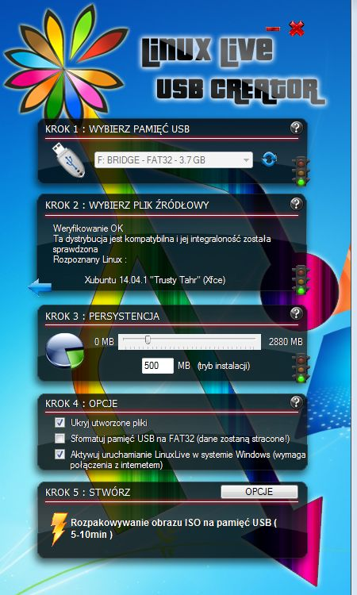

LiveCD lub LiveUSB
##################

Płyta LiveDVD lub klucz startowy USB z systemem w wersji *live* pozwalają
na uruchomienie komputera, testowanie i pracę bez ingerowania w dane
zgromadzone na twardym dysku (np. inne systemy). Mogą posłużyć również do
instalacji lub odzyskiwania danych.

W "czystym" systemie *live* można przećwiczyć scenariusze podstawowe,
pozostałe wymagają doinstalowania bibliotek. Zmiany dokonane w systemie,
np. doinstalowanie bibliotek, nie są zachowywane, można natomiast zapisywać
na dysku lub pendrajwie pliki tworzone przez użytkownika.

Klucz USB umożliwiający uruchomienie komputera można przygotować na kilka
sposobów:

1. na podstawie obrazu *iso*;
2. poprzez zainstalowanie systemu bezpośrednio na pendrajwie;
3. w opraciu o gotowy klucz startowy USB - sporządzenie kopii.

.. tip::

    Poniższe instrukcje powinny działać na wszystkich nośnikach podłączanych
    przez USB, a więc kartach pamięci, dyskach twardych itp.

.. contents:: Spis treści
    :backlinks: none

SRU - Szkolny Remix Ucznia
==========================

W ramach programu `Koduj z Klasą`_ przekazywaliśmy pamięci USB zawierające
spersonalizowaną odmianę Xubuntu pod nazwą `SRU`_, która zawierała wszystkie
potrzebne biblioteki. Obraz ostatniej wersji ma numer 37 i można go
pobrać z podanego adresu. Projekt ten nie jest w tym momencie dalej rozwijany.
Można jednak z niego nadal korzystać, oparty jest bowiem właśnie na Xubuntu
w wersji 14.04 LTS, która wspierana będzie do roku 2019.
Polecamy go zwłaszcza w przypadku, kiedy nie chcemy instalować linuksa
na dysku twardym, a chcemy mieć możliwość przećwiczenia wszystkich scenariuszy.

.. note::

    Ponieważ materiał nt. ORM-ów dodany został już po przygotowaniu
    ostatniej wersji SRU, do jego testowania potrzebne jest doinstalowanie
    po każdym uruchomieniu (!) odpowiednich bibliotek. Omawiamy to
    poniżej.

.. _SRU: http://sru.e-swoi.pl/sru-test-37.iso
.. _Koduj z Klasą: http://kodujzklasa.pl

.. _usb-creator:

Problemy z uruchamianiem pod Windows 8 i BIOS UEFI
==================================================

Uruchomienie płyt Live DVD lub startowych kluczy USB z systemem
Xubuntu (SRU) na nowszych (od 2012 r.) komputerach z biosem UEFI i systemem Windows 8
bywa kłopotliwe. Odpowiada za to mechanizm `secure boot`_.

Najprościej jest omawiane zabezpieczenie wyłączyć według instrukcji:

- `pomoc Ubuntu`_
- `pomoc Microsoft`_
- `wsparcie HP`_

.. _secure boot: http://en.wikipedia.org/wiki/Unified_Extensible_Firmware_Interface#Secure_boot
.. _poprzednie wersje Windows: http://technet.microsoft.com/en-us/library/dn481258.aspx
.. _pomoc Ubuntu: https://help.ubuntu.com/community/UEFI#SecureBoot
.. _pomoc Microsoft: http://technet.microsoft.com/en-us/library/dn481258.aspx
.. _wsparcie HP: http://h10025.www1.hp.com/ewfrf/wc/document?cc=pl&lc=pl&dlc=pl&docname=c03679388

Uruchamiamy Linux na maszynie wirtualnej
========================================

Drugim rozwiązaniem jest użycie oprogramowania VirtualBox, dzięki któremu
można tworzyć wirtualne maszyny i instalować na nich wybrane systemy i aplikacje.
Można też uruchamiać gotowe obrazy maszyn wirtualnych, np. w formacie OVA.
Po ściągnięciu obrazu i uruchomieniu VirtualBoksa wydajemy polecenie "Plik/Importuj
urządzenie proghramowe" i postepujemy według wskazówek wyświetlanych przez kreatora.
Po wykonanym imporcie, możemy uruchomić maszynę w VirtualBoksie.
Po imporcie plik OVA można skasować.

* `VirtualBox - wersja dla Windows <http://download.virtualbox.org/virtualbox/4.3.8/VirtualBox-4.3.8-92456-Win.exe>`_
* `Maszyna wirtualna SRU <http://www.cyfrowaszkola.waw.pl/_python/SRU_FWIOO.ova>`_

.. _ins-python:

ISO na dysku USB
================

Przygotowując klucz USB w oparciu o obraz *iso*, według poniższych instrukcji

Na początktu pobieramy :term:`obraz iso` (np. `SRU v.37`_ lub `Xubuntu 14.04.1 32-bit`_) systemu i zapisujemy na dysku.

.. _SRU v.37: http://sru.e-swoi.pl/sru-test-37.iso
.. _Xubuntu 14.04.1 32-bit: http://se.archive.ubuntu.com/mirror/cdimage.ubuntu.com/xubuntu/releases/14.04/release/xubuntu-14.04.1-desktop-i386.iso

Tak przygotowane pendrajwy przechowują zmiany, tzn. pliki utworzone przez
użytkownika. Dodatkowo, jeżeli zaznaczyliśmy "Przechowywanie pracy" lub "Persystencję",
czyli utworzenie pliku "casper-rw" zachowane zostaną zainstalowane przez nas
biblioteki czy programy, co pozwoli na takich systemach zrealizować wszystkie
przygotowane przez nas scenariusze.

.. tip::

    Niżej pokazujemy, jak zainstalować dodatkowe biblioteki.
    Dodatkowe materiały na temat przygotowywania nośników USB, w tym galerię ilustrującą
    kolejne kroki znajdziecie w serwisie eCG_.

.. _eCG: http://ecg.vot.pl/?id=usb-boot

Wypalamy USB w Windows
----------------------

W systemach MS Windows proponujemy instalację programu `Linux Live USB Creator`_.
Można też skorzystać z programu `Universal USB Installer`_, który polecany
jest w instrukcji zamieszczonej na stronach `producenta Ubuntu`_.

.. _Linux Live USB Creator: http://www.linuxliveusb.com/en/download
.. _Universal USB Installer: http://www.pendrivelinux.com/universal-usb-installer-easy-as-1-2-3/#button
.. _producenta Ubuntu: http://www.ubuntu.com/download/desktop/create-a-usb-stick-on-windows

Po instalacji i uruchomieniu programu "Lnux Live USB Creator"
polecamy kliknąć przycisk "Opcje" i wybrać polski język interfejsu, następnie konfigurujemy
ustawienia zgodnie z podanym zrzutem, czyli wskazujemy klucz USB, wybieramy obraz iso
i określamy rozmiar pliku "casper-rw".

Podstawowa instalacja Xubuntu 14.04 zajmuje
na pendrajwie ok. 1,2 GB, a więc resztę miejsca można przeznaczyć na nasze dane.

Pozostaje naciśnięcie, w zależności od programu, przycisku "Utwórz..." lub ikony błyskawicy
i uzbrojenie się w cierpliwość, po rozpakowaniu plików na partycję główną program może
poprosić o wpisanie hasła, aby wgrać sektor rozruchowy. W systemach ubuntopodobnych
podajemy hasło naszego użytkownika, w MS Windows - jeżeli trzeba - hasło administratora.

Wypalamy USB w Linux
--------------------

W systemie z rodziny Ubuntu instalujemy program **usb-creator-gtk**. Można
   to zrobić przez "Centrum oprogramowania" lub w terminalu:

.. code-block:: bash

    ~$ sudo apt-get update && sudo apt-get install usb-gtk-creator

Podpinamy pendrajw docelowy o pojemności min. 4GB. Napęd powinien zawierać
przynajmniej 1 partycję główną Fat32, wtedy do przechowywania danych użytkownika
wykorzystany zostanie specjalny plik "casper-rw".

.. note::
    Jeżeli korzystamy z obrazu systemu opartego na Ubuntu, możemy na pendrajwie
    utworzyć dwie partycje: pierwszą podstawową Fat32 o pojemności min. 3GB
    i dowolonej etykiecie np. "linux"; oraz drugą typu Ext4 o dowolnej pojemności,
    ale obowiązkowej etykiecie "home-rw".

    Czynności te można wykonać przy użyciu programu **gparted**, który zainstalujemy
    za pomocą "Centrum oprogramowania" lub w terminalu: ``sudo apt-get update &&
    sudo apt-get install gparted``. Niestety za pomocą standardowych narzędzi
    MS Windows nie utworzymy partycji Ext4. Ostateczny układ partycji powinien
    wyglądać tak jak na poniższym zrzucie:

.. figure:: img/sru_usb08.png

4. Po przygotowaniu pendrajwa uruchamiamy kreator dysku usb poleceniem ``usb-creator-gtk``
   wydanym w terminalu. (Jeżeli pracujemy w Xubuntu ze środowiskiem XFCE4 możemy użyć
   również menu programów (:kbd:`CTRL+ESC`) lub okna uruchamiania programów (:kbd:`ALT+F2`).)
   Przycisk "Inny" w górnej części okna pozwoli wskazać :term:`obraz iso`
   wybranego systemu, dalej upewniamy się, że w polu "Nośnik docelowy"
   widnieje nazwa partycji podstawowej naszego pendrajwa (np. /dev/sdb1, zwróćmy też uwagę
   na etykietę!), na koniec wybieramy opcję "Przechowywanie pracy..." jeżeli dane użytkownika
   mają być przechowywane w pliku i na pendrajwie nie tworzyliśmy dodatkowej partycji,
   w przeciwnym wypadku zaznaczamy opcję drugą "Porzucone podczas wyłączania...", która
   mimo nazwy spowoduje zapisywanie ustawień na dodatkowej partycji ext4 o etykiecie "home-rw".

.. figure:: img/sru_usb09.png

System na kluczu USB
====================

Jeżeli dysponujemy startowym nośnikiem z systemem Xubuntu (lub innym),
możemy uruchomić normalną instalację, podpiąć nośnik USB, założyć na nim
(w trakcie instalacji) partycję Ext4 i wskazać ją jako miejsce instalacji
systemu. Trzeba również zainstalować menedżer startowy GRUB w MBR takiego napędu.

.. tip::

    Załóżmy, że uruchamiamy Xubuntu z płyty DVD na komputerze z jednym twardym dyskiem.
    Instalator oznaczy go jako ``sda(x)``, a podłączony klucz USB jako ``sdb(x)``,
    co poznać będzie można po rozmiarze i obecnych na nich partycjach.
    Na dysku ``sdb`` tworzymy co najmniej jedną partycję Ext4, jako cel
    instalacji systemu, czyli punkt montowania katalogu głównego ``/``
    wskazujemy partycję ``/dev/sdb1``, natomiast jako miejsce instalacji GRUB-a
    wybieramy ``/dev/sdb``.

Po uruchomieniu tak zainstalowanego systemu wszystkie dokonywane zmiany będą zapamiętywane.
Można system aktualizować, można instalować nowe oprogramowanie i zapisywać
swoje pliki.

Kopia klucza USB
================

Jeżeli dysponujemy już nośnikiem startowym USB, możemy łatwo go skopiować.
Żeby operację przyśpieszyć, zwłaszcza jeśli chcemy wykonać kilka kopii,
warto na początku utworzyć obraz danych zawartych na pendrajwie.
W Linuksie posługujemy się poleceniem ``dd`` wydanym w katalogu domowym:

.. code-block:: bash

    ~$ sudo dd if=/dev/sdb of=obrazusb.img bs=1M

Ciąg ``/dev/sdb`` w powyższym poleceniu oznacza napęd źródłowy, ``obrazusb.img``
to dowolna nazwa pliku, do którego zapisujemy odczytaną zawartość.

.. note::

    Linux oznacza wykryte napędy jako ``/dev/sd[a-z]``, a więc pierwszy dysk twardy
    oznaczony zostanie jako ``sda``. Po podłączeniu klucza USB otrzyma on nazwę
    ``sdb``. Kolejny podłączony napęd USB będzie dostępny jako ``sdc``.
    Nazwę napędu USB możemy sprawdzić po wydaniu podanych niżej poleceń.
    Pierwsze z nich wyświetli w końcowych liniach ostatnio dodane napędy
    w postaci ciągu typu ``sdb:sdb1``. Podobne wyniki powinno zwrócić
    polecenie drugie.

.. code-block:: bash

    ~$ mount | grep /dev/sd
    ~$ dmesg | grep /dev/sd

Po utworzeniu obrazu podłączamy napęd docelowy i dokładnie ustalamy jego oznaczenie,
ponieważ wcześniejesze **dane z napędu docelowego zostaną usunięte**. Jeżeli napęd
został zamontowany, czyli jego zawartość została automatycznie pokaza w menedżerze
plików, musimy go odmontować za pomocą polecenia ``Odmontuj`` (nie mylić z ``Wysuń``!).
Następnie wydajemy polecenie:

.. code-block:: bash

    ~$ sudo dd if=obrazusb.img of=/dev/sdc bs=4M; sync

Etap tworzenia obrazu na dysku możemy pominąć. Po podłączeniu napędu
źródłowego i docelowego, ustaleniu ich nazw i ewentualnym odmontowaniu
napędu przeznaczenia, możemy wydać polecenie:

.. code-block:: bash

    ~$ sudo dd if=/dev/sdb of=/dev/sdc bs=4M; sync

- gdzie ``sdb`` to nazwa napędu źródłowego, a ``sdc`` to oznaczenie napędu docelowego.

W MS Windows możemy użyć np. narzędzia `Image USB`_ lub 'USB Image Tool'_.
Za ich pomocą utworzymy obraz, który później nagramy na wskazane klucze.

.. _Image USB: http://www.osforensics.com/tools/write-usb-images.html
.. _USB Image Tool: http://www.alexpage.de/usb-image-tool/download/
