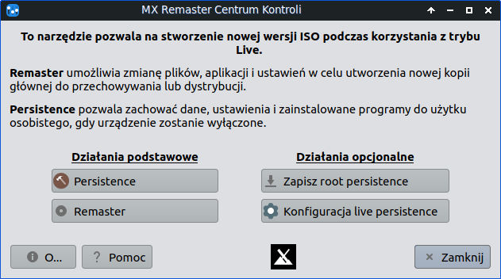

.. _linux-live:

Linux Live USB
##############

System Linux w wersji *live* zapisany na kluczu USB pozwala na uruchomienie
komputera i pracę bez ingerowania w dane na twardym dysku (np. inne systemy).

Do realizacji scenariuszy i codziennej pracy proponujemy dystrybucję **MX Linux** (opartą na Debianie).
System zawiera wszystkie wymagane narzędzia, umożliwia doinstalowywanie programów i pakietów,
po wstępnej konfiguracji pozwala na zapisywanie ustawień, skryptów i dokumentów.

.. figure:: img/MXLinux2201.jpg

   MXLinux 22.01 XFCE 64-bit

.. _usb-creator:

W systemie Windows
==================

* Pobieramy ostatni :term:`obraz iso` `MX Linux XFCE <https://mxlinux.org/download-links/>`_.
* Pobieramy program `Rufus <https://rufus.akeo.ie/>`_.
* Wpinamy pendrajwa o pojemności min. 8 GB.
* Uruchamiamy *Rufusa*, upewniamy się, że na liście "Urządzenie" wybrany jest właściwy pendrajw,
  klikamy przycisk "Wybierz" i wskazujemy ściągnięty obraz iso.
  Klikamy "Start" i czekamy na napis "Gotowe".

W Linuksie
==========

* Pobieramy :term:`obraz iso` `MX Linux XFCE <https://mxlinux.org/download-links/>`_.
* Pobieramy archiwum ostatniej wersji programu `MX_Live_USB_Maker appimage <https://github.com/dolphinoracle/lum-qt-appimage/releases>`_
  i rozpakowujemy w dowolnym katalogu.
* Wpinamy pendrajwa o pojemności min. 4 GB.
* Rozpakowany program uruchamiamy w terminalu, np.:

  .. code-block:: bash

      ~$ sudo ./MX_Live_USB_Maker-24.6.glibc2.28-x86_64.AppImage

* Po uruchomieniu programu klikamy przycisk "Wybierz" i wskazujemy ściągnięty obraz iso.
  Klikamy "Dalej" i czekamy na nagranie obrazu.

MX Linux Live USB
=================

Ustawienie języka i zapamiętywania zmian
----------------------------------------

Po uruchomieniu komputera z przygotowanego klucza USB zobaczymy menu startowe bootmenedżera:

* wybieramy pozycję **Language - Keyboard - Timezone** / **Language** / **lang=pl_PL: Polski - Polish** i wracamy do menu głównego,
* następnie wybieramy **Advanced Options / Persistence option:**, wybieramy **persist_all** i wracamy do menu głównego,
* na koniec wybieramy **Advanced Options** / **Save options:** / **grubsave Save options (LiveUSB only) -> GRUB menu**.
  Dzięki temu ustawienia języka i trybu *persistence*, który pozwala na zapisywanie dokonywanych zmian, zostaną zapamiętane.

Zapamiętywanie zmian
--------------------

* Po wybraniu trybu **persist_all** wyświetli się prośba o utworzenie pliku `rootfs`, który posłuży do zapisywania zmian.
  Musimy wybrać rozmiar pliku, który uzależniony jest od systemu plików użytego na kluczu USB. Dla systemu `vfat` (FAT32)
  będzie to 4GB, w przypadku systemów `NTFS` i `EXT4` ogranicza nas tylko rozmiar klucza.
* Na pytanie, czy utworzyć *live-usb swap file* (plik wymiany) możemy odpowiedzieć "nie".
* Podczas tworzenia haseł dla użytkowników *root* i *demo* można podać domyślne, tj. **root** i **demo**.
* Jako sposób zapisywania zmian, proponujemy opcję **Semi-Automaitc**,
  która pozwala na podjęcie decyzji podczas zamykania lub restartu systemu.

.. note::

   Niezależnie od trybu *persistence* pliki umieszczone w katalogu `Live-usu-storage` zapisywane są bezpośrednio na pendrajwie.

Po uruchomieniu
---------------

Po uruchomieniu systemu instalujemy dodatkowe pakiety zgodnie z opisem w :ref:`Przygotowanie systemu Linux <linux-env>`.
Zamykamy system i zgadzamy się na zapisanie dokonanych zmian!

Po kolejnym uruchomieniu tworzymy :ref:`środowisko wirtualne Pythona <venv>`
i w zależności od potrzeb doinstalowujemy wymagane dla danego scenariusza pakiety.

.. tip::

   Domyślnie panel (pasek) zadań umieszczony jest pionowo po lewej stronie ekranu.
   Jeżeli wolimy układ tradycyjny, z menu start wybieramy `MX Narzędzia`, a następnie `MX Ulepszenia`.
   Potem zaznaczamy opcję "Wyświetl panel poziomo" i klikamy "Zastosuj".

Remastering
-----------

Opcja **persist_all** zapamiętuje zmiany w pliku `rootfs`, który stopniowo zapełnia się. Dzięki operacji
**remastering** można zintegrować dokonane zmiany i zaktualizować wersję live systemu,
dzięki czemu zwolnimy miejsce na kluczu USB i będziemy mogli utworzyć nowy pusty plik `rootfs`.

* Uruchamiamy aplikację MX Narzędzia i wybieramy MX Remaster.

* W oknie "MX Remaster Centrum Kontroli" klikamy "Remaster".

* Jako "remaster-type" wybieramy "Osobisty".

.. figure:: img/mx_remaster_type.jpg

* Na pytanie, czy chcemy zapisać pliki w `/home` klikamy "Yes".

* W oknie podsumowującym klikamy "Yes".

.. figure:: img/mx_remaster_all.jpg

Po zakończeniu operacji na pendrajwie w katalogu :file:`antiX` zostanie utworzony nowy plik :file:`linuxfs.new`
zawierający system wraz z dokonanymi do tej pory zmianami.

Po zamknięciu i ponownym uruchomieniu systemu zostaniemy poproszeni o utworzenie nowego pliku `rootfs`.
Poprzednia wersja systemu i pliku zmian znajdziemy w katalogu :file:`antiX` pod nazwami `linuxfs.old` i `rootfs.old`
– można je usunąć, aby zwolnić miejsce na pendrajwie.

Operację remasteringu możemy powtarzać, jeżeli dokonamy wielu zmian w systemie, np. uaktualnimy go
lub zainstalujemy nowe programy.
