.. _lxpuptahr:

*LxPupTahr* – obsługa
######################

Pierwsze uruchomienie
*********************

.. _plikzapisu:

Po pierwszym uruchomieniu zatwierdzamy okno kreatora ustawień przyciskiem "Ok"
i zamykamy kreatora połączenia z internetem. Następnie **zamykamy system i tworzymy**
`pliku zapisu <http://puppylinux.org/wikka/SaveFile>`_ (ang. *savefile*),
w którym przechowywane będą wprowadzane przez nas zmiany:
konfiguracja, instalacja programów, utworzone dokumenty.

Na początku może pojawić się pytanie o przetłumaczenie informacji rozruchowych,
wybieramy "Yes" i potwierdzamy kolejny komunikat.

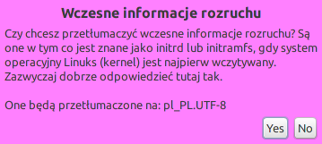

W następnym oknie klikamy "Zapisz", następnie "administrator".
Wybieramy partycję oznaczającą pendrajwa: w konfiguracjach z 1 dyskiem twardym
będzie ona oznaczona najczęsciej `sdb1` (kierujemy się rozmiarem i typem plików: vfat).

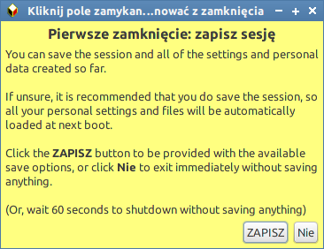
.. figure:: lxpupimg/lxpsave04.png
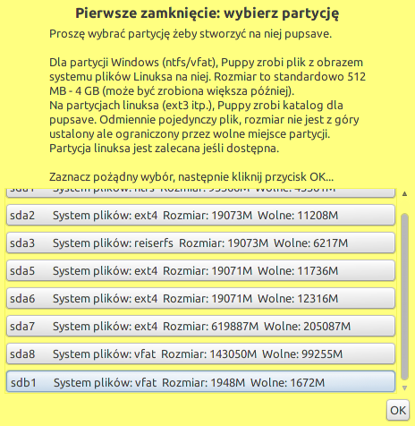

Następnie wybieramy ewentualnie szyfrowanie i system plików. Sugerujemy
`ext2` – najszybszy, wymagany przy szyfrowaniu, lub `ext4` – bezpieczniejszy i domyślny.
Minimalny rozmiar to 32MB, zalecamy **512MB** lub więcej.

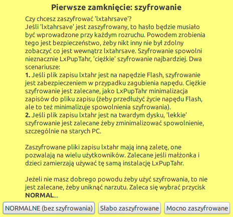
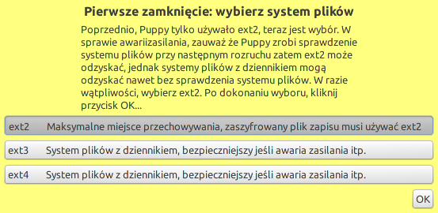
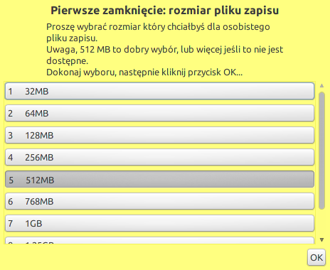

Opcjonalnie rozszerzamy domyślną nazwę i potwierdzamy zapis.

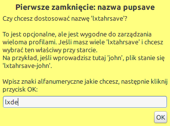
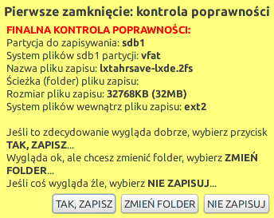
.. figure:: lxpupimg/lxpsave11.png

Należy spokojnie poczekać na utworzenie pliku i wyłącznie komputera.
Po ponownym uruchomieniu system będzie gotowy do pracy :-)

System w naszej wersji *FULL* zawiera:

* spolszczone prawie wszystkie elementy systemu;
* zaktualizowane listy oprogramowania;
* zaktualizowaną i spolszczoną przeglądarkę `Pale Moon <https://www.palemoon.org/>_`
  (otwartoźrodłówa, oparta na Firefoksie);
* fonty Ubuntu oraz podstawowe z Windows;
* podstawowe pakiety narzędziowe: *python-pip*, *python-virtualenv*, *git*;
* wszystkie biblioteki Pythona wymagane w poszczególnych scenariuszach;
* środowiska programistyczne: *Geany IDE*, a w wersji *FULL* *PyCharm Professional* i *Sublime Text*;
* skonfigurowane elementy interfejsu LXDE;
* skonfigurowane skróty klawiszowe.

Połączenie z internetem
************************

System *LxPupTahr* domyślnie wczytuje się w całości do pamięci RAM i uruchamia
środowisko graficzne LXDE z zalogowanym użytkownikiem *root*, czyli administratorem
w systemach linuksowych. Na początku będziesz chciał nawiązać połączenie
z internetem.

Z menu "Start/Konfiguracja" uruchamiamy *Internet kreator połączenia*, klikamy
"Wired or wireless LAN", w następnym oknie wybieramy narzędzie
"Simple Network Setup".

Po jego uruchomieniu powinniśmy zobaczyć listę wykrytych interfejsów,
z której wybieramy *eth0* dla połączenia kablowego, *wlan0* dla połączenia
bezprzewodowego. W przypadku *eth0* połączenie powinno zostać skonfigurowane
od razu, natomiast w przypadku *wlan0* wskazujemy jeszcze odpowiednią sieć,
metodę zabezpieczeń i podajemy hasło.

Jeżeli uzyskamy połączenie, w oknie "Network Connection Wizard/Kreator Połączenia Sieci" zobaczymy
aktywne interfejsy. Sugerujemy kliknąć "Cancel/Anuluj", a w ostatnim oknie
informacyjnym "Ok".

.. figure:: lxpupimg/internet01.png
.. figure:: lxpupimg/internet02.png
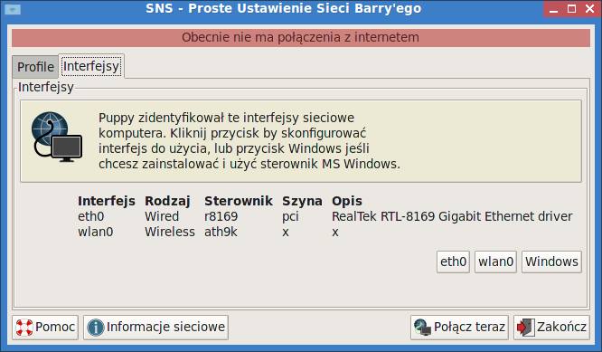
.. figure:: lxpupimg/internet04.png
.. figure:: lxpupimg/internet05.png

Równie proste i dobre są dwa pozostałe narzędzia, tzn. **Frisbee** i **Network Wizard**.

.. _sfs-pet:

Pliki SFS i PET
****************

*LxPup* oferuje dwa dedykowane formaty plików zawierających oprogramowanie:
Pierwszym stosowanym raczej dla dużych pakietów jest `SFS <http://puppylinux.org/wikka/SquashFS>`_.
Za ich pomocą można doinstalować m. in. edytory Pycharm i Sublime Text.
Aby to zrobić, ściągamy odpowiedni(e) plik(i) SFS:

* `PyCharm 5.0.1 <https://copy.com/9WzmbHVn8T8UxsSN/tahrpup/pycharm-5.0.1_15.05.sfs?download=1>`_
  i wymagane środowisko `Java JRE <https://copy.com/9WzmbHVn8T8UxsSN/tahrpup/jre1.7.0_80.sfs?download=1>`_
* `Sublime Text 3 <https://copy.com/9WzmbHVn8T8UxsSN/tahrpup/sublime-text3_15.05.sfs?download=1>`_

Pobrane pliki umieszczamy w katalogu głównym pendrajwa. W działającym systemie dostępny jest on
w ścieżce :file:`/mnt/home`.

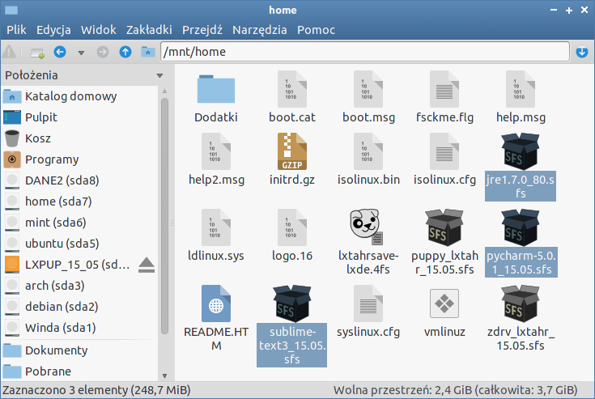

Instalacja możliwa jest po kliknięciu wgranego pliku i wybraniu "Zainstaluj SFS":

.. figure:: lxpupimg/sfs_click.png

Druga możliwość to wybranie *Start/Konfiguracja/SFS-Ładowanie w locie*
lub wydanie polecenia ``sfs_load`` w terminalu. W oknie dialogowym z rozwijalnej listy
wybieramy plik sfs i "Załaduj":

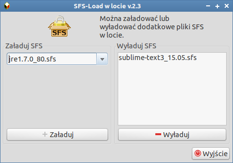

Po załadowaniu plików SFS restartujemy menedżer okien: *Start/Zamknij/Restart WM*.
Jeżeli nie potrzebujemy już danego programu lub chcemy go zaktualizować pakiet SFS
możemy też wyładować,

.. note::

  PyCharma można też zainstalować/zaktualizować za pomocą polecenia wydanego w terminalu:
  ``install-pycharm.sh ver`` – *ver* oznacza wersję, np. *5.0.1*.
  Tak wgrany program zajmuje miejsce w pliku zapisu, więc nie polecamy tego.
  Lepiej użyć pliku SFS.

Drugi format dedykowany dla LxPupa to paczki w formacie `PET <http://puppylinux.org/wikka/PETs?redirect=no>`_,
dostępne np. na stronie `pet_packages-tahr <http://distro.ibiblio.org/puppylinux/pet_packages-tahr/>`.
Ściągamy je, a następnie instalujemy dwukrotnie klikając (uruchomi się narzędzie *petget*).

.. figure:: lxpupimg/pet01.png

Społeczność LxPupa przygotowuje często używane programy w formatach SFS i PET.
Można je przeglądać i instalować za pomocą specjalnego programu, który uruchamiamy
wybierając **Start/Konfiguracja/Quickpet tahr**. Listę dostępnych paczek
zaktualizujemy po kliknięciu "tahrpup updates". Później możemy zainstalować
Chrome'a, Gimpa czy Skype'a.

.. figure:: lxpupimg/pet_quickpet03.png

.. _ppm:

Menedżer pakietów
*******************

Jeżeli w *Quickpet tahr* nie znajdziemy wymaganej aplikacji, uruchamiamy
**Puppy Package Manager/Puppy Manager Pakietów** z menu "Start/Konfiguracja".
Aktualizujemy listę dostępnych aplikacaji: klikamy ikonę ustawień obok koła ratunkowego,
w następnym oknie zakładkę "Update database/Aktualizuj bazę danych"
i przycisk "Update now/Aktualizuj teraz". Po uruchomieniu okna terminala naciskamy
klawisze ENTER klika razy, aby potwierdzić aktualizację repozytoriów.
Na koniec zamykamy okno aktualizacji przyciskiem "OK", co zrestartuje menedżera pakietów.

.. figure:: lxpupimg/ppm01.png
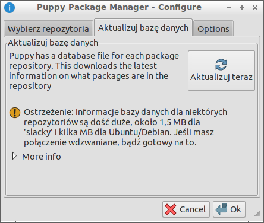
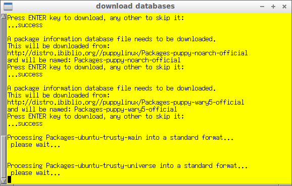

Po ponownym uruchomieniu PPM, wpisujemy nazwę szukanego pakietu w pole wyszukiwania,
następnie wybieramy pakiet z wyświetlonej listy, co dodaje go do kolejki.
W ten sposób możemy wyszukać i dodać kilka pakietów na raz.
Na koniec zatwierdzamy instalację przyciskiem "Do it!"

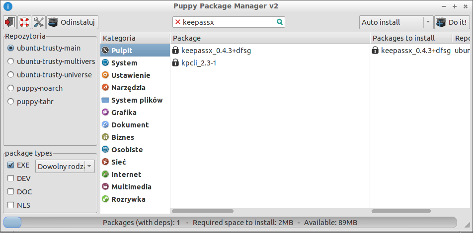

Przeglądarka WWW
************************

Domyślną przeglądarką jest `PaleMoon <https://www.palemoon.org/>`_, otwartoźródłowa
odmiana oparta na Firefoksie. Od czasu do czasu warto ją zaktualizować wybierając
*Start/Internet/Palemoon/...*

Domyślne katalogi
************************

* :file:`/root/my-documents` lub :file:`/root/Dokumenty` – katalog na dokumenty
* :file:`/root/Pobrane` – tu zapisywane są pliki pobierane z internetu
* :file:`/root/my-documents/clipart` lub :file:`/root/Obrazy`– katalog na obrazki
* :file:`/root/my-documents/tmp` lub :file:`/root/tmp` – katalogi tymczasowe
* :file:`/root/LxPupUSB` lub :file:`/mnt/home` – ścieżki do głównego katalogu napędu USB
* :file:`/usr/share/fonts/default/TTF/` – dodatkowe czcionki TrueType, np. z MS Windows

.. _klawiatura:

Skróty klawiaturowe
************************

Oznaczenia: C – Control, A – Alt, W - Windows (SuperKey).

* **C+A+Left** – puplpit lewy
* **C+A+Right** – pulpit prawy
* **Alt + Space** – menu okna
* **C+Esc** – menu start
* **C+A+Del** – menedżer zadań
* **W+f** – menedżer plików (pcmanfm)
* **W+t** – terminal (LXTerminal)
* **W+e** – Geany IDE
* **W+s** – Sublime Text 3
* **W+p** – PyCharm IDE
* **W+w** – przeglądarka WWW (Palemoon)
* **W+Góra**, **W+Dół**, **W+Lewo**, **W+Prawo**, **W+C**, **W+Alt+Lewo**,
  **W+Alt+Prawo** – sterowanie rozmiarem i położeniem okien

.. tip::

  Jeżeli skróty nie działają, ustawiamy odpowiedni model klawiatury.
  Procedura jest bardzo prosta. Uruchamiamy "Ustawienia Puppy" (pierwsza ikona obok przycisku Start,
  lub "Start/Konfiguracja/Wizard Kreator"), wybieramy "Mysz/Klawiatura". W następnym
  oknie "Zaawansowana konfiguracja", potwierdzamy "OK", dalej "Model klawiatury"
  i na koniec zaznaczamy **pc105**. Pozostaje potwierdzenie "OK" i jeszcze
  kliknięcie przycisku "Tak" w poprzednim oknie, aby aktywować ustawienia.

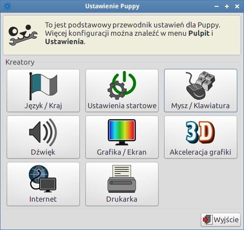
.. figure:: lxpupimg/lxpup_klawiatura01.png
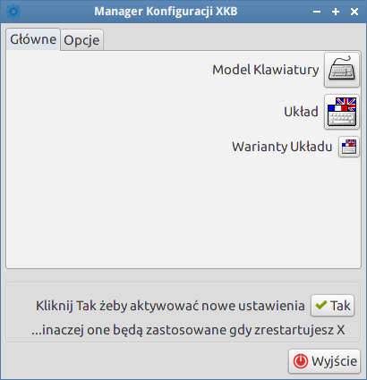
.. figure:: lxpupimg/lxpup_klawiatura03.png

Konfiguracja LXDE
************************

* **Wygląd, Ikony, Tapeta, Panel**: Start/Pulpit/Zmiana wyglądu.
* **Ekran(y)**: Start/System/System/Ustawienia wyświetlania.
* **Czcionki**: Start/Pulpit/Desktop/Manager Czcionki.
* **Wygładzanie czcionek**: Start/Pulpit/Desktop/Manager Czcionki, zakładka "Wygląd", "Styl hintingu" 1.
* **Menedżer plików**: Edycja/Preferencje w programie.
* **Ustawienia Puppy**: Start/Konfiguracja/Wizard Kreator
* **Internet kreator połączenia**: Start/Konfiguracja
* **Zmiana rozmiaru pliku zapisu**: Start/Akcesoria
* **Puppy Manager Pakietów**: Start/Konfiguracja
* **Quickpet tahr**: Start/Konfiguracja
* **SFS-załadowanie w locie**: Start/Konfiguracja/SFS-Załadowanie w locie
* **QuickSetup ustawienia pierwszego uruchamiania**: Start/Konfiguracja
* **Restart menedżera okien** (RestartWM): Start/Zamknij
* **WM Switcher** – switch windowmanagers:
* **Startup Control – kontrola aplikacji startowych**: Start/Konfiguracja
* **Domyślne aplikacje**: Start/Pulpit/Preferowane programy
* **Terminale** Start/Akcesoria
* **Ustawienie daty i czasu**: Start/Pulpit

.. figure:: lxpupimg/lxpfonts.png

  Wygładzanie czcionek

Wskazówki
*************

1. Dwukrotne kliknięcie – menedżer plików PcManFm domyślnie otwiera pliki
   i katalogi po pojedynczym kliknięciu. Jeżeli chcielibyśmy to zmienić,
   wybieramy "Edycja/Preferencje".

2. Jeżeli po uruchomieniu system nie wykrywa podłączonego monitora czy rzutnika,
   wybieramy "Start/Zamknij/Restart WM" – po restarcie menedżera okien obraz
   powinien pojawić się automatycznie. Możemy go dostosować wybierając
   "Start/System/Sytem/Ustawienia wyświetlania".
