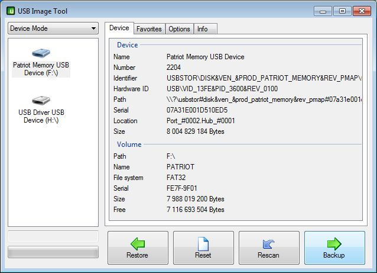

Live USB – inne opcje
######################

System na kluczu USB
====================

Jeżeli dysponujemy startowym nośnikiem (np. CD/DVD) z systemem Xubuntu, SRU,
czy FREE_DESKTOP możemy uruchomić normalną instalację, podpiąć nośnik USB,
założyć na nim (w trakcie instalacji) partycję Ext4 i wskazać ją jako miejsce instalacji
systemu. Trzeba również zainstalować menedżer startowy GRUB w MBR takiego napędu.

.. tip::

    Załóżmy, że uruchamiamy Xubuntu z płyty DVD na komputerze z jednym twardym dyskiem.
    Instalator oznaczy go jako ``sda(x)``, a podłączony klucz USB jako ``sdb(x)``,
    co poznać będzie można po rozmiarze i obecnych na nich partycjach.
    Na dysku ``sdb`` tworzymy co najmniej jedną partycję Ext4, jako cel
    instalacji systemu, czyli punkt montowania katalogu głównego ``/``
    wskazujemy partycję ``/dev/sdb1``, natomiast jako miejsce instalacji GRUB-a
    wybieramy ``/dev/sdb``.

Po uruchomieniu tak zainstalowanego systemu wszystkie dokonywane zmiany będą zapamiętywane.
Można system aktualizować, można instalować nowe oprogramowanie i zapisywać
swoje pliki.

Kopia klucza USB
================

Jeżeli dysponujemy już nośnikiem startowym USB, możemy łatwo go skopiować.
Żeby operację przyśpieszyć, zwłaszcza jeśli chcemy wykonać kilka kopii,
można na początku utworzyć obraz danych zawartych na pendrajwie.

W Linuksie
-----------

Posługujemy się poleceniem ``dd`` wydanym w katalogu domowym:

.. code-block:: bash

    ~$ sudo dd if=/dev/sdb of=obrazusb.img bs=1M

Ciąg ``/dev/sdb`` w powyższym poleceniu oznacza napęd źródłowy, ``obrazusb.img``
to dowolna nazwa pliku, do którego zapisujemy odczytaną zawartość.

.. note::

    Linux oznacza wykryte napędy jako ``/dev/sd[a-z]``, a więc pierwszy dysk twardy
    oznaczony zostanie jako ``sda``. Po podłączeniu klucza USB otrzyma on nazwę
    ``sdb``. Kolejny podłączony napęd USB będzie dostępny jako ``sdc``.
    Nazwę napędu USB możemy sprawdzić po wydaniu podanych niżej poleceń.
    Pierwsze z nich wyświetli w końcowych liniach ostatnio dodane napędy
    w postaci ciągu typu ``sdb:sdb1``. Podobne wyniki powinno zwrócić
    polecenie drugie.

.. code-block:: bash

    ~$ mount | grep /dev/sd
    ~$ dmesg | grep /dev/sd

Po utworzeniu obrazu podłączamy napęd docelowy i dokładnie ustalamy jego oznaczenie,
ponieważ wcześniejesze **dane z napędu docelowego zostaną usunięte**. Jeżeli napęd
został zamontowany, czyli jego zawartość została automatycznie pokaza w menedżerze
plików, musimy go odmontować za pomocą polecenia ``Odmontuj`` (nie mylić z ``Wysuń``!).
Następnie wydajemy polecenie:

.. code-block:: bash

    ~$ sudo dd if=obrazusb.img of=/dev/sdc bs=4M; sync

Możliwe jest również **kopiowanie zawartości klucza USB od razu na drugi klucz**
bez tworzenia obrazu na dysku. Po podłączeniu obu pendrajwów i ustaleniu
ich oznaczeń wydajemy polecenie:

.. code-block:: bash

    ~$ sudo dd if=/dev/sdb of=/dev/sdc bs=4M; sync

- gdzie ``sdb`` to nazwa napędu źródłowego, a ``sdc`` to oznaczenie napędu docelowego.

W MS Widows
--------------

* `USB Image Tool <http://www.dobreprogramy.pl/USB-Image-Tool,Program,Windows,39717.html>`_
  – narzędzie do robienia obrazów dysków USB i nagrywania ich na inne pendrajwy.

* `Image USB <http://osforensics.com/tools/write-usb-images.html>`_ – świetny
  program do tworzenia obrazów napędów USB i nagrywania ich na wiele
  pendrajwów jednocześnie.

.. figure:: img/imageusb.jpg

.. tip::

    Narzędzia udostępniane w serwisie *dobreprogramy.pl* domyślnie ściągane
    są przy użyciu dodatkowej aplikacji ukrytej pod przycieskiem "Pobierz program".
    Jest ona całkowicie zbędna, sugerujemy korzystanie z przycisku "Linki bezpośrednie"
    i wybór odpowiedniej wersji (32-/64-bitowej), jeżeli jest dostępna.

.. _dystrybucje:

Linux-live USB – różne systemy
===============================

W trybie live mogą być również instalowane na pendrajwach różne dystrybucje Linuksa, m. in.
`Xubutnu 14.04 LTS <http://xubuntu.org/>`_,
`Szkolny Remiks Ucznia v.37 <Szkolny Remiks Ucznia: http://sru.e-swoi.pl>`_
czy `FREE_DESKTOP v.02 <http://cyfrowaszkola.waw.pl/free_desktop-edukacyjny-remiks-dla-wszystkich/>`_.
Są one oparte na stabilnych wydaniach systemu Ubuntu i oferują środowisko graficzne XFCE.
Do realizowania naszych scenariuszy wymagają doinstalowania części narzędzi i bibliotek.
Wymienione systemy bardzo dobrze nadają się do zainstalowania jako system główny
lub drugi na dysku twardym komputera. Można to zrobić z poziomu omawianych pendrajwów live.

Aby wgrać system na pendrajwa:

* Pobieramy wybrany obraz iso:

  - `Xubuntu <http://se.archive.ubuntu.com/mirror/cdimage.ubuntu.com/xubuntu/releases/14.04/release/xubuntu-14.04.2-desktop-i386.iso>`_ (975MB)
  - `SRU v.37 32-bit <http://iso.sru.e-swoi.pl/SRU_MT-14.04-37.iso>`_ (2,4GB)
  - `FREE_DESKTOP_CEO <http://cyfrowaszkola.waw.pl/_pliki/FREE_Desktop_CEO_02.iso>`_ (2,1GB)

* Pobieramy `program Unetbootin <http://unetbootin.sourceforge.net/unetbootin-windows-latest.exe>`_.
* Wpinamy pendrajwa o pojemności min. 4GB.
* Po uruchomieniu programu *Unetbootin* zaznaczamy opcję "Obraz dysku", klikamy przycisk "..." i wskazujemy
  pobrany obraz. W polu "Przestrzeń używana do zachowania plików..."
  wpisujemy min. **512**. W polu "Napęd:" wskazujemy pendrajwa i klikamy "OK".
  Czekamy w zależności od wybranej dystrybucji i prędkości klucza USB od 5-25 minut.

.. figure:: img/unetbootin_win_lxpup.jpg

* Jeżeli wybraliśmy *LxPupTahr*, przechodzimy do następnego punktu.
  Jeżeli wybraliśmy inny system, w polu "Przestrzeń
  używana do zachowania plików..." wpisujemy min. **512** (rozmiar w MB).

.. note::

    Jeżeli nagrywamy obraz *Xubuntu*, *SRU* lub *FREE_DESKTOP* możemy na pendrajwie
    utworzyć dodatkową partycję typu Ext4 o dowolnej pojemności, ale obowiązkowej
    etykiecie "home-rw". Zostanie ona wykorzystana jako miejsce montowania
    i zapisywania plików użytkownika. W takim wypadku pole "Przestrzeń używana
    do zachowania plików..." pozostawiamy puste!

    Dodatkową partycję utworzysz przy użyciu programu **gparted**. Instalacja:
    ``sudo apt-get update && sudo apt-get install gparted``.
    Niestety za pomocą standardowych narzędzi MS Windows nie utworzymy partycji Ext4.
    Ostateczny układ partycji powinien wyglądać tak jak na poniższym zrzucie:

.. figure:: img/sru_usb08.png