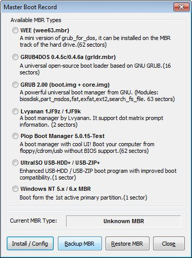
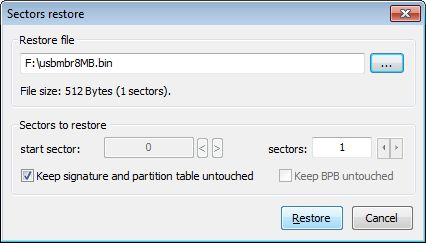

Problemy
#########

Jeśli nie da się uruchomić komputera za pomocą przygotowanego klucza, przeczytaj poniższe wskazówki.

1. Zanim uznasz, że pendrajw nie działa, przetestuj go na innym sprzęcie!

2. W niektórych komputerach możliwość uruchamiania z napędu USB trzeba odblokować
   w BIOS-ie. Odpowiedniego ustawienia poszukaj np. w opcji "Boot order".

3. Starsze komputery stacjonarne mogą wymagać wejścia do ustawień BIOSU
   (zazwyczaj klawisz :kbd:`F1`, :kbd:`F2` lub :kbd:`DEL`)
   i ustawienia pendrajwa (o ile zostanie wykryty) jako urządzenia startowego
   zamiast np. dysku twardego czy cdromu. Opuszczając BIOS zmiany należy zapisać!
   Komputer restartujemy bez usuwania klucza USB.

4. W przypadku komputerów stacjonarnych, jeżeli nie działają frontowe gniazda USB,
   podłącz klucz z tyłu!

5. Niebootujący pendrajw można najpierw sformatować:

   * Windows: użyj programu `HP-USB-Disk-Storage-Format-Tool <http://www.dobreprogramy.pl/HP-USB-Disk-Storage-Format-Tool,Program,Windows,27581.html>`_
     jako administrator;
   * W Linuksie wydaj polecenie: ``mkfs.vat /dev/sdb1``, zwróć uwagę na właściwą nazwę partycji (*sdb1*)!

   Nagraj jeszcze raz wybrany obraz iso.

   .. figure:: img/hpformat.jpg

6. W Windows wypróbuj narzędzie `Linux Live USB Creator <http://www.linuxliveusb.com/en/download>`_.
   Użyj go do nagrania obrazu *Xubuntu, SRU lub LxPupTahr*. Po uruchomieniu
   klikij "Opcje", wybierz polski język interfejsu. Skonfiguruj program
   zgodnie z podanym zrzutem, czyli: wskaż klucz USB, wybierz obraz iso
   i określamy rozmiar pliku "casper-rw" (persystencji) na min. 512MB.
   Poprawność konfiguracji oznaczana jest przez zapalone zielone światła!
   Naciśnij ikonę błyskawicy i czekaj. Uwaga: program może poprosić o hasło
   administratora, aby wgrać sektor rozruchowy.

   .. figure:: img/lluc.jpg

.. _rufustool:

7. W Windows wypróbuj narzędzie `Rufus <https://rufus.akeo.ie/>`_. Użyj go
   do nagrania dystrybucji *LxPupTahr*. 

8. W Windows możesz wypróbować narzędzie `Universal USB Installer <http://www.pendrivelinux.com/universal-usb-installer-easy-as-1-2-3/#button>`_
   polecane przez `producenta Ubuntu <http://www.ubuntu.com/download/desktop/create-a-usb-stick-on-windows>`_,
   który udostępnia również instrukcję. Użyj do nagrania dystrybucji
   *Xubuntu* lub *SRU*.

9. Spróbuj z innym pendrajwem.

10. Zmień maszynę, być może jest za stara lub za nowa!

11. Przygotuj pendrajwa na innym komputerze!

12. Jeżeli masz BIOS UEFI z włączonym mechanizmem `SecureBoot <http://en.wikipedia.org/wiki/Unified_Extensible_Firmware_Interface#Secure_boot>`_,
    co stanowi normę dla laptopów z preinstalowanym Windows 7/8/... po 2012 r.,
    spróbuj wyłączyć zabezpieczenie w biosie. Możesz zajrzeć do instrukcji:

    - `pomoc Ubuntu <https://help.ubuntu.com/community/UEFI#SecureBoot>`_
    - `pomoc Microsoft <http://technet.microsoft.com/en-us/library/dn481258.aspx>`_
    - `wsparcie HP <http://h10025.www1.hp.com/ewfrf/wc/document?cc=pl&lc=pl&dlc=pl&docname=c03679388>`_

13. W Ubuntu i pochodnych można użyć programu **usb-creator-gtk**, który
    powinien być zainstalowany domyślnie. Jeśli nie, wydajemy polecenia:
    ``sudo apt-get update && sudo apt-get install usb-gtk-creator``.

    Po uruchomieniu kreatora poleceniem ``usb-creator-gtk`` wydanym w terminalu
    klikamy przycisk "Inny" i wskazujemy :term:`obraz iso` wybranego systemu,
    w polu "Nośnik docelowy" wybieramy partycję podstawową pendrajwa (np. /dev/sdb1).
    Wybieramy opcję "Przechowywanie pracy...", jeżeli dane użytkownika mają
    być przechowywane w pliku i na pendrajwie nie tworzyliśmy dodatkowej partycji,
    w przeciwnym wypadku zaznaczamy opcję drugą "Porzucone podczas wyłączania...",
    która mimo nazwy spowoduje zapisywanie ustawień na dodatkowej partycji
    ext4 o etykiecie "home-rw".

.. figure:: img/sru_usb09.png

Inne narzędzia
===============

* `Bootice <http://www.dobreprogramy.pl/BOOTICE,Program,Windows,47749.html>`_ –
  opcjonalne narzędzie do różnych operacji na dyskach. Za jego pomocą można
  np. utworzyć, a następnie odtworzyć kopię MBR pendrajwa.

.. figure:: img/bootice01.jpg

.. tip::

    Narzędzia udostępniane w serwisie *dobreprogramy.pl* domyślnie ściągane
    są przy użyciu dodatkowej aplikacji ukrytej pod przycieskiem "Pobierz program".
    Jest ona całkowicie zbędna, sugerujemy korzystanie z przycisku "Linki bezpośrednie"
    i wybór odpowiedniej wersji (32-/64-bitowej), jeżeli jest dostępna.
