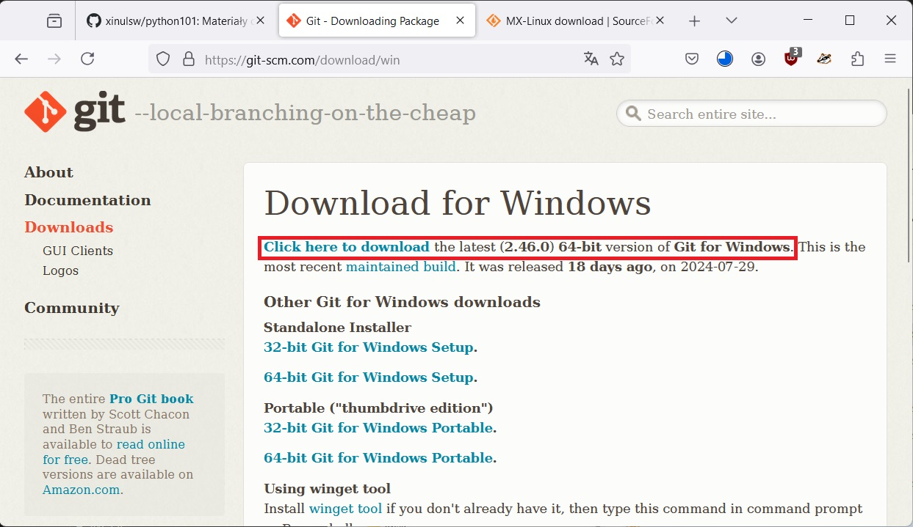
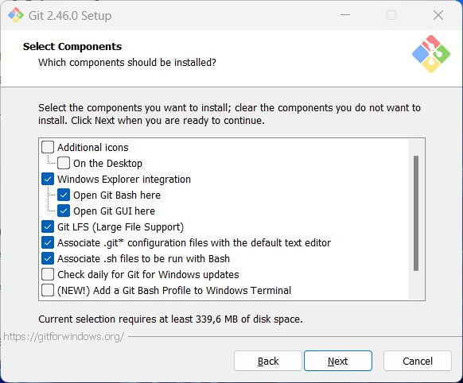

.. _tools:

Dodatkowe narzędzia
###################

Podane niżej narzędzia można zainstalować od razu lub w razie potrzeby, kiedy wymagane będą przez dany scenariusz.

.. _git-install:

Git
===

Git to system wersjonowania kodu umożliwiający korzystanie z repozytoriów np. w serwisie `Github <https://github.com/>`_.
Do jego obsługi używamy klienta działającego w wierszu poleceń.

W systemie **Linux** wydajemy polecenia w terminalu:

   .. code-block:: bash

       ~$ sudo apt update
       ~$ sudo apt install git

W systemie **Windows** pobieramy instalator w wersji 64-bitowej ze strony `Downloading Git <https://git-scm.com/download/win>`_
i instalujemy z domyślnie zaznaczonymi opcjami.

.. _sqlite3-install:

SQLite3
=======

SQLite3 to baza danych, którą obsługiwać można za pomocą klienta w wierszu poleceń.

W systemie **Linux** wydajemy polecenia w terminalu:

   .. code-block:: bash

       ~$ sudo apt update
       ~$ sudo apt install git

W systemie **Windows** ze strony `SQLite Download Page <https://www.sqlite.org/download.html>`_,
z sekcji *Precompiled Binaries for Windows* ściągamy archiwum :file:`sqlite-tools-win-x64-3460100.zip`,
z którego wypakowujemy plik `sqlite3.exe` do jakiegoś katalogu dostępnego w wierszu poleceń.
Może to być katalog systemowy, np. :file:`C:\\Windows\\System32`, lub katalog użytkownika, 
np. :file:`C:\\Users\\twoj_uzytkownik\\AppData\\Local\\Microsoft\\WindowsApps`.
