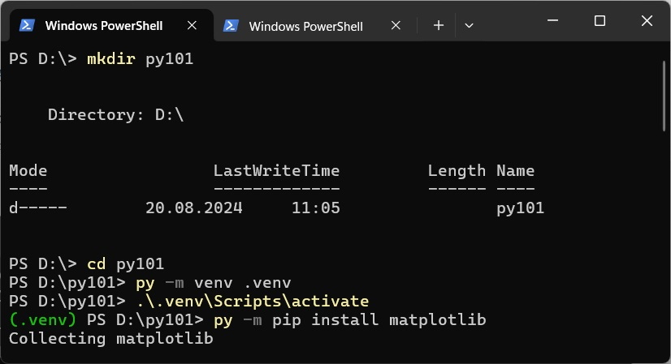
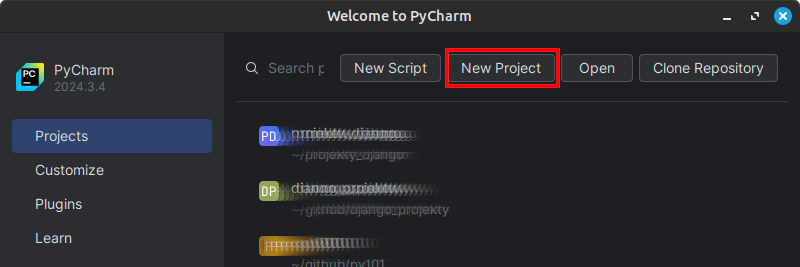
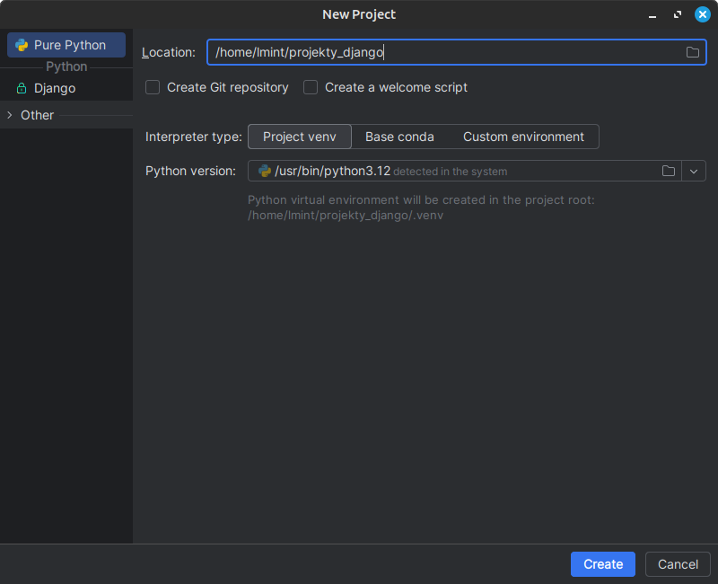
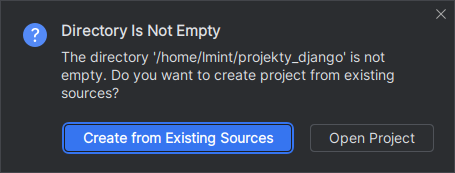
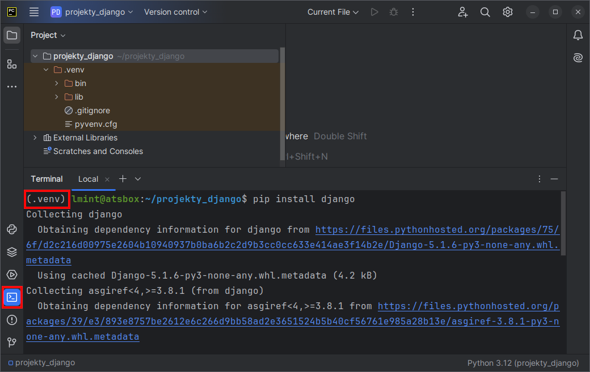

.. _venv:

Środowisko wirtualne
####################

Wirtualne środowisko Pythona (ang. *Python virtual environment*) pozwala instalować dodatkowe pakiety
w wybranych wersjach bez uprawnień administratora. W praktyce to katalog zawierający niezbędne pliki
potrzebne do działania interpretera oraz menedżer instalacji pakietów **pip**.

Wirtualne środowisko Pythona można utworzyć w terminalu za pomocą poleceń. Można też wykorzystać
edytor lub środowisko programistyczne, np. PyCharm lub VSCodium. Poniżej przedstawimy obydwa sposoby.

Linux
=====

Środowisko tworzymy w wybranym katalogu, a następnie aktywujemy i korzystamy z niego przy użyciu dowolnego terminala.

.. code-block:: bash

    ~$ python3 -m venv .venv        # utworzenie środowiska w katalogu .venv
    ~$ source .venv/bin/activate    # aktywacja
    (.venv) ~$ python3              # uruchamianie interpretera w trybie interaktywnym
    (.venv) ~$ python3 skrypt.py    # uruchamianie skryptu w wirtualnym środowisku
    (.venv) ~$ deactivate           # deaktywacja środowiska

.. note::

    Po utworzeniu środowiska przed każdym użyciem należy go aktywować.

Windows
=======

Środowisko tworzymy w wybranym katalogu, a następnie aktywujemy i korzystamy z niego przy użyciu wiersza poleceń (CMD)
lub `Windows PowerShell` lub `Windows Terminal`.

.. code-block:: bash

    py -m venv .venv                # utworzenie środowiska w katalogu .venv
    .venv\\Scripts\\activate.bat    # aktywacja w wierszu poleceń (cmd)
    .venv\\Scripts\\Activate.ps1    # aktywacja w Windows PowerSchell
    (.venv) py                      # uruchamianie interpretera w trybie interaktywnym
    (.venv) py skrypt.py            # uruchamianie skryptu w wirtualnym środowisku
    (.venv) .venv\\Scripts\\deactivate.bat  # deaktywacja w wierszu poleceń (cmd)
    (.venv) deactivate                      # deaktywacja w Windows PowerSchell

.. note::

    Jeżeli korzystasz z `PowerSchella` podczas próby aktywacji środowiska możesz zobaczyć komunikat
    `... Activate.ps1 cannot be loaded ...` związany z brakiem praw do wykonania skryptów. Wydaj wtedy polecenie:
    
    .. code-block:: bash
    
        Set-ExecutionPolicy Unrestricted -Scope CurrentUser

PyCharm
========

Po uruchomieniu PyCharma w oknie "Welcome to PyCharm" klikamy przycisk **New Project**.

W następnym oknie "New Project" w polu "Location" domyślną lokalizację i nazwę katalogu :file:`PythonProject`
możemy zastąpić innym katalogiem wpisując jego nazwę lub wskazując istniejący katalog na dysku.
Poniżej wpisano przykładową nazwę :file:`projekty_django`:

Następnie klikamy przycisk **Create**. Jeżeli wpisany katalog nie istniał na dysku, PyCharm utworzy go,
a w nim środowisko wirtualne Pythona w katalogu :file:`.venv`.
W przypadku wskazania istniejącego na dysku katalogu, dodatkowo zostanie wyświetlone okno z pytaniem:

Na pytanie odpowiadamy twierdząco, czyli klikamy przycisk "Create from Existing Sources".

Po otwarciu głównego okna aplikacji klikamy ikonę "Terminal" umieszczoną na pionowym pasku narzędzi
z lewej strony (skrót :kbd:`ALT+F12`).

W terminalu upewniamy się, że środowisko wirtualne zostało aktywowane, o czym świadczy przedrostek ``(.venv)``.
W aktywnym środowisku możemy instalować wymagane pakiety.

Zarządzanie pakietami
=====================

Do zarządzania pakietami w aktywnym środowisku używamy narzędzia `pip`,
za pomocą którego instalujemy wymagane w danym scenariuszu pakiety, np.:

.. code-block:: bash

    (.venv) pip install matplotlib
    (.venv) pip install pygame
    (.venv) pip install flask flask-wtf peewee sqlalchemy flask-sqlalchemy django
    (.venv) pip install pyqt6

.. tip::

    Skopiowane polecenia (bez nazwy katalogu z wirtualnym środowiskiem!)
    możemy wkleić do terminala za pomocą środkowego klawisza myszki
    lub skrótów :kbd:`CTRL+SHIFT+V`, :kbd:`CTRL+SHIFT+Insert`.

.. note::

    W systemie MS Windows wszystkie podane polecenia `pip` poprzedzamy wywołaniem launchera, np.:

    .. code-block:: bash

        (.venv) py -m pip install matplotlib
        (.venv) py -p pip install --upgrade pip
    
Przydatne polecenia
-------------------

.. code-block:: bash

    (.venv) pip install --upgrade pip     # aktualizacja narzędzia pip do najnowszej wersji
    (.venv) pip install biblioteka==1.4   # instalacja biblioteki we wskazanej wersji
    (.venv) pip -V                        # wersja narzędzia pip
    (.venv) pip list                      # lista zainstalowanych pakietów
    (.venv) pip install nazwa_pakietu     # instalacja pakietu
    (.venv) pip install nazwa_pakietu -U  # aktualizacja pakietu
    (.venv) pip uninstall nazwa_pakietu   # usunięcie pakietu

