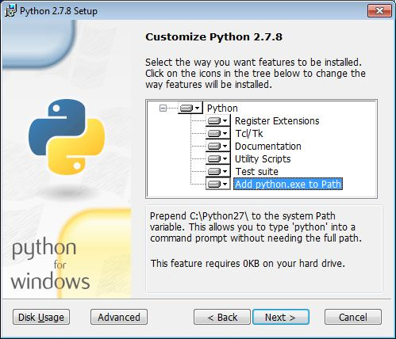
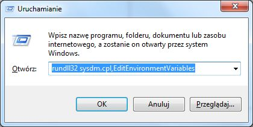
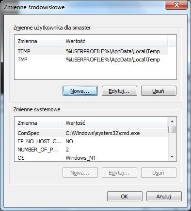
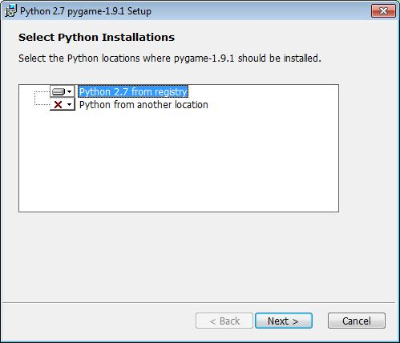

.. _windows-env:

Przygotowanie systemu Windows
#############################

Przykłady zostały przygotowane myślą o systemie Linux, jednak bez większych problemów
powinniśmy móc je zaadaptować dla środowiska Windows.
Cały kod działa tak samo, jednak niektóre biblioteki trzeba ściągnąć i zainstalować ręcznie w wersjach binarnych.

.. note::

    Pamiętaj, by w systemie Windows zmieniać znaki ``/`` (slash) na ``\`` (backslash) w ścieżkach
    podawanych w scenariuszach, podobnie pozamieniaj komendy systemu Linux
    na odpowiedniki wiersza poleceń Windows.

.. contents:: Spis treści
    :backlinks: none

.. _ins-python:

Instalacja przez PowerShell
===========================

Interpreter Pythona w wersji 2.7.8 szybko zainstalujemy za pomocą konsoli
PowerShell (oznaczonej niebieską ikoną i niebieskim tłem). Wystarczy skopiować
poniższy kod linia po linii, wkleić i wykonać:

.. code-block:: posh

    (new-object System.Net.WebClient).DownloadFile("https://www.python.org/ftp/python/2.7.9/python-2.7.9.msi", "$pwd\python-2.7.9.msi")
    msiexec /i python-2.7.9.msi TARGETDIR=C:\Python27
    (new-object System.Net.WebClient).DownloadFile("https://raw.github.com/pypa/pip/master/contrib/get-pip.py", "$pwd\get-pip.py")
    C:\Python27\python.exe get-pip.py virtualenv

Instalacja ręczna
=================

Jeżeli w naszej wersji Windows nie ma PowerShella, ściągamy `interpreter Pythona`_
w wersji 2.7.x i instalujemy ręcznie.

.. tip::

    Warto zaznaczyć opcję "Add Python.exe to Path", która domyślnie nie jest włączona.

.. _interpreter Pythona: https://www.python.org/downloads/

Instalacja PIP
--------------

Następnie instalujemy program ``pip`` do zarządzania dodatkowymi bibliotekami za pomocą polecenia:

.. code-block:: bash

    python -c "exec('try: from urllib2 import urlopen \nexcept: from urllib.request import urlopen');f=urlopen('https://raw.github.com/pypa/pip/master/contrib/get-pip.py').read();exec(f)"

Brak Pythona?
=============

Jeżeli nie możemy wywołać interpretera lub instalatora ``pip`` w terminalu,
musimy rozszerzyć zmienną systemową ``PATH`` swojego użytkownika o ścieżkę do ``python.exe``:
Najwygodniej wykorzystać konsolę PowerShell:

.. code-block:: posh

    [Environment]::SetEnvironmentVariable("Path", "$env:Path;C:\Python27\;C:\Python27\Scripts\", "User")

Ewentualnie jeśli posiadamy uprawnienia administracyjne, możemy zmienić zmienną ``PATH`` wszystkim użytkownikom:

.. code-block:: posh

    $CurrentPath=[Environment]::GetEnvironmentVariable("Path", "Machine")
    [Environment]::SetEnvironmentVariable("Path", "$CurrentPath;C:\Python27\;C:\Python27\Scripts\", "Machine")

Jeżeli nie mamy dostępu do konsoli PowerShell, w oknie "Uruchamianie" (:kbd:`WIN+R`)
wpisujemy polecenie wywołujące okno "Zmienne środowiskowe" – można je również
uruchomić z okna właściwości komputera:

.. code-block:: bat

    rundll32 sysdm.cpl,EditEnvironmentVariables

.. note::

    Dla wersji Python 3.x trzeba odpowiednio dostosować ścieżkę instalacji Pythona.

Następnie klikamy przycisk "Nowa" i wpisujemy: ``PATH=%PATH%;c:\Python27\;c:\Python27\Scripts\``;
w przypadku zmiennej systemowej klikamy "Edytuj", a ścieżki ``c:\Python27\;c:\Python27\Scripts\``
dopisujemy po średniku. Dla pojedynczej sesji (do momentu przelogowania się) możemy użyć
polecenia w konsoli tekstowej:

.. code-block:: bat

    set PATH=%PATH%;c:\Python27\;c:\Python27\Scripts\

Instalacja bibliotek
====================

Biblioteki instalujemy za pomocą polecenia ``pip``:

.. code-block:: bash

    pip install flask django peewee sqlalchemy flask-sqlalchemy

Wersję zainstalowanych modułów sprawdzimy za pomocą polecenia:

.. code-block:: bash

    pip list

Aby zaktualizować jakiś moduł, wydajemy polecenie typu:

.. code-block:: bash

    pip install --upgrade django

Część bibliotek wymaganych przez scenariusze wymaga innej instalacji.

Matplotlib
----------

Aby zainstalować ``matplotlib``, wchodzimy na stronę `http://www.lfd.uci.edu/~gohlke/pythonlibs <http://www.lfd.uci.edu/~gohlke/pythonlibs>`_ i pobieramy pakiety ``numpy`` oraz ``matplotlib`` w formacie ``whl`` dostosowane do naszej wersji Pythona i Windows. Np. jeżeli zainstalowaliśmy *Pythona v. 2.7.10* i mamy *Windows 7 64-bit*, pobierzemy:
``numpy‑1.10.0b1+mkl‑cp27‑none‑win_amd64.whl`` i ``matplotlib‑1.4.3‑cp27‑none‑win_amd64.whl``. Następnie
otwieramy terminal w katalogu z pobranymi pakietami i instalujemy je przy użyciu instalatora:

.. code-block:: bash

    pip install numpy‑1.10.0b1+mkl‑cp27‑none‑win_amd64.whl
    pip install matplotlib‑1.4.3‑cp27‑none‑win_amd64.whl

PyGame
------

Moduł wymagany przez gry pobieramy z katalogu `/arch/` zawartego w repozytorium
lub ze strony `PyGame`_ i instalujemy:

.. _PyGame: http://pygame.org/ftp/pygame-1.9.1.win32-py2.7.msi

GIT i GitHub
============

Jeżeli chcemy pod Windowsem korzystać z mechanizmów oferowanych przez serwis
GitHub, musimy zainstalować odpowiedniego :ref:`klienta <git-install>`.
Zagadnienia te omówione zostały w osobnym :ref:`dokumencie <git-howto>`,
który warto przejrzeć.
Instalacja Git-a nie jest wymagana, aby pracować na przygotowanych scenariuszach.
