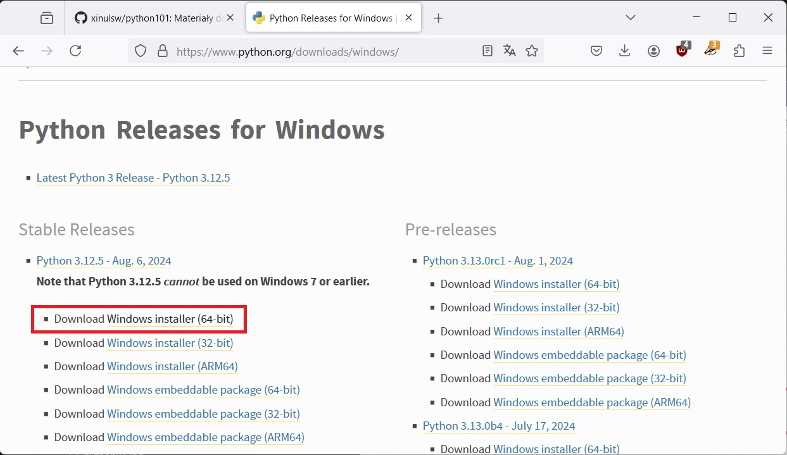

.. _windows-env:

Przygotowanie systemu Windows
#############################

.. _python-ins:

Interpreter Pythona
===================

.. note::

  Przed rozpoczęciem instalacji Pythona zaktualizuj system.

Na stronie `Python Releases for Windows <https://www.python.org/downloads/windows/>`_ z sekcji *Stable Releases*
pobieramy instalator :file:`Windows installer (64-bit)`.

Podczas instalacji zaznaczamy opcję "Add Python.exe to PATH" i wybieramy "Customize installation".

W kolejnym ognie sugerujemy zmienić domyślny katalog instalacji:

Na końcu instalacji można aktywować opcję "Disable path length limit".

Poprawność instalacji weryfikujemy w wierszu poleceń (np. *Windows PowerShell*) wpisując przykładowe polecenie
`py --version` lub `python` (uruchamia tryb interaktywny interpretera):

.. note::

    Podczas pierwszego uruchomienia możemy zobaczyć komunikat zapory systemowej.
    Zezwalamy na dostęp wybierając sieci prywatne:

    .. figure:: img/python04.jpg

Następnie przygotowujemy :ref:`środowisko wirtualne Pythona <venv>`
i w razie potrzeby instalujemy w nim wymagane dla danego scenariusza pakiety.

Brak Pythona?
=============

Jeżeli nie możemy wywołać interpretera lub instalatora ``pip`` w wierszu poleceń,
oznacza to zazwyczaj, że zapomnieliśmy zaznaczyć opcji "Add Python.exe to Path" podczas
instalacji interpretera. Najprościej zainstalować go jeszcze raz z zaznaczoną
opcją.
