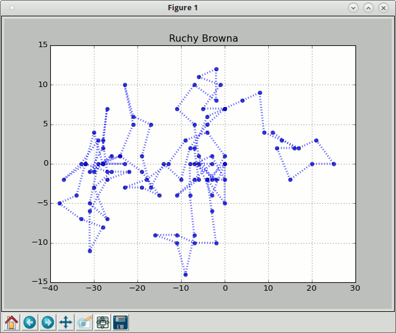
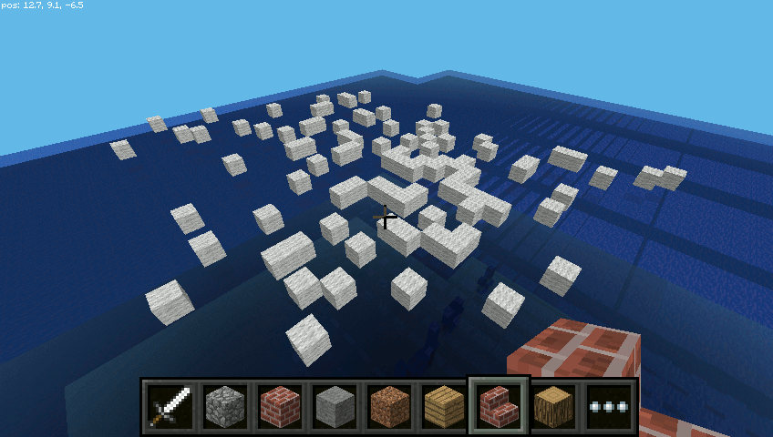
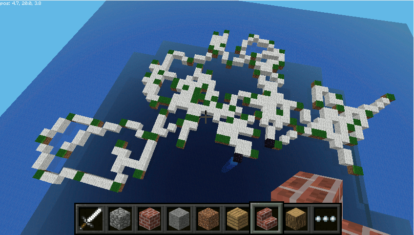
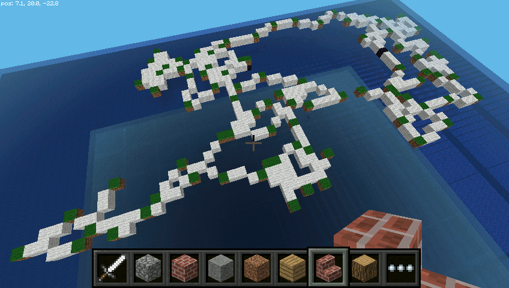
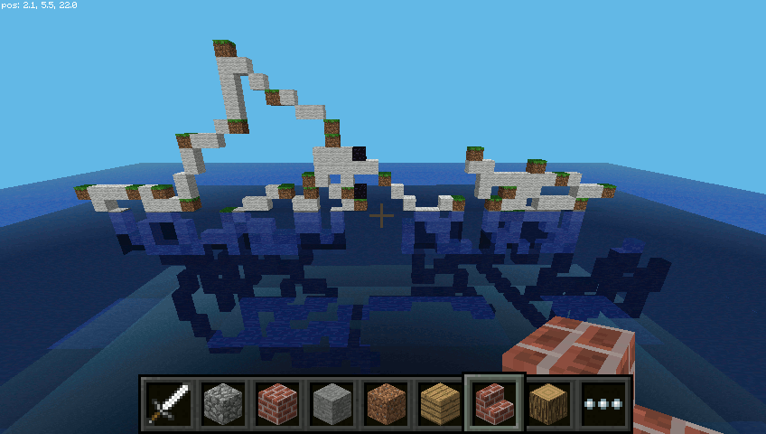
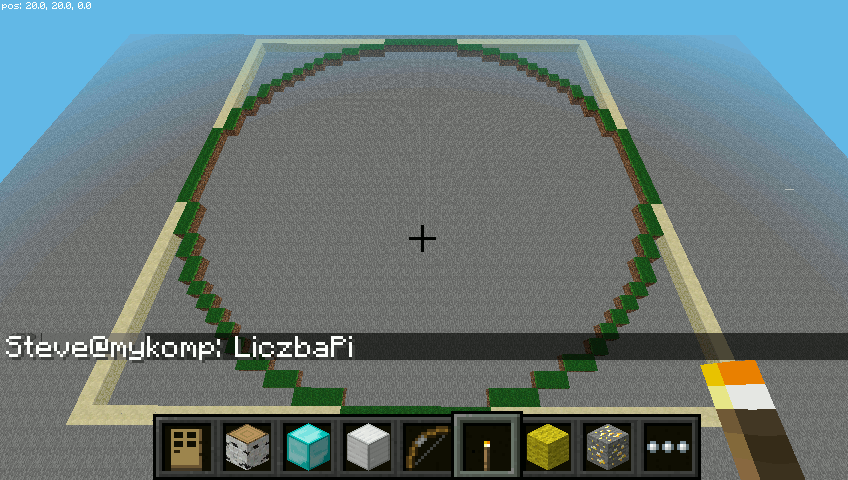
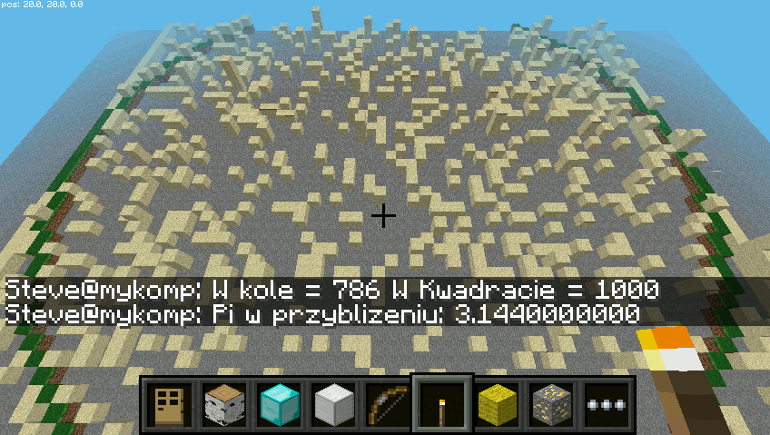
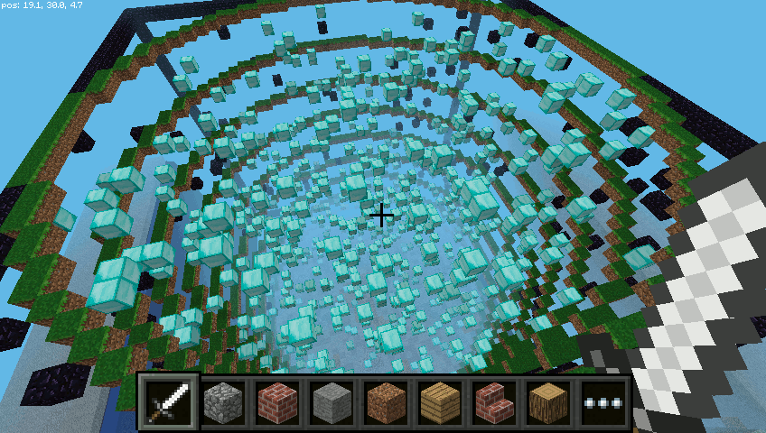
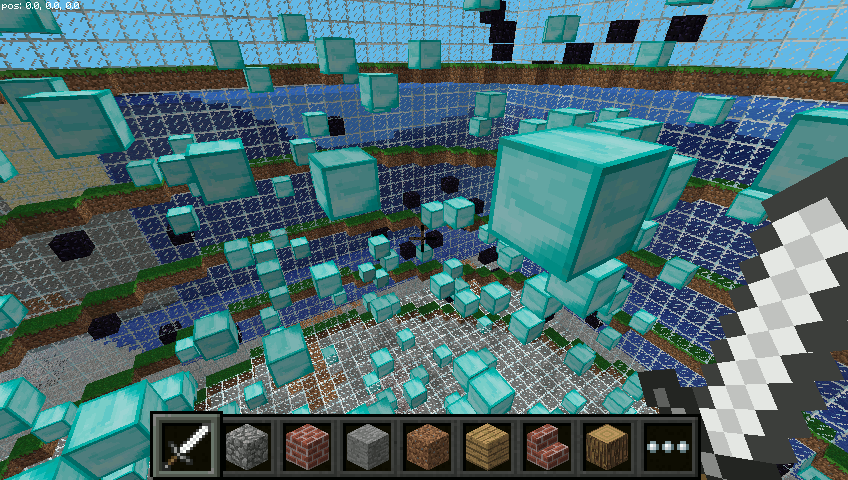

.. _mcpialgorytmy:

Algorytmy
##############

W tym scenariuszu spróbujemy pokazać w Minecrafcie Pi algorytm symulujący
`ruchy Browna <https://pl.wikipedia.org/wiki/Ruchy_Browna>`_ oraz algorytm
stosujący `metodę Monte Carlo <https://pl.wikipedia.org/wiki/Metoda_Monte_Carlo>`_
do wyliczenia przybliżonej wartości liczby Pi.

Ruchy Browna
==============

Za pomocą wybranego edytora utwórz pusty plik, umieść w nim podany niżej kod i zapisz
w katalogu :file:`mcpi-sim` pod nazwą :file:`mcpi-rbrowna.py`:

.. raw:: html

    
Kod nr 

.. highlight:: python
.. literalinclude:: mcpi-rbrowna01.py
    :linenos:
    :lineno-start: 1
    :lines: 1-

Większość kodu powinna być już zrozumiała. Importy bibliotek, nawiązywanie połączenia
z serwerem MC Pi, funkcje ``plac()``, ``wykres()`` i ``rysuj()`` omówione zostały w poprzednim
scenariuszu :ref:`Funkcje w mcpi <mcpi-funkcje>`.

W funkcji ``ruchyBrowna()`` na początku pobieramy od użytkownika ilość ruchów cząsteczki
do wygenerowania oraz ich długość, co ma znaczenie podczas ich odwzorowywania w świecie MC Pi.
Następnie w pętli:

* losujemy kąt wskazujący kierunek ruchu cząsteczki,
* wyliczamy współrzędne kolejnego punktu korzystając z funkcji *cos()* i *sin()* (np. ``x = x + r * np.cos(rad)``),
* zaokrąglamy wyniki do 2 miejsc po przecinku (np. ``x = int(round(x, 2))``) i drukujemy,
* na koniec dodajemy obliczone współrzędne do list odciętych i rzędnych (np. ``lx.append(x)``).

Po wyjściu z pętli obliczamy długość wektora przesunięcia, korzystając z twierdzenia Pitagorasa,
i drukujemy wynik z dokładnością do dwóch miejsc po przecinku (wyrażenie formatujące: ``{:.2f}``).

Po tych operacjach pozostaje wykreślenie ruchu cząsteczki w *matplotlib* i wyznaczenie go
w Minecrafcie.

.. tip::

    Przed uruchomieniem wizualizacji warto ustawić Steve'a w tryb lotu
    (dwukrotne naciśnięcie spacji).

(Nie)powtarzalność
------------------

Kilkukrotne uruchomienie dotychczasowego kodu pokazuje, że za każdym razem generowany jest
inny tor ruchu cząsteczki. Z jednej strony to dobrze, bo to potwierdza przypadkowość symulowanych
ruchów, z drugiej strony przydatna byłaby możliwość zapamiętania wyjątkowo malowniczych
sekwencji.

Zmienimy więc funkcję ``ruchyBrowna()`` tak, aby zapisywała i ewentualnie
odczytywała wygenerowany i zapisany ruch cząsteczki. Musimy też dodać dwie funkcje narzędziowe
zapisujące i czytające dane.

.. raw:: html

    
Kod nr 

.. highlight:: python
.. literalinclude:: mcpi-rbrowna02.py
    :linenos:
    :lineno-start: 68
    :lines: 68-129

Z powyższego kodu wynika, że jeżeli funkcja ``ruchyBrowna()`` otrzyma niepustą listę danych
(``if len(dane):``), wczyta z niej dane współrzędnych *x* i *y*. W przeciwnym wypadku
generowane będą nowe, które zostaną zapisane: ``zapisz_dane((lx, ly))``.

Funkcja ``zapisz_dane()``, pobiera tuplę zawierającą listę współrzędnych *x* i *y*,
otwiera plik o podanej nazwie do zapisu (``open('rbrowna.log', 'w')``) i zapisuje
w nim dane w formacie `json <https://pl.wikipedia.org/wiki/JSON>`_.

Funkcja ``czytaj_dane()`` prosi o podanie nazwy pliku z danymi, jeśli istnieje,
zwraca dane zapisane w formacie *json*, które w funkcji ``ruchyBrowna()``
rozpakowywane są jako listy wartości *x* i *y*: ``lx, ly = dane``.
Jeżeli podany plik z danymi nie istnieje, zwracana jest pusta lista,
a w funkcji ``ruchyBrowna()`` generowane są nowe dane.

W funkcji głównej zmieniamy wywołanie funkcji na ``ruchyBrowna(czytaj_dane())``
i testujemy zmieniony kod. Za pierwszym razem wciskamy :kbd:`Enter`, generujemy
i zapisujemy dane, za drugim razem podajemy nazwę pliku :file:`rbrowna.log`.

Ruch cząsteczki
---------------

Do tej pory ruch cząsteczki wizualizowane był jako pojedyncze punkty.
Możemy jednak pokazać pokonaną trasę liniowo, używając omawianej już
biblioteki :ref:`minecraftstaff <mcpifigury>`. Pod funkcją ``rysuj()`` umieszczamy
następującą funkcję:

.. raw:: html

    
Kod nr 

.. highlight:: python
.. literalinclude:: mcpi-rbrowna03.py
    :linenos:
    :lineno-start: 68
    :lines: 68-103

Jak widać, jest to zmodyfikowana funkcja, której użyliśmy po raz pierwszy w scenariuszu
:ref:`Funkcje <mcpi-funkcje>`. Zmiany dotyczą dodatkowych instrukcji
typu ``mc.setBlock(x2, y2, z[0], block.GRASS)``, których zadaniem jest zaznaczenie
innymi blokami wylosowanych punktów reprezentujących ruch cząsteczki.
Instrukcja ``sleep(1)`` wstrzymując budowanie na 1 sekundę wywołuje wrażenie
animacji i pozwala śledzić na bieżąco budowany tor.
Końcowe instrukcje służą zaznaczeniu początku i końca ruchu blokami obsydianu.

**Eksperymenty**

Uruchamiamy kod i eksperymentujemy. Dla 100 ruchów z krokiem przesunięcia 5
możemy uzyskać np. takie rezultaty:

Nic nie stoina przeszkodzie, żeby cząsteczka "ruszała się" w pionie nad i...
pod wodą:

.. figure:: img/rbrowna4.png

Liczba Pi
=========

Mamy koło o promieniu *r*, którego środek umieszczamy w początku układu współrzędnych (0, 0).
Na kole opisany jest kwadrat o boku *2r*. Spróbujmy to zbudować w MC Pi. W pliku :file:`mcpi-lpi.py`
umieszczamy kod:

.. raw:: html

    
Kod nr 

.. highlight:: python
.. literalinclude:: mcpi-lpi01.py
    :linenos:
    :lineno-start: 1

Funkcja ``model()`` działa podobnie do funkcji ``plac()``, czyli na początku
budujemy wokół środka układu współrzędnych płytę z bloku, który będzie zarysem kwadratu.
Później budujemy drugą płytę o blok mniejszą z powietrza. Na koniec rysujemy koło.

Deszcz punktów
--------------

Teraz wyobraźmy sobie, że pada deszcz. Część kropel upada w obrębie kwadratu,
ich ilość oznaczymy zmienną ``ileKw``, a część również w obrębie koła – oznaczymy
je zmienną ``ileKo``. Ponieważ znamy promień koła, możemy ułożyć proporcję, zakładając, że
stosunek pola koła do pola kwadratu równy będzie stosunkowi kropel w kole do kropel
w kwadracie:

.. math::

    \frac{\Pi * r^2}{(2 * r)^2} = \frac{ileKo}{ileKw}

Z prostego przekształcenia tej równości możemy wyznaczyć liczbę Pi:

.. math::

    \Pi = \frac{4 * ileKo}{ileKw}

Uzupełniamy więc kod funkcji ``liczbaPi()``:

.. raw:: html

    
Kod nr 

.. highlight:: python
.. literalinclude:: mcpi-lpi02.py
    :linenos:
    :lineno-start: 55
    :lines: 55-76

Jak widać w nowym kodzie, na początku pobieramy od użytkownika ilość "kropel" deszczu,
czyli punktów do wylosowania. Następnie w pętli losujemy ich współrzędne
w przedziale <*-r;r*> w instrukcji typu: ``x = round(random.uniform(-r, r), 10)``.
Funkcja ``uniform()`` zwraca wartości zmiennoprzecinkowe, które zaokrąglamy
do 10 miejsca po przecinku.

Korzystając z twierdzenia Pitagorasa układamy warunek pozwalający sprawdzić,
które punkty "wpadły" do koła: ``if abs(x)**2 + abs(y)**2 <= r**2:`` – i zliczamy je.

Instrukcja ``mc.setBlock(x, 10, y, blok)`` rysuje punkty w MC Pi za pomocą
bloków piasku (*SAND*), dzięki czemu uzyskujemy efekt spadania.

Wyliczenie wartości  *Pi* i wydrukowanie jej jest prostą formalnością.

Uruchomienie powyższego kodu dla promienia 30 i 1000 punktów dało następujący efekt:

Jak widać, niektóre punkty po zaokrągleniu ich współrzędnych w MC Pi nakładają się
na siebie.

Podkolorowanie
--------------

Punkty wpadające do koła mogłyby wyglądać inaczej niż poza nim. Można by to
osiągnąć przez ustawienie różnych typów bloków w pętli ``for``, ale tylko
blok piaskowy daje efekt spadania. Zrobimy więc inaczej. Zmieniamy funkcję ``liczbaPi()``:

.. raw:: html

    
Kod nr 

.. highlight:: python
.. literalinclude:: mcpi-lpi03.py
    :linenos:
    :lineno-start: 55
    :lines: 55-88
    :emphasize-lines: 8-9, 15, 19, 23-30

Deklarujemy dwie pomocnicze listy, do których zapisujemy w pętli współrzędne
punktów należących do kwadratu i koła, np. ``wKwadrat.append((x, y))``.
Następnie wstrzymujemy wykonanie kodu na 5 sekund, aby bloki piasku
zdążyły opaść. W wyrażeniu ``set(wKwadrat) - set(wKolo)`` każda lista zostaje
przekształcona na zbiór, a następnie zostaje obliczona ich różnica.
W efekcie otrzymujemy współrzędne punktów należących do kwadratu, ale nie do koła.
Ponieważ niektóre bloki piasku układają się jeden na drugim, wychwytujemy je w pętli
wewnętrznej ``if mc.getBlock(x, i, y) == 12:`` – i zmieniamy na obsydian.

Trzeci wymiar
-------------

Siła MC Pi tkwi w 3 wymiarze. Możemy bez większych problemów go wykorzystać. Na początku
warto zauważyć, że w algorytmie wyliczania wartości liczby Pi nic się nie zmieni.
Stosunek pola koła do pola kwadratu zastępujemy bowiem stosunkiem objętości walca,
którego podstawa ma promień *r*, do objętości sześcianu o boku *2r*. Otrzymamy zatem:

.. math::

    \frac{\Pi * r^2 * 2 * r}{(2 * r)^3} = \frac{ileKo}{ileKw}

Po przekształceniu skończymy na takim samym jak wcześniej wzorze, czyli:

.. math::

    \Pi = \frac{4 * ileKo}{ileKw}

Aby to wykreślić, zmienimy funkcje ``model()``, ``liczbaPi()`` i ``main()``. Sugerujemy, żeby
dotychczasowy plik zapisać pod inną nazwą, np. :file:`mcpi-lpi3D.py`, i wprowadzić następujące zmiany:

.. raw:: html

    
Kod nr 

.. highlight:: python
.. literalinclude:: mcpi-lpi04.py
    :linenos:
    :lineno-start: 38
    :lines: 38-122
    :emphasize-lines: 42, 51, 54, 57-58, 69-78, 84

Zadaniem funkcji ``model()`` jest stworzenie przestrzeni dla obrysu sześcianu i jego szkieletu.
Opcjonalnie, jeżeli przekażemy do funkcji parametr ``klatka`` równy ``True``,
ściany mogą zostać wypełnione szkłem. Walec wizualizujemy w pętli ``for``
rysując kilka okręgów blokami trawy.

W funkcji ``liczbaPi()`` najważniejszą zmianą jest dodanie trzeciej zmiennej.
Wartości wszystkich trzech współrzędnych losowane są w takim samym zakresie,
ponieważ za środek całego układu przyjmujemy początek układu współrzędnych.
Ważna zmiana zachodzi w funkcji warunkowej: ``if abs(x)**2 + abs(z)**2 <= r**2:``.
Do sprawdzenia, czy punkt należy do koła wykorzystujemy zmienne *x* i *z*,
uwzględniając fakt, że w MC Pi wyznaczają one położenie w poziomie.

Bloki należące do sześcianu rysujemy za pomocą obsydianu, te w walcu –
za pomocą diamentów.

Na końcu funkcji dodajemy nieskończoną pętlę (``while True:``), której zadaniem jest
sprawdzanie, na jakim bloku znajduje się gracz: ``if mc.getBlock(x, y - 1, z) == block.STONE.id:``.
Jeżeli stanie on na kamieniu, wszystkie bloki należące do walca zamieniamy
w pętli ``for pkt in wKolo:`` w piasek, a gracza teleportujemy do środka sześcianu.

Dla promienia o wielkości 20 i 1000 bloków uzyskać można poniższe budowle:

.. figure:: img/mcpi-lpi4_3.png

Pozostaje eksperymentować z rozmiarami, typami bloków czy parametrem ``klatka``
określanym w wywołaniu funkcji ``liczbaPi()`` w funkcji głównej.

**Źródła:**

* :download:`Skrypty mcpi-algorytmy <mcpi-algorytmy.zip>`