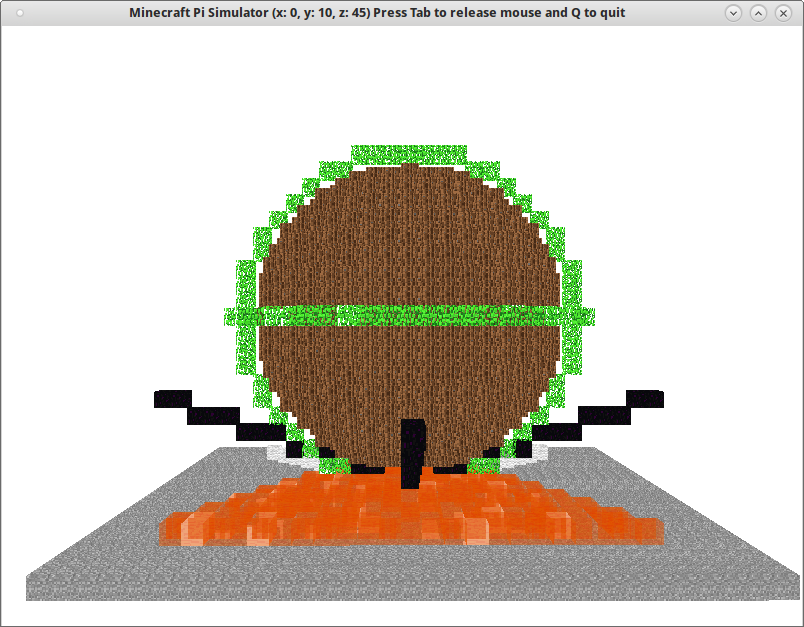
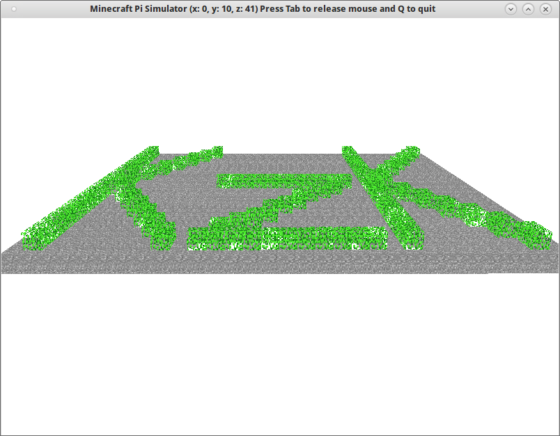

.. _mcpifigury:

Figury 2D i 3D
###############

Możliwość programowego umieszczania różnych bloków w Minecraft Pi Edition
można wykorzystać jako atrakcyjny sposób wizualizacji różnych figur. Jednak
o ile budowanie prostych kształtów, jak np. kwadrat czy sześcian, nie stanowi
raczej problemu, o tyle trójkąty, koła i bardziej skomplikowane budowle
nie są trywialnym zadaniem. Tworzenie 2- i 3-wymiarowych konstrukcji ułatwi
nam biblioteka `minecraftstuff <http://www.stuffaboutcode.com/2013/11/coding-shapes-in-minecraft.html>`_.

**Instalacja**

Symulator ``mcpi-sim`` domyślnie nie działa z omawianą biblioteką i wymaga modyfikacji.
Zmienione pliki oraz omawianą bibliotekę umieściliśmy w archiwum
:download:`mcpi-sim-fix.zip <../mcpi-sim-fix.zip>`, które po ściągnięciu
należy rozpakować do katalogu :file:`~/mcpi-sim/local` nadpisując oryginalne pliki.

Linia
===========

W pustym pliku :file:`mcsim-fig.py` umieszczamy kod:

.. raw:: html

    
Kod nr 

.. highlight:: python
.. literalinclude:: mcsim-fig01.py
    :linenos:
    :lineno-start: 1
    :lines: 1-
    :emphasize-lines: 7-8, 14, 38-51, 57

Większość kodu omówiona została w :ref:`Podstawach <mcpiplac>`. W nowym kodzie, który został podświetlony,
importujemy bibliotekę *minecraftstuff* oraz klasę *Vec3*. Reprezentuje ona punkty o podanych
współrzędnych w trójwymiarowym świecie MC. Polecenie ``figura = mcstuff.MinecraftDrawing(mc)`` tworzy instancję
głównej klasy biblioteki, która udostępni jej metody.

Do rysowania linii wykorzystujemy metodę ``drawLine()``, której przekazujemy jako argumenty
współrzędne punktu początkowego i końcowego, a także typ bloku i ewentualnie podtyp.
Ponieważ chcemy narysować kilka linii wychodzących z tego samego punktu, współrzędne punktów końcowych
umieszczamy w dwóch tuplach (niemodyfikowalnych listach) jako... tuple.
W pętlach odczytujemy je (``for punkt in punkty1:``), rozpakowujemy (``x, y, z = punkt``) i przekazujemy do konstruktora omówionej wyżej klasy ``Vec3`` (``p2 = Vec3(x, y, z)``).

Całość omówionego kodu dla przejrzystości umieszczamy w funkcji ``linie()``,
którą wywołujemy w funkcji głównej i testujemy.

Koło
=====

Przed funkcją główną ``main()`` wstawiamy kod:

.. raw:: html

    
Kod nr 

.. highlight:: python
.. literalinclude:: mcsim-fig.py
    :linenos:
    :lineno-start: 54
    :lines: 54-57

Funkcja ``kolo(x, y, z, r)`` wykorzystuje metodę ``drawCircle()`` do rysowania koła w pionie
oraz ``drawHorizontalCircle()`` do rysowania koła w poziomie. Obydwie metody pobierają współrzędne
środka koła, jego promień oraz typ i podtyp bloku, służącego do rysowania.

Umieść wywołanie funkcji, np. ``kolo(0, 10, 0, 10)``, w funkcji głównej i przetestuj.

Kula
====

Do skryptu wstawiamy kolejną funkcję przed funkcją ``main()``:

.. raw:: html

    
Kod nr 

.. highlight:: python
.. literalinclude:: mcsim-fig.py
    :linenos:
    :lineno-start: 60
    :lines: 60-62

Metoda ``drawSphere()`` buduje kulę. Pierwsze trzy argumenty to współrzędne środka,
kolejne to: promień, typ i ewentualny podtyp bloku. Umieść wywołanie funkcji,
np. ``kula(0, 10, 0, 9)``, w funkcji głównej i przetestuj.

Kształt
=======

Przed funkcją ``main()`` wstawiamy:

.. raw:: html

    
Kod nr 

.. highlight:: python
.. literalinclude:: mcsim-fig.py
    :linenos:
    :lineno-start: 65
    :lines: 65-71

Chcąc narysować trójkąt do listy do listy ``ksztalt`` dodajemy trzy instancje klasy *Vec3*
definiujące kolejne wierzchołki: ``ksztalt.append(Vec3(-11, 0, 11))``.
Do rysowania dowolnych kształtów służy metoda ``drawFace()``, która punkty przekazane w liście łączy
liniami budowanymi z podanego bloku. Drugi argument, logiczny, decyduje o tym, czy figura
ma zostać wypełniona (``True``), czy nie (``False``).

Po wywołaniu wszystkich omówionych funkcji możemy zobaczyć w symulatorze poniższą budowlę:

**Ćwiczenie 1**

Wykorzystując odpowiednią metodę biblioteki *minecraftstuff*,
spróbuj zbudować napis "KzK" podobny do pokazanego poniżej.
Przetestuj swój kod w symulatorze i w Minecrafcie Pi.

