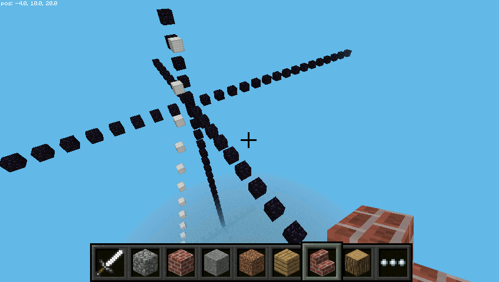
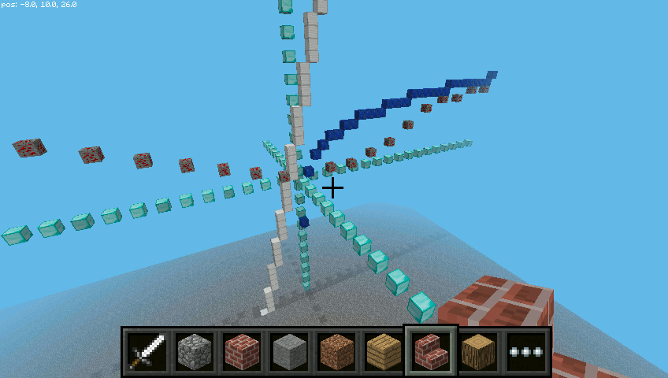
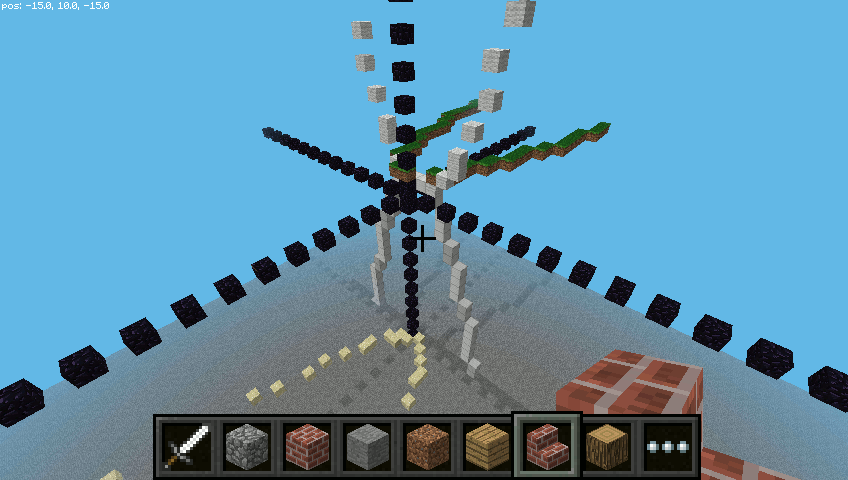
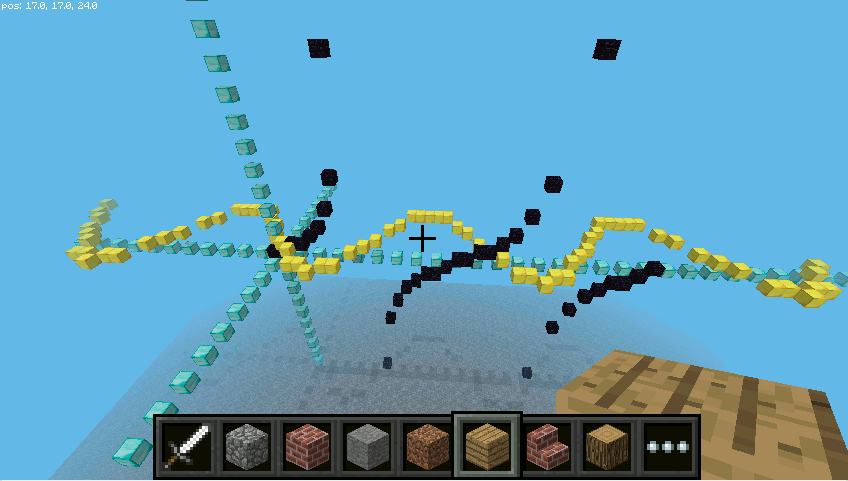

.. _mcpi-funkcje:

Funkcje w mcpi
##############

O Minecrafcie w wersji na Raspberry Pi myśleć można jak o atrakcyjnej formie
wizualizacji tego co można przedstawić w grafice dwu- lub trójwymiarowej.
Zobaczmy zatem jakie budowle otrzymamy, wyliczając współrzędne bloków
za pomocą funkcji matematycznych. Przy okazji niejako przypomnimy sobie
użycie opisywanej już w naszych scenariuszach biblioteki :ref:`matplotlib <pylab>`,
która jest dedykowanym dla Pythona środowiskiem tworzenia wykresów 2D.

Funkcja liniowa
===============

Za pomocą wybranego edytora utwórz pusty plik, umieść w nim podany niżej kod i zapisz
w katalogu :file:`mcpi-sim` pod nazwą :file:`mcpi-funkcje.py`:

.. raw:: html

    
Kod nr 

.. highlight:: python
.. literalinclude:: mcpi-funkcje01.py
    :linenos:
    :lineno-start: 1
    :lines: 1-

Większość kodu powinna być już zrozumiała, czyli importy bibliotek, nawiązywania połączenia
z serwerem MC Pi, czy funkcja ``plac()`` tworząca przestrzeń do testów.
Podobnie funkcja ``wykres()``, która pokazuje nam graficzną reprezentację funkcji
za pomocą biblioteki *matblotlib*. Na uwagę zasługuje w niej tylko parametr ``*extra``,
który pozwala przekazać argumenty i wartości dodatkowej funkcji.

Funkcja ``fun1()`` pobiera od użytkownika dwa współczynniki i odwzorowuje argumenty
z dziedziny <-10;10> na wartości wg liniowego równania: ``f(x) = a * x + b``.
Przeciwdziedzinę można byłoby uzyskać "na piechotę" za pomocą kodu:

.. code-block:: python

    y = []
    for i in x:
        y.append(a * i + b)

– ale efektywniejsze jest :term:`wyrażenie listowe`: ``y = [a * i + b for i in x]``.
Po zobrazowaniu wykresu za pomocą funkcji funkcji ``wykres()`` i biblioteki *matplotlib*
"budujemy" ją w MC Pi w pętli odczytującej wyliczone pary argumentów i wartości funkcji,
stanowiących współrzędne kolejnych bloków umieszczanych poziomo.

Uruchom i przetestuj omówiony kod podając współczynniki np. *4* i *6*.

Układ współrzędnych
===================

Spróbujmy pokazać w Mc Pi układ współrzędnych oraz ułatwić "budowanie" wykresów
za pomocą osobnej funkcji. Po funkcji ``wykres()`` umieszczamy w pliku :file:`mcpi-funkcje.py` nowy kod:

.. raw:: html

    
Kod nr 

.. highlight:: python
.. literalinclude:: mcpi-funkcje02.py
    :linenos:
    :lineno-start: 52
    :lines: 52-74

– a pętlę tworzącą wykres w funkcji ``fun1()`` zastępujemy wywołaniem:

.. code-block:: python

    rysuj(x, y, [1], blok)

Funkcja ``rysuj()`` potrafi zbudować bloki zarówno w poziomie, jak i w pionie w zależności
od tego, czy lista wartości funkcji przekazana zostanie jako parametr *y* czy też *z*.
Do rozpoznania tego wykorzystujemy zmienną sterującą ustawianą w instrukcji: ``czylista = True if len(y) > 1 else False``.

Zawartość funkcji ``main()`` zmieniamy na:

.. raw:: html

    
Kod nr 

.. highlight:: python
.. literalinclude:: mcpi-funkcje02.py
    :linenos:
    :lineno-start: 90
    :lines: 90-96

Po uruchomieniu zmienionego kodu powinniśmy zobaczyć wykres naszej funkcji w pionie.

Kod "budujący" wykresy funkcji możemy urozmaicić wykorzystując poznaną wcześniej
bibliotekę :ref:`minecraftstuff <mcpifigury>`. Poniżej funkcji ``rysuj()`` dodajemy:

.. raw:: html

    
Kod nr 

.. highlight:: python
.. literalinclude:: mcpi-funkcje03.py
    :linenos:
    :lineno-start: 77
    :lines: 77-98

– a wywołanie ``rysuj()`` w funkcji ``fun1()`` zmieniamy na ``rysuj_linie()``.
Sprawdź rezultat.

Kolejne funkcje
===============

W pliku :file:`mcpi-funkcje.py` tuż nad funkcją główną ``main()`` umieszczamy kod
wyliczający dziedziny i przeciwdziedziny dwóch kolejnych funkcji:

.. raw:: html

    
Kod nr 

.. highlight:: python
.. literalinclude:: mcpi-funkcje04.py
    :linenos:
    :lineno-start: 114
    :lines: 114-158

W funkcji ``fun2()`` wartości dziedziny uzyskujemy dzięki metodzie ``arange(start, stop, step)`` z biblioteki *numpy*. Potrafi ona generować listę wartości zmiennopozycyjnych w podanym zakresie <*start;stop*) z określonym krokiem *step*.

Przeciwdziedzinę wyliczamy w pętli w zależności od przedziałów, w których znajdują się argumenty,
za pomocą złożonej instrukcji warunkowej. Następnie wartości zarówno dziedziny, jak i przeciwdziedziny
przeskalowujemy w wyrażeniach listowych, mnożąc przez stały współczynnik,
aby wykres w MC Pi był większy i wyraźniejszy. Przy okazji współrzędne zaokrąglamy
do dwóch miejsc po przecinku, np.: ``x = [round(i * 20, 2) for i in x]``.

W funkcji ``fun3()`` w podobny jak powyżej sposób obliczamy argumenty i wartości funkcji logarytmicznej.

Na koniec zmieniamy też nieco wywołania w funkcji głównej. Przetestuj podany kod.

Funkcja kwadratowa
==================

Przygotujemy wykres funkcji kwadratowej. Przed funkcją główną umieszczamy następujący kod:

.. raw:: html

    
Kod nr 

.. highlight:: python
.. literalinclude:: mcpi-funkcje05.py
    :linenos:
    :lineno-start: 150
    :lines: 150-188

Na początku w funkcji ``fkwadratowa()`` pobieramy od użytkownika przedział, w którym
budować będziemy funkcję. Wymuszamy przy tym w pętli ``while``, aby lewa i prawa granica
miały inne znaki. Dalej używamy funkcji ``linspace(start, stop, num, endpoint)``, która generuje
listę *num* wartości od punktu początkowego do końcowego, który uwzględniany jest, jeżeli argument
*endpoint* ma wartość *True*. Kolejne wyrażenia listowe wyliczają przeciwdziedziny
i zaokrąglają wartości do 2 miejsc po przecinku.

Sama funkcja kwadratowa ``a*x^2 + b*x + c`` zdefiniowana jest w funkcji ``fkw()``, do której
przekazujemy kolejne argumenty dziedziny i opcjonalnie współczynniki.

Instrukcje ``rysuj()`` i ``rysuj_linie()`` dzięki przekazywaniu przeciwdziedziny jako
2. lub 3. argumentu budują wykresy w poziomie lub w pionie za pomocą pojedynczych
lub połączonych bloków.

Po przygotowaniu w funkcji głównej miejsca, ustawieniu gracza, narysowaniu układu
i podaniu przedziału <-20, 20> otrzymamy konstrukcję podobną do poniższej.

Po zmianie funkcji na *x**2 / 3* można otrzymać:

.. figure:: img/fkwadratowa2.png

Zwróciłeś uwagę na to, że jeden z wykresów opada?

Funkcje trygonometryczne
========================

Na koniec zobrazujemy funkcje trygonometryczne. Przed funkcją główną dopisujemy kod:

.. raw:: html

    
Kod nr 

.. highlight:: python
.. literalinclude:: mcpi-funkcje06.py
    :linenos:
    :lineno-start: 182
    :lines: 182-210

W funkcji ``trygon()`` na początku wyliczamy dziedzinę i przeciwdziedzinę funkcji
*5 * sin(0.1 * Pi * x)*, przy czym wartości *y* zaokrąglamy.

Dalej generujemy argumenty *x* dla funkcji tangens w przedziale od 0 do 360 co 10 stopni.
Obliczając wartości *y* za pomocą wyrażenia listowego
``y2 = [None if i == 90 or i == 270 else np.tan(i * np.pi / 180) for i in x2]``
dla argumentów *90* i *270* wstawiamy *None* (czyli nic), ponieważ dla tych argumentów
funkcja nie przyjmuje wartości. Dzięki temu uzyskamy poprawny wykres w *matplotlib*.

Aby wykresy obydwu funkcji nałożyły się na siebie, używając wyrażenia listowego,
skalujemy argumenty i wartości funkcji tangens. Pierwsze dzielimy przez 10, drugie
mnożymy przez 3 (i przy okazji zaokrąglamy). Konstrukcja ``if i is not None else None``
zapobiega wykonywaniu operacji dla wartości ``None``, co generowałoby błędy.

Przygotowanie danych do zwizualizowania w Minecrafcie wymaga usunięcia 2 argumentów
z listy *x2* oraz odpowiadających im wartości ``None`` z listy *y2*, ponieważ nie tworzą
one poprawnych współrzędnych. Pierwszą parę usuwamy podając wprost odpowiedni indeks
w instrukcjach ``del x2[9]`` i ``del y2[9]``. Indeksy elementów drugiej pary najpierw
wyszukujemy ``x2.index(27)`` i ``y2.index(None)``, a później przekazujemy do
instrukcji usuwającej ``del()``.

Po wywołaniu z ustawieniami w funkcji głównej takimi jak w powyższym kodzie
powinniśmy zobaczyć obraz podobny do poniższego.

**Ćwiczenia**

Warto poeksperymentować z wzorami funkcji, ich współczynnikami,
wartościami przedziałów i ilością argumentów, aby zbadać jak te zmiany
wpływają na ich reprezentację graficzną.

Można też rysować mieszać metody rysujące wykresy (``rysuj()``, ``rysuj_linie()``),
kolejność przekazywania im parametrów, rodzaje bloków itp.
Spróbuj np. budować wykresy z piasku (``block.STONE``) ponad powierzchnią.

**Źródła:**

* :download:`Skrypty mcpi-funkcje <mcpi-funkcje.zip>`