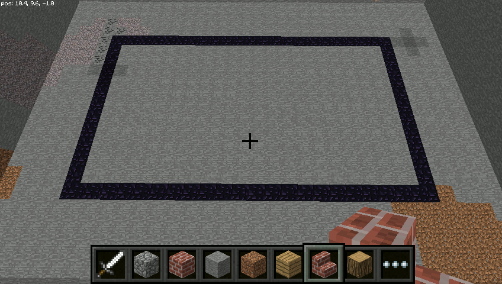
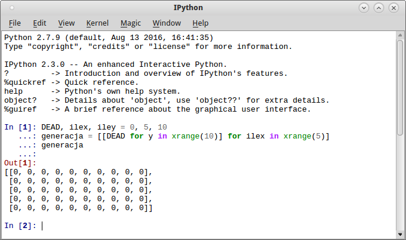
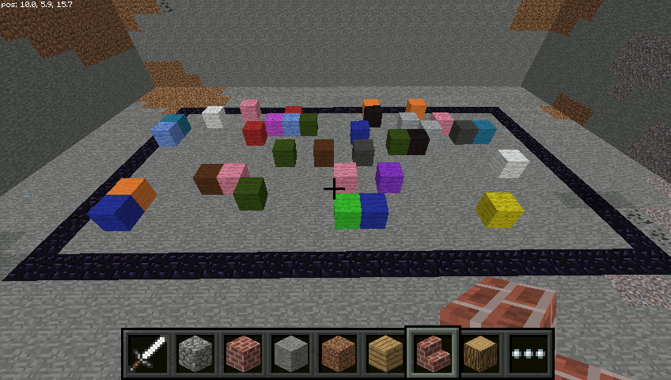
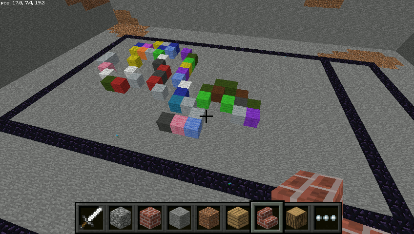
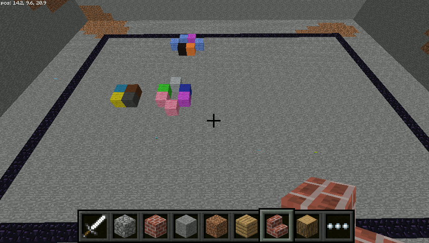
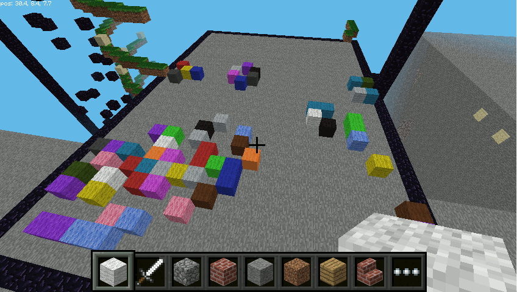

.. _mcpi-glife:

Gra w życie
##############

`Gra w życie <https://pl.wikipedia.org/wiki/Gra_w_%C5%BCycie>`_  jest najbardziej znaną implementacją
`automatu komórkowego <https://pl.wikipedia.org/wiki/Automat_kom%C3%B3rkowy>`_,
wymyśloną przez brytyjskiego matematyka Johna Conwaya. Cały pomysł polega na symulowaniu
rozwoju populacji komórek, które umieszczone w wyznaczonym obszarze tworzą różne
zaskakujące układy.

Grę zaimplementujemy przy użyciu programowania obiektowego, którego podstawowym
elementem są `klasy <https://pl.wikipedia.org/wiki/Klasa_%28programowanie_obiektowe%29>`_.
Można je rozumieć jako definicje
`obiektów <https://pl.wikipedia.org/wiki/Obiekt_%28programowanie_obiektowe%29>`_
odwzorowujących mniej lub bardziej dokładniej jakieś elementy rzeczywistości,
niekoniecznie materialne. Obiekty łączą dane, czy też właściwości,
oraz metody na nich operujące. Obiekt tworzymy na podstawie klas i nazywamy
je wtedy instancjami danej klasy.

Plansza gry
===========

Zaczniemy od przygotowania obszaru, w którym będziemy obserwować kolejne populacje
komórek. Tworzymy pusty plik w katalogu :file:`mcpi-sim` i zapisujemy pod nazwą :file:`mcpi-glife.py`.
Wstawiamy do niego poniższy kod:

.. raw:: html

    
Kod nr 

.. highlight:: python
.. literalinclude:: mcpi-glife01.py
    :linenos:
    :lineno-start: 1
    :lines: 1-

Główna klasa w programie nazywa się ``GraWZycie``, jej definicja rozpoczyna się słowem
kluczowym ``class``, a nazwa obowiązkową dużą literą. Pierwsza zdefiniowana metoda o nazwie ``__init__()``
to konstruktor klasy, wywoływany w momencie tworzenia jej instancji.
Dzieje się tak w głównej funkcji ``main()`` w instrukcji: ``gra = GraWZycie(mc, 20, 10, 40)``.
Tworząc instancję klasy, czyli obiekt ``gra``, przekazujemy do konstruktora
parametry: obiekt ``mc`` reprezentujący grę Minecraft, szerokość
i wysokość pola gry, a także ilość tworzonych na wstępie komórek.

Konstruktor z przekazanych parametrów tworzy właściwości klasy w instrukcjach
typu ``self.mc = mc``. Do właściwości klasy odwołujemy się w innych metodach za pomocą
słowa ``self`` – np. w wywołanej w funkcji głównej metodzie ``uruchom()``.
Jej zadaniem jest wykonanie metody ``plac()``, która buduje planszę gry.
Przekazujemy jej współrzędne punktu początkowego, a także szerokość i wysokość planszy.

.. note::

    Warto zauważyć i zapamiętać, że każda metoda w klasie jako pierwszy
    parametr przyjmuje zawsze wskaźnik do instancji obiektu, na którym
    będzie działać, czyli konwencjonalne słowo ``self``.

W wyniku uruchomienia i przetestowania kodu powinniśmy zobaczyć zbudowaną
planszę do gry, czyli prostokąt, o podanych w funkcji głównej wymiarach.

Populacja
=========

Utworzymy klasę ``Populacja``, a w niej strukturę danych reprezentującą
układ żywych i martwych komórek. Przed funkcją główną ``main()`` wstawiamy kod:

.. raw:: html

    
Kod nr 

.. highlight:: python
.. literalinclude:: mcpi-glife02.py
    :linenos:
    :lineno-start: 61
    :lines: 61-100

Konstruktor klasy ``Populacja`` pobiera obiekt Minecrafta (``mc``) oraz rozmiary
dwuwymiarowej macierzy (``ilex, iley``), czyli tablicy, która reprezentować będzie układy
komórek. Po przypisaniu właściwościom klasy przekazanych parametrów tworzymy
początkowy stan populacji, tj. macierz wypełnioną zerami. W metodzie ``reset_generacja()``
wykorzystujemy wyrażenie listowe, które – ujmując rzecz w terminologii Pythona –
zwraca listę *ilex* list zawierających *iley* komórek z wartościami zero.
To właśnie wspomniana wcześniej macierz dwuwymiarowa.

**Ćwiczenie 1**

Uruchom konsolę IPython Qt Console i wklej do niej polecenia:

.. code-block:: python

    DEAD, ilex, iley = 0, 5, 10
    generacja = [[DEAD for y in xrange(10)] for ilex in xrange(5)]
    generacja

Zobacz efekt (nie zamykaj konsoli, jeszcze się przyda):

Komórki mogą być martwe (``DEAD``– wartość 0) i tak jest na początku, ale aby populacja mogła ewoluować,
trzeba niektóre z nich ożywić (``ALIVE`` – wartość 1).
Odpowiada za to metoda ``losuj()``, która przyjmuje jeden argument
określający, ile komórek ma być początkowo żywych. Następnie w pętli losowana
jest wymagana ilość par indeksów wskazujących wiersz i kolumnę, czyli komórkę,
która ma być żywa (``ALIVE``). Na końcu drukujemy w terminalu
początkowy układ komórek.

**Ćwiczenie 2**

Spróbuj w kilku komórkach macierzy utworzonej w konsoli, zapisać wartość ALIVE,
czyli 1.

W konstruktorze klasy głównej ``GraWZycie`` tworzymy instancję klasy ``Populacja`` – to powoduje
wykonanie jej konstruktora. Potem wywołujemy metodę tworzącą układ początkowy.
Tak więc na końcu konstruktora klasy ``GraWZycie`` (``__init__()``)dodajemy poniższy kod:

.. raw:: html

    
Kod nr 

.. highlight:: python
.. literalinclude:: mcpi-glife02.py
    :linenos:
    :lineno-start: 32
    :lines: 32-34

Przetestuj kod.

Rysowanie macierzy
==================

Skoro mamy przygotowany plac gry oraz początkowy układ populacji, trzeba ją
narysować, czyli umieścić określone bloki we współrzędnych Minecrafta odpowiadających
indeksom ożywionych komórek macierzy. Na końcu klasy ``Populacja`` dodajemy dwie nowe
metody ``rysyj()`` i ``zywe_komorki()``:

.. raw:: html

    
Kod nr 

.. highlight:: python
.. literalinclude:: mcpi-glife03.py
    :linenos:
    :lineno-start: 103
    :lines: 103-120

– a rysowanie wywołujemy w metodzie ``uruchom()`` klasy ``GraWZycie``, dopisując:

.. raw:: html

    
Kod nr 

.. highlight:: python
.. literalinclude:: mcpi-glife03.py
    :linenos:
    :lineno-start: 41
    :lines: 41

Wyjaśnienia wymaga funkcja ``rysuj()``. W pętli pobieramy współrzędne
żywych komórek, które rozpakowywane są z 2-elementowej listy do zmiennych:
``for x, z in self.zywe_komorki():``. Dalej losujemy podtyp bloku bawełny
i umieszczamy go we wskazanym miejscu.

Funkcja ``zywe_komorki()`` to tzw. :term:`generator`, co poznajemy po tym,
że zwraca wartości za pomocą słowa kluczowego ``yield``. Jej
działanie polega na przeglądaniu macierzy za pomocą zagnieżdżonych pętli
i zwracaniu współrzędnych "żywych"komórek.

**Ćwiczenie 3**

Odwołując się do utworzonej wcześniej przykładowej macierzy, przetestuj
w konsoli poniższy kod:

.. code-block:: python

    for x in range(len(generacja)):
        kolumna = generacja[x]
        for y in range(len(kolumna)):
            print x, y, " = ", generacja[x][y]

Różnica pomiędzy generatorem a zwykłą funkcją polega na tym, że zwykła funkcja
po przeglądnięciu całej macierzy zwróciłaby od razu kompletną listę żywych
komórek, a `generator <https://wiki.python.org/moin/Generators>`_
robi to "na żądanie". Po napotkaniu żywej komórki
zwraca jej współrzędne, zapamiętuje stan lokalnych pętli i czeka na następne
wywołanie. Dzięki temu oszczędzamy pamięć, a dla dużych struktur także
zwiększamy wydajność.

Uruchom kod, oprócz pola gry, powinieneś zobaczyć bloki reprezentujące pierwszą
generację komórek.

Ewolucja – zasady gry
=====================

Jak można było zauważyć, rozgrywka toczy się na placu podzielonym na kwadratowe komórki,
którego reprezentacją algorytmiczną jest macierz. Każda komórka ma maksymalnie
ośmiu sąsiadów. To czy komórka przetrwa, zależy od ich ilości.
Reguły są następujące:

* Martwa komórka, która ma dokładnie 3 sąsiadów, staje się żywa w następnej generacji.
* Żywa komórka z 2 lub 3 sąsiadami zachowuje swój stan, w innym przypadku umiera
  z powodu "samotności" lub "zatłoczenia".

Kolejne generacje obliczamy w umownych jednostkach czasu.
Do kodu klasy ``Populacja`` dodajemy dwie metody zawierające logikę gry:

.. raw:: html

    
Kod nr 

.. highlight:: python
.. literalinclude:: mcpi-glife04.py
    :linenos:
    :lineno-start: 128
    :lines: 128-181

Metoda ``nast_generacja()`` wylicza kolejny stan populacji. Na początku
tworzymy pustą macierz ``naste_gen`` wypełnioną zerami – tak jak w konstruktorze
klasy. Następnie przy użyciu dwóch zagnieżdżonych pętli ``for`` –
takich samych jak w generatorze ``zywe_komorki()`` – przeglądamy
wiersze, wydobywając z nich kolejne komórki i badamy ich otoczenie.

Najważniejszy krok algorytmu to określenie ilości żywych sąsiednich komórek,
co ma miejsce w instrukcji: ``iluS = sum(self.sasiedzi(x, y))``.
Funkcja ``sum()`` sumuje zapisane w sąsiednich komórkach wartości,
zwracane przez generator ``sasiedzi()``. Generator ten wykorzystuje
zagnieżdżone pętle ``for``, aby uzyskać współrzędne sąsiednich komórek,
następnie w instrukcjach warunkowych ``if`` sprawdza,
czy nie wychodzą one poza planszę.

.. attention::

    "Gra w życie" zakłada, że symulacja toczy się na nieograniczonej planszy,
    jednak dla celów wizualizacji w MC Pi musimy przyjąć jakieś jej wymiary,
    a także podjąć decyzję, co ma się dziać, kiedy je przekraczamy.
    W naszej implementacji, kiedy badając stan sąsiada przekraczamy planszę,
    bierzemy pod uwagę stan komórki z przeciwległego końca wiersza lub kolumny.

**Ćwiczenie 4**

Na przykładzie utworzonej wcześniej macierzy przetestuj w konsoli kod:

.. code-block:: python

    x, y = 2, 2
    for nx in range(x - 1, x + 2):
        for ny in range(y - 1, y + 2):
            print nx, ny, "=", generacja[nx][ny]

Jak widzisz, zwraca on wartości zapisane w komórkach otaczających wyznaczoną
współrzędnymi *x, y*.

Wróćmy do metody ``nast_generacja()``. Po wywołaniu ``iluS = sum(self.sasiedzi(x, y))``,
wiemy już, ilu mamy wokół siebie sąsiadów. Dalej za pomocą instrukcji warunkowych,
np. ``if iluS == 3:``, sprawdzamy więc ich ilość i – zgodnie z regułami –
ożywiamy badaną komórkę, zachowujemy jej stan lub ją uśmiercamy.
Uzyskany stan zapisujemy w nowej macierzy ``nast_gen``. Po zbadaniu
wszystkich komórek nowa macierz reprezentująca nową generację nadpisuje
poprzednią: ``self.generacja = nast_gen``. Pozostaje ją narysować.
Zmieniamy metodę ``uruchom()`` klasy ``GraWZycie``:

.. raw:: html

    
Kod nr 

.. highlight:: python
.. literalinclude:: mcpi-glife04.py
    :linenos:
    :lineno-start: 36
    :lines: 36-47

Proces generowania i rysowania kolejnych generacji komórek dokonuje się
w zmienionej metodzie ``uruchom()`` głównej klasy naszego skryptu.
Wykorzystujemy nieskończoną pętlę ``while True:``, w której:

* rysujemy plac gry,
* rysujemy aktualną populację,
* wyliczamy następną generację,
* wstrzymujemy działanie na sekundę
* i wszystko powtarzamy.

Tak uruchomiony program możemy przerwać tylko "ręcznie" przerywając
działanie skryptu.

.. tip::

    Uwaga: metoda zakończenia działania skryptu zależy od sposobu jego
    uruchomienia i systemu operacyjnego. Np. w Linuksie skrypt uruchomiony
    w terminalu poleceniem ``python skrypt.py`` przerwiemy naciskając
    :kbd:`CTRL+C` lub bardziej radykalnie :kbd:`ALT+F4` (zamknięcie okna z terminalem).

Przetestuj skrypt!

Początek zabawy
===============

Śledzenie ewolucji losowo przygotowanego układu komórek nie jest zazwyczaj
zbyt widowiskowe, zwłaszcza kiedy symulację przeprowadzamy na dużej planszy.
O wiele ciekawsza jest możliwość śledzenia zmian samodzielnie zaprojektowanego
układu początkowego. Dodajmy więc możliwość wczytywania takiego układu
bezpośrednio z Minecrafta. Do klasy ``Populacja`` poniżej metody ``losuj()``
dodajemy kod:

.. raw:: html

    
Kod nr 

.. highlight:: python
.. literalinclude:: mcpi-glife05.py
    :linenos:
    :lineno-start: 111
    :lines: 111-125

Działanie metody ``wczytaj()`` jest proste: za pomocą zagnieżdżonych pętli
pobieramy typ bloku z każdego miejsca placu gry: ``blok = self.mc.getBlock(x, 0, z)``.
Jeżeli na placu znajduje się jakikolwiek blok inny niż powietrze,
oznaczamy odpowiednią komórkę początkowej generacji, wskazywaną przez współrzędną
bloku jako żywą: ``self.generacja[x][z] = ALIVE``. Przy okazji zliczamy ilość takich komórek.

Wywołanie funkcji trzeba dopisać do konstruktora klasy ``GraWZycie`` w następujący sposób:

.. raw:: html

    
Kod nr 

.. highlight:: python
.. literalinclude:: mcpi-glife05.py
    :linenos:
    :lineno-start: 33
    :lines: 33-36

Jak widać wykonanie metody ``wczytaj()`` zależne jest od wartości parametru ``ile``.
Tak więc jeżeli chcesz przetestować nową możliwość, w wywołaniu konstruktora w funkcji
głównej ustaw ten parametr na 0 (zero), np: ``gra = GraWZycie(mc, 30, 20, 0)``.

.. note::

    Uwaga: przy dużych rozmiarach pola gry odczytywanie wszystkich bloków zajmuje dużo czasu!
    Przed testowaniem wczytywania własnych układów warto uruchomić skrypt przynajmniej raz,
    aby zbudować w MC Pi plac gry.

Nie pozostaje nic innego, jak zacząć się bawić. Można np. urządzić zawody: czyja
populacja komórek utrzyma się dłużej – oczywiście warto wykluczyć budowanie
znanych i udokumentowanych układów stałych.

**Ćwiczenie 5**

Dodaj do skryptu mechanizm kończący symulacji, kiedy na planszy nie ma już
żadnych żywych komórek.

**Źródła:**

* :download:`Skrypty mcsim-glife <mcpi-glife.zip>`