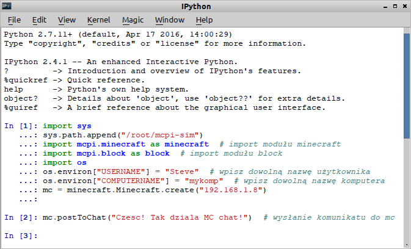
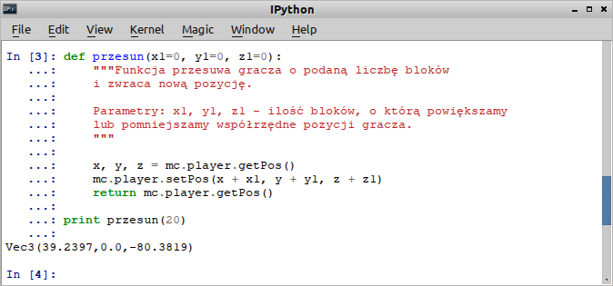
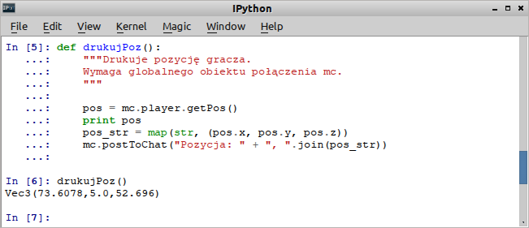
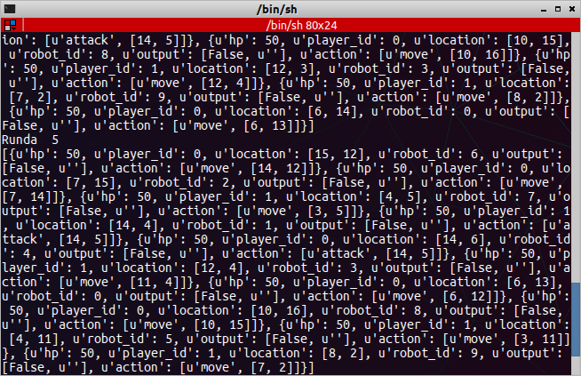
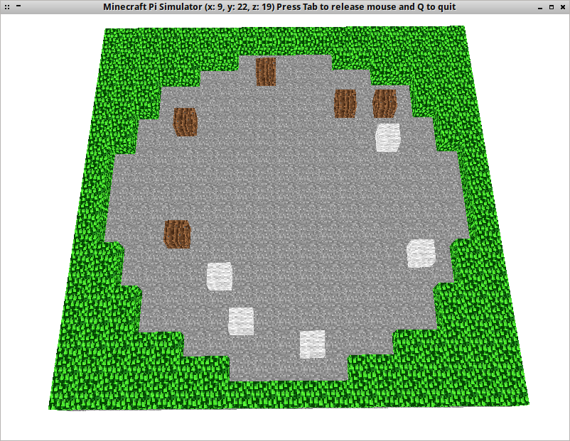
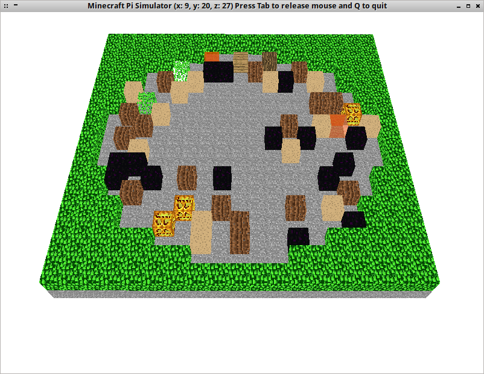

Minecraft Pi
#############

`Minecraft Pi Edition <http://pi.minecraft.net/>`_ to zbiór bibliotek `Pythona <https://www.python.org/>`_
umożliwiających kontrolowanie niektórych elementów gry `Minecraft <https://pl.wikipedia.org/wiki/Minecraft>`_ uruchamianej jako serwer na minikomputerze `Raspberry Pi <https://pl.wikipedia.org/wiki/Raspberry_Pi>`_
z systemem `Raspbian <https://www.raspbian.org/>`_. Całość bardzo dobrze nadaje się do nauki programowania
z wykorzystaniem języka Python.

Wymagania wstępne
=================

1. Serwer Minecrafta Pi, czyli minikomputer Raspberry Pi w wersji B+, 2 lub 3
   z najnowszą wersją systemu Raspbian
2. Klient, czyli dowolny komputer z systemem Linux [lub Windows?],
   zawierający interpreter Pythona 2 oraz bibliotekę *mcpi-sim*
3. Adresy IP serwera i klienta muszą należeć do tej samej sieci lokalnej

Instalacja bibliotek
--------------------

Biblioteki *mcpi-sim*, czyli symulatora Minecrafta, instalujemy poleceniem:

.. code-block:: bash

    ~$ git clone https://github.com/pddring/mcpi-sim.git

Symulator w katalogu :file:`~/mcpi-sim/mcpi` zawiera biblioteki *mcpi*, czyli pythonowe :term:`API`
pozwalające na komunikację z serwerem Minecraft Pi.

.. note::

	* Dystrybucja XenialPup KzkBox przygotowana na potrzeby naszego projektu zawiera już symulator.

	* Do zainstalowania tylko bibliotek *mcpi* użyć można polecenia:
	  ``git clone https://github.com/martinohanlon/mcpi.git``. Można też ściągnąć
	  i rozpakować archiwum `master.zip <https://github.com/martinohanlon/mcpi/archive/master.zip>`_.

	* Pełną dokumentację API znajdziemy na stronie
	  `Minecraft API <http://www.stuffaboutcode.com/p/minecraft-api-reference.html>`_.

Połączenie z serwerem
=====================

Za pomocą wybranego edytora utwórz pusty plik, umieść w nim podany niżej kod i zapisz,
np. w katalogu :file:`mcpi-sim` pod nazwą :file:`mcpikzk.py`:

.. raw:: html

    
Kod nr 

.. highlight:: python
.. literalinclude:: mcpikzk01.py
    :linenos:
    :lineno-start: 1
    :lines: 1-25

Bardzo ważną rzeczą jest wskazanie lokalizacji biblioteki mcpi, odpowiada za to instrukcja
``sys.path.append("/root/mcpi-sim")``, która dołącza katalog :file:`/root/mcpi-sim` do ścieżki
przeszukiwania. Jeżeli katalog :file:`mcpi-sim` znajduje się w innym położeniu, ścieżkę
należy odpowiednio zmodyfikować. Potrzebne moduły importujemy w poleceniach:

.. code-block:: python

		import mcpi.minecraft as minecraft
		import mcpi.block as block

Biblioteka *mcpi* zawarta w symulatorze wymaga do działania ustawienia zmiennych
środowiskowych określających nazwę użytkownika i komputera. Po zaimportowaniu modułu
``os`` dodajemy więc odpowiednie klucze do pythonowego słownika, np. ``os.environ["USERNAME"] = "Steve"``.

Po wykonaniu czynności wstępnych tworzymy podstawowy obiekt reprezentujący grę Minecraft:
``mc = minecraft.Minecraft.create("192.168.1.8")``.

.. tip::

	Adres IP serwera Minecrafta, czyli minikomputera Raspberry Pi, odczytamy po najechaniu myszą
	na ikonę połączenia sieciowego w prawym górnym rogu pulpitu (zob. zrzut poniżej). Możemy też wydać
	w terminalu polecenie ``ip addr`` i odczytać adres poprzedzony przedrostkiem *inet*
	dla interfejsu *eth0* (łącze kablowe) lub *wlan0* (łącze radiowe).

.. figure:: img/rasplan-ip.jpg

Na końcu w funkcji ``main()``, czyli głównej, wywołujemy metodę ``postToChat()``,
która pozwala wysłać i wyświetlić podaną wiadomość na czacie Minecrafta.

Skrypt uruchamiamy z poziomu edytora, jeśli to możliwe, lub wykonując w terminalu polecenie:

.. code-block:: bash

    ~/mcpi-sim$ python mcpikzk.py

.. note::

	Omówiony kod (linie 7-17) stanowi **niezbędne minimum**, które **musi znaleźć się** w każdym skrypcie
	lub w sesji interpretera (konsoli), jeżeli chcemy widzieć efekty naszych działań
	na serwerze. Dla wygody kopiowania podajemy go w skondensowanej formie:

.. raw:: html

    
Kod nr 

.. highlight:: python
.. literalinclude:: mcpikzk00.py
    :linenos:

Świat Minecrafta Pi
===================

Świat Minecrafta Pi opisujemy za pomocą trójwymiarowego układu współrzędnych:

.. figure:: img/minecraft-system.png

Obserwując położenie bohatera gry Steve'a zauważymy, że zmiany współrzędnej *x*
(klawisze :kbd:`A` i :kbd:`D`) i *z* (klawisze :kbd:`W` i :kbd:`S`) przesuwają postać
w lewo/prawo, do przodu/tyłu, czyli horyzontalnie, natomiast zmiany współrzędnej *y*
do góry/w dół - wertykalnie.

.. note::

	W Pi Edition wartości *x* i *y* ograniczono do przedziału [-128, 127].

**Ćwiczenie 1**

Uruchamiamy rozszerzoną konsolę Pythona wpisując w terminalu polecenie:

.. code-block:: bash

	~$ ipython qtconsole

.. tip::

	Podane polecenie można wpisać również w okienko "Uruchom" wywoływane w środowiskach
	linuksowych zazwyczaj przez skrót :kbd:`ALT+F2`.

	Zamiast rozszerzonej konsoli qt możemy użyć zwykłej konsoli ``ipython``
	lub podstawowego interpretera ``python`` uruchamianych w terminalu.
	Uwaga: jeżeli skorzystamy z interpretera podstawowego kod kopiujemy i wklejamy
	linia po linii.

Kopiujemy do okna konsoli, uruchamiamy omówiony powyżej "Kod 2", służący nawiązaniu połączenia z serwerem,
i wysyłamy wiadomość na czat:

Poznamy teraz kilka podstawowych metod pozwalających na manipulowanie światem Minecrafta.

Orientuj się Steve!
===================

Wpisz w konsoli poniższy kod:

.. code-block:: bash

    >>> mc.player.getPos()
    >>> x, y, z = mc.player.getPos()
    >>> print x, y, z
    >>> x, y, z = mc.player.getTilePos()
    >>> print x, y, z

Metoda ``getPos()`` obiektu ``player`` zwraca nam obiekt zawierający współrzędne określające
pozycję bohatera. Metoda ``getTitlePos()`` zwraca z kolei współrzędne bloku, na którym stoi
bohater. Instrukcje typu ``x, y, z = mc.player.getPos()`` rozpakowują kolejne współrzędne
do zmiennych *x*, *y* i *z*. Możemy wykorzystać je do zmiany położenia bohatera:

.. code-block:: bash

    >>> mc.player.setPos(x+10, y+20, z)

Powyższy kod przesunie bohatera w bok o 10 bloków i do góry na wysokość 20 bloków.
Podobnie zadziała kod ``mc.player.setTilePos(x+10, y+20, z)``, który przeniesie postać
na blok, którego pozycję podamy.

Idź i przesuń się
-----------------

Zadania takie możemy realizować za pomocą funkcji, które dodatkowo zwrócą nam nową pozycję.
W pliku :file:`mcpikzk.py` umieszczamy kod:

.. raw:: html

    
Kod nr 

.. highlight:: python
.. literalinclude:: mcpikzk.py
    :linenos:
    :lineno-start: 20
    :lines: 20-39

W pierwszej funkcji ``idzDo()`` warto zwrócić uwagę na metodę ``getHeight()``, która pozwala ustalić
wysokość świata w punkcie *x, z*, czyli współrzędną *y* najwyższego bloku nie będącego powietrzem.
Dzięki temu umieścimy bohatera zawsze na jakiejś powierzchni, a nie np. pod ziemią ;-).
Druga funkcja ``przesunSie()`` nie tyle umieszcza, co przesuwa postać, stąd dodatkowe instrukcje.

Dopisz wywołanie ``print idzDo(50, 0, 50)`` w funkcji ``main()`` przed instrukcją ``return``
i przetestuj kod uruchamiając skrypt :file:`mcpikzk.py` lub w konsoli. Później dopisz również
drugą funkcję ``print przesunSie(20)`` i sprawdź jej działanie.

**Ćwiczenie 2**

Sprawdź, co się stanie, kiedy podasz współrzędne większe niż świat Minecrafta.
Zmień kod obydwu funkcji na "bezpieczny dla życia" ;-)

Gdzie jestem?
-------------

Aby odczytywać i drukować pozycję bohatera dodamy kolejną funkcję do pliku :file:`mcpikzk.py`:

.. raw:: html

    
Kod nr 

.. highlight:: python
.. literalinclude:: mcpikzk.py
    :linenos:
    :lineno-start: 42
    :lines: 42-50

Funkcja nie tylko drukuje koordynaty w konsoli (``print x, y, z``), ale również –
po przekształceniu ich na listę wartości typu string ``pos_str = map(str, pos_list)`` –
wysyła jako komunikat na czat Minecrafta. Wywołanie funkcji dopisujemy do funkcji głównej
i testujemy kod:

Więcej ruchu
------------

Teraz możemy trochę pochodzić, ale będziemy obserwować to z lotu ptaka. Dopiszmy kod poniższej
funkcji do pliku :file:`mcpikzk.py`:

.. raw:: html

    
Kod nr 

.. highlight:: python
.. literalinclude:: mcpikzk.py
    :linenos:
    :lineno-start: 53
    :lines: 53-87

Warto zauważyć, jak pętla ``for i in range(krok)`` umożliwia symulowanie ruchu postaci.
Wywołanie funkcji dodajemy do funkcji głównej. Kod testujemy uruchamiając skrypt lub w konsoli.

.. figure:: img/ipython04.png

Po czym chodzę?
---------------

Teraz spróbujemy dowiedzieć się, po jakich blokach chodzimy. Definiujemy jeszcze jedną funkcję:

.. raw:: html

    
Kod nr 

.. highlight:: python
.. literalinclude:: mcpikzk.py
    :linenos:
    :lineno-start: 90
    :lines: 90-92

Dopisujemy jej wywołanie: ``print "Typ bloku: ", jakiBlok()`` – w funkcji głównej i testujemy.

.. figure:: img/ipython05.png

Plac budowy
============

Skoro orientujemy się już w przestrzeni, możemy zacząć budować. Na początku wykorzystamy
**symulator**. Rozpoczniemy od przygotowania placu budowy.
Posłuży nam do tego odpowiednia funkcja, którą umieścimy w pliku :file:`mc.py`:

.. raw:: html

    
Kod nr 

.. highlight:: python
.. literalinclude:: mc01.py
    :linenos:
    :lineno-start: 1
    :lines: 1-51

Funkcja ``plac()`` korzysta z metody ``setBlocks(x0,y0,z0,x1,y1,z1,blockType, blockData)``,
która wypełnia obszar w przedziałach [*x0-x1*], [*y0-y1*], [*z0-z1*] blokiem podanego typu
o opcjonalnych właściwościach. Na początku tworzymy "podłogę" z kamienia,
później wypełniamy sześcian o podanym rozmiarze powietrzem. W symulatorze nie jest to przydatne,
ale bardzo przydaje się do "wyczyszczenia" miejsca w świecie Minecrafta.
Opcjonalnie możemy umieścić gracza w środku utworzonego obszaru.

Kod testujemy uruchamiając skrypt :file:`mc.py`:

.. code-block:: bash

    ~/mcpi-sim$ python mc.py

.. warning::

	Skrypt :file:`mc.py` musi znajdować się w katalogu :file:`mcpi-sim` ze źródłami symulatora,
	który wykorzystuje specjalne wersje bibliotek *minecraft* i *block* z podkatalogu :file:`local`.

Klawisze sterujące podglądem symulacji widoczne są w terminalu:

.. figure:: img/mc01.png

Umieszczanie bloków
===================

W pliku :file:`mc.py` przed funkcją główną (``main()``) umieszczamy funkcję ``buduj()``:

.. raw:: html

    
Kod nr 

.. highlight:: python
.. literalinclude:: mc02.py
    :linenos:
    :lineno-start: 45
    :lines: 45-50

Używamy podstawowej metody ``setBlock(x, y, z, blockType)``, która w podanych koordynatach
umieszcza określony blok. Wywołanie funkcji ``buduj()`` dodajemy do ``main()`` po funkcji ``plac()``
i testujemy. Ponad "podłogą" powinien znaleźć się zielony blok.

Do rysowania bloków można użyć pętli. Zmieniamy funkcję ``buduj()`` następująco:

.. raw:: html

    
Kod nr 

.. highlight:: python
.. literalinclude:: mc03.py
    :linenos:
    :lineno-start: 43
    :lines: 43-49

Teraz powinniśmy postawić mur 10 bloków na skraju "placu".

Robot Game & Minecraft
======================

Pole gry
--------

Spróbujemy teraz pokazać rozgrywkę z :ref:`gry robotów <robot-game>`.
Zaczniemy od zbudowania areny wykorzystywanej w grze. W pliku :file:`mc.py` umieszczamy następującą funkcję:

.. raw:: html

    
Kod nr 

.. highlight:: python
.. literalinclude:: mc04.py
    :linenos:
    :lineno-start: 52
    :lines: 52-74

Pole gry wpisane jest w kwadrat o boku 19 jednostek, dlatego korzystamy z dwóch zagnieżdżonych pętli,
w których zmienne iteracyjne *i*, *j* przyjmują wartości od 0 do 18. Część pól kwadratu wyłączona jest
z rozgrywki, ich współrzędne zawiera lista ``obstacle``. Bloki trawy umieszczamy tylko wtedy, kiedy
para zmiennych iteracyjnych, służąca również do wyznaczania współrzędnych, znajduje się w liście.
Odpowiada za to instrukcja warunkowa ``if (i, j) in obstacle``.

Przed uruchomieniem skryptu trzeba jeszcze umieścić wywołanie funkcji ``polegry()`` w funkcji głównej
po instrukcji rysującej pole budowy ``plac()``.

.. figure:: img/mc04.png

Dane gry
--------

W pliku :file:`lastgame.log` w katalogu :file:`mcpi-sim` (lub na końcu w "Źródłach") znajduje się zapis 100 rund przykładowej rozgrywki.

.. note::

	Gdybyś chciał wykorzystać zapis swojej rozgrywki, musisz zmodyfikować bibliotekę ``game.py``
	z pakietu ``rgkit``. Jeżeli korzystałeś z naszego :ref:`scenariusza <robot-game>` i zainstalowałeś ``rgkit``
	w :ref:`wirtualnym środowisku <rg-env>` :file:`~/robot/env`, plik ten znajdziesz w ścieżce
	:file:`~/robot/env/lib/python2.7/site-packages/rgkit/game.py`. Na końcu funkcji ``run_all_turns()``
	po linii nr 386 wstaw podany niżej kod:

	.. code-block:: python

	    # BEGIN DODANE na potrzeby Kzk
	    import json
	    plik = open('lastgame.log', 'w')
	    json.dump(self.history, plik)
	    plik.close()
	    # END OF DODANE

  Teraz po wywołaniu przykładowej walki: ``(env) root@kzk:~/robot$ rgrun bots/stupid26.py bots/Wall-E.py``
  w katalogu :file:`~/robot` znajdziesz plik :file:`lastgame.log`, który trzeba umieścić w katalogu
  ze skryptem :file:`mc.py`.

Każda runda to lista zawierająca słowniki określające właściwości poszczególnych robotów.
Do pliku :file:`mc.py` przed funkcją główną dodamy funkcję ``pokaz_gre()``:

.. raw:: html

    
Kod nr 

.. highlight:: python
.. literalinclude:: mc05.py
    :linenos:
    :lineno-start: 77
    :lines: 77-88

Po otworzeniu pliku z danymi wczytujemy jego zawartość do listy za pomocą modułu *json*: ``dane = json.load(plik)``.
Następnie w pętli odczytujemy dane kolejnych rund i – na razie, poglądowo – drukujemy je w konsoli.
Aby przetestować kod, wpisz wywołanie funkcji ``pokaz_gre(5)`` zamiast ``polegry()`` w funkcji głównej.

Jak można zauważyć na zrzucie, słowniki opisujące roboty walczące w danej rundzie zawierają m.in.
identyfikatory gracza oraz położenie robota. Wykorzystamy te informacje w funkcji ``pokaz_runde()``,
którą dopisujemy w pliku :file:`mc.py` przed funkcją ``pokaz_gre()``:

.. raw:: html

    
Kod nr 

.. highlight:: python
.. literalinclude:: mc06.py
    :linenos:
    :lineno-start: 77
    :lines: 77-89

Funkcja na początku rysuje pole gry, następnie w pętli odczytujemy dane kolejnych robotów.
Na podstawie identyfikatora gracza określamy typ bloku reprezentujący robota, pobieramy jego
położenie i wreszcie umieszczamy na planszy: ``mc.setBlock(loc[0], y, loc[1], blok)``.
Aby przetestować kod, wywołanie funkcji ``pokaz_runde(r)`` umieszczamy w funkcji ``pokaz_gre()``
po instrukcji ``print(r)``, którą można zakomentować.

Kolory i  animacja
------------------

W trakcie starć w kolejnych rundach maleje siła robotów wskazywana przez właściwość *hp*.
Spróbujemy zróżnicować kolorystycznie typ bloków wykorzystywany do wyświetlania robotów.
Przed funkcją ``pokaz_runde()`` dopisujemy funkcję ``wybierz_blok()``:

.. raw:: html

    
Kod nr 

.. highlight:: python
.. literalinclude:: mc07.py
    :linenos:
    :lineno-start: 77
    :lines: 77-85

Siła robotów (*hp*) przyjmuje wartości od 0 do 50, dzieląc tę wartość całkowicie przez 10,
otrzymamy liczby od 0 do 5, które posłużą nam jako indeksy wskazujące typ bloku służący
do wyświetlenia robota danego zawodnika. Dobór typów w tuplach jest oczywiście
czysto umowny.

Pozostaje jeszcze zastąpienie instrukcji warunkowej w funkcji ``pokaz_runde()`` wywołaniem
naszej funkcji: ``blok = wybierz_blok(robot['player_id'], robot['hp'])``. Przykładowy efekt
przedstawia się tak:

**Ćwiczenie 3**

Przekształć kod uruchamiany na symulatorze tak, aby można go było uruchomić na serwerze
Minecrafta Pi Edition.

[cdn]

Materiały
=========

1. Minecraft `Pi Edition <http://minecraft.gamepedia.com/Pi_Edition>`_

**Źródła:**

* :download:`Skrypty mcpi <mcpi.zip>`
* :download:`Logi RG <lastgame.zip>`