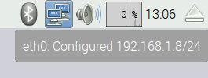
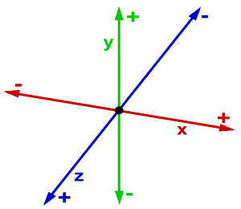
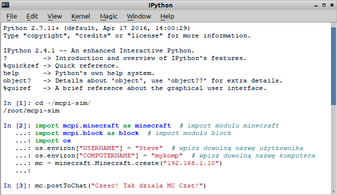
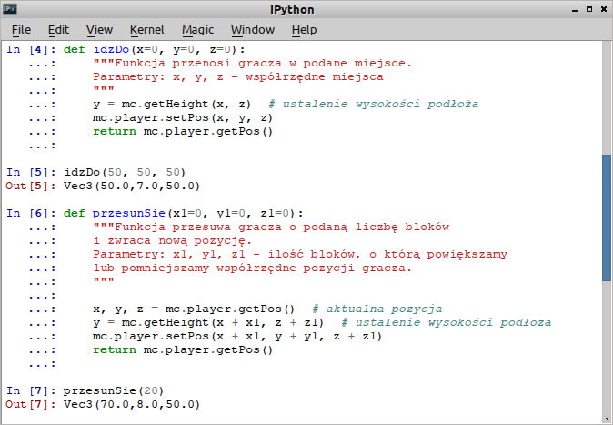
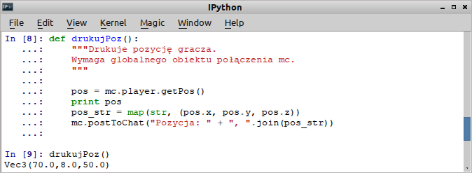
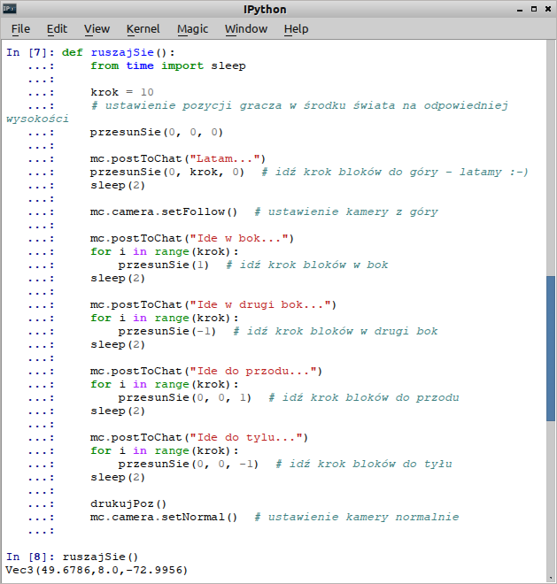
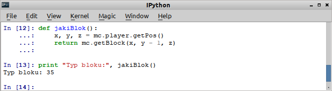
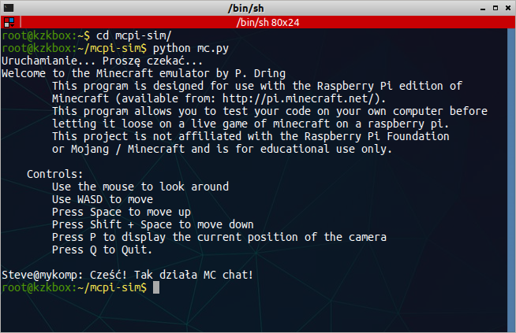
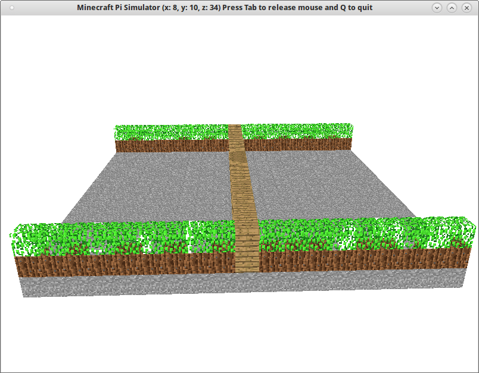

.. _mcpipodstawy:

Podstawy mcpi
#############

Połączenie z serwerem
=====================

Za pomocą wybranego edytora utwórz pusty plik, umieść w nim podany niżej kod i zapisz
w katalogu :file:`mcpi-sim` pod nazwą :file:`mcpi-podst.py`:

.. raw:: html

    
Kod nr 

.. highlight:: python
.. literalinclude:: mcpi-podst01.py
    :linenos:
    :lineno-start: 1
    :lines: 1-

Na początku importujemy moduły do obsługi Minecrafta i za pomocą instrukcji
``os.environ["ZMIENNA"]`` ustawiamy wymagane przez ``mcpi`` zmienne
środowiskowe z nazwami użytkownika i komputera:

.. note::

    Udany import wymaga, aby w katalogu ze skryptem znajdował się katalog :file:`mcpi`,
    z którego importujemy wymagane moduły. Jeżeli katalog ten byłby w innym folderze, np. :file:`biblioteki`,
    przed instrukcjami importu musielibyśmy wskazać ścieżkę do niego,
    np: ``sys.path.append("/home/user/biblioteki")``.

Po wykonaniu czynności wstępnych tworzymy podstawowy obiekt reprezentujący grę Minecraft:
``mc = minecraft.Minecraft.create("192.168.1.8")``.

.. tip::

	Adres IP serwera Minecrafta, czyli minikomputera Raspberry Pi, odczytamy po najechaniu myszą
	na ikonę połączenia sieciowego w prawym górnym rogu pulpitu (zob. zrzut poniżej). Możemy też wydać
	w terminalu polecenie ``ip addr`` i odczytać adres poprzedzony przedrostkiem *inet*
	dla interfejsu *eth0* (łącze kablowe) lub *wlan0* (łącze radiowe).

Na końcu w funkcji ``main()``, czyli głównej, wywołujemy metodę ``postToChat()``,
która pozwala wysłać i wyświetlić podaną wiadomość na czacie Minecrafta.

Skrypt uruchamiamy z poziomu edytora, jeśli to możliwe, lub wykonując w terminalu polecenie:

.. code-block:: bash

    ~/mcpi-sim$ python mcpi-podst.py

.. note::

	Omówiony kod (linie 4-14) stanowi **niezbędne minimum**, które **musi znaleźć się** w każdym skrypcie
	lub w sesji interpretera (konsoli), jeżeli chcemy widzieć efekty naszych działań
	na serwerze. Dla wygody kopiowania podajemy go w skondensowanej formie:

.. raw:: html

    
Kod nr 

.. highlight:: python
.. literalinclude:: mcpimin.py
    :linenos:
    :lines: 3-8

Świat Minecrafta Pi
===================

Świat Minecrafta Pi opisujemy za pomocą trójwymiarowego układu współrzędnych:

Obserwując położenie bohatera gry Steve'a zauważymy, że zmiany współrzędnej *x*
(klawisze :kbd:`A` i :kbd:`D`) i *z* (klawisze :kbd:`W` i :kbd:`S`) przesuwają postać
w lewo/prawo, do przodu/tyłu, czyli horyzontalnie, natomiast zmiany współrzędnej *y*
do góry/w dół - wertykalnie.

.. note::

	W Pi Edition wartości *x* i *y* ograniczono do przedziału [-128, 127].

**Ćwiczenie 1**

Uruchamiamy rozszerzoną konsolę Pythona i wchodzimy do katalogu :file:`mcpi-sim`:

.. code-block:: bash

	~$ ipython qtconsole
    In [1]: cd /root/mcpi-sim

.. tip::

	Podane polecenie można wpisać również w okienko "Uruchom" wywoływane w środowiskach
	linuksowych zazwyczaj przez skrót :kbd:`ALT+F2`.

	Zamiast rozszerzonej konsoli qt możemy użyć zwykłej konsoli ``ipython``
	lub podstawowego interpretera ``python`` uruchamianych w terminalu.
	Uwaga: jeżeli skorzystamy z interpretera podstawowego kod kopiujemy i wklejamy
	linia po linii.

Kopiujemy do okna konsoli, uruchamiamy omówiony powyżej "Kod 2", służący nawiązaniu połączenia z serwerem,
i wysyłamy wiadomość na czat:

Poznamy teraz kilka podstawowych metod pozwalających na manipulowanie światem Minecrafta.

Orientuj się Steve!
===================

Wpisz w konsoli poniższy kod:

.. code-block:: bash

    >>> mc.player.getPos()
    >>> x, y, z = mc.player.getPos()
    >>> print x, y, z
    >>> x, y, z = mc.player.getTilePos()
    >>> print x, y, z

Metoda ``getPos()`` obiektu ``player`` zwraca nam obiekt zawierający współrzędne określające
pozycję bohatera. Metoda ``getTitlePos()`` zwraca z kolei współrzędne bloku, na którym stoi
bohater. Instrukcje typu ``x, y, z = mc.player.getPos()`` rozpakowują kolejne współrzędne
do zmiennych *x*, *y* i *z*. Możemy wykorzystać je do zmiany położenia bohatera:

.. code-block:: bash

    >>> mc.player.setPos(x+10, y+20, z)

Powyższy kod przesunie bohatera w bok o 10 bloków i do góry na wysokość 20 bloków.
Podobnie zadziała kod ``mc.player.setTilePos(x+10, y+20, z)``, który przeniesie postać
na blok, którego pozycję podamy.

Idź i przesuń się
-----------------

Zadania takie możemy realizować za pomocą funkcji, które dodatkowo zwrócą nam nową pozycję.
W pliku :file:`mcpi-podst.py` umieszczamy kod:

.. raw:: html

    
Kod nr 

.. highlight:: python
.. literalinclude:: mcpi-podst.py
    :linenos:
    :lineno-start: 16
    :lines: 16-35

W pierwszej funkcji ``idzDo()`` warto zwrócić uwagę na metodę ``getHeight()``, która pozwala ustalić
wysokość świata w punkcie *x, z*, czyli współrzędną *y* najwyższego bloku nie będącego powietrzem.
Dzięki temu umieścimy bohatera zawsze na jakiejś powierzchni, a nie np. pod ziemią ;-).
Druga funkcja ``przesunSie()`` nie tyle umieszcza, co przesuwa postać, stąd dodatkowe instrukcje.

Dopisz wywołanie ``print idzDo(50, 0, 50)`` w funkcji ``main()`` przed instrukcją ``return``
i przetestuj kod uruchamiając skrypt :file:`mcpi-podst.py` lub w konsoli. Później dopisz również
drugą funkcję ``print przesunSie(20)`` i sprawdź jej działanie.

**Ćwiczenie 2**

Sprawdź, co się stanie, kiedy podasz współrzędne większe niż świat Minecrafta.
Zmień kod obydwu funkcji na "bezpieczny dla życia" ;-)

Gdzie jestem?
-------------

Aby odczytywać i drukować pozycję bohatera dodamy kolejną funkcję do pliku :file:`mcpi-podst.py`:

.. raw:: html

    
Kod nr 

.. highlight:: python
.. literalinclude:: mcpi-podst.py
    :linenos:
    :lineno-start: 38
    :lines: 38-46

Funkcja nie tylko drukuje koordynaty w konsoli (``print x, y, z``), ale również –
po przekształceniu ich na listę wartości typu string ``pos_str = map(str, pos_list)`` –
wysyła jako komunikat na czat Minecrafta. Wywołanie funkcji dopisujemy do funkcji głównej
i testujemy kod:

Więcej ruchu
------------

Teraz możemy trochę pochodzić, ale będziemy obserwować to z lotu ptaka. Dopiszmy kod poniższej
funkcji do pliku :file:`mcpi-podst.py`:

.. raw:: html

    
Kod nr 

.. highlight:: python
.. literalinclude:: mcpi-podst.py
    :linenos:
    :lineno-start: 49
    :lines: 49-83

Warto zauważyć, jak pętla ``for i in range(krok)`` umożliwia symulowanie ruchu postaci.
Wywołanie funkcji dodajemy do funkcji głównej. Kod testujemy uruchamiając skrypt lub w konsoli.

Po czym chodzę?
---------------

Teraz spróbujemy dowiedzieć się, po jakich blokach chodzimy. Definiujemy jeszcze jedną funkcję:

.. raw:: html

    
Kod nr 

.. highlight:: python
.. literalinclude:: mcpi-podst.py
    :linenos:
    :lineno-start: 86
    :lines: 86-88

Dopisujemy jej wywołanie: ``print "Typ bloku: ", jakiBlok()`` – w funkcji głównej i testujemy.

.. _mcpiplac:

Plac budowy
============

Skoro orientujemy się już w przestrzeni, możemy zacząć budować. Na początku wykorzystamy
**symulator**. Rozpoczniemy od przygotowania placu budowy.
Posłuży nam do tego odpowiednia funkcja, którą umieścimy w pliku :file:`mcsim.py`:

.. raw:: html

    
Kod nr 

.. highlight:: python
.. literalinclude:: mcsim01.py
    :linenos:
    :lineno-start: 1
    :lines: 1-

Funkcja ``plac()`` korzysta z metody ``setBlocks(x0,y0,z0,x1,y1,z1,blockType, blockData)``,
która wypełnia obszar w przedziałach [*x0-x1*], [*y0-y1*], [*z0-z1*] blokiem podanego typu
o opcjonalnych właściwościach. Na początku tworzymy "podłogę" z kamienia,
później wypełniamy sześcian o podanym rozmiarze powietrzem. W symulatorze nie jest to przydatne,
ale bardzo przydaje się do "wyczyszczenia" miejsca w świecie Minecrafta.
Opcjonalnie możemy umieścić gracza w środku utworzonego obszaru.

Kod testujemy uruchamiając skrypt :file:`mcsim.py`:

.. code-block:: bash

    ~/mcpi-sim$ python mcsim.py

.. warning::

	Skrypt :file:`mcsim.py` musi znajdować się w katalogu :file:`mcpi-sim` ze źródłami symulatora,
	który wykorzystuje specjalne wersje bibliotek *minecraft* i *block* z podkatalogu :file:`local`.

Klawisze sterujące podglądem symulacji widoczne są w terminalu:

Umieszczanie bloków
===================

W pliku :file:`mcsim.py` przed funkcją główną (``main()``) umieszczamy funkcję ``buduj()``:

.. raw:: html

    
Kod nr 

.. highlight:: python
.. literalinclude:: mcsim02.py
    :linenos:
    :lineno-start: 37
    :lines: 37-42

Używamy podstawowej metody ``setBlock(x, y, z, blockType)``, która w podanych koordynatach
umieszcza określony blok. Wywołanie funkcji ``buduj()`` dodajemy do ``main()`` po funkcji ``plac()``
i testujemy. Ponad "podłogą" powinien znaleźć się zielony blok.

Do rysowania bloków można użyć pętli. Zmieniamy funkcję ``buduj()`` następująco:

.. raw:: html

    
Kod nr 

.. highlight:: python
.. literalinclude:: mcsim03.py
    :linenos:
    :lineno-start: 37
    :lines: 37-50

Teraz plac powinien wyglądać, jak poniżej:

**Ćwiczenie 3**

Odpowiednio modyfikując funkcję ``buduj()`` skonstruuj:

- kwadrat 2D
- prostokąt 2D
- słup
- bramę, czyli prostokąt 3D
- sześcian

Przykłady
=========

Zapisz skrypt :file:`mcsim.py` pod nazwą :file:`mcpi-test.py` i dostosuj go do uruchomienia
na serwerze *MC Pi*. W tym celu zamień ciąg "local" w importach na "mcpi"
oraz podaj adres IP serwera *MC Pi* w poleceniu tworzącym połączenie.
Następnie umieść w pliku kody poniższych funkcji i po kolei je przetestuj dodając
ich wywołania w funkcji głównej.

Zostawiam ślady
---------------

.. raw:: html

    
Kod nr 

.. highlight:: python
.. literalinclude:: mcpi-slad.py
    :linenos:
    :lineno-start: 17
    :lines: 17-39

Buduję pomnik
-------------

.. raw:: html

    
Kod nr 

.. highlight:: python
.. literalinclude:: mcpi-pomnik.py
    :linenos:
    :lineno-start: 38
    :lines: 38-52

Piramida
--------

.. raw:: html

    
Kod nr 

.. highlight:: python
.. literalinclude:: mcpi-piramida.py
    :linenos:
    :lineno-start: 37
    :lines: 37-55

**Źródła:**

* :download:`Skrypty mcpi podstawy <mcpi-podst.zip>`
