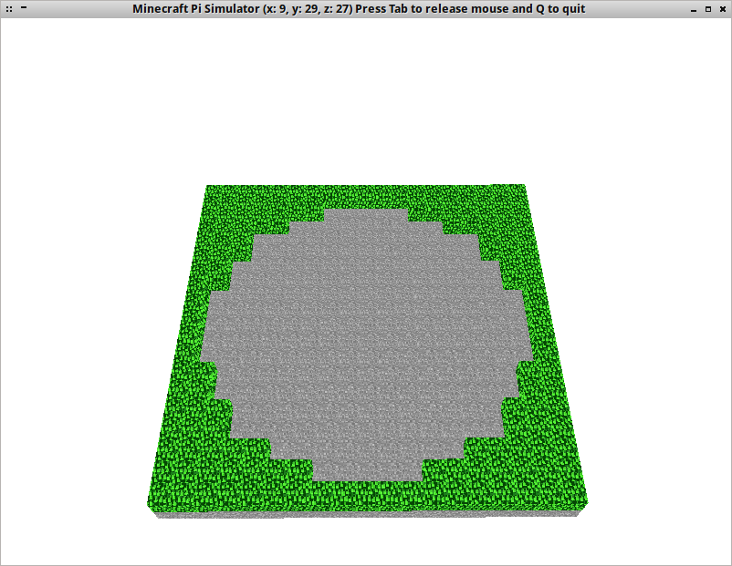
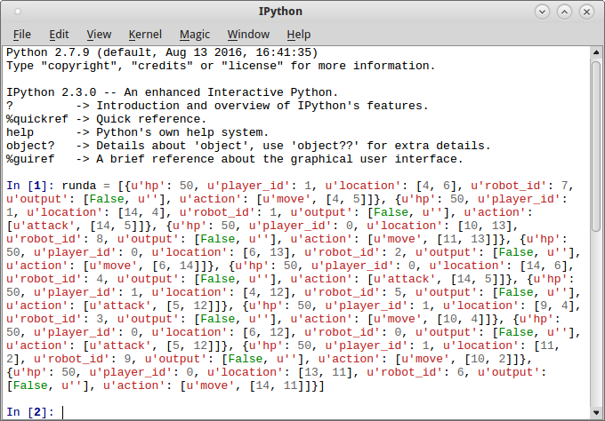
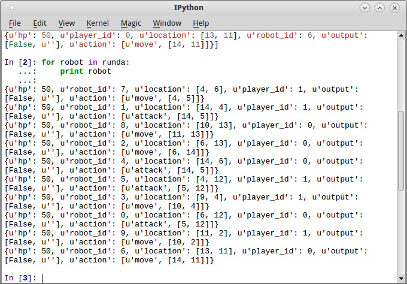
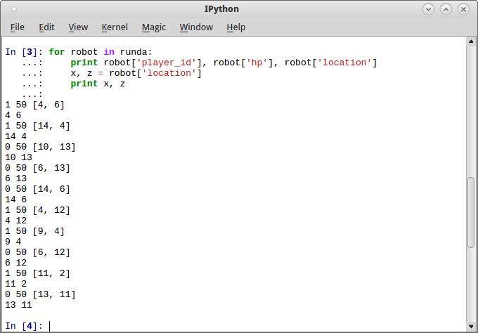
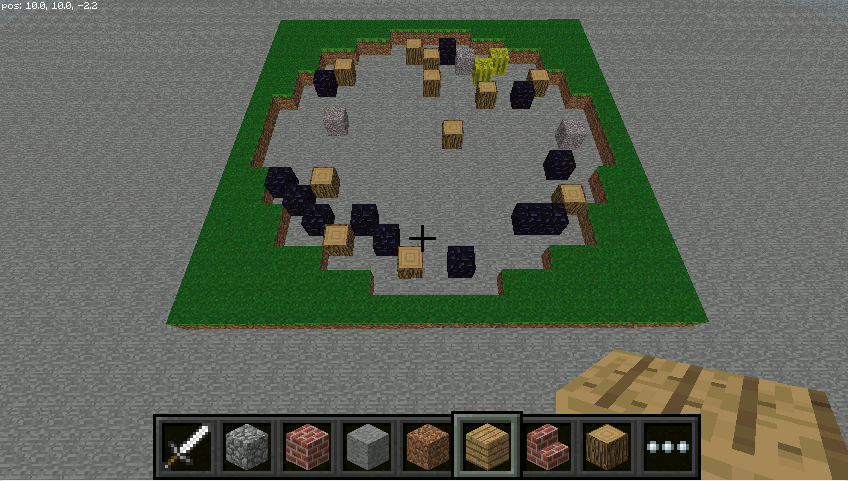
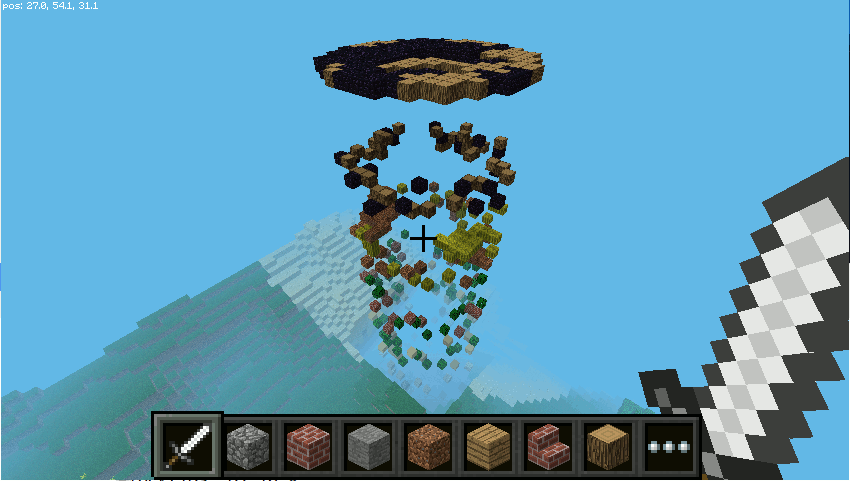
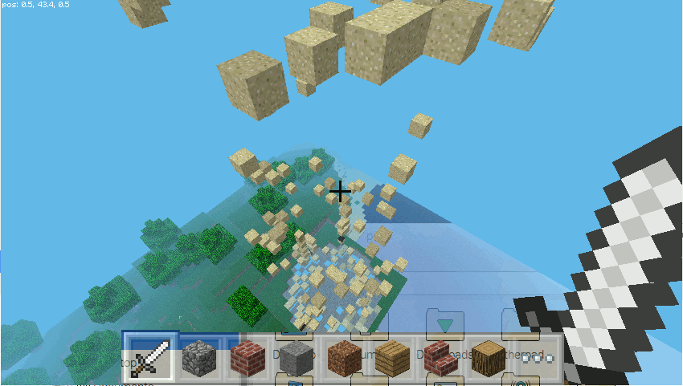
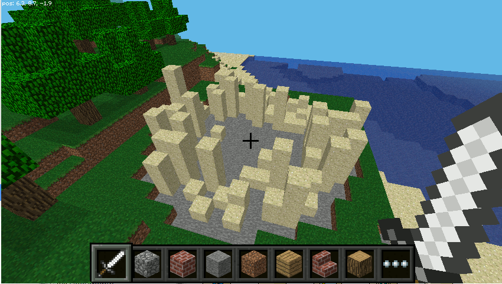
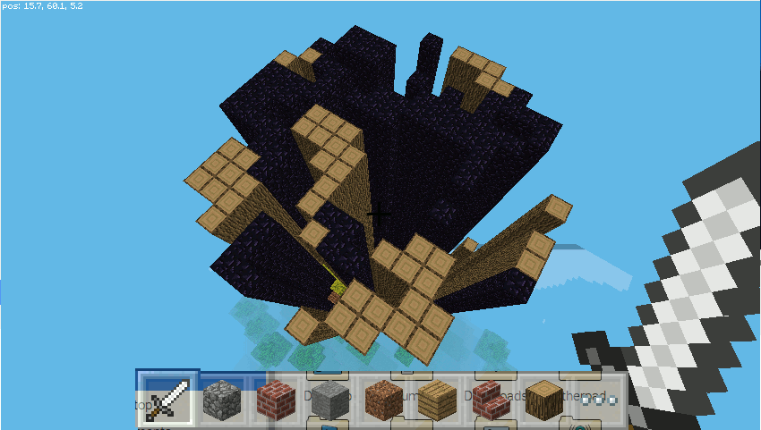

.. _mcpi-rg:

Gra robotów
###########

Pole gry
========

Spróbujemy teraz pokazać rozgrywkę z :ref:`gry robotów <robot-game>`.
Zaczniemy od zbudowania areny wykorzystywanej w grze. W pliku :file:`mcpi-rg.py` umieszczamy następujący kod:

.. raw:: html

    
Kod nr 

.. highlight:: python
.. literalinclude:: mcpi-rg01.py
    :linenos:
    :lineno-start: 1
    :lines: 1-

Zaczynamy od definicji klasy *GraRobotow*, której instancję tworzymy w funkcji
głównej ``main()`` i przypisujemy do zmiennej: ``gra = GraRobotow(mc)``.
Konstruktor klasy wywołuje metodę ``poleGry()``, która buduje pusty plac
i arenę, na której walczą roboty.

Pole gry wpisane jest w kwadrat o boku 19 jednostek. Część pól kwadratu
wyłączona jest z rozgrywki, ich współrzędne zawiera lista ``obstacle``.
Funkcja ``poleGry()`` wykorzystuje dwie zagnieżdżone pętle, w których zmienne
iteracyjne *i*, *j* przyjmują wartości od 0 do 18, wyznaczając wszystkie pola
kwadratu. Jeżeli dane pole zawarte jest w liście pól wyłączonych ``if (i, j) in obstacle``,
umieszczamy w nim blok trawy – wyznaczą one granice planszy. W przeciwnym
wypadku dołączamy współrzędne pola w postaci tupli do listy pól dozwolonych:
``self.plansza.append((x + i, z + j))``. Wykorzystamy tę listę później
do "czyszczenia" pola gry.

Po uruchomieniu powinniśmy zobaczyć plac gry, a w konsoli listę pól,
na których będą walczyć roboty.

Dane gry
========

Dane gry, czyli zapis 100 rund rozgrywki zawierający m. in. informacje o położeniu
robotów oraz ich sile (punkty *hp*) musimy wygenerować uruchamiając walkę
gotowych lub napisanych przez nas robotów.

W tym celu trzeba zmodyfikować bibliotekę ``game.py`` z pakietu ``rgkit``. Jeżeli
korzystałeś z naszego :ref:`scenariusza <robot-game>` i zainstalowałeś ``rgkit``
w :ref:`wirtualnym środowisku <rg-env>` :file:`~/robot/env`, plik ten znajdziesz
w ścieżce :file:`~/robot/env/lib/python2.7/site-packages/rgkit/game.py`.
Na końcu funkcji ``run_all_turns()`` po linii nr 386 wstawiamy podany niżej kod:

.. code-block:: python

    # BEGIN DODANE na potrzeby Kzk
    import json
    plik = open('lastgame.log', 'w')
    json.dump(self.history, plik)
    plik.close()
    # END OF DODANE

Następnie po wywołaniu przykładowej walki: ``(env) root@kzk:~/robot$ rgrun bots/stupid26.py bots/Wall-E.py``
w katalogu :file:`~/robot` znajdziemy plik :file:`lastgame.log`,
który musimy umieścić w katalogu ze skryptem :file:`mcpi-rg.py`.

Do definicji klasy ``GraRobotow`` w pliku :file:`mcpi-rg.py` dodajemy metodę ``uruchom()``:

.. raw:: html

    
Kod nr 

.. highlight:: python
.. literalinclude:: mcpi-rg02.py
    :linenos:
    :lineno-start: 61
    :lines: 61-81
    :emphasize-lines: 20

Omawianą metodę wywołujemy w funkcji głównej ``main()`` przekazując jej jako parametry
nazwę pliku z zapisem rozgrywki oraz ilość rund do pokazania: ``gra.uruchom("lastgame.log", 10)``.

W samej metodzie zaczynamy od sprawdzenia, czy podany plik istnieje
w katalogu ze skryptem. Jeżeli nie istnieje (``if not os.path.exists(plik):``)
drukujemy komunikat i wychodzimy z funkcji.

Jeżeli plik istnieje, otwieramy go w trybie tylko do odczytu.
Dalej, ponieważ dane gry zapisane są w formacie *json*,
w pętli ``for runda in json.load(plik):`` dekodujemy jego zawartość
wykorzystując metodę ``load()`` modułu *json*.
Instrukcja ``print runda`` pokaże nam w konsoli format danych kolejnych rund.

Po uruchomieniu kodu widzimy, że każda runda to lista zawierająca słowniki
określające właściwości poszczególnych robotów.

.. figure:: img/mcpi-rg02.png

**Ćwiczenie 1**

Skopiuj z konsoli dane jednej z rund, uruchom konsolę IPython Qt i wklej do
niej.

Następnie przećwicz wydobywanie słowników z listy:

– oraz wydobywanie konkretnych danych ze słowników, a także rozpakowywanie tupli
(``robot['location']``) określających położenie robota:

Pokaż rundę
===========

Słowniki opisujące roboty walczące w danej rundzie zawierają m.in.
identyfikatory gracza, położenie robota oraz jego ilość punktów *hp*.
Wykorzystamy te informacje w funkcji ``pokazRunde()``.

Klasę *GraRobotow* w pliku :file:`mcpi-rg.py` uzupełniamy dwoma metodami:

.. raw:: html

    
Kod nr 

.. highlight:: python
.. literalinclude:: mcpi-rg03.py
    :linenos:
    :lineno-start: 77
    :lines: 77-92

W metodzie ``pokazRunde()`` na początku czyścimy pole gry, czyli wypełniamy je
blokami powietrza – to zadanie funkcji ``czyscPole()``. Jak widać, wykorzystuje ona
stworzoną wcześniej listę dozwolonych pól. Kolejne tuple współrzędnych odczytujemy
w pętli ``for xz in self.plansza:`` i rozpakowujemy ``x, z = xz``.

Po wyczyszczeniu pola gry, z danych rundy przekazanych do metody ``pokazRunde()``
odczytujemy w pętli ``for robot in runda:`` słowniki opisujące kolejne roboty.

W skróconej instrukcji warunkowej sprawdzamy identyfikator gracza: ``if robot['player_id']``.
Jeżeli wynosi 1 (jeden), roboty będą oznaczane blokami bawełny, jeżeli 0 (zero)
– blokami drewna.

Następnie z każdego słownika rozpakowujemy tuplę określającą położenie robota:
``x, z = robot['location']``. W uzyskanych współrzędnych umieszczamy ustalony
dla gracza typ bloku.

Dodatkowo drukujemy kolejne dane w konsoli ``print robot['player_id'], blok, x, z``.

Zanim uruchomimy kod, musimy jeszcze zamienić instrukcję ``print runda`` w metodzie
``uruchom()`` na wywołanie omówionej funkcji:

.. raw:: html

    
Kod nr 

.. highlight:: python
.. literalinclude:: mcpi-rg03.py
    :linenos:
    :lineno-start: 70
    :lines: 70-75
    :emphasize-lines: 3

Po uruchomieniu kodu powinniśmy zobaczyć już rozgrywkę:

.. figure:: img/mcpi-rg03.png

Kolory
======

Takie same bloki wykorzystywane do pokazywania ruchów robotów obydwu graczy nie
wyglądają zbyt dobrze. Spróbujemy odróżnić od siebie obydwie drużyny i pokazać,
że roboty w starciach tracą siłę, czyli punkty życia *hp*.

Do definicji klasy *GraRobotow* dodajemy jeszcze jedną metodę o nazwie
``wybierzBlok()``:

.. raw:: html

    
Kod nr 

.. highlight:: python
.. literalinclude:: mcpi-rg04.py
    :linenos:
    :lineno-start: 94
    :lines: 94-100

Metoda definiuje dwie tuple, po jednej dla każdego gracza, zawierające zestawy
bloków używane do wyświetlenia robotów danej drużyny. Dobór typów w tuplach jest
oczywiście czysto umowny.

Siła robotów (*hp*) przyjmuje wartości od 0 do 50, dzieląc tę wartość całkowicie
przez 10, otrzymujemy liczby od 0 do 5, które wykorzystamy jako indeksy wskazujące
typ bloku przeznaczony do wyświetlenia robota danego zawodnika.

Skrócona instrukcja warunkowa ``player1_bloki[hp / 10] if player_id else player2_bloki[hp / 10]``
bada wartość identyfikatora gracza ``if player_id`` i zwraca ``player1_bloki[hp / 10]``,
jeżeli wynosi on 1 (jeden) oraz ``player2_bloki[hp / 10]`` jeżeli równa się 0 (zero).

Pozostaje jeszcze zastąpienie instrukcji ``blok = block.WOOL if robot['player_id'] else block.WOOD``
w metodzie ``pokazRunde()`` wywołaniem omówionej funkcji, czyli:

.. raw:: html

    
Kod nr 

.. highlight:: python
.. literalinclude:: mcpi-rg04.py
    :linenos:
    :lineno-start: 80
    :lines: 80-84
    :emphasize-lines: 2

.. figure:: img/mcpi-rg04.png

Trzeci wymiar
=============

**Ćwiczenia**

Warto poeksperymentować z wizualizacją gry wykorzystując trójwymiarowość Minecrafta.
Można uzyskać spektakularne rezulaty. Poniżej kilka sugestii.

- Stosunkowo łatwo urozmaicić wizualizację gry używając wartości *hp* (siła robota)
  jako współrzędnej określającej położenie bloku w pionie. Wystarczy zmienić instrukcję
  ``self.mc.setBlock(x, 0, z, blok)`` w funkcji ``pokazRunde()``.

- Jeżeli udało ci się wprowadzić powyższą poprawkę i bloki umieszczame są na różnej wysokości,
  można zmienić typ umieszczanych bloków na piasek (``SAND``).

- Można spróbować wykorzystać omawianą w scenariuszu :ref:`Figury 2D i 3D <mcpifigury>`
  bibliotekę `minecraftstuff <http://www.stuffaboutcode.com/2013/11/coding-shapes-in-minecraft.html>`_.
  Wykorzystując funkcję ``drawLine()`` oraz wartość siły robotów ``robot['hp']`` jako
  współrzędną określającą położenie bloku w pionie, można rysować kolejne rundy
  w postaci słupków.

.. note::

    Dziękujemy uczestnikom szkolenia przeprowadzonego w ramach programu "Koduj z Klasą"
    w Krakowie (03.12.2016 r.), którzy zgłosili powyższe pomysły i sugestie.

**Źródła:**

* :download:`Skrypty mcpi-rg <mcpi-rg.zip>`
* :download:`Log RG <lastgame.zip>`