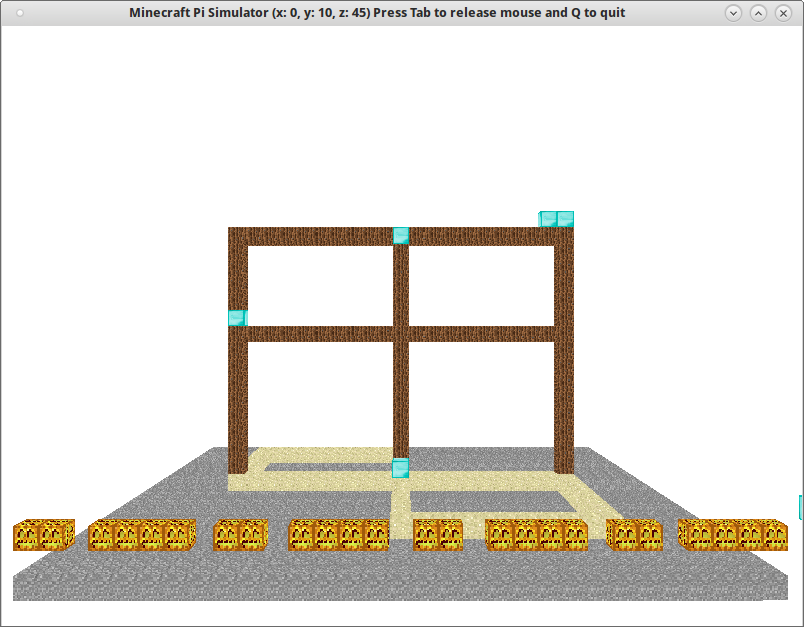
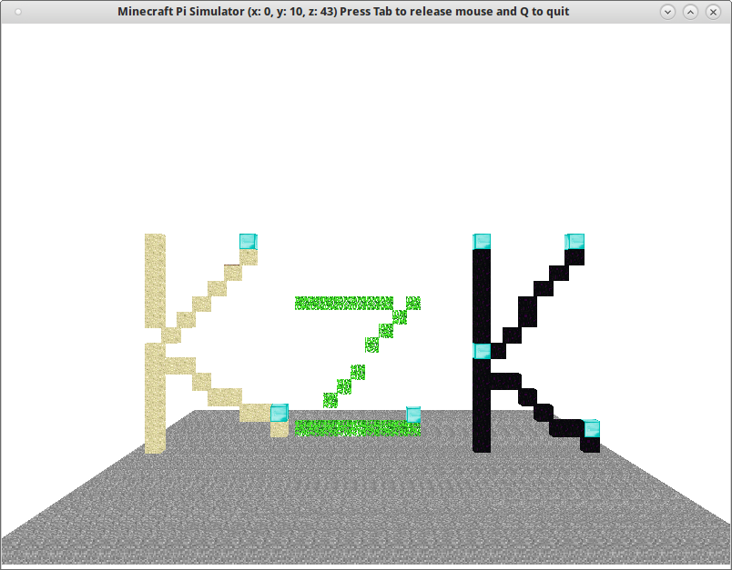

.. _mcpiturtle:

Żółw w przestrzeni
###################

Bilioteka `minecraftturtle <http://www.stuffaboutcode.com/2014/05/minecraft-graphics-turtle.html>`_
implementuje tzw. grafikę zółwia (ang. *turtle graphics*) w trzech wymiarach. W praktyce ułatwia więc
budowanie konstrukcji przestrzennych. Inspirowana jest wbudowaną w Pythona biblioteką
`turtle <https://docs.python.org/2/library/turtle.html>`_, często wykorzystywaną do
nauki programowania najmłodszych. Poniżej pokażemy, jak poruszać się "żółwiem" w przestrzeni.

**Instalacja**

Symulator ``mcpi-sim`` domyślnie nie działa z omawianą biblioteką i wymaga modyfikacji.
Zmienione pliki oraz omawianą bibliotekę umieściliśmy w archiwum
:download:`mcpi-sim-fix.zip <../mcpi-sim-fix.zip>`, które po ściągnięciu
należy rozpakować do katalogu :file:`~/mcpi-sim/local` nadpisując oryginalne pliki.

Kwadraty
=========

W pustym pliku :file:`mcsim-turtle.py` umieszczamy kod:

.. raw:: html

    
Kod nr 

.. highlight:: python
.. literalinclude:: mcsim-turtle01.py
    :linenos:
    :lineno-start: 1
    :lines: 1-
    :emphasize-lines: 41-56

Początek kodu omawialiśmy już w :ref:`Podstawach <mcpipodstawy>`. W podświetlonym fragmencie
przede wszystkim importujemy omawianą bibliotekę oraz klasę *Vec3* reprezentującą położenie
w MC. Polecenie ``turtle = mcturtle.MinecraftTurtle(mc, start)`` tworzy obiekt "żółwia",
którym będziemy mogli sterować za pomocą kilku metod.

[todo]

Okna
======

Do funkcji ``main()`` dopisujemy:

.. raw:: html

    
Kod nr 

.. highlight:: python
.. literalinclude:: mcsim-turtle.py
    :linenos:
    :lineno-start: 58
    :lines: 58-76

[todo]

Litery
=======

Napisz kod, który zbuduje napis "KzK" podobny do pokazanego niżej.

