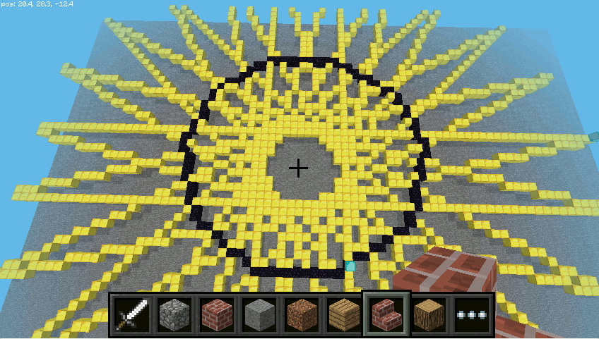

.. _mcpiturtle:

Żółw w przestrzeni
###################

Biblioteka `minecraftturtle <http://www.stuffaboutcode.com/2014/05/minecraft-graphics-turtle.html>`_
implementuje tzw. grafikę żółwia (ang. *turtle graphics*) w trzech wymiarach. W praktyce ułatwia więc
budowanie konstrukcji przestrzennych. Inspirowana jest wbudowaną w Pythona biblioteką
`turtle <https://docs.python.org/2/library/turtle.html>`_, często wykorzystywaną do
nauki programowania najmłodszych. Poniżej pokażemy, jak poruszać się "żółwiem" w przestrzeni.

Kwadraty
=========

W pustym pliku :file:`mcsim-turtle.py` umieszczamy kod:

.. raw:: html

    
Kod nr 

.. highlight:: python
.. literalinclude:: mcsim-turtle01.py
    :linenos:
    :lineno-start: 1
    :lines: 1-
    :emphasize-lines: 7-8, 14-15, 39-49, 55

Początek kodu omawialiśmy już w :ref:`Podstawach <mcpipodstawy>`. W podświetlonym fragmencie
przede wszystkim importujemy omawianą bibliotekę oraz klasę *Vec3* reprezentującą położenie
w MC. Polecenie ``turtle = mcturtle.MinecraftTurtle(mc, start)`` tworzy obiekt "żółwia" w podanym
położeniu (``start = Vec3(0, 1, 0)``).

Żółwiem sterujemy za pomocą m.in. następujących metod:

- ``speed()`` – ustawia prędkość budowania: 0 – brak animacji, 1 – b. wolno, 10 – najszybciej;
- ``penblock()`` – określamy blok, którym rysujemy ślad;
- ``forward(x)`` – idź do przodu o *x* "kroków";
-  ``right(x)``, ``left(x)`` – obróć się w prawo/lewo o *x* stopni;

Wywołanie przykładowej funkcji ``kwadraty()`` umieszczamy w funkcji głównej i testujemy kod.

Okna
======

Przed funkcją główną ``main()`` dopisujemy kolejną przykładową funkcję:

.. raw:: html

    
Kod nr 

.. highlight:: python
.. literalinclude:: mcsim-turtle.py
    :linenos:
    :lineno-start: 52
    :lines: 52-71

W podanym kodzie mamy kilka nowych metod:

- ``setposition(x, y, z)`` – ustawia "żółwia" na podanej pozycji;
- ``up(x)`` – obróć się do góry o *x* stopni;
- ``down(x)`` – obróć się w dół o *x* stopni;

Dopisz wywołanie funkcji ``okna()`` do funkcji głównej i wykonaj skrypt.

Szlaczek
========

Jeszcze jedna funkcja przed funkcją ``main()``:

.. raw:: html

    
Kod nr 

.. highlight:: python
.. literalinclude:: mcsim-turtle.py
    :linenos:
    :lineno-start: 74
    :lines: 74-88

Nowe metody to:

- ``setx(x)``, ``setx(y)``, ``setx(z)`` – metody ustawiają składowe pozycji;
  jest też metoda ``position()``, która zwraca pozycję;
- ``penup()``, ``pendown()`` – podniesienie/opuszczenie "pędzla", dodatkowo funkcja ``isdown()``
  sprawdza, czy pędzel jest opuszczony.

Po wywołaniu kolejno w funkcji głównej wszystkich powyższych funkcji otrzymamy następującą
budowlę:

.. figure:: img/mcsim-turtle.png

**Ćwiczenia**

1. Napisz kod, który zbuduje napis "KzK" podobny do pokazanego niżej.

.. figure:: img/mcsim-turtKzK.png

2. Napisz kod, który zbuduje sześcian. Przekształć go w funkcję,
   która buduje sześcian o podanej długości boku z podanego punktu.

Przykłady
==========

Prawdziwie widowiskowe efekty uzyskamy przy wykorzystaniu pętli.
Zapisz skrypt :file:`mcsim-turtle.py` pod nazwą :file:`mcpi-turtle.py` i dostosuj go do uruchomienia
na serwerze *MC Pi*. W tym celu zamień ciąg "local" w importach na "mcpi"
oraz podaj adres IP serwera *MC Pi* w poleceniu tworzącym połączenie.
Następnie umieść w pliku kody poniższych funkcji i po kolei je przetestuj dodając
ich wywołania w funkcji głównej.

.. raw:: html

    
Kod nr 

.. highlight:: python
.. literalinclude:: mcpi-turtle.py
    :linenos:
    :lineno-start: 91
    :lines: 91-122

