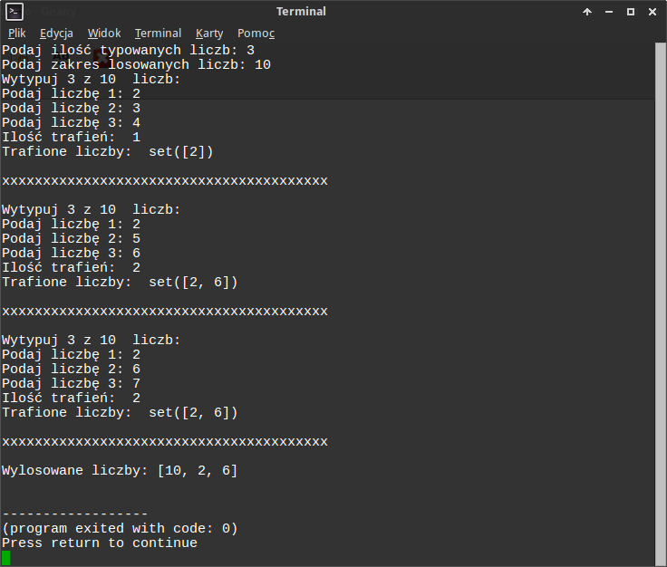

.. _duzy-lotek:

Duży Lotek
##########

Zakładamy, że znasz już podstawy podstaw :-) Pythona, czyli scenariusz :ref:`Mały Lotek <maly-lotek>`.

Jedna liczba to za mało, wylosujmy ich więcej! Zasady dużego lotka to typowanie
6 liczb z 49. Ponieważ trafienie jest tu bardzo trudne, napiszemy program
w taki sposób, aby można było łatwo dostosować poziom jego trudności.

**Na początek**

1. Utwórz nowy plik :file:`toto2.py` i uzupełnij go wymaganymi liniami
   wskazującymi interpreter pythona i użyte kodowanie.

2. Wykorzystując funkcje ``input()`` oraz ``int()`` pobierz od użytkownika ilość liczb,
   które chce odgadnąć i zapisz wartość w zmiennej ``ileliczb``.

3. Podobnie jak wyżej pobierz od użytkownika i zapisz maksymalną losowaną liczbę w zmiennej ``maksliczba``.

4. Na koniec wyświetl w konsoli komunikat "Wytypuj *ileliczb* z *maksliczba* liczb: ".

.. tip::

    Do wyświetlenia komunikatu można użyć konstrukcji: ``print("Wytypuj", ileliczb, "z", maksliczba, " liczb: ")``.
    Jednak wygodniej korzystać z operatora ``%``. Wtedy instrukcja przyjmie postać:
    ``print("Wytypuj %s z %s liczb: " % (ileliczb, maksliczba))``. Symbole zastępcze ``%s``
    zostaną zastąpione kolejnymi wartościami z listy podanej po operatorze ``%``.
    Najczęściej używamy symboli: ``%s`` – wartość zostaje zamieniona na napis przez funkcję
    ``str()``; ``%d`` – wartość ma być dziesiętną liczbą całkowitą; ``%f`` – oczekujemy liczby
    zmiennoprzecinkowej.

Listy
******

Ćwiczenie
==========

Jedną wylosowaną liczbę zapamiętywaliśmy w jednej zmiennej, ale przechowywanie
wielu wartości w osobnych zmiennych nie jest dobrym pomysłem. Najwygodniej
byłoby mieć jedną zmienną, w której można zapisać wiele wartości. W Pythonie
takim złożonym typem danych jest :term:`lista`.

Przetestuj w interpreterze następujące polecenia:

.. code-block:: bash

    ~$ python3
    >>> liczby = []
    >>> liczby
    >>> liczby.append(1)
    >>> liczby.append(2)
    >>> liczby.append(4)
    >>> liczby.append(4)
    >>> liczby
    >>> liczby.count(1)
    >>> liczby.count(4)
    >>> liczby.count(0)

.. tip::

    Klawisze kursora (góra, dół) służą w terminalu do przywoływania poprzednich
    poleceń. Każde przywołane polecenie możesz przed zatwierdzeniem
    zmienić używając klawiszy lewo, prawo, del i backspace.

Jak widać po zadeklarowaniu pustej listy (``liczby = []``), metoda ``.append()``
pozwala dodawać do niej wartości, a metoda ``.count()`` podaje, ile razy
dana wartość wystąpiła w liście. To się nam przyda ;-)

Wróćmy do programu i pliku :file:`toto2.py`, który powinien w tym momencie wyglądać tak:

.. raw:: html

    
Kod nr 

.. highlight:: python
.. literalinclude:: toto21.py
    :linenos:
    :lineno-start: 1
    :lines: 1-

Kodujemy dalej. Użyj pętli:

* dodaj instrukcję ``for``, aby wylosować ``ileliczb`` z zakresu ograniczonego przez ``maksliczba``;
* kolejne losowane wartości drukuj w terminalu;
* sprawdź działanie kodu.

Trzeba zapamiętać losowane wartości:

* przed pętlą zadeklaruj pustą listę;
* wewnątrz pętli umieść polecenie dodające wylosowane liczby do listy;
* na końcu programu (uwaga na wcięcia) wydrukuj zawartość listy;
* kilkukrotnie przetestuj program.

Pętla while
***********

Czy lista zawsze zawiera akceptowalne wartości?

.. figure:: img/toto22_0.png

Pętla ``for`` nie nadaje się do losowania unikalnych liczb, ponieważ wykonuje się określoną ilość razy,
a nie możemy zagwarantować, że losowane liczby będą za każdym razem inne.
Do wylosowania podanej ilości liczb wykorzystamy więc pętlę ``while wyrażenie_logiczne:``,
która powtarza kod dopóki podane wyrażenie jest prawdziwe.
Uzupełniamy kod w pliku :file:`toto2.py`:

.. raw:: html

    
Kod nr 

.. highlight:: python
.. literalinclude:: toto22.py
    :linenos:
    :emphasize-lines: 10-19
    :lineno-start: 1
    :lines: 1-

Losowane liczby zapamiętujemy w **liście** ``liczby``. Zmienna ``i`` to
licznik unikalnych wylosowanych liczb, korzystamy z niej w wyrażeniu
warunkowym ``i < ileliczb``, które kontroluje powtórzenia pętli. W instrukcji
warunkowej wykorzystujemy funkcję zliczającą wystąpienia wylosowanej wartości
w liście (``liczby.count(liczba)``), aby dodawać (``liczby.append(liczba)``)
do listy tylko liczby wcześniej niedodane.

Zbiory
******

Przy pobieraniu typów użytkownika użyjemy podobnie jak przed chwilą pętli
``while``, ale typy zapisywać będziemy w zbiorze, który z założenia nie
może zawierać duplikatów (zob. :term:`zbiór`).

Ćwiczenie
=========

W interpreterze Pythona przetestuj następujące polecenia:

.. code-block:: bash

    ~$ python3
    >>> typy = set()
    >>> typy.add(1)
    >>> typy.add(2)
    >>> typy
    >>> typy.add(2)
    >>> typy
    >>> typy.add(0)
    >>> typy.add(9)
    >>> typy

Pierwsza instrukcja deklaruje pusty zbiór (``typy = set()``). Metoda ``.add()``
dodaje do zbioru elementy, ale nie da się dodać dwóch takich samych elementów.
Drugą cechą zbiorów jest to, że ich elementy nie są w żaden sposób uporządkowane.

Wykorzystajmy zbiór, aby pobrać od użytkownika typy liczb. W pliku
:file:`toto2.py` dopisujemy:

.. raw:: html

    
Kod nr 

.. highlight:: python
.. literalinclude:: toto23.py
    :linenos:
    :lineno-start: 20
    :lines: 20-27

Zauważ, że operator ``in`` pozwala sprawdzić, czy podana liczba
jest (``if typ in typy``) lub nie (``if typ not in typy:``) w zbiorze.
Przetestuj program.

Operacje na zbiorach
********************

Określenie ilości trafień w większości języków programowania wymagałoby
przeszukiwania listy wylosowanych liczb dla każdego podanego typu. W Pythonie
możemy użyć arytmetyki zbiorów: wyznaczymy część wspólną.

Ćwiczenie
==========

W interpreterze przetestuj poniższe instrukcje:

.. code-block:: bash

    ~$ python3
    >>> liczby = [1,3,5,7,9]
    >>> typy = set([2,3,4,5,6])
    >>> set(liczby) | typy
    >>> set(liczby) - typy
    >>> trafione = set(liczby) & typy
    >>> trafione
    >>> len(trafione)

Polecenie ``set(liczby)`` przekształca listę na zbiór. Kolejne operatory
zwracają sumę (``|``), różnicę (``-``) i iloczyn (``&``), czyli część
wspólną zbiorów. Ta ostania operacja bardzo dobrze nadaje się do sprawdzenia,
ile liczb trafił użytkownik. Funkcja ``len()`` zwraca ilość elementów
każdej sekwencji, czyli np. napisu, listy czy zbioru.

Do pliku :file:`toto2.py` dopisujemy:

.. raw:: html

    
Kod nr 

.. highlight:: python
.. literalinclude:: toto24.py
    :linenos:
    :lineno-start: 31
    :lines: 31-36

Instrukcja ``if trafione:`` sprawdza, czy część wspólna zawiera jakiekolwiek elementy.
Jeśli tak, drukujemy liczbę trafień i trafione liczby.

Przetestuj program dla 5 typów z 10 liczb. Działa? Jeśli masz wątpliwości,
wpisz wylosowane i wytypowane liczby w interpreterze, np.:

.. code-block:: bash

    >>> liczby = [1,4,2,6,7]
    >>> typy = set([1,2,3,4,5])
    >>> trafione = set(liczby) & typy
    >>> if trafione:
    ...   print(len(trafione))
    ...
    >>> print(trafione)

Wnioski? Logika kodu jest poprawna, czego dowodzi test w terminalu, ale
program nie działa. Dlaczego?

.. tip::

    Przypomnij sobie, jakiego typu wartości zwraca funkcja ``input()``
    i użyj we właściwym miejscu funkcji ``int()``.

Wynik działania programu powinien wyglądać następująco:

.. figure:: img/toto25.png

Do 3 razy sztuka
================

Zastosuj pętlę ``for`` tak, aby użytkownik mógł 3 razy typować liczby z tej
samej serii liczb wylosowanych. Wynik działania programu powinien przypominać
poniższy zrzut:

Błędy i wyjątki
***************

Kod naszego programu do tej pory przedstawia się mniej więcej tak:

.. raw:: html

    
Kod nr 

.. highlight:: python
.. literalinclude:: toto26.py
    :linenos:

Uruchom powyższy program i podaj ilość losowanych liczb większą od maksymalnej losowanej liczby.
Program wpada w nieskończoną pętlę! Po chwili zastanowienia dojdziemy
do wniosku, że nie da się wylosować np. 6 unikalnych liczb z zakresu 1-5.

Ćwiczenie
==========

* Użyj w kodzie instrukcji warunkowej, która w przypadku gdy użytkownik chciałby wylosować więcej liczb
  niż podany zakres maksymalny, wyświetli komunikat "Błędne dane!" i przerwie wykonywanie programu
  za pomocą funkcji ``exit()``.

Testujemy dalej. Uruchom program i zamiast liczby podaj tekst.
Co się dzieje? Uruchom jeszcze raz, ale tym razem jako typy podaj
wartości spoza zakresu <0;maksliczba>. Da się to zrobić?

Jak pewnie zauważyłeś, w pierwszym wypadku zgłoszony zostaje wyjątek ``ValuError``
(zob.: :term:`wyjątki`) i komunikat ``invalid literal for int() with base 10``,
który informuje, że funkcja ``int()`` nie jest w stanie przekształcić podanego
ciągu znaków na liczbę całkowitą. W drugim wypadku podanie nielogicznych
typów jest możliwe.

Uzupełnijmy program tak, aby był nieco odporniejszy na niepoprawne dane:

.. raw:: html

    
Kod nr 

.. highlight:: python
.. literalinclude:: toto28.py
    :linenos:
    :lineno-start: 1
    :emphasize-lines: 6, 12-14, 29, 31-33, 35

Do przechwytywania wyjątków używamy konstrukcji ``try: ... except wyjątek: ...``, czyli:
spróbuj wykonać kod w bloku ``try``, a w razie błędów przechwyć ``wyjątek`` i wykonaj
podporządkowane instrukcje. W powyższych przypadkach przechwytujemy wyjątek ``ValueError``,
wyświetlamy odpowiedni komunikat i kończymy działanie programu (``exit()``) lub
wymuszamy ponowne wykonanie pętli (``continue``) zamiast ją przerywać (``break``).

Poza tym sprawdzamy, czy użytkownik podaje sensowne typy. Warunek ``if 0 < typ <= maksliczba:``
to skrócony zapis wyrażenia logicznego z użyciem operatora koniunkcji:
``typ > 0 and typ <= maksliczba``. Sprawdzamy w ten sposób, czy wartość zmiennej
``typ`` jest większa od zera i mniejsza lub równa wartości zmiennej ``maksliczba``.

Materiały
**********

**Źródła:**

* :download:`Duży Lotek <dlotek.zip>`