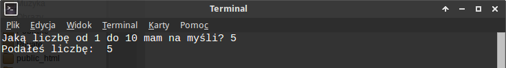

.. _maly-lotek:

Mały Lotek
###########

W *Toto Lotku* trzeba zgadywać liczby. Napiszmy prosty program, w którym
będziemy mieli podobne zadanie. Użyjemy języka Python.

.. contents::
    :depth: 1
    :local:

Szablon
*******

Zaczynamy od utworzenia pliku o nazwie :file:`toto.py` w dowolnym katalogu
za pomocą dowolnego edytora. Zapis ``~$`` poniżej oznacza katalog domowy użytkownika.
Obowiązkowa zawartość pliku:

.. raw:: html

    
Kod nr 

.. highlight:: python
.. literalinclude:: toto03.py
    :linenos:
    :lineno-start: 1
    :lines: 1-2

Pierwsza linia to ścieżka do interpretera Pythona (zob. :term:`interpreter`),
druga linia deklaruje sposób kodowania znaków, dzięki czemu możemy używać
polskich znaków.

Wartości i zmienne
******************

Zaczniemy od wylosowania jednej liczby. Potrzebujemy funkcji
``randint(a, b)`` z modułu ``random``. Zwróci nam ona liczbę całkowitą
z zakresu <a; b>. Do naszego pliku dopisujemy:

.. raw:: html

    
Kod nr 

.. highlight:: python
.. literalinclude:: toto03.py
    :linenos:
    :lineno-start: 4
    :lines: 4-7

Wylosowana liczba zostanie zapamiętana w **zmiennej** ``liczba`` (zob. :term:`zmienna` ).
Instrukcja ``print`` wydrukuje ją razem z komunikatem na ekranie.
Program możemy już uruchomić w terminalu (zob. :term:`terminal`),
wydając w katalogu z plikiem polecenie:

.. code-block:: bash

    ~$ python toto.py

Efekt działania naszego skryptu:

.. figure:: img/toto02.png

.. tip::

    Skrypty Pythona możemy też uruchamiać z poziomu edytora, o ile oferuje on taką możliwość.

Wejście – wyjście
******************

Liczbę mamy, niech gracz, czyli użytkownik ją zgadnie. Pytanie tylko,
na ile prób mu pozwolimy. Zacznijmy od jednej! Dopisujemy zatem:

.. raw:: html

    
Kod nr 

.. highlight:: python
.. literalinclude:: toto03.py
    :linenos:
    :emphasize-lines: 9
    :lineno-start: 1
    :lines: 1-

Liczbę podaną przez użytkownika pobieramy za pomocą instrukcji ``raw_input()``
i zapamiętujemy w zmiennej ``odp``.

.. attention::

    Zakładamy na razie, że gracz wprowadza poprawne dane, czyli liczby
    całkowite!

Ćwiczenie 1
=============

* Zgadywanie, gdy losowana liczba jest drukowana, nie jest zabawne. Zakomentuj
  więc instrukcję drukowania: ``# print "Wylosowana liczba:", liczba`` – będzie pomijana
  przez interpreter.

* Dopisz odpowiednie polecenie, które wyświetli liczbę podaną przez gracza.
  Przetestuj jego działanie.

Instrukcja warunkowa
********************

Mamy wylosowaną liczbę i typ gracza, musimy sprawdzić, czy trafił.
Uzupełniamy nasz program:

.. raw:: html

    
Kod nr 

.. highlight:: python
.. literalinclude:: toto04.py
    :linenos:
    :emphasize-lines: 12-15
    :lineno-start: 1
    :lines: 1-

Używamy **instrukcji warunkowej** ``if``, która sprawdza prawdziwość warunku
``liczba == int(odp)`` (zob. :term:`instrukcja warunkowa`).
Jeżeli wylosowana i podana liczba są sobie równe (``==``),
wyświetlamy informację o wygranej, w przeciwnym razie (``else:``) zachętę
do ponownej próby.

.. note::

    Instrukcja ``raw_input()`` wszystkie pobrane dane zwraca jako napisy (typ *string*).
    Do przekształcenia napisu na liczbę całkowitą (typ *integer*) wykorzystujemy funkcję
    ``int()``, która w przypadku niepowodzenia zgłasza wyjątek ``ValueError``.
    Ich obsługę omówimy później.

Przetestuj kilkukrotnie działanie programu.

.. figure:: img/toto04.png

Pętla for
*********

Trafienie za pierwszym razem wylosowanej liczby jest bardzo trudne, damy
graczowi 3 szanse. Zmieniamy i uzupełniamy kod:

.. raw:: html

    
Kod nr 

.. highlight:: python
.. literalinclude:: toto05.py
    :linenos:
    :emphasize-lines: 9
    :lineno-start: 1
    :lines: 1-

Pobieranie i sprawdzanie kolejnych liczb wymaga powtórzeń, czyli **pętli** (zob. :term:`pętla`).
Blok powtarzających się operacji umieszczamy więc w instrukcji ``for``.
Ilość powtórzeń określa wyrażenie ``i in range(3)``. **Zmienna iteracyjna** ``i``
to "licznik" powtórzeń. Przyjmuje on kolejne wartości wygenerowane przez
funkcję ``range(n)``. Funkcja ta tworzy listę liczb całkowitych od *0* do *n-1*.

A więc polecenia naszego skryptu, które umieściliśmy w pętli, wykonają się 3 razy,
chyba że... użytkownik trafi za 1 lub 2 razem. Wtedy warunek w instrukcji ``if``
stanie się prawdziwy, wyświetli się informacja o nagrodzie,
a polecenie ``break`` przerwie działanie pętli.

.. attention::

    Uwaga na WCIĘCIA!

    Podporządkowane bloki kodu wyodrębniamy za pomocą wcięć (zob. :term:`formatowanie kodu`).
    Standardem są 4 spacje i ich wielokrotności. Przyjęty rozmiar wcięć obowiązuje w całym pliku.
    Błędy wcięć sygnalizowane są komunikatem ``IndentationError``.

    W naszym kodzie linie 10, 13, 16 wcięte są na 4 spacje, zaś 14-15, 17-18 na 8.

Ćwiczenia
==========

Sprawdźmy działanie funkcji ``range()`` w trybie interaktywnym interpretera Pythona.
W terminalu wpisz polecenia:

.. code-block:: bash

    ~$ python
    >>> range(100)
    >>> for i in range(0, 100, 2)
    ...   print i
    ...
    >>> exit()

Funkcja range może przyjmować opcjonalne parametry określające początek, koniec
oraz krok generowanej listy wartości.

**Uzupełnij kod**, tak aby program wyświetlał informację "Próba 1", "Próba 2"
itd. przed podaniem liczby.

Instrukcja if...elif
********************

Po 3 błędnej próbie program ponownie wyświetla komunikat: "Nie zgadłeś..."
Za pomocą członu ``elif`` możemy wychwycić ten moment i wyświetlić komunikat:
"Miałem na myśli liczbę: liczba". Kod przyjmie następującą postać:

.. raw:: html

    
Kod nr 

.. highlight:: python
.. literalinclude:: toto07.py
    :linenos:

Ostateczny wynik działania naszego programu prezentuje się tak:

.. figure:: img/toto07.png

Materiały
**********

**Źródła:**

* :download:`Mały Lotek <mlotek.zip>`