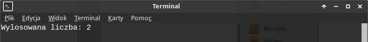
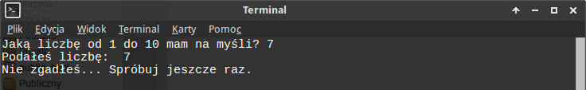
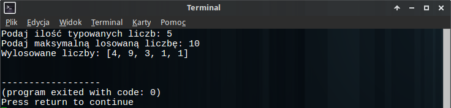
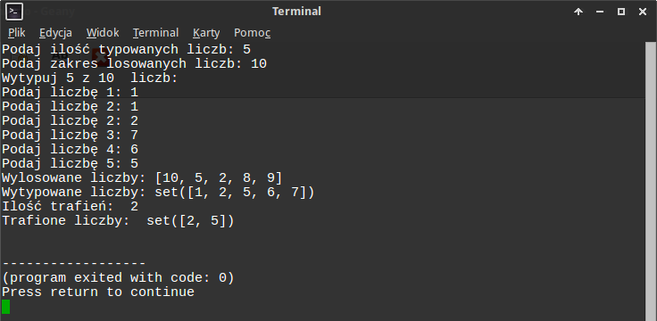

.. _toto-lotek:

Toto Lotek
###########

W *Toto Lotku* trzeba zgadywać liczby. Napiszmy prosty program, w którym
będziemy mieli podobne zadanie. Użyjemy języka Python.

.. contents::
    :depth: 1
    :local:

.. _maly-lotek:

Mały Lotek
**************

Zaczynamy od utworzenia pliku o nazwie :file:`toto.py` w dowolnym katalogu
za pomocą dowolnego edytora. Zapis ``~$`` poniżej oznacza katalog domowy użytkownika.
Obowiązkowa zawartość pliku:

.. raw:: html

    
Kod nr 

.. highlight:: python
.. literalinclude:: toto01.py
    :linenos:

Pierwsza linia to ścieżka do interpretera Pythona (zob. :term:`interpreter`),
druga linia deklaruje sposób kodowania znaków, dzięki czemu możemy używać
polskich znaków.

Losowanie liczby
*****************

Musimy wylosować liczby, ale zaczniemy od jednej. Potrzebujemy funkcji
``randint(a, b)`` z modułu ``random``. Zwróci nam ona liczbę całkowitą
z zakresu <a; b>. Do naszego pliku dopisujemy:

.. raw:: html

    
Kod nr 

.. highlight:: python
.. literalinclude:: toto02.py
    :linenos:
    :emphasize-lines: 4, 6-7
    :lineno-start: 1
    :lines: 1-

Wylosowana liczba zostanie zapamiętana w **zmiennej** ``liczba`` (zob. :term:`zmienna` ).
Instrukcja ``print`` wydrukuje ją razem z komunikatem na ekranie.
Program możemy już uruchomić w terminalu (zob. :term:`terminal`),
wydając w katalogu z plikiem polecenie:

.. code-block:: bash

    ~$ python toto.py

Efekt działania naszego skryptu:

Zgadywanie
***********

Liczbę mamy, niech gracz, czyli użytkownik ją zgadnie. Pytanie tylko,
na ile prób mu pozwolimy. Zacznijmy od jednej! Dopisujemy zatem:

.. raw:: html

    
Kod nr 

.. highlight:: python
.. literalinclude:: toto03.py
    :linenos:
    :emphasize-lines: 7, 9
    :lineno-start: 1
    :lines: 1-

Na początku **zakomentowujemy** znakiem ``#`` instrukcję drukującą wylosowaną liczbę.
Nie będzie wykonywana :-) Liczbę podaną przez użytkownika pobieramy za pomocą
instrukcji ``raw_input()`` i zapamiętujemy w zmiennej ``odp``.

.. attention::

    Zakładamy na razie, że gracz wprowadza poprawne dane, czyli liczby
    całkowite!

Ćwiczenie 1
=============

Dopisz odpowiednie polecenie, które wyświetli liczbę podaną przez gracza.
Przetestuj jego działanie.

.. figure:: img/toto03.png

Sprawdzanie
**************

Mamy wylosowaną liczbę i typ gracza, musimy sprawdzić, czy trafił.
Uzupełniamy nasz program:

.. raw:: html

    
Kod nr 

.. highlight:: python
.. literalinclude:: toto04.py
    :linenos:
    :emphasize-lines: 12-15
    :lineno-start: 1
    :lines: 1-

Używamy **instrukcji warunkowej** ``if``, która sprawdza prawdziwość warunku
``liczba == int(odp)`` (zob. :term:`instrukcja warunkowa`).
Jeżeli wylosowana i podana liczba są sobie równe (``==``),
wyświetlamy informację o wygranej, w przeciwnym razie (``else:``) zachętę
do ponownej próby. Dodatkowa funkcja ``int()`` zamienia podaną przez
gracza wartość na liczbę całkowitą.

.. note::

    Instrukcja ``raw_input()`` wszystkie pobrane dane zwraca jako tekst,
    dlatego jeżeli wprowadzone wartości chcemy wykorzystywać jako liczby,
    musimy używać funkcji ``int()``, która próbuje podany tekst
    przekształcić na typ całkowity (*integer*). Jeżeli nie jest w stanie
    tego zrobić, zgłasza wyjątek ``ValueError``. Ich obsługę omówimy
    później.

Przetestuj kilkukrotnie działanie programu.

Do 3 razy sztuka
*****************

Trafienie za pierwszym razem wylosowanej liczby jest bardzo trudne, spróbujmy
dać graczowi 3 szanse. Zmieniamy i uzupełniamy kod:

.. raw:: html

    
Kod nr 

.. highlight:: python
.. literalinclude:: toto05.py
    :linenos:
    :emphasize-lines: 9
    :lineno-start: 1
    :lines: 1-

Pobieranie i sprawdzanie kolejnych liczb wymaga powórzenia zakodowanych
wcześniej operacji. Do tego celu używamy **pętli** ``for`` (zob. :term:`pętla`).
Umieszczamy w niej blok poprzednio napisanego kodu odpowiednio
wcięty (zob. :term:`formatowanie kodu`).

Ilość powtórzeń określa wyrażenie ``i in range(3)``. **Zmienna iteracyjna** ``i``
to "licznik" powtórzeń. Będzie się on zmieniał tyle razy, ile wartości
zwróci funkcja ``range(n)``. Funkcja ta generuje listę liczb całkowitych
od *0* do *n-1*.

Ćwiczenie 2
=============

Zamiast się domyślać, sprawdźmy działanie omawianej funkcji w trybie interaktywnym
interpretera Pythona. W terminalu wpisz polecenia:

.. code-block:: python

    ~$ python
    >>> range(3)
    >>> for i in range(3)
    ...   print i
    ...
    >>> exit()

Jak wynika z powyższego, zmienna ``i`` przyjmie wartość 0, 1 i 2, czyli
pętla ``for`` wykona się 3 razy. Wszystkie polecenia znajdujące się wewnątrz
pętli również 3 razy, chyba że... Właśnie, a jeżeli użytkownik trafi
za 1 lub 2 razem? Wtedy warunek w instrukcji ``if`` stanie się prawdziwy,
wyświetli się informacja o nagrodzie, a polecenie ``break`` przerwie działanie
pętli. Przetestuj działanie programu, ale wcześniej przeczytaj jeszcze poniższą
uwagę:

.. note::

    W kodzie Pythona bardzo ważną rolę pełnią wcięcia. W obrębie całego pliku
    muszą one być równe (najczęściej 4 spacje i ich wielokrotności),
    służą bowiem wydzielaniu bloków kodu. Wskazują więc, które polecenia,
    którym są podporządkowane. W naszym przypadku linie 10, 13 i 16
    muszą mieć wcięcia pojedyncze (np. 4 spacje), a linie 14-15, 17-18
    podwójne (np. 8 spacji). Inaczej pojawią się błędy ``IndentationError``.

Ćwiczenie 3
=============

Uzupełnij kod, tak aby program wyświetlał informację "Próba 1", "Próba 2"
itd. przed podaniem liczby. **Wskazówki**: Wykorzystaj zmienną ``i`` i
sprawdź również w trybie interaktywnym, co się dzieje, kiedy wpiszesz:

.. code-block:: bash

    ~$ python
    >>> i = 0
    >>> print i
    >>> i = i + 1
    >>> print i

Ćwiczenie 4
=============

Po 3 błędnej próbie program ponownie wyświetla komunikat: "Nie zgadłeś...
Spróbuj jeszcze raz." Użyj intrukcji ``if`` z odpowiednim warunkiem
i wcięciami (!), aby po 3 nieudanej próbie wyświetlić komunikat:
"Miałem na myśli liczbę: liczba".

Ostateczny wynik działania naszego programu prezentuje się tak:

.. figure:: img/toto07.png

.. _duzy-lotek:

Duży Lotek
************

Jedna liczba to za mało, wylosujmy ich więcej! Zasady dużego lotka to typowanie
6 liczb z 49. Ponieważ trafienie jest tu bardzo trudne, napiszemy program
w taki sposób, aby można było łatwo dostosować poziom jego trudności.
Na początku utwórz nowy plik :file:`toto2.py` i uzupełnij go wymaganymi
liniami wskazujacymi interpreter pythona i użyte kodowanie.

Ćwiczenie 5
=============

Niech użytkownik określi ile liczb chce typować i z jakiego zakresu.
Pobierz od użytkownika ilość typowanych liczb, podaną wartość przechowaj
w zmiennej ``ileliczb``. Podobnie pobierz i zapisz maksymalną losowaną liczbę
w zmiennej ``maksliczba``. Na koniec wyświetl komunikat "Wytypuj x z y liczb: ".
Zamiast *x* i *y* powinny wyświetlić się podane przez użytkownika wartości.

.. tip::

    Skorzystaj z instrukcji ``raw_iput()``, której użyj jako argumentu
    funkcji ``int()``.

Losowanie wielu liczb
*********************

Ćwiczenie 6
=============

Jedną wylosowaną liczbę zapamiętywaliśmy w jednej zmiennej, ale przechowywanie
wielu wartości w osobnych zmiennych nie jest dobrym pomysłem. Najwygodniej
byłoby mieć jedną zmienną, w której można zapisać wiele wartości. W Pythonie
takim złożonym typem danych jest :term:`lista`.

Przetestuj w interpreterze następujące polecenia:

.. code-block:: bash

    ~$ python
    >>> liczby = []
    >>> liczby
    >>> liczby.append(1)
    >>> liczby.append(2)
    >>> liczby.append(4)
    >>> liczby.append(4)
    >>> liczby
    >>> liczby.count(1)
    >>> liczby.count(4)
    >>> liczby.count(0)

.. tip::

    Zamiast wpisywać w terminalu powtarzające się lub podobne polecenia,
    użyj klawiszy kursora (góra, dół) do przywoływania poprzednich
    poleceń. Każde przywołane polecenie możesz przed zatwierdzeniem
    zmienić używając klawiszy lewo, prawo, del i backspace.

Jak widać po zadeklarowaniu pustej listy (``liczby = []``), metoda ``.append()``
pozwala dodawać do niej wartości, a metoda ``.count()`` podaje, ile razy
dana wartość wystąpiła w liście. To się nam przyda ;-)

Wróćmy do programu i pliku :file:`toto2.py`. Losowanie wielu liczb to...
powtarzające się losowanie jednej liczby, czyli pętla. Spróbuj użyć poznanej
wcześniej instrukcji ``for``, aby dopisać kod losujący ``ileliczb``
z zakresu ograniczonego przez ``maksliczba``. Wylosowane wartości wydrukuj
w terminalu... Przetestuj program, powinien wypisywać kolejne losowane
liczby.

Kontynuujemy ćwiczenie. Przed pętlą zadeklaruj pustą listę. Wewnątrz pętli
umieść polecenie dodające wylosowane liczby do listy. Na końcu programu
(uwaga na wcięcia) wydrukuj zawartość listy. Wielokrotnie przetestuj program;
czy lista zawsze zawiera akceptowalne wartości?

Pętla ``for`` nie nadaje się do losowania liczb, ponieważ wykonuje się określoną ilość razy,
a nie możemy zagwarantować, że losowane liczby będą za każdym razem inne.
Do wylosowania podanej ilości liczb wykorzystamy więc pętlę ``while wyrażenie_logiczne:``,
która powtarza kod dopóki podane wyrażenie jest prawdziwe.
Uzupełniamy Kod w pliku :file:`toto2.py`:

.. raw:: html

    
Kod nr 

.. highlight:: python
.. literalinclude:: toto22.py
    :linenos:
    :emphasize-lines: 10-19
    :lineno-start: 1
    :lines: 1-

Losowane liczby zapamiętujemy w **liście** ``liczby`` (zob. :term:`lista`).
Zmienna ``i`` to licznik unikalnych wylosowanych liczb, korzystamy z niej w wyrażeniu
warunkowym ``i < ileliczb``, które kontroluje powtórzenia pętli. W instrukcji
warunkowej wykorzystujemy funkcję zliczającą wystąpienia wylosowanej wartości
w liście (``liczby.count(liczba)``), aby dodawać (``liczby.append(liczba)``)
do listy liczby wcześniej niepodane.

Nasze typy
***********

Przy pobieraniu typów użytkownika użyjemy podobnie jak przed chwilą pętli
``while``, ale typy zapisywać będziemy w zbiorze, który z założenia nie
może zawierać duplikatów (zob. :term:`zbiór`).

Ćwiczenie 7
=============

W interpreterze Pythona przetestuj następujące polecenia:

.. code-block:: bash

    ~$ python
    >>> typy = set()
    >>> typy.add(1)
    >>> typy.add(2)
    >>> typy
    >>> typy.add(2)
    >>> typy
    >>> typy.add(0)
    >>> typy.add(9)
    >>> typy

Pierwsza instrukcja deklaruje pusty zbiór (``typy = set()``). Metoda ``.add()``
dodaje do zbioru elementy, ale nie da się dodać dwóch takich samych elementów.
Drugą cechą zbiorów jest to, że ich elementy nie są w żaden sposób uporządkowane.

Wykorzystajmy poznany typ, aby pobrać od użytkownika typy liczb. W pliku
:file:`toto2.py` dopisujemy:

.. raw:: html

    
Kod nr 

.. highlight:: python
.. literalinclude:: toto23.py
    :linenos:
    :lineno-start: 20
    :lines: 20-27

W powyższym kodzie warto zwrócić uwagę na sposób sprawdzania, czy podanej liczby
nie ma już w zbiorze: ``if typ not in typy:``. Gdybyśmy chcieli sprawdzić,
czy liczba jest w zbiorze, użylibyśmy wyrażenia ``typ in typy``. Przetestuj program.

Ile trafiliśmy
***************

Określenie ilości trafień w większości języków programowania wymagałoby
przeszukiwania listy wylosowanych liczb dla każdego podanego typu. W Pythonie
możemy użyć arytmetyki zbiorów: wyznaczymy część wspólną.

Ćwiczenie 8
==============

W interpreterze przetestuj poniższe instrukcje:

.. code-block:: bash

    ~$ python
    >>> liczby = [1,3,5,7,9]
    >>> typy = set([2,3,4,5,6])
    >>> set(liczby) | typy
    >>> set(liczby) - typy
    >>> trafione = set(liczby) & typy
    >>> len(trafione)

Polecenie ``set(liczby)`` przekształca listę na zbiór. Kolejne operatory
zwracają sumę (``|``), różnicę (``-``) i iloczyn (``&``), czyli część
wspólną zbiorów. Ta ostania operacja bardzo dobrze nadaje się do sprawdzenia,
ile liczb trafił użytkownik. Funkcja ``len()`` zwraca ilość elementów m.in.
listy i zbioru.

Do pliku :file:`toto2.py` dopisujemy:

.. raw:: html

    
Kod nr 

.. highlight:: python
.. literalinclude:: toto24.py
    :linenos:
    :lineno-start: 31
    :lines: 31-36

Instrukcja ``if trafione:`` sprawdza, czy część wspólna zawiera jakiekolwiek elementy.
Jeśli tak, drukujemy liczbę trafień i trafione liczby.

Ćwiczenie 9
==============

Przetestuj program dla 5 typów z 10 liczb. Działa?
Jeśli masz wątpliwości, wpisz wylosowane i wytypowane liczby w interpreterze,
np.:

.. code-block:: bash

    >>> liczby = [1,4,2,6,7]
    >>> typy = set([1,2,3,4,5])
    >>> trafione = set(liczby) & typy
    >>> if trafione:
    ...   print len(trafione)
    ...
    >>> print trafione

Wnioski? Logika kodu jest poprawna, czego dowodzi test w terminalu, ale
program nie działa. Dlaczego?

.. tip::

    Przypomnij sobie, jakiego typu wartości zwraca funkcja ``raw_input()``.

Ćwiczenie 10
==============

Zmodyfikuj program tak, aby wynik jego działania wyglądał następująco:

Ćwiczenie 11
==============

Zmień program tak, aby użytkownik mógł 3 razy typować liczby z tej
samej serii liczb wylosowanych. Wynik działania programu powinien przypominać
poniższy zrzut:

.. figure:: img/toto26.png

.. tip::

    Wykorzystaj pętlę ``for``.

Uwaga: błędne dane!
*******************

Kod naszego programu do tej pory przedstawia się mniej więcej tak:

.. raw:: html

    
Kod nr 

.. highlight:: python
.. literalinclude:: toto26.py
    :linenos:

Uruchom powyższy program i podaj ilość losowanych liczb większą od maksymalnej losowanej liczby.
Program wpada w nieskończoną pętlę! Po chwili zastanowienia dojdziemy
do wniosku, że nie da się wylosować np. 6 unikalnych liczb z zakresu 1-5.

Ćwiczenie 12
=============

Dodaj odpowiednią instrukcję warunkową, która w przypadku gdy zmienna ``ileliczb``
będzie mniejsza od zmiennej ``maksliczba`` wyświetli komunikat "Błędne dane!"
i przerwie wykonywanie programu – użyj funkcji ``exit()``. Sprawdź działanie programu.

Tetsujemy dalej. Uruchom program i zamiast liczby podaj tekst.
Co się dzieje? Uruchom jeszcze raz, ale tym razem jako typy podaj
wartości spoza zakresu <0;maksliczba>. Da się to zrobić?

Jak pewnie zauważyłeś, w pierwszym wypadku zgłoszony zostaje wyjątek "ValuError"
(zob.: :term:`wyjątki`) i komunikat ``invalid literal for int() with base 10``,
który informuje, że fukncja ``int()`` nie jest w stanie przekształcić podanego
ciągu znaków na liczbę całkowitą. W drugim wypadku podanie nielogicznych
typów jest możliwe.

Spróbujmy zmodyfikować program tak, aby był nieco odporniejszy na niepoprawne dane:

.. raw:: html

    
Kod nr 

.. highlight:: python
.. literalinclude:: toto28.py
    :linenos:
    :lineno-start: 6
    :lines: 6-14

Do przechwytywania wyjątków używamy konstrukcji ``try: ... except: ...``, czyli
spróbuj wykonać kod w bloku ``try``, a w razie błędów przechwyć wyjątek ``ValueError``
i wykonaj podporządkowane instrukcje. W powyższym przypadku wyświetlamy odpowiedni
komunikat i kończymy działanie programu (``exit()``).

.. raw:: html

    
Kod nr 

.. highlight:: python
.. literalinclude:: toto28.py
    :linenos:
    :lineno-start: 28
    :lines: 28-37

Pobierając typy od użytkownika również musimy spróbować przekształcić
podane znaki na liczbę (``int()``) i w razie błędu przechwycić wyjątek
(``try...except``). Poza tym jednak trzeba sprawdzić, czy użytkownik podaje
sensowane typy. Odpowiada za to warunek ``0 < typ <= maksliczba``.
Jest to skrócony zapis wyrażenia: ``typ > 0 and typ <= maksliczba``.

Na koniec warto zauważyć, co dzieje się, kiedy przechwytujemy wyjątek.
Nie kończymy programu (``exit()``), ani nie przerywamy pętli (``break()``),
zamiast tego pomijamy dalsze polecenia i wznawiamy wykonywanie pętli
kolejny raz. Tak działa polecenie ``continue``.

Funkcje i moduły
*****************

Tam, gdzie w programie występują powtarzające się operacje lub zestaw poleceń
realizujący wyodrębnione zadanie, wskazane jest używanie funkcji.
Są to nazwane bloki kodu, które można grupować w ramach modułów (zob. :term:`funkcja`, zob. :term:`moduł`).
Funkcje zawarte w modułach można importować do różnych programów.
Do tej pory korzystaliśmy np. z funkcji ``randit()`` zawartej w module ``random``.

Wyodrębnienie funkcji ułatwia sprawdzanie i poprawianie kodu, ponieważ
wymusza podział programu na logicznie uporządkowane kroki. Jeżeli
program korzysta z niewelu funkcji, można umieszczać je na początku pliku
programu głównego.

Tworzymy więc nowy plik :file:`totomodul.py` rozpoczynający się liniami wskazującymi
interpreter i kodowanie. Umieszczamy w nim następujący kod:

.. raw:: html

    
Kod nr 

.. highlight:: python
.. literalinclude:: totomodul30.py
    :linenos:
    :emphasize-lines: 6, 9, 17, 22, 31, 34, 49

Kod odpowiedzialny za ustawienia gry, losowanie liczb i pobieranie typów
użytkownika umieszczony został w osobnych funkcjach sygnalizowanych słowem
kluczowym ``def`` i wcięciami. Funkcje mogą przyjmować definiowane w nawiasach
dane wejściowe, np. ``losujliczby(ile, maks)``, które podajemy jako argumenty
w momencie wywołania funkcji. Funkcje mogą zwracać dane wyjściowe za pomocą
instrukcji ``return``.

Warto zauważyć, że można zwracać więcej niż jedną wartość naraz,
np. w postaci tupli ``(ile, maks, ilelos)``. Tupla to rodzaj listy, w której
nie możemy zmieniać wartości (zob. :term:`tupla`), jest często stosowana
do przechowywania i przekazywania stałych danych.

Nazwy zmiennych lokalnych w funkcjach są niezależne od nazw zmiennych w programie
głównym, ponieważ definiwane są w różnych zasięgach czy też przestrzeniach nazw.
Możliwe jest modyfikowanie zmiennych globalnych dostępnych w całym programie,
w funkcji musimy tylko umieścić polecenie: ``global nazwa_zmiennej``.

Wiele wartości zwracanych w tupli przez funkcję ``ustawienia()`` można
jednocześnie przypisać kilku zmiennym dzięki operacji tzw. rozpakowania
tupli: ``ileliczb, maksliczba, ilerazy = ustawienia()``.

Dwie pozostałe funkcje zwracają listę wylosowanych liczb i zbiór typów.

Program główny po zmianach przedstawia się następująco:

.. raw:: html

    
Kod nr 

.. highlight:: python
.. literalinclude:: toto30.py
    :linenos:
    :emphasize-lines: 4, 9, 12, 16

Na początku z modułu ``totomodul``, którego nazwa jest taka sama jak nazwa pliku,
importujemy potrzebne funkcje. Później wywołujemy je podając nazwę i ewentualne
argumenty. W efekcie zwracane przez nie wartości zostają przypisane podanym zmiennym.
Jak widać, program stał się czytelniejszy.

.. note::

    W rozbudowanych programach dobrą praktyką ułatwiającą późniejsze przeglądanie
    i poprawianie kodu jest opatrywanie jego fragmentów komentarzami. Można je
    umieszczać po znaku ``#``. Z kolei funkcje opatruje się krótkim opisem
    działania i/lub wymaganych argumentów, ograniczanym potrójnymi cudzysłowami.
    Notacja ``"""..."""`` lub ``'''...'''`` pozwala zamieszczać teksty wielowierszowe.

Ćwiczenie 13
=================

Użytkownik może typować liczby kilka razy w ramach jednego uruchomienia programu.
Powtarzany w pętli ``for`` kod warto przenieść do funkcji zapisanej w module
programu i nazwanej np. ``wyniki()``. Zastanów się, jakie argumenty należy
jej przekazać i co powinna zwracać.

Ustawienia
***********

Uruchamiając wielokrotnie program, musimy podawać wiele danych, aby zadziałał.
Dodamy więc możliwość zapamiętywania ustawień i ich zmiany. Dane zapisywać
będziemy w zwykłym pliku tekstowym. W pliku :file:`toto2.py` uzupełniamy
tylko jedną linię:

.. raw:: html

    
Kod nr 

.. highlight:: python
.. literalinclude:: toto32.py
    :linenos:
    :emphasize-lines: 2
    :lineno-start: 8
    :lines: 8-9

W pliku :file:`totomodul.py` zmieniamy funkcję ``ustawienia()`` oraz dodajemy
dwie nowe: ``czytaj_ust()`` i ``zapisz_ust()``.

.. raw:: html

    
Kod nr 

.. highlight:: python
.. literalinclude:: totomodul32.py
    :linenos:
    :emphasize-lines: 12, 21, 34, 38, 46
    :lineno-start: 1
    :lines: 1-50

W funkcji ``ustawienia()`` pobieramy nick użytkownika i tworzymy nazwę pliku
z ustawieniami, następnie próbujemy je odczytać wywołując funkcję ``czytaj_ust()``.
Funkcja ta sprawdza, czy podany plik istnieje na dysku i otwiera go do odczcytu:
``plik = open(nazwapliku, "r")``. Plik powinien zawierać 1 linię, która przechowuje
ustawienia w formacie: ``nick;ile_liczb;maks_liczba;ile_prób``. Po jej
odczytaniu za pomocą metody ``.readline()`` i rozbiciu na elementy
zwracamy ją jako listę ``gracz``.

Jeżeli uda się odczytać zapisane ustawienia, drukujemy je, a następnie
pytamy, czy użytkownik chce je zmienić. Jeżeli nie znaleźliśmy zapisanych
ustawień lub użytkownik nacisnął klawisz "t" lub "T" wykonujemy poprzedni
kod. Na koniec zmiennej ``gracz`` przypisujemy listę ustwień przekazaną
do zapisu funkcji ``zapisz_ust()``. Funkcja ta zapisuje dane złączone za
pomocą średnika w jedną linię do pliku: ``plik.write(";".join(gracz))``.

W powyższym kodzie widać, jakie operacje można wykonywać na tekstach, tj.:

* operator ``+``: łączenie tekstów,
* ``linia.split(";")`` – rozbijanie tekstu wg podanego znaku na elementy listy,
* ``";".join(gracz)`` – złączanie elementów listy za pomocą podanego znaku,
* ``odp.lower()`` – zmiana wszystkich znaków na małe litery,
* ``str(arg)`` – przekształcanie podanego argumentu na typ tekstowy.

Na szczególną uwagę zasługuje konstrukcja ``return gracz[0:1] + map(lambda x: int(x), gracz[1:4])``,
której używamy, aby zwrócić odczytane/zapisane ustawienia do programu głównego.
Dane w pliku przechowujemy, a także pobieramy od użytkownika jako znaki.
Natomiast program główny oczekuje 4 wartości typu: znak, liczba, liczba, liczba.
Stosujemy więc notację wycinkową (ang. *slice*), aby wydobyć nick użytkownika:
``gracz[0:1]``. Pierwsza wartość mówi od którego elementu, a druga do którego
elementu wycinamy wartości z listy (przećwicz w konsoli Pythona!).
Funkcja ``map()`` pozwala zastosować do pozostałych 3 elementów – ``gracz[1:4]`` –
funkcję, która zamienia je w wartości liczbowe. Wykorzystujemy tu :term:`wyrażenia lambda`,
czyli skrócony zapis 1-argumentowej funkcji (zob. :ref:`mapowanie funkcji <map-fun>`).

Historia losowań
******************

Skoro umiemy już zapamiętywać wstępne ustawienia programu, możemy również
zapamiętywać losowania użytkownika, tworząc rejestr do celów informacyjnych
i/lub statystycznych. Zadanie wymaga po pierwsze zdefiniowania jakieś struktury,
w której będziemy przechowywali dane, po drugie zapisu danych albo w plikach,
albo w bazie danych.

Na początku dopiszemy kod w programie głównym :file:`toto2.py`:

.. raw:: html

    
Kod nr 

.. highlight:: python
.. literalinclude:: toto33.py
    :linenos:
    :emphasize-lines: 4-6, 13-14, 24-29, 31
    :lineno-start: 1
    :lines: 1-

Dane graczy zapisywać będziemy w plikach nazwanych nickiem
użytkownika z rozszerzeniem ".json": ``nazwapliku = nick + ".json"``.
Informacje o grach umieścimy w liście ``losowania``, którą na początku
zainicjujemy danymi o grach zapisanymi wcześniej: ``losowania = czytaj(nazwapliku)``.

Każda gra w liście ``losowania`` to :term:`słownik`. Struktura ta pozwala
przechowywać dane w parach "klucz: wartość", przy czym indeksami mogą być napisy:

* ``"czas"`` – będzie indeksem daty gry (potrzebny import modułu ``time``!),
* ``"dane"`` – będzie wskaywał tuplę z ustawieniami,
* ``"wylosowane"`` – listę wylosowanych liczb,
* ``"ile"`` – ilość trafień.

Na koniec dane ostatniej gry dopiszemy do listy (``losowania.append()``),
a całą listę zapiszemy do pliku: ``zapisz(nazwapliku, losowania)``.

Teraz zobaczmy, jak wyglądają funkcje ``czytaj_json()`` i ``zapisz_json()`` w module
:file:`totomodul.py`:

.. raw:: html

    
Kod nr 

.. highlight:: python
.. literalinclude:: totomodul33.py
    :linenos:
    :lineno-start: 92
    :lines: 92-

Kiedy czytamy i zapisujemy dane, ważną sprawą staje się ich format. Najprościej
zapisywać dane jako znaki, tak jak zrobiliśmy to z ustawieniami, jednak często
programy użytkowe potrzebują zapisywać złożone struktury danych, np.
listy, zbiory czy słowniki. Znakowy zapis wymagałby wtedy wielu dodatkowych
manipulacji, aby możliwe było poprawne odtworzenie informacji. Prościej
jest skorzystać z *serializacji*, czyli zapisu danych obiektowych (zob. :term:`serializacja`).
Jednym z szerzej stosowanych jest prosty format tekstowy `JSON <https://pl.wikipedia.org/wiki/JSON>`_.

W funkcji ``czytaj()`` zawartość podanego pliki dekodujemy do listy: ``dane = json.load(plik)``.
Funkcja ``zapisz()`` oprócz nazwy pliku wymaga listy danych. Po otwarciu
pliku w trybie zapisu ``"w"``, co powoduje wyczyszczenie jego zawartości,
dane są serializowane i zapisywane formacie JSON: ``json.dump(dane, plik)``.

Dobrą praktyką jest zwalnianie uchwytu do otwartego pliku i przyddzielonych mu zasobów
poprzez jego zamknięcie: ``plik.close()``. Tak robiliśmy w funkcjach
czytających i zapisujących ustawienia. Teraz jednak pliki otworzyliśmy przy
użyciu konstrukcji typu ``with open(nazwapliku, "r") as plik:``, która zadba
o ich włąsciwe zmaknięcie.

Przetestuj, przynajmniej kilkukrotnie, działanie programu.

Ćwiczenie 14
==============

Załóżmy, że jednak chcielibyśmy zapisywać historię losowań w pliku tekstowym,
którego poszczególne linie zawierałyby dane jednego losowania, np.:
``wylosowane:[4, 5, 7];dane:(3, 10);ile:0;czas:1434482711.67``

Funkcja zapisująca dane mogłaby wyglądać np. tak:

.. raw:: html

    
Kod nr 

.. code-block:: python

    def zapisz_str(nazwapliku, dane):
        """Funkcja zapisuje dane w formacie txt do pliku"""
        with open(nazwapliku, "w") as plik:
            for slownik in dane:
                linia =[k+":"+str(w) for k, w in slownik.iteritems()]
                linia = ";".join(linia)
                # plik.write(linia+"\n") – zamiast tak, można:
                print >>plik, linia

Napisz funkcję ``czytaj_str()`` odczytującą tak zapisane dane. Funkcja
powinna zwrócić listę słowników.
