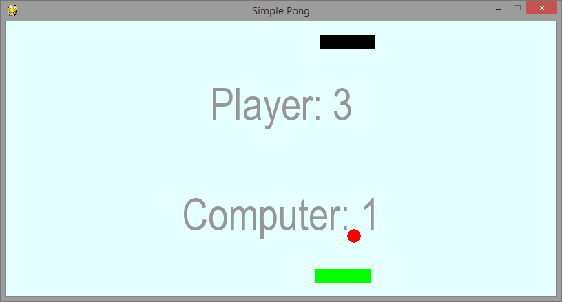

Gra w Ponga
===========

Klasyczna gry w odbijanie piłeczki zrealizowana z użyciem biblioteki PyGame.

Przygotowanie
-------------

Do rozpoczęcia pracy z przykładem pobieramy szczątkowy kod źródłowy:

.. code-block:: bash

    ~/python101$ git checkout -f --track origin/pong/z1

.. note::

    Przykłady zawierające znak zachęty ``$`` oznaczają komendy
    do wykonania w terminalu systemu operacyjnego (uruchom przez :kbd:`Win+T`).

    Oprócz znaku zachęty ``$`` przykłady mogą zawierać informację o
    lokalizacji w jakiej należy wykonać komendę. Np. ``~/python101$`` oznacza
    że komendę wykonujemy w folderze ``python101`` w katalogu domowym
    użytkownika.
    Jeśli nie mamy tego katalogu należy :doc:`przygotować katalog projektu <git>`.

    Komendy należy kopiować i wklejać bez znaku zachęty ``$`` i poprzedzającego tekstu.
    Komendy można wklejać do terminala środkowym klawiszem myszki.

Okienko gry
-----------

Na wstępie w pliku ``~/python101/pong/pong.py`` otrzymujemy kod który przygotuje okienko naszej gry:

.. literalinclude:: pong/pong_z1.py
    :linenos:

W powyższym kodzie zdefiniowaliśmy klasę ``Board`` z dwiema metodami:

#. konstruktorem ``__init__``, oraz
#. metodą ``draw`` posługującą się biblioteką ``PyGame`` do rysowania w oknie.

Na końcu utworzyliśmy instancję klasy ``Board`` i wywołaliśmy jej metodę ``draw`` na razie
bez żadnych elementów wymagających narysowania.

.. note::

    Każdy plik skryptu *Python* jest uruchamiany w momencie importu — plik/moduł główny
    jest importowany jako pierwszy.

    Deklaracje klas są faktycznie instrukcjami sterującymi mówiącymi by w aktualnym module
    utworzyć typy zawierające wskazane definicje.

    Możemy mieszać deklaracje klas ze zwykłymi instrukcjami sterującymi takimi jak ``print``,
    czy przypisaniem wartości zmiennej ``board = Board(800, 400)`` i następnie wywołaniem
    metody na obiekcie ``board.draw()``.

Nasz program możemy uruchomić komendą:

.. code-block:: bash

    ~/python101$ python pong/pong.py

Mrugnęło? Program się wykonał i zakończył działanie :). Żeby zobaczyć efekt na dłużej,
możemy na końcu chwilkę uśpić nasz program:

.. code-block:: python
    :linenos:
    :lineno-start: 35

    import time
    time.sleep(5)

Jednak zamiast tego, dla lepszej kontroli powinniśmy zadeklarować klasę kontrolera gry:

.. literalinclude:: pong/pong_z2.py
    :linenos:
    :lineno-start: 32
    :lines: 32-

.. note::

    Prócz dodania kontrolera zmieniliśmy także sposób w jaki gra jest uruchamiana
    — nie mylić z uruchomieniem programu.

    Na końcu dodaliśmy instrukcję warunkową
    ``if __name__ == "__main__":``, w niej sprawdzamy czy nasz moduł jest modułem
    głównym programu, jeśli nim jest gra zostanie uruchomiona.

    Dzięki temu jeśli nasz moduł został zaimportowany gdzieś indziej instrukcją
    ``import pong``, deklaracje klas zostały by wykonane, ale sama gra nie będzie
    uruchomiona.

Gotowy kod możemy wyciągnąć komendą:

.. code-block:: bash

    ~/python101$ git checkout -f --track origin/pong/z2

