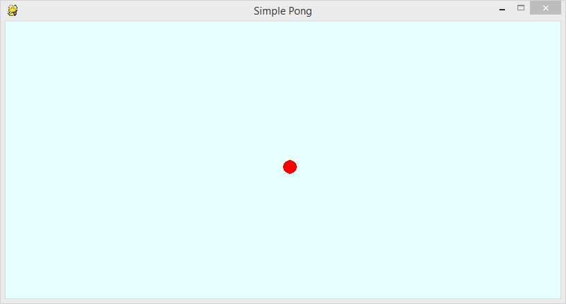

Gra w Ponga
===========

.. highlight:: python

Klasyczna gry w odbijanie piłeczki zrealizowana z użyciem biblioteki `PyGame`_.

.. _PyGame: http://www.pygame.org/wiki/tutorials

.. figure:: pong_0.png

Przygotowanie
-------------

Do rozpoczęcia pracy z przykładem pobieramy szczątkowy kod źródłowy:

.. code-block:: bash

    ~/python101$ git checkout -f pong/z1

Okienko gry
-----------

Na wstępie w pliku ``~/python101/pong/pong.py`` otrzymujemy kod który przygotuje okienko naszej gry:

.. raw:: html

    
Kod nr 

.. literalinclude:: pong_z1.py
    :linenos:

W powyższym kodzie zdefiniowaliśmy klasę ``Board`` z dwiema metodami:

#. konstruktorem ``__init__``, oraz
#. metodą ``draw`` posługującą się biblioteką ``PyGame`` do rysowania w oknie.

Na końcu utworzyliśmy instancję klasy ``Board`` i wywołaliśmy jej metodę ``draw`` na razie
bez żadnych elementów wymagających narysowania.

.. note::

    Każdy plik skryptu *Python* jest uruchamiany w momencie importu — plik/moduł główny
    jest importowany jako pierwszy.

    Deklaracje klas są faktycznie instrukcjami sterującymi mówiącymi by w aktualnym module
    utworzyć typy zawierające wskazane definicje.

    Możemy mieszać deklaracje klas ze zwykłymi instrukcjami sterującymi takimi jak ``print``,
    czy przypisaniem wartości zmiennej ``board = Board(800, 400)`` i następnie wywołaniem
    metody na obiekcie ``board.draw()``.

Nasz program możemy uruchomić komendą:

.. code-block:: bash

    ~/python101$ python pong/pong.py

Mrugnęło? Program się wykonał i zakończył działanie :). Żeby zobaczyć efekt na dłużej,
możemy na końcu chwilkę uśpić nasz program:

.. raw:: html

    
Kod nr 

.. code-block:: python
    :linenos:
    :lineno-start: 39

    import time
    time.sleep(5)

Jednak zamiast tego, dla lepszej kontroli powinniśmy zadeklarować klasę kontrolera gry,
usuńmy kod o linii 37 do końca i dodajmy klasę kontrolera:

.. raw:: html

    
Kod nr 

.. literalinclude:: pong_z2.py
    :linenos:
    :lineno-start: 38
    :lines: 38-

.. note::

    Prócz dodania kontrolera zmieniliśmy także sposób w jaki gra jest uruchamiana
    — nie mylić z uruchomieniem programu.

    Na końcu dodaliśmy instrukcję warunkową
    ``if __name__ == "__main__":``, w niej sprawdzamy czy nasz moduł jest modułem
    głównym programu, jeśli nim jest gra zostanie uruchomiona.

    Dzięki temu jeśli nasz moduł został zaimportowany gdzieś indziej instrukcją
    ``import pong``, deklaracje klas zostały by wykonane, ale sama gra nie będzie
    uruchomiona.

Gotowy kod możemy wyciągnąć komendą:

.. code-block:: bash

    ~/python101$ git checkout -f pong/z2

Piłeczka
--------

Czas dodać piłkę do gry. *Piłeczką* będzie kolorowe kółko które z każdym przejściem
naszej pętli przesuniemy o kilka punktów w osi X i Y, zgodnie wektorem prędkości.

Wcześniej jednak zdefiniujemy wspólną klasę bazową dla obiektów które będziemy
rysować w oknie naszej gry:

.. raw:: html

    
Kod nr 

.. literalinclude:: pong_z3.py
    :linenos:
    :lineno-start: 71
    :lines: 75-88

Następnie dodajmy klasę samej piłeczki dziedzicząc z ``Drawable``:

.. raw:: html

    
Kod nr 

.. literalinclude:: pong_z3.py
    :linenos:
    :lineno-start: 87
    :lines: 91-127

W przykładzie powyżej wykonaliśmy :term:`dziedziczenie` oraz :term:`przesłanianie` konstruktora,
ponieważ rozszerzamy ``Drawable`` i chcemy zachować efekt działania konstruktora na początku
konstruktora ``Ball`` wywołujemy konstruktorr klasy bazowej:

    .. code-block:: python

        super(Ball, self).__init__(width, height, x, y, color)

Teraz musimy naszą piłeczkę zintegrować z resztą gry:

.. raw:: html

    
Kod nr 

.. literalinclude:: pong_z3.py
    :linenos:
    :lines: 38-61
    :emphasize-lines: 12, 20-23
    :lineno-start: 38

.. note::

    Metoda ``Board.draw`` oczekuje wielu opcjonalnych argumentów, chodź na razie przekazujemy
    tylko jeden. By zwiększyć czytelność potencjalnie dużej listy argumentów — kto
    wie co jeszcze dodamy :) — podajemy każdy argument w swojej linii zakończonej przecinkiem ``,``

    Python nie traktuje takich osieroconych przecinków jako błąd, jest to ukłon w stronę
    programistów którzy często zmieniają kod, kopiują i wklejają kawałki.

    Dzięki temu możemy wstawiać nowe, i zmieniać kolejność bez zwracania uwagi czy na końcu
    jest przecinek, czy go brakuje, czy go należy usunąć. Zgodnie z konwencją powinien być
    tam zawsze.

Gotowy kod możemy wyciągnąć komendą:

.. code-block:: bash

    ~/python101$ git checkout -f pong/z3

Odbijanie piłeczki
------------------

Uruchommy naszą "grę" ;)

.. code-block:: bash

    ~/python101$ python pong/pong.py

Efekt nie jest powalający, ale mamy już jakiś ruch na planszy. Szkoda, że piłka spada z planszy.
Może mogła by się odbijać od krawędzi okienka?
Możemy wykorzystać wcześniej przygotowane metody do zmiany kierunku wektora
prędkości, musimy tylko wykryć moment w którym piłeczka będzie dotykać krawędzi.

W tym celu piłeczka musi być świadoma istnienia planszy i pozycji krawędzi, dlatego
zmodyfikujemy metodę ``Ball.move`` tak by przyjmowała ``board`` jako argument i na
jego podstawie sprawdzimy czy piłeczka powinna się odbijać:

.. raw:: html

    
Kod nr 

.. code-block:: python
    :emphasize-lines: 1, 8-12
    :lineno-start: 122

    def move(self, board):
        """
        Przesuwa piłeczkę o wektor prędkości
        """
        self.rect.x += self.x_speed
        self.rect.y += self.y_speed

        if self.rect.x < 0 or self.rect.x > board.surface.get_width():
            self.bounce_x()

        if self.rect.y < 0 or self.rect.y > board.surface.get_height():
            self.bounce_y()

Jeszcze zmodyfikujmy wywołanie metody ``move`` w naszej pętli głównej:

.. raw:: html

    
Kod nr 

.. code-block:: python
    :emphasize-lines: 6
    :lineno-start: 51

    def run(self):
        """
        Główna pętla programu
        """
        while not self.handle_events():
            self.ball.move(self.board)
            self.board.draw(
                self.ball,
            )
            self.fps_clock.tick(30)

.. warning::

    Powyższe przykłady mają o jedno wcięcie za mało. Poprawnie wcięte przykłady
    straciłyby kolorowanie w tej formie materiałów. Ze względu na czytelność
    kodu zdecydowaliśmy się na taki drobny błąd. Kod po ewentualnym wklejeniu
    należy poprawić dodając jedno wcięcie (4 spacje).

Sprawdzamy piłka się odbija, uruchamiamy nasz program:

.. code-block:: bash

    ~/python101$ python pong/pong.py

Gotowy kod możemy wyciągnąć komendą:

.. code-block:: bash

    ~/python101$ git checkout -f pong/z4

Odbijamy piłeczkę rakietką
--------------------------

Dodajmy "rakietkę" od przy pomocy której będziemy mogli odbijać piłeczkę.
Dodajmy zwykły prostokąt, który będziemy przesuwać przy pomocy myszki.

.. raw:: html

    
Kod nr 

.. literalinclude:: pong_z5.py
    :linenos:
    :lines: 147-164
    :lineno-start: 136

.. note::

    W tym przykładzie zastosowaliśmy operator warunkowy, za jego pomocą ograniczamy
    prędkość poruszania się rakietki:

    .. code-block:: python

        delta = self.max_speed if delta > 0 else -self.max_speed

    Zmienna ``delta`` otrzyma wartość ``max_speed`` ze znakiem ``+`` lub ``-``
    w zależności od znaku jaki ma aktualnie.

Następnie "pokażemy" rakietkę piłeczce, tak by mogła się od niej odbijać.
Wiemy że rakietek będzie więcej dlatego od razu tak zmodyfikujemy metodę
``Ball.move`` by przyjmowała kolekcję rakietek:

.. raw:: html

    
Kod nr 

.. code-block:: python
    :linenos:
    :emphasize-lines: 1, 14-16
    :lineno-start: 122

    def move(self, board, *args):
        """
        Przesuwa piłeczkę o wektor prędkości
        """
        self.rect.x += self.x_speed
        self.rect.y += self.y_speed

        if self.rect.x < 0 or self.rect.x > board.surface.get_width():
            self.bounce_x()

        if self.rect.y < 0 or self.rect.y > board.surface.get_height():
            self.bounce_y()

        for racket in args:
            if self.rect.colliderect(racket.rect):
                self.bounce_y()

Tak jak w przypadku dodawania piłeczki, rakietkę też trzeba dodać do "gry",
dodatkowo musimy ją pokazać piłeczce:

.. raw:: html

    
Kod nr 

.. literalinclude:: pong_z5.py
    :linenos:
    :lines: 38-79
    :emphasize-lines: 13, 21, 24, 39-42
    :lineno-start: 38

Gotowy kod możemy wyciągnąć komendą:

.. code-block:: bash

    ~/python101$ git checkout -f pong/z5

.. note::

    W tym miejscu można się pobawić naszą grą, zmodyfikuj ją według uznania
    i pochwal się rezultatem z innymi.
    Jeśli kod przestanie działać, można szybko porzucić zmiany poniższą komendą.

    .. code-block:: bash

        ~/python101$ git reset --hard

Gramy przeciwko komputerowi
---------------------------

Dodajemy przeciwnika, nasz przeciwnik będzie mistrzem, będzie dokładnie
śledził piłeczkę i zawsze starał się utrzymać rakietkę gotową do odbicia piłeczki.

.. raw:: html

    
Kod nr 

.. literalinclude:: pong_z6.py
    :linenos:
    :lines: 170-180
    :lineno-start: 167

Tak jak w przypadku piłeczki i rakietki dodajemy nasze ``Ai`` do gry,
a wraz nią wraz dodajemy drugą rakietkę.
Dwie rakietki ustawiamy na przeciwległych brzegach planszy.

Trzeba pamiętać by pokazać drugą rakietkę piłeczce, tak by mogła się
od niej odbijać.

.. raw:: html

    
Kod nr 

.. literalinclude:: pong_z6.py
    :linenos:
    :lines: 38-67
    :emphasize-lines: 13-15, 23, 27, 29
    :lineno-start: 38

Pokazujemy punkty
-----------------

Dodajmy klasę sędziego, który patrząc na poszczególne elementy gry będzie
decydował czy graczom należą się punkty i będzie ustawiał piłkę w początkowym położeniu.

.. raw:: html

    
Kod nr 

.. literalinclude:: pong_z7.py
    :linenos:
    :lines: 184-228
    :lineno-start: 184

Tradycyjnie dodajemy instancję nowej klasy do gry:

.. raw:: html

    
Kod nr 

.. literalinclude:: pong_z7.py
    :linenos:
    :lines: 38-70
    :emphasize-lines: 16, 29
    :lineno-start: 38

Zadania dodatkowe i rzeczy które można poprawić
-----------------------------------------------

#. Piłeczka "odbija się" po zewnętrznej prawej i dolnej krawędzi. Można to poprawić.
#. Metoda ``Ball.move`` otrzymuje w argumentach planszę i rakietki. Te elementy można
   piłeczce przekazać tylko raz w konstruktorze.
#. Komputer nie odbija piłeczkę rogiem rakietki.
#. Rakietka gracza rusza się tylko gdy gracz rusza myszką, ruch w stronę myszki powinen
   być kontynuowany także gdy myszka jest bezczynna.
#. Gdy piłeczka odbija się od boków rakietki powinna odbijać się w osi X.
#. Gra dwuosobowa z użyciem komunikacji po sieci.

Słowniczek
----------

.. glossary::

    dziedziczenie
        w programowaniu obiektowym nazywamy mechanizm współdzielenia funkcjonalności
        między klasami. Klasa może dziedziczyć po innej klasie, co oznacza,
        że oprócz swoich własnych atrybutów oraz zachowań, uzyskuje także te pochodzące
        z klasy, z której dziedziczy.

    przesłanianie
        w programowaniu obiektowym możemy w klasie dziedziczącej przesłonić metody
        z klasy nadrzędnej rozszerzając lub całkowicie zmieniając jej działanie

Metryka
^^^^^^^

:Autorzy: Janusz Skonieczny <js@bravelabs.pl>,
          Robert Bednarz

:Utworzony: |date| o |time|

.. |date| date::
.. |time| date:: %H:%M

.. raw:: html

    

.. include:: ../copyright.rst
