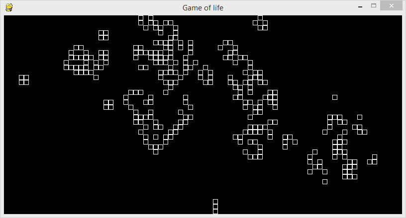

Życie Conwaya (obj)
###################

`Gra w życie`_ zrealizowana z użyciem biblioteki `PyGame`_.

.. _PyGame: http://www.pygame.org/wiki/tutorials
.. _Gra w życie: http://pl.wikipedia.org/wiki/Gra_w_życie

.. contents::
    :depth: 1
    :local:

Przygotowanie
***************

Do rozpoczęcia pracy z przykładem pobieramy szczątkowy kod źródłowy:

.. code-block:: bash

    ~/python101$ git checkout -f life/z1

Okienko gry
***************

Na wstępie w pliku ``~/python101/games/life.py`` otrzymujemy kod który przygotuje okienko naszej gry:

.. note::

    Ten przykład zakłada wcześniejsze zrealizowanie przykładu: :doc:`../pong/index`,
    opisy niektórych cech wspólnych zostały tutaj wyraźnie pominięte.
    W tym przykładzie wykorzystujemy np. podobne mechanizmy do tworzenia okna i
    zarządzania główną pętlą naszej gry.

.. raw:: html

    
Kod nr 

.. literalinclude:: code1.py
    :linenos:

W powyższym kodzie mamy podstawy potrzebne do uruchomienia gry:

.. code-block:: bash

    ~/python101$ python games/life.py

Tworzymy matrycę życia
************************

Nasza gra polega na ułożenia komórek na planszy i obserwacji jak w kolejnych generacjach
życie się zmienia, które komórki giną, gdzie się rozmnażają i wywołują efektowną wędrówkę
oraz tworzenie się ciekawych struktur.

Zacznijmy od zadeklarowania zmiennych które zastąpią nam tzw. :term:`magiczne liczby`.
W kodzie zamiast wartości ``1`` dla określenia żywej komórki i wartości ``0``
dla martwej komórki wykorzystamy zmiennie ``ALIVE`` oraz ``DEAD``. W innych językach
takie zmienne czasem są określane jako :term:`stała`.

.. raw:: html

    
Kod nr 

.. literalinclude:: code1a.py
    :linenos:
    :lines: 77-79
    :lineno-start: 77

Podstawą naszego życia będzie klasa ``Population`` która będzie przechowywać stan gry,
a także realizować funkcje potrzebne do zmian stanu gry w czasie. W przeciwieństwie do
:doc:`gry w Pong <../pong/index>` nie będziemy dzielić odpowiedzialności
pomiędzy większą liczbę klas.

.. raw:: html

    
Kod nr 

.. literalinclude:: code1a.py
    :linenos:
    :lines: 82-106
    :lineno-start: 82

Poza ostatnią linią nie ma tutaj wielu niespodzianek, ot konstruktor ``__init__``
zapamiętujący wartości konfiguracyjne w instancji naszej klasy, tj. w ``self``.

W ostatniej linii budujemy macierz dla komórek. Tablicę dwuwymiarową, którą będziemy
adresować przy pomocy współrzędnych ``x`` i ``y``.
Jeśli plansza miałaby szerokość 4, a wysokość 3
komórek to zadeklarowana ręcznie nasza tablica wyglądałaby tak:

.. raw:: html

    
Kod nr 

.. code-block:: python
    :linenos:

    generation = [
        [DEAD, DEAD, DEAD, DEAD],
        [DEAD, DEAD, DEAD, DEAD],
        [DEAD, DEAD, DEAD, DEAD],
    ]

Jednak ręczne zadeklarowanie byłoby uciążliwe i mało elastyczne, wyobraźmy sobie macierz
40 na 80 — strasznie dużo pisania! Dlatego posłużymy się pętlami i wyliczymy sobie dowolną
macierz na podstawie zadanych parametrów.

.. raw:: html

    
Kod nr 

.. code-block:: python
    :linenos:

    def reset_generation(self)
        generation = []
        for x in xrange(self.width):
            column = []
            for y in xrange(self.height)
                column.append(DEAD)
            generation.append(column)
        return generation

Powyżej wykorzystaliśmy 2 pętle (jedna zagnieżdżona w drugiej)
oraz funkcję ``xrange`` która wygeneruje listę wartości
od 0 do zadanej wartości - 1. Dzięki temu nasze pętle uzyskają ``self.width``
i ``self.height`` przebiegów. Jest lepiej.

Przykład kodu powyżej to konstrukcja którą w taki lub podobny sposób
wykorzystuje się co chwila w każdym programie — to chleb powszedni programisty.
Każdy program musi w jakiś sposób iterować po elementach list przekształcając je w inne listy.

W linii 113 mamy przykład zastosowania tzw. wyrażeń listowych (ang. list comprehensions).
Pomiędzy znakami nawiasów kwadratowych ``[ ]`` mamy pętlę, która w każdym przebiegu
zwraca jakiś element. Te zwrócone elementy napełniają nową listę która zostanie zwrócona
w wyniku wyrażenia.

Sprawę komplikuje dodaje fakt, że chcemy uzyskać tablicę dwuwymiarową dlatego mamy zagnieżdżone
wyrażenie listowe (jak 2 pętle powyżej). Zajrzyjmy najpierw do wewnętrznego wyrażenia:

.. raw:: html

    
Kod nr 

.. code-block:: python
    :linenos:

    [DEAD for y in xrange(self.height)]

W kodzie powyżej każdym przebiegu pętli uzyskamy ``DEAD``. Dzięki temu zyskamy
*kolumnę* macierzy od wysokości ``self.height``, w każdej z nich będziemy mogli się dostać do pojedynczej
komorki adresując ją listę wartością ``y`` o tak ``kolumna[y]``.

Teraz zajmijmy się zewnętrznym wyrażeniem
listowym, ale dla uproszczenia w każdym jego przebiegu zwracajmy ``nowa_kolumna``

.. raw:: html

    
Kod nr 

.. code-block:: python
    :linenos:

    [nowa_kolumna for x in xrange(self.width)]

W kodzie powyżej w każdym przebiegu pętli uzyskamy ``nowa_kolumna``. Dzięki temu zyskamy
listę *kolumn*. Do każdej z nich będziemy mogli się dostać adresując listę wartością ``x`` o tak
``generation[x]``, w wyniku otrzymamy kolumnę którą możemy adresować wartością ``y``, co w sumie
da nam macierz w której do komórek dostaniemy się o tak: ``generation[x][y]``.

Zamieniamy ``nowa_kolumna`` wyrażeniem listowym dla ``y`` i otrzymamy 1 linijkę
zamiast 7 z przykładu z podwójną pętlą:

.. raw:: html

    
Kod nr 

.. code-block:: python
    :linenos:

    [[DEAD for y in xrange(self.height)] for x in xrange(self.width)]

Układamy żywe komórki na planszy
**********************************

Teraz przygotujemy kod który dzięki wykorzystaniu myszki umożliwi nam
ułożenie planszy, będziemy wybierać gdzie na planszy będą żywe komórki.
Dodajmy do klasy ``Population`` metodę ``handle_mouse`` którą będziemy
później wywoływać w metody ``GameOfLife.handle_events`` za każdym razem
gdy nasz program otrzyma zdarzenie dotyczące myszki.

Chcemy by myszka z naciśniętym lewym klawiszem ustawiała pod kursorem
żywą komórkę. Jeśli jest naciśnięty inny klawisz to usuniemy żywą komórkę.
Jeśli żaden z klawiszy nie jest naciśnięty to zignorujemy zdarzenie myszki.

Zdarzenia są generowane w przypadku naciśnięcia klawiszy lub ruchu myszką,
nie będziemy nic robić jeśli gracz poruszy myszką bez naciskania klawiszy.

.. raw:: html

    
Kod nr 

.. literalinclude:: code1a.py
    :linenos:
    :lines: 108-128
    :lineno-start: 108

Następnie dodajmy metodę ``draw_on`` która będzie rysować żywe komórki na planszy.
Tą metodę wywołamy w metodzie ``GameOfLife.draw``.

.. raw:: html

    
Kod nr 

.. literalinclude:: code1a.py
    :linenos:
    :lines: 130-137
    :lineno-start: 130

Powyżej wykorzystaliśmy nie istniejącą metodę ``alive_cells`` która jak wynika z
jej użycia powinna zwrócić kolekcję współrzędnych dla żywych komórek.
Po jednej parze ``x, y`` dla każdej żywej komórki. Każdą żywą komórkę
narysujemy jako kwadrat w białym kolorze.

Utwórzmy metodę ``alive_cells`` która w pętli przejdzie po całej macierzy populacji
i zwróci tylko współrzędne żywych komórek.

.. raw:: html

    
Kod nr 

.. literalinclude:: code1a.py
    :linenos:
    :lines: 141-150
    :lineno-start: 141

W kodzie powyżej mamy przykład dwóch pętli przy pomocy których sprawdzamy zawartość
stan życia komórek dla wszystkich możliwych współrzędnych ``x`` i ``y`` w macierzy.
Na uwagę zasługują dwie rzeczy. Nigdzie tutaj nie zadeklarowaliśmy listy żywych komórek
— którą chcemy zwrócić — oraz instrukcję yield.

Instrukcja ``yield`` powoduje, że nasza funkcja zamiast zwykłych wartości zwróci
:term:`generator`. W skrócie w każdym przebiegu wewnętrznej pętli
zostaną *wygenerowane* i zwrócone na zewnątrz wartości ``x, y``. Za każdym razem gdy
``for x, y in self.alive_cells()`` poprosi o współrzędne następnej żywej komórki,
``alive_cells`` wykona się do instrukcji ``yield``.

.. tip::

    Działanie generatora najlepiej zaobserwować w debugerze, będziemy mogli to zrobić za
    chwilę.

Dodajemy populację do kontrolera gry
*************************************

Czas by rozwinąć nasz kontroler gry, klasę ``GameOfLife`` o instancję klasy ``Population``

.. raw:: html

    
Kod nr 

.. literalinclude:: code2.py
    :linenos:
    :lines: 38-81
    :emphasize-lines: 18, 26-28, 42-44
    :lineno-start: 38

Gotowy kod możemy wyciągnąć komendą:

.. code-block:: bash

    ~/python101$ git checkout -f life/z2

Szukamy żyjących sąsiadów
*************************************

Podstawą do określenia tego czy w danym miejscu na planszy (w współrzędnych x i y macierzy)
powstanie nowe życie, przetrwa lub zginie istniejące życie; jest określenie liczby żywych
komórek w bezpośrednim sąsiedztwie. Przygotujmy do tego metodę:

.. raw:: html

    
Kod nr 

.. literalinclude:: code2a.py
    :linenos:
    :lines: 159-183
    :lineno-start: 159

Następnie przygotujmy funkcję która będzie tworzyć nową populację

.. raw:: html

    
Kod nr 

.. literalinclude:: code2a.py
    :linenos:
    :lines: 185-209
    :lineno-start: 185

Jeszcze ostatnie modyfikacje kontrolera gry tak by komórki zaczęły żyć po wciśnięciu klawisza enter.

.. raw:: html

    
Kod nr 

.. literalinclude:: code3.py
    :linenos:
    :lines: 38-87
    :emphasize-lines: 29-30, 48-50
    :lineno-start: 1

Gotowy kod możemy wyciągnąć komendą:

.. code-block:: bash

    ~/python101$ git checkout -f life/z3

Zadania dodatkowe
*******************

#. TODO

Materiały
**********************

Słowniczek
============

.. glossary::

    magiczne liczby
        to takie same wartości liczbowe wielokrotnie używane w kodzie, za każdym
        razem oznaczające to samo. Stosowanie magicznych liczby jest uważane
        za złą praktykę ponieważ ich utrudniają czytanie i zrozumienie działania kodu.

    stała
        to zmienna której wartości po początkowym ustaleniu nie będziemy zmieniać.
        Python nie ma mechanizmów które wymuszają takie zachowanie, jednak
        przyjmuje się, że zmienne zadeklarowane WIELKIMI_LITERAMI zwykle służą do
        przechowywania wartości stałych.

    generator
        zwraca jakąś wartość za każdym wywołaniem. Dla świata zewnętrznego
        generatory zachowują się jak listy (możemy po nich iterować) jedna różnica polega
        na użyciu pamięci. Listy w całości znajdują się pamięci podczas gdy generatory
        "tworzą" wartość na zawołanie.
        Czasem tak samo nazywane są funkcje zwracające generator (ang. generator function).

Metryka
=============

:Autorzy: `Janusz Skonieczny <https://plus.google.com/+JanuszSkonieczny/>`_,
          Robert Bednarz <ecg@ecg.vot.pl>

:Utworzony: |date| o |time|

.. |date| date::
.. |time| date:: %H:%M

.. raw:: html

    

.. include:: ../../copyright.rst
