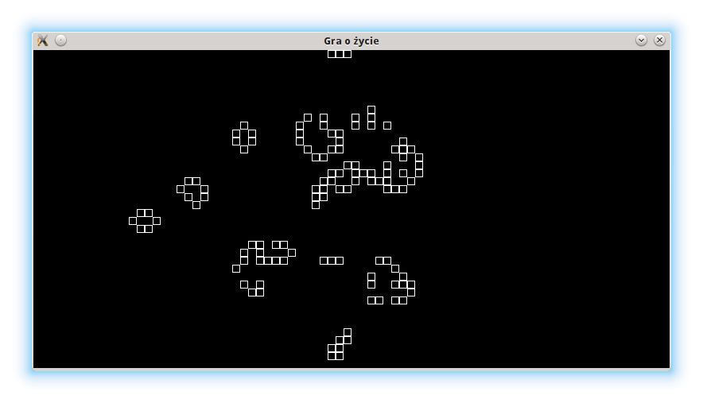

Życie Conwaya (str)
#####################

.. highlight:: python

`Gra w życie`_ zrealizowana z użyciem biblioteki `PyGame`_. Wersja strukturalna.
Biblioteka PyGame ułatwia tworzenie aplikacji multimedialnych, w tym gier.

.. _PyGame: http://www.pygame.org/wiki/tutorials
.. _Gra w życie: http://pl.wikipedia.org/wiki/Gra_w_życie

.. contents::
    :depth: 1
    :local:

Zmienne i plansza gry
****************************

Tworzymy plik ``life.py`` w terminalu lub w wybranym edytorze i zaczynamy od zdefiniowania zmiennych określających właściwości obiektów w naszej grze.

.. raw:: html

    
Kod nr 

.. literalinclude:: life_str1.py
    :linenos:

W instrukcji ``pygame.display.set_mode()`` inicjalizujemy okno gry o rozmiarach 800x400 pikseli i 32-bitowej głębi kolorów. Tworzymy w ten sposób powierzchnię główną do rysowania zapisaną w zmiennej ``OKNOGRY``. Ilość możliwych do narysowania komórek, reprezentowanych przez kwadraty o boku 10 pikseli, wyliczamy w zmiennych ``KOM_POZIOM`` i ``KOM_PION``. Najważniejszą strukturą w naszej grze jest ``POLE_GRY``, dwuwymiarowa lista elementów reprezentujących "żywe" i "martwe" komórki, czyli populację. Tworzymy ją w dwóch krokach, na początku inicjujemy zerami jednowymiarową listę o rozmiarze odpowiadającym ilości komórek w poziomie (``POLE_GRY = [KOM_MARTWA] * KOM_POZIOM``). Następnie do każdego elementu listy przypisujemy listę zawierającą tyle zer, ile jest komórek w pionie.

Populacja komórek
****************************

Kolejnym krokiem będzie zdefiniowanie funkcji przygotowującej i rysującej populację komórek.

.. raw:: html

    
Kod nr 

.. literalinclude:: life_str2.py
    :linenos:
    :lineno-start: 36
    :lines: 36-

Najważniejszym fragmentem kodu, implementującym logikę naszej gry, jest funkcja przygotuj_populacje(), która jako parametr przyjmuje omówioną wcześniej strukturę ``POLE_GRY`` (pod nazwą ``polegry``). Funkcja sprawdza, jak rozwija się populacja komórek, według następujących zasad:

1. Jeżeli żywa komórka ma mniej niż 2 żywych sąsiadów, umiera z powodu samotności.
2. Jeżeli żywa komórka ma więcej niż 3 żywych sąsiadów, umiera z powodu przeludnienia.
3. Żywa komórka z  2 lub 3 sąsiadami żyje dalej.
4. Martwa komórka z 3 żywymi sąsiadami ożywa.

Funkcja iteruje po każdym elemencie ``POLA_GRY`` i sprawdza stan sąsiadów każdej komórki, w wierszu 1 powyżej komórki, w wierszu 2 na tym samym poziomie i w wierszu 3 poniżej. Konstrukcja ``try...except`` pozwala obsłużyć sytuacje wyjątkowe (błędy), a więc komórki skrajne, które nie mają sąsiadów u góry czy u dołu, z lewej bądź z prawej strony: w takim przypadku wywoływana jest instrukcja ``pass``, czyli nie rób nic :-). Końcowa złożona instrukcja warunkowa ``if`` ożywia lub uśmierca sprawdzaną komórkę w zależności od stanu sąsiednich komórek (czyli zmiennej ``populacja``).

Zadaniem funkcji ``rysuj_populacje()`` jest narysowanie kwadratów (obiekty :term:`Rect`) o białych bokach w rozmiarze 10 pikseli dla pól (elementów), które w liście ``POLE_GRY`` są żywe (mają wartość 1).

Główna pętla programu
****************************

Programy interaktywne, w tym gry, reagujące na działania użytkownika, takie jak ruchy czy kliknięcia myszą, działają w pętli, której zadaniem jest:

1. przechwycenie i obsługa działań użytkownika, czyli tzw. zdarzeń (ruchy, kliknięcia myszą, naciśnięcie klawiszy),
2. aktualizacja stanu gry (przesunięcia elementów, aktualizacja planszy),
3. aktualizacja wyświetlanego okna (narysowanie nowego stanu gry).

Dopisujemy więc do kodu główną pętlę wraz z obsługą zdarzeń:

.. raw:: html

    
Kod nr 

.. literalinclude:: life_str3.py
    :linenos:
    :lineno-start: 99
    :lines: 99-

W obrębie głównej pętli programu pętla ``for`` odczytuje kolejne zdarzenia zwracane przez metodę ``pygame.event.get()``. Jak widać, w pierwszej kolejności obsługujemy wydarzenie typu (właściwość ``.type``) QUIT, czyli zakończenie aplikacji.

Jednak na początku gry gracz klika lewym lub prawym klawiszem myszy i ożywia lub uśmierca kliknięte komórki w obrębie okna gry. Dzieje się tak dopóty, dopóki zmienna ``zycie_trwa`` ma wartość ``False``, a więc dopóki gracz nie naciśnie klawisza ENTER (``if event.type == KEYDOWN and event.key == K_RETURN:``). Każde kliknięcie myszą zostaje przechwycone (``if event.type == MOUSEBUTTONDOWN:``) i zapamiętane w zmiennej ``przycisk_wdol``. Jeżeli zmienna ta ma wartość ``True``, pobieramy współrzędne kursora myszy (``mouse_x, mouse_y = pygame.mouse.get_pos()``) i obliczamy indeksy elementu listy ``POLE_GRY`` odpowiadającego klikniętej komórce. Następnie sprawdzamy, który przycisk myszy został naciśnięty; informację tę zapisaliśmy wcześniej za pomocą funkcji ``event.button`` w zmiennej ``przycisk_typ``, która przyjmuje wartość 1 (lewy) lub 3 (prawy przycisk myszy), w zależności od klikniętego przycisku ożywiamy lub uśmiercamy komórkę, zapisując odpowiedni stan w liście ``POLE_GRY``.

Naciśnięcie klawisza ENTER uruchamia symulację rozwoju populacji. Zmienna ``zycie_trwa`` ustawiona zostaje na wartość ``True`` , co przerywa obsługę kliknięć myszą, i wywoływana jest funkcja ``przygotuj_populacje()``, która przygotowuje kolejny stan populacji. Końcowe polecenia wypełniają okno gry kolorem (``.fill()``), wywołują funkcję rysującą planszę (``rysuj_populacje()``). Funkcja ``pygame.display.update()``, która musi być wykonywana na końcu rysowania, aktualizuje obraz gry na ekranie. Ostatnie polecenie ``pygame.time.delay(100)`` dodaje 100-milisekundowe opóźnienie kolejnej aktualizacji stanu populacji. Dzięki temu możemy obserwować jej rozwój na planszy.

Grę możemy uruchomić poleceniem wpisanym w terminalu:

.. code:: bash

    $ python life_str.py

Poćwicz sam
****************************

    Spróbuj inaczej zaimplementować funkcję ``przygotuj_populacje``.
    Spróbuj zmodyfikować kod tak, aby plansza gry była biała, a komórki rysowane były
    jako kolorowe kwadraty o różniącym się od wypełnienia obramowaniu.

Materiały
****************************

Źródła
===================

* :download:`life_str.zip <life_str.zip>`
* :download:`life_str.pdf <../../pdf/life_str.pdf>`

Kolejne wersje tworzenego kodu można pobierać wydając polecenia:

.. code-block:: bash

    ~/python101$ git checkout -f life/str1
    ~/python101$ git checkout -f life/str2
    ~/python101$ git checkout -f life/str3

Uruchamiamy je wydając polecenie:

.. code-block:: bash

    ~/python101$ cd docs/life_str
    ~/python101/docs/life_str$ python life_strx.py

\- gdzie *x* jest numerem kolejnej wersji kodu.

Słownik
===================

.. include:: ../glossary.rst

