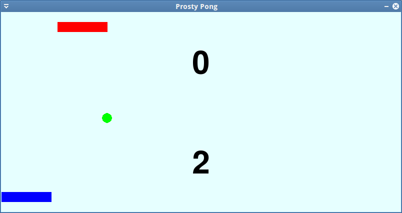

Pong (str)
###################

.. highlight:: python

Klasyczna gra w odbijanie piłeczki zrealizowana z użyciem biblioteki `PyGame`_. Wersja strukturalna.
Biblioteka PyGame ułatwia tworzenie aplikacji multimedialnych, w tym gier.

.. _PyGame: http://www.pygame.org/wiki/tutorials

.. contents::
    :depth: 1
    :local:

Zmienne i plansza gry
***********************

Tworzymy plik ``pong_str.py`` w terminalu lub w wybranym edytorze, zapisujemy na dysku i zaczynamy od zdefiniowania zmiennych określających właściwości obiektów w naszej grze.

.. raw:: html

    
Kod nr 

.. literalinclude:: pong_str1.py
    :linenos:

W instrukcji ``pygame.display.set_mode()`` inicjalizujemy okno gry o rozmiarach 800x400 pikseli i 32 bitowej głębi kolorów. Tworzymy w ten sposób powierzchnię główną do rysowania zapisaną w zmiennej OKNOGRY. Definujemy również kolory w formacie RGB (Red, Green, Blue) podając składowe poszczegónych kanałów w tuplach, np. ``(0, 0, 255)``.

Obiekty graficzne
***********************

W dalszej kolejności zamiemy się określeniem właściwości i inicjalizacją paletek i piłki.

.. raw:: html

    
Kod nr 

.. literalinclude:: pong_str2.py
    :linenos:
    :lineno-start: 34
    :lines: 34-

Schemat dodawania obiektów graficznych jest prosty. Po określeniu wymiarów obiektu (szerokości i wysokości), tworzymy powierzchnię (``pygame.Surface``), którą wypełniamy odpowiednim kolorem (``.fill()``). W przypadku piłki do metody ``Surface()`` przekazujemy dodatkowe argumenty (``pygame.SRCALPHA``) umożliwiające uzyskanie powierzchni z przezroczystymi pikselami (z kanałem alpha), na której rysujemy koło (``pygame.draw.ellipse()``) o podanym kolorze, środku i rozmiarach. W kolejnym kroku pobieramy prostokąt (np. ``paletka1_prost = paletka1_obr.get_rect()``) zajmowany przez obiekt, za pomocą którego łatwiej ustawić wstępne położenie obiektu, a później nim manipulować (właściwości ``.x`` i ``.y`` obiektu :term:`Rect` zwróconego przez metodę ``.get_rect()``).

Wyświetlanie tekstu
***********************

W grze chcemy wyświetlać punkty zdobywane przez graczy. Dopisujemy więc poniższy kod:

.. raw:: html

    
Kod nr 

.. literalinclude:: pong_str3.py
    :linenos:
    :lineno-start: 72
    :lines: 72-

Po zdefiniowaniu zmiennych przechowujących punkty graczy, tworzymy obiekt czcionki z podanego pliku (``pygame.font.Font()``). Następnie definujemy funkcje, których zadaniem jest rysowanie punktacji graczy. Na początku tworzą one nową powierzchnię z punktacją gracza (``.render()``), pobierają jej prostokąt (``.get_rect()``), pozycjonują go (``.center()``) i rysują na głównej powierzchni gry (``.blit()``).

.. note::
    Plik wykorzystywany do wyświetlania tekstu (``freesansbold.ttf``) musi znaleźć się w katalogu ze skryptem.

Główna pętla programu
***********************

Programy interaktywne, w tym gry, reagujące na działania użytkownika, takie jak ruchy czy kliknięcia myszą, działają w pętli, której zadaniem jest:

* przechwycenie i obsługa działań użytkownika, czyli tzw. zdarzeń (ruchy, kliknięcia myszą, naciśnięcie klawiszy),
* aktualizacja stanu gry (przesunięcia elementów, aktualizacja planszy),
* aktualizacja wyświetlanego okna (narysowanie nowego stanu gry).

Dopisujemy więc do kodu główną pętlę wraz z obsługą zdarzeń:

.. raw:: html

    
Kod nr 

.. literalinclude:: pong_str4.py
    :linenos:
    :lineno-start: 95
    :lines: 95-

W obrębie głównej pętli programu pętla ``for`` odczytuje kolejne zdarzenia zwracane przez metodę ``pygame.event.get()``. Jak widać, za pomocą instrukcji warunkowych (``if event.type ==``) obsługujemy wydarzenia typu QUIT, czyli zakończenie aplikacji, oraz MOUSEMOTION, a więc ruch myszy W tym drugim przypadku pobieramy współrzędne kursora (``event.pos``) i obliczamy przesunięcie myszy w poziomie. Kolejne instrukcje uniemożliwiają wyjście paletki gracza poza okno gry.
Do pętli głównej musimy dopisać jeszcze kod kontrolujący paletkę komputera, piłkę i jej interakcje ze ścianami okna gry oraz paletkami, a także rysujący poszczególne obiekty:

.. raw:: html

    
Kod nr 

.. literalinclude:: pong_str5.py
    :linenos:
    :lineno-start: 119
    :lines: 119-

Komentarze w kodzie wyjaśniają kolejne czynności. Warto zwrócić uwagę na sposób odczytywania pozycji obiektów klasy ``Rect`` (prostokątów), czyli właściwości ``.x, .y, .centerx, .right, .left, .top, .bottom``; oraz na sprawdzanie kolizji piłki z paletkami, czyli metodę ``.colliderect()``. Ostatnie linie kodu rysują okno gry i obiekty (tekst z wynikami graczy, paletki i piłkę) ze zmienionymi właściwościami (liczba punktów, położenie). Funkcja ``pygame.display.update()``, która musi być wykonywana na końcu rysowania, aktualizuje obraz gry na ekranie. Ostatnia linia natomiast (``fpsClock.tick()``) blokuje grę na 30 klatek na sekundę, aby nie działała tak szybko jak pozwala sprzęt, lecz ze stałą prędkością.

Grę możemy uruchomić poleceniem wpisanym w terminalu:

.. code:: bash

    $ python pong_str.py

Poćwicz sam
***********************

    Zmodyfikuj właściwości obiektów (paletek, piłki) takie jak rozmiar, kolor, początkowa pozycja.
    Zmień położenie paletek tak aby znalazły przy lewej i prawej krawędzi okna, wprowadź potrzebne zmiany w kodzie, aby umożliwić rozgrywkę.
    Dodaj trzecią paletkę, która co jakiś czas będzie "przelatywać" przez środek planszy i zmieniać w przypadku kolizji tor i kolor piłki.

Materiały
**************

Źródła
==============

* :download:`pong_str.zip <pong_str.zip>`
* :download:`pong_str.pdf <../../pdf/pong_str.pdf>`

Kolejne wersje tworzenego kodu można pobierać wydając polecenia:

.. code-block:: bash

    ~/python101$ git checkout -f pong/str1
    ~/python101$ git checkout -f pong/str2
    ~/python101$ git checkout -f pong/str3
    ~/python101$ git checkout -f pong/str4
    ~/python101$ git checkout -f pong/str5

Uruchamiamy je wydając polecenie:

.. code-block:: bash

    ~/python101$ cd docs/pong_str
    ~/python101/docs/pong_str$ python pong_strx.py

\- gdzie *x* jest numerem kolejnej wersji kodu.

Słownik
==============

.. include:: ../glossary.rst

