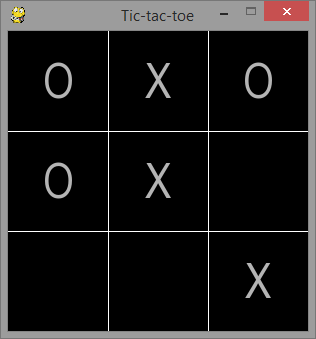

Kółko i krzyżyk (obj)
##########################

.. highlight:: python

Klasyczna gra w kółko i krzyżyk zrealizowana przy pomocy  `PyGame`_.

.. _PyGame: http://www.pygame.org/wiki/tutorials

.. contents::
    :depth: 1
    :local:

Okienko gry
**************************

Na wstępie w pliku ``~/python101/games/tic_tac_toe.py`` otrzymujemy kod który przygotuje okienko naszej gry:

.. note::

    Ten przykład zakłada wcześniejsze zrealizowanie przykładu: :doc:`../life/index`,
    opisy niektórych cech wspólnych zostały tutaj wyraźnie pominięte.
    W tym przykładzie wykorzystujemy np. podobne mechanizmy do tworzenia okna i
    zarządzania główną pętlą naszej gry.

.. warning::

    TODO: Wymaga ewentualnego rozbicia i uzupełnienia opisów.

.. raw:: html

    
Kod nr 

.. literalinclude:: code0.py
    :linenos:

W powyższym kodzie mamy podstawy potrzebne do uruchomienia gry:

.. code-block:: bash

    ~/python101$ python games/tic_tac_toe.py
