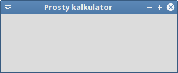

.. _kalkulator:

Kalkulator
###########################

.. highlight:: python

Prosta 1-okienkowa aplikacja ilustrująca podstawy tworzenia interfejsu graficznego
i obsługi działań użytkownika za pomocą Pythona (PyQt5) i biblioteki Qt5.
Przykład wprowadza również podstawy `programowania obiektowego <https://pl.wikipedia.org/wiki/Programowanie_obiektowe>`_
(ang. Object Oriented Programing).

.. figure:: img/kalkulator05.png

.. attention::

    **Wymagane oprogramowanie**:

      * Python v. 3.x
      * PyQt v. => 5.2.1

.. contents::
    :depth: 1
    :local:

Pokaż okno
***********

Zaczynamy od utworzenia pliku o nazwie :file:`kalkulator.py` w dowolnym katalogu
za pomocą dowolnego edytora. Wstawiamy do niego poniższy kod:

.. raw:: html

    
Kod nr 

.. highlight:: python
.. literalinclude:: kalkulator01.py
    :linenos:

Podstawą naszego programu będzie moduł ``PyQt5.QtWidgets``, z którego importujemy
klasy ``QApplication`` i ``QWidget`` – podstawową klasę wszystkich elementów interfejsu graficznego.

Wygląd okna naszej aplikacji definiować będziemy za pomocą klasy *Kalkulator*
dziedziczącej (zob. :term:`dziedziczenie`) właściwości i metody z klasy *QWidget* (``class Kalkulator(QWidget)``).
Instrukcja ``super().__init()__`` zwraca nam klasę rodzica i wywołuje jego :term:`konstruktor`.
Z kolei w konstruktorze naszej klasy wywołujemy metodę ``interfejs()``,
w której tworzyć będziemy :term:`GUI` naszej aplikacji. Ustawiamy więc właściwości
okna aplikacji i jego zachowanie:

* ``self.resize(300, 100)`` – szerokość i wysokość okna;
* ``setWindowTitle("Prosty kalkulator")``) – tytuł okna;
* ``self.show()`` – wyświetlenie okna na ekranie.

.. note::

    Słowa ``self`` używamy wtedy, kiedy odnosimy się do właściwości lub metod,
    również odziedziczonych, jej instancji, czyli obiektów.
    Słowo to zawsze występuje jako pierwszy parametr metod obiektu definiowanych
    jako funkcje w definicji klasy. Zob. `What is self? <https://docs.python.org/3/faq/programming.html#what-is-self>`_

Aby uruchomić program, tworzymy obiekt reprezentujący aplikację: ``app = QApplication(sys.argv)``.
Aplikacja może otrzymywać parametry z linii poleceń (``sys.argv``). Tworzymy również
obiekt reprezentujący okno aplikacji, czyli instancję klasy *Kalkulator*: ``okno = Kalkulator()``.

Na koniec uruchamiamy **główną pętlę programu** (``app.exec_()``), która rozpoczyna obsługę
zdarzeń (zob. :term:`główna pętla programu`). Zdarzenia (np. kliknięcia) generowane są przez
system lub użytkownika i przekazywane do widżetów aplikacji, które mogą je obsługiwać.

.. note::

    Jeżeli jakaś metoda, np. ``exec_()``, ma na końcu podkreślenie, to dlatego, że jej nazwa
    pokrywa się z zarezerwowanym słowem kluczowym Pythona. Podkreślenie służy
    ich rozróżnieniu.

Poprawne zakończenie aplikacji zapewniające zwrócenie informacji o jej stanie do systemu
zapewnia metoda ``sys.exit()``.

Przetestujmy kod. Program uruchamiamy poleceniem wydanym w terminalu w katalogu ze skryptem:

.. code-block:: bash

    ~$ python3 kalkulator.py

Widżety
**********

Puste okno być może nie robi wrażenia, zobaczymy więc, jak tworzyć widżety (zob. :term:`widżet`).
Najprostszym przykładem będą etykiety.

Dodajemy wymagane importy i rozbudowujemy metodę ``interfejs()``:

.. raw:: html

    
Kod nr 

.. highlight:: python
.. literalinclude:: kalkulator02.py
    :linenos:
    :lineno-start: 5
    :lines: 5-6

.. raw:: html

    
Kod nr 

.. highlight:: python
.. literalinclude:: kalkulator02.py
    :linenos:
    :lineno-start: 16
    :lines: 16-35

Dodawanie etykiet zaczynamy od utworzenia obiektów na podstawie odpowiedniej klasy,
w tym wypadku `QtLabel <http://doc.qt.io/qt-5/qlabel.html>`_. Do jej konstruktora
przekazujemy tekst, który ma się wyświetlać na etykiecie, np.: ``etykieta1 = QLabel("Liczba 1:")``.

Później tworzymy pomocniczy obiekt służący do rozmieszczenia etykiet w układzie
tabelarycznym: ``ukladT = QGridLayout()``. Kolejne etykiety dodajemy do niego za
pomocą metody ``addWidget()``. Przyjmuje ona nazwę obiektu oraz numer wiersza i kolumny
definiujących komórkę, w której znaleźć się ma obiekt. Zdefiniowany układ
(ang. layout) musimy powiązać z oknem naszej aplikacji: ``self.setLayout(ukladT)``.

Na koniec używamy metody ``setGeometry()`` do określenia położenia okna aplikacji
(początek układu jest w lewym górnym rogu ekranu) i jego rozmiaru (szerokość, wysokość).
Dodajemy również ikonę pokazywaną w pasku tytułowym lub w miniaturze na pasku zadań:
``self.setWindowIcon(QIcon('kalkulator.png'))``.

.. note::

    Plik graficzny z ikoną musimy :download:`pobrać <kalkulator.png>` i umieścić w katalogu
    z aplikacją, czyli ze skryptem :file:`kalkulator.py`.

Przetestuj wprowadzone zmiany.

.. figure:: img/kalkulator02.png

Interfejs
**********

Dodamy teraz pozostałe widżety tworzące graficzny interfejs naszej aplikacji.
Jak zwykle, zaczynamy od zaimportowania potrzebnych klas:

.. raw:: html

    
Kod nr 

.. highlight:: python
.. literalinclude:: kalkulator03.py
    :linenos:
    :lineno-start: 7
    :lines: 7

Następnie przed instrukcją ``self.setLayout(ukladT)`` wstawiamy następujący kod:

.. raw:: html

    
Kod nr 

.. highlight:: python
.. literalinclude:: kalkulator03.py
    :linenos:
    :lineno-start: 30
    :lines: 30-56

Jak widać, dodawanie widżetów polega zazwyczaj na:

* **utworzeniu obiektu** na podstawie klasy opisującej potrzebny element interfejsu,
  np. `QLineEdit <http://doc.qt.io/qt-5/qlineedit.html>`_ – 1-liniowe pole edycyjne, lub
  `QPushButton <http://doc.qt.io/qt-5/qpushbutton.html>`_ – przycisk;
* **ustawieniu właściwości** obiektu, np. ``self.wynikEdt.readonly = True`` umożliwia tylko odczyt tekstu pola,
  ``self.wynikEdt.setToolTip('Wpisz <b>liczby</b> i wybierz działanie...')`` – ustawia podpowiedź,
  a ``koniecBtn.resize(koniecBtn.sizeHint())`` – sugerowany rozmiar obiektu;
* **przypisaniu obiektu do układu** – w powyższym przypadku wszystkie przyciski działań dodano
  do układu horyzontalnego `QHBoxLayout <http://doc.qt.io/qt-5/qhboxlayout.html>`_, ponieważ przycisków jest 4, a dopiero jego instancję do układu tabelarycznego: ``ukladT.addLayout(ukladH, 2, 0, 1, 3)``.
  Liczby w tym przykładzie oznaczają odpowiednio wiersz i kolumnę, tj. komórkę, do której wstawiamy obiekt,
  a następnie ilość wierszy i kolumn, które chcemy wykorzystać.

.. note::

    Jeżeli chcemy mieć dostęp do właściwości obiektów interfejsu w zasięgu całej klasy,
    czyli w innych funkcjach obiekty musimy definiować jako składowe klasy, a więc
    poprzedzone słowem ``self``, np.: ``self.liczba1Edt = QLineEdit()``.

W powyższym kodzie, np. ``dodajBtn = QPushButton("&Dodaj", self)``, widać również, że tworząc obiekty można
określać ich rodzica (ang. *parent*), tzn. widżet nadrzędny, w tym wypadku ``self``, czyli okno główne
(ang. *toplevel window*). Bywa to przydatne zwłaszcza przy bardziej złożonych interfejsach.

Znak ``&`` przed jakąś literą w opisie przycisków tworzy z kolei skrót klawiaturowy dostępny po naciśnięciu :kbd:`ALT + litera`.

Po uruchomieniu programu powinniśmy zobaczyć okno podobne do poniższego:

.. figure:: img/kalkulator03.png

Zamykanie programu
*******************

Mamy okienko z polami edycyjnymi i przyciskami, ale kontrolki te na nic nie reagują.
Nauczymy się więc obsługiwać poszczególne zdarzenia. Zacznijmy od zamykania aplikacji.

Na początku zaimportujmy klasę *QMessageBox* pozwalającą tworzyć komunikaty
oraz przestrzeń nazw `Qt <http://doc.qt.io/qt-5/qt.html>`_ zawierającą różne stałe:

.. raw:: html

    
Kod nr 

.. highlight:: python
.. literalinclude:: kalkulator04.py
    :linenos:
    :lineno-start: 8
    :lines: 8-9

Dalej po instrukcji ``self.setLayout(ukladT)`` w metodzie ``interfejs()`` dopisujemy:

.. raw:: html

    
Kod nr 

.. highlight:: python
.. literalinclude:: kalkulator04.py
    :linenos:
    :lineno-start: 64
    :lines: 64

– instrukcja ta wiąże kliknięcie przycisku "Koniec" z wywołaniem metody ``koniec()``,
którą musimy dopisać na końcu klasy ``Kalkulator()``:

.. raw:: html

    
Kod nr 

.. highlight:: python
.. literalinclude:: kalkulator04.py
    :linenos:
    :lineno-start: 71
    :lines: 71-72

Funkcja ``koniec()``, obsługująca wydarzenie (ang. *event*) kliknięcia przycisku,
wywołuje po prostu metodę ``close()`` okna głównego.

.. note::

    Omówiony fragment kodu ilustruje mechanizm zwany :term:`sygnały i sloty` (ang. *signals & slots*).
    Zapewnia on komunikację między obiektami. Sygnał powstaje w momencie wystąpienia jakiegoś wydarzenia,
    np. kliknięcia. Slot może z kolei być wbudowaną w Qt funkcją lub Pythonowym wywołaniem (ang. *callable*),
    np. klasą lub metodą.

Zamknięcie okna również jest rodzajem wydarzenia (`QCloseEvent <http://doc.qt.io/qt-5/qcloseevent.html>`_),
które można przechwycić. Np. po to, aby zapobiec utracie niezapisanych danych.
Do klasy ``Kalkulator()`` dopiszmy następujący kod:

.. raw:: html

    
Kod nr 

.. highlight:: python
.. literalinclude:: kalkulator04.py
    :linenos:
    :lineno-start: 74
    :lines: 74-84

W nadpisanej metodzie `closeEvent() <http://doc.qt.io/qt-5/qwidget.html#closeEvent>`_
wyświetlamy użytkownikowi prośbę o potwierdzenie zamknięcia
za pomocą metody ``question()`` (ang. pytanie) klasy `QMessageBox <http://doc.qt.io/qt-5/qmessagebox.html>`_.
Do konstruktora metody przekazujemy:

* obiekt rodzica – ``self`` oznacza okno główne;
* tytuł kona dialogowego;
* komunikat dla użytkownika, np. pytanie;
* kombinację standardowych przycisków, np. ``QMessageBox.Yes | QMessageBox.No``;
* przycisk domyślny – ``QMessageBox.No``.

Udzielona odpowiedź ``odp``, np. kliknięcie przycisku "Tak", decyduje o zezwoleniu
na obsłużenie wydarzenia ``event.accept()`` lub odrzuceniu go ``event.ignore()``.

Może wygodnie byłoby zamykać aplikację naciśnięciem klawisza :kbd:`ESC`?
Dopiszmy jeszcze jedną funkcję:

.. raw:: html

    
Kod nr 

.. highlight:: python
.. literalinclude:: kalkulator04.py
    :linenos:
    :lineno-start: 86
    :lines: 86-88

Podobnie jak w przypadku ``closeEvent()`` tworzymy własną wersję funkcji
`keyPressEvent <http://doc.qt.io/qt-5/qwidget.html#keyPressEvent>`_ obsługującej
naciśnięcia klawiszy `QKeyEvent <http://doc.qt.io/qt-5/qkeyevent.html>`_.
Sprawdzamy naciśnięty klawisz ``if e.key() == Qt.Key_Escape:`` i zamykamy okno.

Przetestuj działanie aplikacji.

.. figure:: img/kalkulator04.png

Działania
*********

Kalkulator powinien liczyć. Zaczniemy od dodawania, ale na początku wszystkie
sygnały wygenerowane przez przyciski działań połączymy z jednym slotem.
Pod instrukcją ``koniecBtn.clicked.connect(self.koniec)`` dodajemy:

.. raw:: html

    
Kod nr 

.. highlight:: python
.. literalinclude:: kalkulator05.py
    :linenos:
    :lineno-start: 65
    :lines: 65-68

Następnie zaczynamy implementację funkcji ``dzialanie()``. Na końcu klasy ``Kalkulator()`` dodajemy:

.. raw:: html

    
Kod nr 

.. highlight:: python
.. literalinclude:: kalkulator05.py
    :linenos:
    :lineno-start: 94
    :lines: 94-111

Ponieważ jedna funkcja ma obsłużyć cztery sygnały, musimy znać źródło sygnału (ang. *source*),
czyli nadawcę (ang. *sender*): ``nadawca = self.sender()``.
Dalej rozpoczynamy blok ``try: except:`` – użytkownik może wprowadzić błędne dane,
tj. pusty ciąg znaków lub ciąg, którego nie da się przekształcić na liczbę zmiennoprzecinkową (``float()``).
W przypadku wyjątku, wyświetlamy ostrzeżenie o błędnych danych: ``QMessageBox.warning()``

Jeżeli dane są liczbami, sprawdzamy nadawcę (``if nadawca.text() == "&Dodaj":``)
i jeżeli jest to przycisk dodawania, obliczamy sumę ``wynik = liczba1 + liczba2``.
Na koniec wyświetlamy ją po zamianie na tekst (``str()``) w polu tekstowym za pomocą
metody ``setText()``: ``self.wynikEdt.setText(str(wynik))``.

Sprawdź działanie programu.

.. figure:: img/kalkulator05.png

Dopiszemy obsługę pozostałych działań. Instrukcję warunkową w funkcji ``dzialanie()``
rozbudowujemy następująco:

.. raw:: html

    
Kod nr 

.. highlight:: python
.. literalinclude:: kalkulator06.py
    :linenos:
    :lineno-start: 103
    :lines: 103-115

Na uwagę zasługuje tylko dzielenie. Po pierwsze określamy dokładność dzielenia do 9
miejsc po przecinku ``round(liczba1 / liczba2, 9)``. Po drugie zabezpieczamy się
przed dzieleniem przez zero. Znów wykorzystujemy konstrukcję ``try: except:``,
w której przechwytujemy wyjątek ``ZeroDivisionError`` i wyświetlamy odpowiednie ostrzeżenie.

Pozostaje przetestować aplikację.

.. figure:: img/kalkulator06.png

.. tip::

    Jeżeli po zaimplementowaniu działań, aplikacja po uruchomieniu nie aktywuje kursora
    w pierwszym polu edycyjnym, należy tuż przed ustawianiem właściwości okna głównego
    (``self.setGeometry()``) umieścić wywołanie ``self.liczba1Edt.setFocus()``,
    które ustawia focus na wybranym elemencie.

Materiały
***************

1. Strona główna `dokumentacji Qt5 <http://doc.qt.io/qt-5/>`_
2. `Lista klas Qt5 <http://doc.qt.io/qt-5/classes.html>`_
3. `PyQt5 Reference Guide <http://pyqt.sourceforge.net/Docs/PyQt5/>`_
4. `Przykłady PyQt5 <https://github.com/baoboa/pyqt5/tree/master/examples>`_
5. `Signals and slots <http://doc.qt.io/qt-5/signalsandslots.html>`_
6. `Kody klawiszy <http://doc.qt.io/qt-5/qt.html#Key-enum>`_

**Źródła:**

* :download:`Kalkulator Qt5 <kalkulator_qt5.zip>`
* :download:`Kalkulator Qt4 <kalkulator_qt4.zip>`
