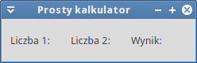

.. _kalkulator:

Kalkulator
###########################

.. highlight:: python

Prosta 1-okienkowa aplikacja ilustrująca podstawy tworzenia interfejsu graficznego
i obsługi działań użytkownika za pomocą Pythona (PyQt5) i biblioteki Qt5.
Przykład wprowadza również podstawy `programowania obiektowego <https://pl.wikipedia.org/wiki/Programowanie_obiektowe>`_
(ang. Object Oriented Programing).

.. attention::

    **Wymagane oprogramowanie**:

      * Python v. 3.x
      * PyQt v. => 5.2.1

.. contents::
    :depth: 1
    :local:

Pokaż okno
***********

Zaczynamy od utworzenia pliku o nazwie :file:`kalkulator.py` w dowolnym katalogu
za pomocą dowolnego edytora. Wstawiamy do niego poniższy kod:

.. raw:: html

    
Kod nr 

.. highlight:: python
.. literalinclude:: kalkulator01.py
    :linenos:

Podstawą naszego programu będzie moduł ``PyQt5.QtWidgets``, z którego importujemy
klasy ``QApplication`` i ``QWidget`` – podstawową klasę wszystkich elementów interfejsu graficznego.

Wygląd okna naszej aplikacji definiować będziemy za pomocą klasy *Kalkulator*
dziedziczącej właściwości i metody z klasy *QWidget* (``class Kalkulator(QWidget)``).
Instrukcja ``super().__init()__`` zwraca nam klasę rodzica i wywołuje jego :term:`konstruktor`.
Z kolei w konstruktorze naszej klasy wywołujemy metodę ``interfejs()``,
w której tworzyć będziemy :term:`GUI` naszej aplikacji. Ustawiamy więc właściwości
okna aplikacji i jego zachowanie:

* ``self.resize(300, 100)`` – szerokość i wysokość okna;
* ``setWindowTitle("Prosty kalkulator")``) – tytuł okna;
* ``self.show()`` – wyświetlenie okna na ekranie.

.. note::

    Słowa ``self`` używamy w definicji klasy wtedy, kiedy odnosimy się do jej właściwości lub metod
    oraz odziedziczonych. Słowo to zawsze podajemy również jako pierwszy parametr
    funkcji definiującyhc metody klasy.

Aby uruchomić program, tworzymy obiekt reprezentujący aplikację: ``app = QApplication(sys.argv)``.
Aplikacja może otrzymywać parametry z linii poleceń (``sys.argv``). Tworzymy również
obiekt reprezentujący okno aplikacji, czyli instancję klasy *Kalkulator*: ``okno = Kalkulator()``.

Na koniec uruchamiamy **główną pętlę programu** (``app.exec_()``), która rozpoczyna obsługę
zdarzeń (zob. :term:`główna pętla programu`). Zdarzenia (np. kliknięcia) generowane są przez
system lub użytkownika i przekazywane do widżetów aplikacji, które mogą je obsługiwać.

.. note::

    Metoda ``exec_()`` ma podkreślenie, ponieważ ``exec`` jest zarezerwowanym słowem
    kluczowym Pythona.

Poprawne zakończenie aplikacji zapewniające zwrócenie informacji o jej stanie do systemu
zapewnia metoda ``sys.exit()``.

Przetestujmy kod. Program uruchamiamy poleceniem wydanym w terminalu w katalogu ze skryptem:

.. code-block:: bash

    ~$ python3 kalkulator.py

.. figure:: img/kalkulator01.png

Dodajemy widżety
****************

Puste okno być może nie robi wrażenia, zobaczymy więc, jak tworzyć widżety (zob. :term:`widżet`),
czyli składniki interfejsu takie jak etykiety, przyciski, pola edycyjne itd.

Dodajemy wymagane importy i rozbudowujemy metodę ``interfejs()``:

.. raw:: html

    
Kod nr 

.. highlight:: python
.. literalinclude:: kalkulator02.py
    :linenos:
    :lineno-start: 5
    :lines: 5-6

.. raw:: html

    
Kod nr 

.. highlight:: python
.. literalinclude:: kalkulator02.py
    :linenos:
    :lineno-start: 16
    :lines: 16-35

Dodawanie etykiet zaczynamy od utworzenia obiektów na podstawie odpowiedniej klasy Qt,
w tym wypadku *QtLabel*. Do jej konstruktora przekazujemy tekst, który ma się wyświetlać
na etykiecie, np.: ``self.etykieta1 = QLabel("Liczba 1:")``.

Później tworzymy pomocniczy obiekt służący do rozmieszczenia etykiet w układzie
tabelarycznym: ``ukladT = QGridLayout()``. Kolejne etykiety dodajemy do niego za
pomocą metody ``addWidget()``. Przyjmuje ona nazwę obiektu oraz numer wiersza i kolumny
definiujących komórkę, w której znaleźć się ma obiekt. Zdefiniowany układ
(ang. layout) musimy powiązać z oknem naszej aplikacji: ``self.setLayout(ukladT)``.

Na koniec używamy metody ``setGeometry()`` do określenia położenia okna aplikacji
(początek układu jest w lewym górnym rogu ekranu) i jego rozmiaru (szerokość, wysokość).
Dodajemy również ikonę pokazywaną w pasku tytułowym lub w miniaturze na pasku zadań:
``self.setWindowIcon(QIcon('kalkulator.png'))``.

.. note::

    Plik graficzny z ikoną musimy :download:`pobrać <kalkulator.png>` i umieścić w katalogu
    z aplikacją, czyli ze skryptem :file:`kalkulator.py`.

Przetestuj wprowadzone zmiany.

[cdn.]

Materiały
***************

1. `Dokumentacja Qt5 <http://doc.qt.io/qt-5/>`_
