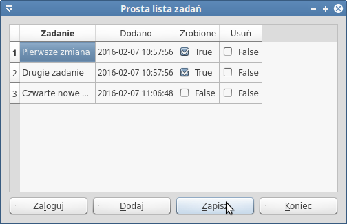
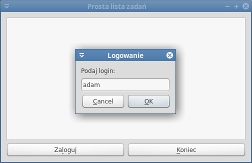
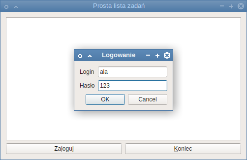
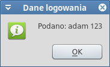
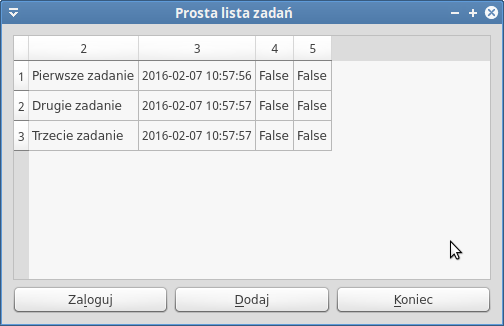
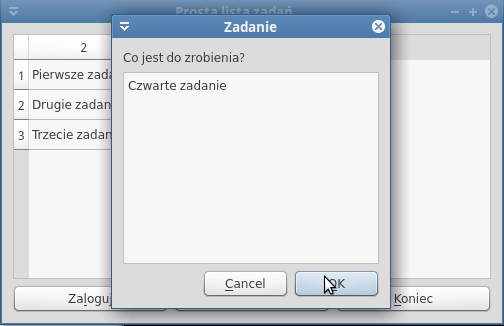
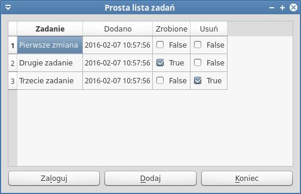

.. _todopw:

ToDoPw
###########################

.. highlight:: python

Realizacja prostej listy zadań do zrobienia jako aplikacji okienkowej,
z wykorzystaniem biblioteki Qt5 i wiązań Pythona PyQt5.
Aplikacja umożliwia dodawanie, usuwanie, edycję i oznaczanie jako wykonane zadań,
zapisywanych w bazie SQLite obsługiwanej za pomocą systemu ORM `Peewee <http://docs.peewee-orm.com/en/latest/>`_.

Przykład wykorzystuje `programowanie obiektowe <https://pl.wikipedia.org/wiki/Programowanie_obiektowe>`_ (ang. *Object Oriented Programing*) i ilustruje technikę `programowania model/widok <http://doc.qt.io/qt-5/model-view-programming.html>`_ (ang. *Model/View Programming*).

.. attention::

    **Wymagane oprogramowanie**:

      * Python v. 3.x
      * PyQt v. => 5.2.1
      * Peewee dla Pythona v. 3.x

    **Wymagana wiedza**:

    	* Znajomość Pythona w stopniu średnim.
    	* Znajomość podstaw projektowania interfejsu z wykorzystaniem biblioteki Qt
    	  (zob. scenariusze :ref:`Kalkulator <kalkulator>` i :ref:`Widżety <widzety>`).
        * Znajomość podstaw systemów ORM (zob. scenariusz :ref:`Systemy ORM <systemy_orm>`).

.. contents::
    :depth: 1
    :local:

Interfejs
**********

Budowanie aplikacji zaczniemy od przygotowania podstawowego interfejsu.
Na początku utwórzmy katalog aplikacji, w którym zapisywać będziemy wszystkie pliki:

.. code-block:: bash

    ~$ mkdir todopw

Następnie w dowolnym edytorze tworzymy plik o nazwie :file:`gui.py`, który posłuży
do definiowania składników interfejsu. Wklejamy do niego poniższy kod:

.. raw:: html

    
Plik <i>gui.py</i>. Kod nr 

.. highlight:: python
.. literalinclude:: gui_z0.py
    :linenos:

Centralnym elementem aplikacji będzie komponent `QTableView <http://doc.qt.io/qt-5/qtableview.html>`_, który potrafi wyświetlać dane w formie tabeli na podstawie zdefiniowanego modelu.
Użyjemy go po to, aby oddzielić dane od sposobu ich prezentacji (zob. `Model/View programming <http://doc.qt.io/qt-5/model-view-programming.html>`_). Taka architektura przydaje się zwłaszcza wtedy,
kiedy aplikacja okienkowa stanowi przede wszystkim interfejs służący prezentacji
i ewentualnie edycji danych, przechowywanych niezależnie, np. w bazie.

Pod kontrolką widoku umieszczamy obok siebie dwa przyciski, za pomocą których będzie się można
zalogować do aplikacji i ją zakończyć.

Główne okno i obiekt aplikacji utworzymy w pliku :file:`todopw.py`, który musi zostać zapisany
w tym samym katalogu co plik opisujący interfejs. Jego zawartość na początku będzie następująca:

.. raw:: html

    
Plik <i>todopw.py</i>. Kod nr 

.. highlight:: python
.. literalinclude:: todopw_z0.py
    :linenos:

Podobnie jak w poprzednich scenariuszach klasa ``Zadania`` dziedziczy z klasy ``Ui_Widget``,
aby utworzyć interfejs aplikacji. W konstruktorze skupiamy się na działaniu aplikacji,
czyli wiążemy kliknięcia przycisków z odpowiednimi slotami.

Przeglądanie i dodawanie zadań wymaga zalogowania, które obsługuje funkcja ``loguj()``.
Login i hasło użytkownika można pobrać za pomocą widżetu `QInputDialog <http://>`_, np.:
``login, ok = QInputDialog.getText(self, 'Logowanie', 'Podaj login:')``. Zmienna ``ok``
przyjmie wartość ``True``, jeżeli użytkownik zamknie okno naciśnięciem przycisku *OK*.

Jeżeli użytkownik nie podał loginu lub hasła za pomocą okna dialogowego typu `QMessageBox <http://doc.qt.io/qt-5/qmessagebox.html>`_ wyświetlamy ostrzeżenie (``warning``). W przeciwnym wypadku wyświetlamy
okno informacyjne (``information``) z wprowadzonymi wartościami.

Aplikację testujemy wpisując w terminalu polecenie:

.. code-block:: bash

    ~/todopw$ python3 todopw.py

Okno logowania
***************

Pobieranie loginu i hasła w osobnych dialogach nie jest optymalne. Na podstawie klasy
`QDialog <http://doc.qt.io/qt-5/qdialog.html>`_ stworzymy specjalne okno dialogowe.

.. raw:: html

    
Plik <i>gui.py</i> – importy. Kod nr 

.. code-block:: python

    from PyQt5.QtCore import Qt
    from PyQt5.QtWidgets import QDialog, QDialogButtonBox
    from PyQt5.QtWidgets import QLabel, QLineEdit
    from PyQt5.QtWidgets import QGridLayout

Na końcu pliku :file:`gui.py` wstawiamy:

.. raw:: html

    
Plik <i>gui.py</i>. Kod nr 

.. highlight:: python
.. literalinclude:: gui_z1.py
    :linenos:
    :lineno-start: 38
    :lines: 38-
    :emphasize-lines: 31-42

Okno składa się z dwóch etykiet, odpowiadających im 1-liniowych pól edycyjnych oraz standardowych
przycisków. Wywołanie metody ``setModal(True)`` powoduje, że dopóki użytkownik nie zamknie
okna, nie może manipulować oknem rodzica, czyli aplikacją.

Do wywołania okna użyjemy metody statycznej ``getLoginHaslo()`` (zob. :term:`metoda statyczna`)
klasy *LoginDialog*. Można by ją zapisać nawet poza definicją klasy, ale ponieważ ściśle jest z nią związana, używamy dekoratora ``@staticmethod``. Metodę wywołamy w pliku :file:`todopw.py` w postaci
``LoginDialog.getLoginHaslo(self)``. Tworzy ona okno dialogowe (``dialog = LoginDialog(parent)``)
i aktywuje pole loginu. Następnie wyświetla okno i zapisuje odpowiedź użytkownika
(wciśnięty przycisk) w zmiennej: ``ok = dialog.exec_()``.
Po zamknięciu okna pobiera wpisane dane za pomocą funkcji pomocniczej ``loginHaslo()``
i zwraca je, o ile użytkownik wcisnął przycisk *OK*.

W pliku :file:`todopw.py` uzupełniamy importy:

.. raw:: html

    
Plik <i>todopw.py</i> – importy. Kod nr 

.. code-block:: python

    from gui import Ui_Widget, LoginDialog

- i zmieniamy funkcję ``loguj()``:

.. raw:: html

    
Plik <i>gui.py</i>. Kod nr 

.. highlight:: python
.. literalinclude:: todopw_z1.py
    :linenos:
    :lineno-start: 18
    :lines: 18-29
    :emphasize-lines: 2

Przetestuj działanie nowego okna dialogowego.

Podłączamy bazę
*****************

Dane użytkowników oraz ich listy zadań zapisywać będziemy w bazie SQLite.
Dla uproszczenia jej obsługi wykorzystamy prosty system ORM Peewee.
Kod umieścimy w osobnym pliku o nazwie :file:`baza.py`. Po utworzeniu
tego pliku wypełniamy go poniższą zawartością:

.. raw:: html

    
Plik <i>baza.py</i>. Kod nr 

.. highlight:: python
.. literalinclude:: baza_z2.py
    :linenos:

Po zaimportowaniu wymaganych modułów mamy definicje klas *Osoba* i *Zadania*,
na podstawie których tworzyć będziemy obiekty reprezentujące użytkownika
i jego zadania. W pliku definiujemy również instancję bazy w instrukcji:
``baza = SqliteDatabase('adresy.db')``. Jako argument podajemy nazwę pliku,
w którym zapisywane będą dane.

Dalej mamy trzy funkcje pomocnicze:

* ``polacz()`` – służy do nawiązania połączenia z bazą, utworzenia tabel, o ile ich w bazie
  nie ma oraz do wywołania funkcji ładującej początkowe dane testowe;
* ``loguj()`` – funkcja stara się odczytać z bazy dane użytkownika o podanym loginie
  i haśle; jeżeli użytkownika nie ma w bazie, zostaje automatycznie utworzony
  pod warunkiem, że podany login nie został wcześniej wykorzystany; w takim
  wypadku zamiast obiektu reprezentującego użytkownika zwrócona zostanie wartość ``None``;
* ``ladujDane()`` – jeżeli tabela użytkowników jest pusta, funkcja doda dane dwóch
  testowych użytkowników.

Resztę zmian nanosimy w pliku :file:`todopw.py`. Przede wszystkim importujemy przygotowany
przed chwilą moduł obsługujący bazę:

.. raw:: html

    
Plik <i>todopw.py</i> – importy. Kod nr 

.. code-block:: python

    import baza

Dalej uzupełniamy funkcję ``loguj()``:

.. raw:: html

    
Plik <i>todopw.py</i>. Kod nr 

.. highlight:: python
.. literalinclude:: todopw_z2.py
    :linenos:
    :lineno-start: 19
    :lines: 19-36
    :emphasize-lines: 12-15

Jak widać, dopisujemy kod logujący użytkownika w bazie: ``self.osoba = baza.loguj(login, haslo)``.

Na końcu pliku, po utworzeniu obiektu aplikacji (``app = QApplication(sys.argv)``),
musimy jeszcze wywołać funkcję ustanawiającą połączenie z bazą, czyli wstawić kod ``baza.polacz()``:

.. raw:: html

    
Plik <i>todopw.py</i>. Kod nr 

.. highlight:: python
.. literalinclude:: todopw_z2.py
    :linenos:
    :lineno-start: 41
    :lines: 41-45
    :emphasize-lines: 4

Przetestuj działanie aplikacji. Znakiem poprawnego jej działania będzie utworzenie
pliku bazy :file:`adresy.db`, brak komunikatów po podaniu poprawnego loginu i hasła
oraz komunikat o błędzie, jeżeli login został już w bazie użyty, a hasło do niego
nie pasuje.

Model danych
**************

Kluczowym zadaniem podczas programowania z wykorzystaniem techniki model/widok jest zaimplementowanie
modelu. Jego zadaniem jest stworzenie interfejsu dostępu do danych dla komponentów pełniących
rolę widoków. Zob. `Model Classess <http://doc.qt.io/qt-5/model-view-programming.html#model-classes>`_.

.. note::

    Warto zauważyć, ze dane udostępniane przez model mogą być prezentowane za pomocą różnych widoków jednocześnie.

Ponieważ listę zadań przechowujemy w zewnętrznej bazie danych w tabeli, model stworzymy
na podstawie klasy `QAbstractTableModel <http://doc.qt.io/qt-5/qabstracttablemodel.html>`_.
W nowym pliku o nazwie :file:`tabmodel.py` umieszczamy następujący kod:

.. raw:: html

    
Plik <i>tabmodel.py</i>. Kod nr 

.. highlight:: python
.. literalinclude:: tabmodel_z3.py
    :linenos:

Konstruktor klasy *TabModel* opcjonalnie przyjmuje listę pól oraz listę rekordów
– z tych możliwości skorzystamy później. Dane będzie można również przypisać za pomocą metody
``aktualizuj()``. Wywołanie ``print(dane)`` jest w niej umieszczone tylko w celach
poglądowych: wydrukuje przekazane dane w konsoli.

Dwie kolejne funkcje ``rowCount()`` i ``columnCount()`` są obowiązkowe i zgodnie ze swoimi
nazwami zwracają ilość wierszy (``len(self.tabela)``) i kolumn (``len(self.tabela[0])``)
w każdym wierszu. Jak widać, dane przekazywać będziemy w postaci listy list,
czy też listy dwuwymiarowej.

Funkcja ``data()`` również jest obowiązkowa i odpowiada za wyświetlanie danych.
Wywoływana jest dla każdego wiersza i każdej kolumny osobno. Trzecim parametrem
tej funkcji jest tzw. *rola* (zob. `ItemDataRole <http://doc.qt.io/qt-5/qt.html#ItemDataRole-enum>`_ ), oznaczająca rodzaj danych wymaganych przez widok do właściwego wyświetlenia danych.
Domyślną wartością jest ``Qt.DisplayRole``, czyli wyświetlanie danych, dla której zwracamy reprezentację tekstową naszych danych: ``return '{0}'.format(self.tabela[i][j])``.

Dane przekazywane do modelu odczytamy za pomocą funkcji, którą dopisujemy do pliku :file:`baza.py`:

.. raw:: html

    
Plik <i>baza.py</i>. Kod nr 

.. highlight:: python
.. literalinclude:: baza_z3.py
    :linenos:
    :lineno-start: 64
    :lines: 64-
    :emphasize-lines: 6-11

Funkcję ``czytajDane()`` odczytuje wszystkie zadania danego użytkownika z bazy:
``wpisy = Zadanie.select().where(Zadanie.osoba == osoba)``. Następnie w pętli
do listy ``zadania`` dodajemy rekordy opisujące kolejne zadania (``zadania.append()``).
Każdy rekord to lista, która zawiera: identyfikator, treść, datę dodania,
pole oznaczające wykonanie zadania oraz dodatkową wartość logiczną,
która pozwoli wskazać zadania do usunięcia.

Pozostaje nam edycja pliku :file:`todopw.py`. Na początku trzeba zaimportować model:

.. raw:: html

    
Plik <i>todopw.py</i> – importy. Kod nr 

.. code-block:: python

    from tabmodel import TabModel

Następnie tworzymy jego instancję. Uzupełniamy fragment uruchamiający aplikację
o kod: ``model = TabModel()``:

.. raw:: html

    
Plik <i>todopw.py</i>. Kod nr 

.. highlight:: python
.. literalinclude:: todopw_z3.py
    :linenos:
    :lineno-start: 49
    :lines: 49-51
    :emphasize-lines: 3

Zadania użytkownika odczytujemy w funkcji ``loguj()``, w której kod wyświetlający dialog
informacyjny (``QMessageBox.information()``) zastępujemy oraz dodajemy nową funkcję:

.. raw:: html

    
Plik <i>todopw.py</i>. Kod nr 

.. highlight:: python
.. literalinclude:: todopw_z3.py
    :linenos:
    :lineno-start: 36
    :lines: 36-42

Po odczytaniu zadań ``zadania = baza.czytajDane(self.osoba)`` przypisujemy dane
modelowi ``model.aktualizuj(zadania)``.

Instrukcja ``model.layoutChanged.emit()`` powoduje wysłanie sygnału powiadamiającego
widok o zmianie danych. Umieszczamy ją, aby po ewentualnym ponownym zalogowaniu
kolejny użytkownik zobaczył swoje zadania.

Dane modelu musimy przekazać widokowi. To zadanie metody ``odswiezWidok()``,
która wywołuje polecenie: ``self.widok.setModel(model)``.

Przetestuj aplikację.

Dodawanie zadań
***************

Możemy już przeglądać zadania, ale jeżeli zalogujemy się jako nowy użytkownik,
nic w tabeli nie zobaczymy. Aby umożliwić dodawanie zadań, w pliku
:file:`gui.py` tworzymy nowy przycisk "Dodaj", który po uruchomieniu będzie
nieaktywny:

.. raw:: html

    
Plik <i>gui.py</i>. Kod nr 

.. highlight:: python
.. literalinclude:: gui_z4.py
    :linenos:
    :lineno-start: 19
    :lines: 19-29
    :emphasize-lines: 4-5, 10

W pliku :file:`todopw.py` uzupełniamy konstruktor i dodajemy nową funkcję ``dodaj()``:

.. raw:: html

    
Plik <i>todopw.py</i>. Kod nr 

.. highlight:: python
.. literalinclude:: todopw_z4.py
    :linenos:
    :lineno-start: 13
    :lines: 13-37
    :emphasize-lines: 7-25

Kliknięcie przycisku "Dodaj" wiążemy z nową funkcją ``dodaj()``.
Treść zadania pobieramy za pomocą omawianego okna typu ``QInputDialog``. Po sprawdzeniu,
czy użytkownik w ogóle coś wpisał, wywołujemy funkcję ``dodajZadanie()``
z modułu :file:`baza`, która zapisuje nowe dane w bazie. Następnie aktualizujemy
dane modelu, czyli do listy zadań dodajemy rekord nowego zadania: ``model.tabela.append(zadanie)``.
Ponieważ następuje zmiana danych modelu, emitujemy odpowiedni sygnał: ``model.layoutChanged.emit()``.

Jeżeli nowe zadanie jest pierwszym w modelu (``if len(model.tabela) == 1``), należy
jeszcze odświeżyć widok. Wywołujemy więc funkcję``odswiezWidok()``. Przy okazji
warto ją rozwinąć:

.. raw:: html

    
Plik <i>todopw.py</i>. Kod nr 

.. highlight:: python
.. literalinclude:: todopw_z4.py
    :linenos:
    :lineno-start: 60
    :lines: 60-66
    :emphasize-lines: 3-7

W uzupełnionej funkcji wywołujemy metody obiektu widoku, które ukrywają pierwszą kolumnę
z identyfikatorami zadań, ograniczają szerokość ostatniej kolumny oraz powodują
dopasowanie szerokości kolumn do zawartości.

Musimy jeszcze aktywować przycisk dodawania po zalogowaniu się użytkownika. Na końcu
funkcji ``loguj()`` dopisujemy:

.. raw:: html

    
Plik <i>todopw.py</i>. Kod nr 

.. code-block:: python

    self.dodajBtn.setEnabled(True)

W pliku :file:`baza.py` dopisujemy jeszcze wspomnianą funkcję ``dodajZadanie()``:

.. raw:: html

    
Plik <i>baza.py</i>. Kod nr 

.. highlight:: python
.. literalinclude:: baza_z4.py
    :linenos:
    :lineno-start: 78
    :lines: 78-87

Zapisanie zadania jest proste dzięki wykorzystaniu systemu ORM. Tworzymy instancję
klasy *Zadanie*: ``zadanie = Zadanie(tresc=tresc, osoba=osoba)`` – podając tylko
wymagane dane. Pozostałe utworzone zostaną na podstawie wartości domyślnych
określonych w definicji klasy. Wywołanie metody ``save()`` zapisuje zadanie w bazie.
Funkcja zwraca listę – rekord o takiej samej strukturze, jak funkcja ``czytajDane()``.

Pozostaje uruchomienie aplikacji i dodanie nowego zadania.

Edycja i widok danych
*********************

Edycję zadań można zrealizować za pomocą funkcjonalności modelu. Rozszerzamy więc
funkcję ``data()`` i uzupełniamy definicję klasy *TabModel* w pliku :file:`tabmodel.py`:

.. raw:: html

    
Plik <i>tabmodel.py</i>. Kod nr 

.. highlight:: python
.. literalinclude:: tabmodel_z5.py
    :linenos:
    :lineno-start: 31
    :lines: 31-

W funkcji ``data()`` dodajemy obsługę roli ``Qt.CheckStateRole``, pozwalającej w polach
typu prawda/fałsz wyświetlić kontrolki *checkbox*. Rozpoczęcie edycji danych,
np. poprzez dwukrotne kliknięcie, wywołuje rolę ``Qt.EditRole``, wtedy zwracamy
do dotychczasowe dane.

Właściwości danego pola danych określa funkcja ``flags()``, która wywoływana jest dla
każdego pola osobno. W naszej implementacji, po sprawdzeniu indeksu pola,
pozwalamy na zmianę treści zadania: ``flags |= Qt.ItemIsEditable``. Pozwalamy również
na oznaczenie zadania jako wykonanego i przeznaczonego do usunięcia:
``flags |= Qt.ItemIsUserCheckable``.

Faktyczną edycję danych zatwierdza funkcja ``setData()``. Po sprawdzeniu roli i indeksu
pola aktualizuje ona treść zadania oraz stan pól typu *checkbox* w modelu.

Ostatnia funkcja, ``headerData()``, odpowiada za wyświetlanie nagłówków kolumn.
Nagłówki pól (resp. kolumn, ``kierunek == Qt.Horizontal``), odczytywane są z listy:
``return self.pola[sekcja]``. Kolejne rekordy (resp. wiersze, ``kierunek == Qt.Vertical``)
są kolejno numerowane: ``return sekcja+1``. Zmienna ``sekcja`` oznacza numer kolumny lub wiersza.

Listę nagłówków kolumn definiujemy w pliku :file:`baza.py` dopisując na końcu:

.. raw:: html

    
Plik <i>baza.py</i>. Kod nr 

.. highlight:: python
.. literalinclude:: baza_z5.py
    :linenos:
    :lineno-start: 89
    :lines: 89

W pliku :file:`todopw.py` uzupełniamy jeszcze kod tworzący instancję modelu:

.. raw:: html

    
Plik <i>todopw.py</i>. Kod nr 

.. highlight:: python
.. literalinclude:: todopw_z5.py
    :linenos:
    :lineno-start: 71
    :lines: 71-75
    :emphasize-lines: 5

Uruchom zmodyfikowaną aplikację. Spróbuj zmienić treść zadania dwukrotnie na niej klikając.
Oznacz wybrane zadania jako wykonane lub przeznaczone do usunięcia.

Zapisywanie zmian
******************

Możemy już edytować zadania, oznaczać je jako wykonane i przeznaczone do usunięcia,
ale zmiany te nie są zapisywane. Dodamy więc taką możliwość. W pliku :file:`gui.py`
tworzymy jeszcze jeden przycisk i dodajemy go do układu:

.. raw:: html

    
Plik <i>gui.py</i>. Kod nr 

.. highlight:: python
.. literalinclude:: gui_z6.py
    :linenos:
    :lineno-start: 19
    :lines: 19-32
    :emphasize-lines: 6-7, 13

W pliku :file:`todopw.py` kliknięcie przycisku "Zapisz" wiążemy z nową funkcją ``zapisz()``:

.. raw:: html

    
Plik <i>todopw.py</i>. Kod nr 

.. highlight:: python
.. literalinclude:: todopw_z6.py
    :linenos:
    :lineno-start: 13
    :lines: 13-24
    :emphasize-lines: 8

Slot ``zapisz()`` wywołuje funkcję zdefiniowaną w module :file:`baza.py`,
przekazując jej listę z rekordami: ``baza.zapiszDane(model.tabela)``. Na koniec
emitujemy sygnał zmiany, aby widok mógł uaktualnić dane, jeżeli jakieś zadania
zostały usunięte.

Przycisk "Zapisz" podobnie jak "Dodaj" powinien być uaktywniony po zalogowaniu
użytkownika. Na końcu funkcji ``loguj()`` należy dopisać kod:

.. raw:: html

    
Plik <i>todopw.py</i>. Kod nr 

.. code-block:: python

    self.zapiszBtn.setEnabled(True)

Pozostaje dopisanie na końcu pliku :file:`baza.py` funkcji zapisującej zmiany:

.. raw:: html

    
Plik <i>baza.py</i>. Kod nr 

.. highlight:: python
.. literalinclude:: baza_z6.py
    :linenos:
    :lineno-start: 92
    :lines: 92-103

W pętli odczytujemy indeksy i rekordy z danymi zadań: ``for i, z in enumerate(zadania)``.
Tworzymy instancję każdego zadania na podstawie identyfikatora zapisanego jako
pierwszy element listy: ``zadanie = Zadanie.select().where(Zadanie.id == z[0]).get()``.
Później albo usuwamy zadanie, albo aktualizujemy przypisując polom "tresc" i "wykonane"
dane z modelu.

To wszystko, przetestuj gotową aplikację.

Materiały
***************

1. `Model/View Programming <http://doc.qt.io/qt-5/model-view-programming.html>`_
2. `Model/View Tutorial <http://doc.qt.io/qt-5/modelview.html>`_
3. `Presenting Data in a Table View <http://doc.qt.io/qt-5/sql-presenting.html>`_
4. `Layout Management <http://doc.qt.io/qt-5/layout.html>`_

**Źródła:**

* :download:`ToDoPw <todopw.zip>`