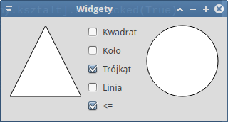
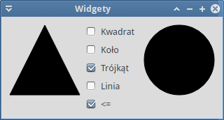

.. _widzety:

Widżety
###########################

.. highlight:: python

1-okienkowa aplikacja prezentująca zastosowanie większości podstawowych widżetów
dostępnych w bibliotece Qt5 obsługiwanej za pomocą wiązań PyQt5.
Przykład ilustruje również techniki `programowania obiektowego <https://pl.wikipedia.org/wiki/Programowanie_obiektowe>`_ (ang. *Object Oriented Programing*).

.. attention::

    **Wymagane oprogramowanie**:

      * Python v. 3.x
      * PyQt v. => 5.2.1

    **Wymagana wiedza**:

    	* Znajomość Pythona w stopniu średnim.
    	* Znajomość podstaw projektowania interfejsu z wykorzystaniem bibliotek Qt
    	  (zob. scenariusz :ref:`Kalkulator <kalkulator>`).

.. contents::
    :depth: 1
    :local:

QPainter – podstawy rysowania
*****************************

Zaczynamy od utworzenia głównego pliku o nazwie :file:`widgety.py` w dowolnym katalogu
za pomocą dowolnego edytora. Wstawiamy do niego poniższy kod:

.. raw:: html

    
Plik <i>widgety.py</i>. Kod nr 

.. highlight:: python
.. literalinclude:: widgety_z0.py
    :linenos:

Podstawową klasą opisującą naszą aplikację będzie klasa ``Widgety``. Umieścimy
w niej głównie logikę aplikacji, czyli powiązania sygnałów i slotów (zob.: :term:`sygnały i sloty`)
oraz implementację tych ostatnich. Klasa ta dziedziczy z zaimportowanej klasy ``Ui_Widget``
i w swoim konstruktorze (``def __init__(self, parent=None)``) wywołuję odziedziczoną
metodę ``self.setupUi(self)``, aby zbudować interfejs. Pozostała część pliku
tworzy instancję aplikacji, instancję okna głównego, czyli klasy ``Widgety``,
wyświetla je i uruchamia pętlę zdarzeń.

Klasę ``Ui_Widget`` dla przejrzystości umieścimy w osobnym pliku o nazwie :file:`gui.py`.
Tworzymy go i wstawiamy poniższy kod:

.. raw:: html

    
Plik <i>widgety.py</i>. Kod nr 

.. highlight:: python
.. literalinclude:: gui_z0.py
    :linenos:

Klasa pomocnicza ``Ksztalty`` symulować będzie typ wyliczeniowy: angielskim nazwom
kształtów przypiszemy kolejne wartości całkowite zaczynając od 0.
Kształty, które będziemy rysowali, to:

 * *Rect* – prostokąt, wartość 0;
 * *Ellipse* – elipsa, w tym koło, wartość 1;
 * *Polygon* – linia łamana zamknięta, np. trójkąt, wartość 2;
 * *Line* – linia łącząca dwa punkty, wartość 3.

Określając rodzaj rysowanego kształtu, będziemy używali konstrukcji typu ``Ksztalty.Ellipse``,
tak jak w głównej metodzie klasy ``Ui_Widget`` o nazwie ``setupUi()``. Definiujemy w niej zmienną
wskazującą rysowany ksztalt (``self.ksztalt = Ksztalty.Ellipse``) oraz jego właściwości,
czyli rozmiar, kolor obramowania i wypełnienia. Kolory opisujemy za pomocą klasy
`QColor <http://doc.qt.io/qt-5/qcolor.html>`_, przy czym używamy formatu `RGB <https://pl.wikipedia.org/wiki/RGB>`_,
np .: ``self.kolorW = QColor(200, 30, 40)``.

Za rysowanie każdego widżetu, w tym wypadku głównego okna, odpowiada funkcja
`paintEven() <http://doc.qt.io/qt-5/qwidget.html#paintEvent>`_. Nadpisujemy ją,
tworzymy instancję klasy `QPainter <http://doc.qt.io/qt-5/qwidget.html#paintEvent>`_
umożliwiającej rysowanie różnych kształtów (``qp = QPainter()``). Między metodami ``begin()`` i ``end()``
wywołujemy funkcję ``rysujFigury()``, w której implementujemy właściwy kod rysujący.

Metody ``setPen()`` i ``setBrush()`` pozwalają ustawić kolor odpowiednio obramowania
i wypełnienia. Po sprawdzeniu w instrukcji warunkowej rodzaju rysowanego kształtu
wywołujemy odpowiednią metodę obiektu ``QPainter``:

* ``drawRect()`` – rysuje prostokąty,
* ``drawEllipse()`` – rysuje elipsy.

Obydwie metody jako parametr przyjmują instancję klasy `QRect <http://doc.qt.io/qt-5/qrect.html>`_:
``self.prost = QRect(1, 1, 101, 101)``. Pozwala ona opisywać prostokąt do narysowania
albo służący do wpisania w niego elipsy. Jako argumenty konstruktora podajemy
dwie pary współrzędnych. Pierwsza określa położenie lewego górnego,
druga prawego dolnego rogu prostokąta.

.. attention::

    Początek układu współrzędnych, w dniesieniu do którego definujemy w Qt pozycję okien,
    widżetów czy punkty opisujące kształty, znajduje się w lewym górnym rogu ekranu
    czy też okna.

**Ćwiczenie**

    * Przetestuj działanie aplikacji wydając w katalogu z plikami źródłowymi polecenie
      w terminalu: ``python3 widgety.py``.
    * Spróbuj zmienić rodzaj rysowanej figury oraz kolory jej obramowania i wypełnienia.

.. figure:: img/widzety00.png

Klasa *Ksztalt*
***************

Przedstawiony wyżej sposób rysowania ma istotne ograniczenia. Przede wszystkim
rysowanie odbywa się bezpośrednio w oknie głównym, co utrudnia umieszczanie
innych widżetów. Po drugie nie ma wygodnego sposobu dodawania niezależnych
od siebie kształtów. Aby poprawić te niedogoności, stworzymy swój widżet
do rysowania, czyli klasę ``Ksztalt``. Kod umieszczamy w osobnym pliku
o nazwie :file:`ksztalt.py` w katalogu z poprzednimi plikami.
Jego zawartość jest następująca:

.. raw:: html

    
Plik <i>ksztalty.py</i>. Kod nr 

.. highlight:: python
.. literalinclude:: ksztalty.py
    :linenos:

Najważniejsza metoda, tj. ``paintEvent()``, w ogóle się nie zmienia. Natomiast funkcję
``rysujFigury()`` rozbudowujemy o możliwość rysowania kolejnych kształtów:

* ``drawPolygon()`` – pozwala rysować wielokąty, jako argument podajemy listę typu
  `QPolygon <http://doc.qt.io/qt-5/qpolygon.html>`_ punktów typu `QPoint <http://doc.qt.io/qt-5/qpoint.html>`_
  opisujących współrzędne kolejnych wierzchołków; domyślne współrzędne zdefiniowane zostały
  jako atrybut ``punkty`` naszej klasy;
* ``qp.drawLine()`` – pozwala narysować linię wyznaczoną przez współrzędne punktu
  początkowego i końcowego typu ``QPoint``; nasza klasa wykorzystuje tu współrzędne
  lewego górnego (``self.prost.topLeft()``) i prawego dolnego ``self.prost.bottomRight()``
  rogu domyślnego prostokąta: ``prost = QRect(1, 1, 100, 100)``.

Konstruktor naszej klasy: ``__init__(self, parent, ksztalt=Ksztalty.Rect)`` –
umożliwia opcjonalne przekazanie w drugim argumencie typu rysowanego kształtu. Domyślnie
będzie to prostokąt. Zostanie on przypisany do atrybutu ``self.ksztalt``.
W konstruktorze definujemy również domyślne kolory obramowania ``self.kolorO``
i wypełnienia ``self.kolorW``.

.. note::

    Warto zrozumieć różnicę pomiędzy **zmiennymi klasy** a **zmiennymi instancji**.
    Zmienne (właściwości) klasy są wspólne dla wszystkich jej instancji.
    W naszym przypadku zdefiniowaliśmy w ten sposób zmienne ``prost`` i ``punkty``.
    Zmienne instancji definiujemy w konstruktorze, są one inne dla każdego obiektu.
    Np. każda instancja klasy *Ksztalt* może rysować inną figurę zapamiętaną
    w zmiennej ``self.ksztalt``.

Funkcje ``ustawKsztalt()`` i ``ustawKolorW()`` – jak wskazują nazwy – pozwalają modyfikować
kształt i kolor wypełnienia obiektu kształtu już po jego utworzeniu jako instancji klasy.
Metoda ``self.update()`` wymusza ponowne narysowanie kształtu.

W metodach ``sizeHint()`` i ``minimumSizeHint()`` określamy sugerowany i minimalny
rozmiar naszego kształtu. Są one niezbędne, aby układy (ang. *layouts*), w których
umieścimy kształty, zarezerwowały odpowiednio dużo miejsca na ich wyświetlenie.

Ponieważ wydzieliliśmy klasę opisującą kształty, plik :file:`gui.py` możemy uprościć:

.. raw:: html

    
Plik <i>gui.py</i>. Kod nr 

.. highlight:: python
.. literalinclude:: gui_z1.py
    :linenos:

Tworzymy obiekt ``self.ksztalt`` jako instancję klasy ``Ksztalty()`` i ustawiamy
kolor wypełnienia. Utworzony widżet dodajemy do poziomego układu ``ukladH1.addWidget(self.ksztalt)``,
a układ przypisujemy do okna głównego ``self.setLayout(ukladH1)``.

Plik :file:`widgety.py` pozostaje bez zmian, jego zadaniem jest uruchomienie aplikacji.

**Ćwiczenie**

    * Ponownie przetestuj działanie aplikacji, spróbuj zmienić rodzaj rysowanej figury oraz
      kolor jej wypełnienia.

.. figure:: img/widzety01.png

.. note::

    W kolejnych krokach będziemy umieszczać w oknie głównym widżety różnego typu.
    Za każdym razem pamiętać należy o zaimportowaniu potrzebnej klasy na początku
    pliku, czyli o dodaniu klauzuli typu: ``from PyQt5.QtWidget import <nazwa_klasy>``.

Przyciski CheckBox
******************

Wykorzystując klasę *Ksztalt* utworzymy kolejny obiekt do rysowania figur. Dodamy także
przyciski typu `QCheckBox <http://doc.qt.io/qt-5/qcheckbox.html>`_ umożliwiające zmianę
rodzaju wyświetlanej figury.

Na poczatku pliku :file:`gui.py` zaimportuj klasy *QCheckBox, QButtonGroup, QVBoxLayout*.
Funkcja ``setupUi()`` przyjmie następującą postać:

.. raw:: html

    
Plik <i>gui.py</i>. Kod nr 

.. highlight:: python
.. literalinclude:: gui_z2.py
    :linenos:
    :lineno-start: 12
    :lines: 12-
    :emphasize-lines: 12-13, 15

Do tworzenia przycisków wykorzystujemy pętlę ``for``, która odczytuje z tupli
kolejne indeksy i etykiety przycisków. Jeśli masz wątpliwości, jak to działa,
przetestuj następujący kod w terminalu:

.. code-block:: bash

    ~$ python3
    >>> for i, v in enumerate(('Kwadrat', 'Koło', 'Trójkąt', 'Linia')):
    ...   print(i, v)

Odczytane etykiety przekazujemy do konstruktora: ``self.chk = QCheckBox(v)``.

Przyciski wyboru kształtu działać mają na zasadzie wyłączności, w danym momencie
powinien zaznaczony być tylko jeden z nich. Tworzymy więc grupę logiczną dzięki
klasie `QButtonGroup <http://doc.qt.io/qt-5/qbuttongroup.html>`_.
Do jej instancji dodajemy przyciski, oznaczając je kolejnymi indeksami:
``self.grupaChk.addButton(self.chk, i)``.

Po uruchomieniu aplikacji zaznaczony powinien być przycisk, który odpowiada aktualnemu kształtowi.
Metoda ``buttons()`` grupy przycisków zwraca nam ich listę. Ponieważ do oznaczania
kształtów używamy kolejnych liczb całkowitych zaczynając od zera, możemy użyć
ich jako indeksu wskazującego odpowiedni przycisk:
``self.grupaChk.buttons()[self.ksztaltAktywny.ksztalt].setChecked(True)``.

Poza pętlą tworzymy jeszcze jeden przycisk (``self.ksztaltChk = QCheckBox("<=")``),
niezależny od powyższej grupy. Jego stan będzie wskazywał aktywny kształt.
Domyślnie go zaznaczamy: ``self.ksztaltChk.setChecked(True)``. Przyjmujemy,
że stan ten będzie oznaczał jako aktywną pierwszą figurę: ``self.ksztaltAktywny = self.ksztalt1``.

Wszystkie elementy interfejsu umieszczamy w układzie poziomym o nazwie ``ukladH1``.
Po lewej stronie znajdzie się ``ksztalt1``, w środku układ przycisków wyboru,
a po prawej ``ksztalt2``.

Jeżeli w tym momencie uruchomimy naszą aplikację, powinniśmy zobaczyć okno
podobne do poniższego:

Teraz zajmiemy się obsługą syganłów. W pliku :file:`widgety.py` rozbudowujemy klasę ``Widgety``:

.. raw:: html

    
Plik <i>widgety.py</i>. Kod nr 

.. highlight:: python
.. literalinclude:: widgety_z2.py
    :linenos:
    :lineno-start: 8
    :lines: 8-31

Na poczatku kliknięcie któregokolwiek z przycisków wyboru kształtu wiążemy z funkcją ``ustawKsztalt``:
``self.grupaChk.buttonClicked[int].connect(self.ustawKsztalt)``. Zapis ``buttonClicked[int]``
oznacza, że sygnał kliknięcia może przekazać do slotu różne dane.
W tym wypadku będzie to indeks klikniętego przycisku, czyli liczba całkowita.
Gdybyśmy chcieli otrzymać tekst przycisku, użylibyśmy konstrukcji ``buttonClicked[str]``.
W slocie ``ustawKsztalt()`` otrzymaną wartość używamy do ustawienia rodzaju rysowanej figury
za pomocą odpowiedniej metody klasy ``Ksztalt``: ``self.ksztaltAktywny.ustawKsztalt(wartosc)``.

Drugie zdarzenie, tj. kliknięcie przycisku wskazującego aktywną figurę, wiążemy ze slotem
``aktywujKsztalt()``: ``self.ksztaltChk.clicked.connect(self.aktywujKsztalt)``.
Tym razem funkcja dostaje wartość logiczną ``True`` lub ``False``,
która określa, czy przycisk został zanaczony, czy nie. W zależności od tego
ustawiamy jako aktywny odpowiedni obszar rysowania oraz tekst przycisku.
Konstrukcja ``nadawca = self.sender()`` pozwala uzyskać dostęp do obiektu,
który wygenerował obsługiwany sygnał.

**Ćwiczenie**

    Jak zwykle uruchom kilkakrotnie aplikację. Spróbuj zmieniać inicjalne rodzaje domyślnych
    kształtów i kolory wypełnienia figur.

Slider i przyciski RadioButton
******************************

Możemy już manipulować rodzajami rysowanych kształtów na obydwu obszarach rysowania.
Spróbujemy teraz dodać widżety pozwalające je kolorować.
Po pierwsze do importów w pliku :file:`gui.py` dopisz ``from PyQt5.QtCore import Qt``.
Dalej dodaj jeszcze importy widżetów *QSlider, QLCDNumber, QSplitter*
oraz *QRadioButton, QGroupBox*.

Teraz rozbudowujemy klasę ``Ui_Widget``. Po komentarzu ``# koniec CheckBox ###``
wstawiamy:

.. raw:: html

    
Plik <i>gui.py</i>. Kod nr 

.. highlight:: python
.. literalinclude:: gui_z3.py
    :linenos:
    :lineno-start: 42
    :lines: 42-68
    :emphasize-lines: 16-18, 22

Do zmiany wartości składowych kolorów RGB wykorzystamy instancję klasy `QSlider <http://doc.qt.io/qt-5/qslider.html>`_,
czyli popularny suwak, w tym wypadku poziomy. Po utworzeniu obiektu, ustawiamy za pomocą
metod ``setMinimum()`` i ``setMaximum()`` zakres zmienianych wartości <0-255>. Następnie
tworzymy instancję klasy `QLCDNumber <http://doc.qt.io/qt-5/qlcdnumber.html>`_,
którą wykorzystamy do wyświetlania wartości wybranej za pomocą suwaka.
Obydwa obiekty dodajemy do poziomego układu, rozdzielając je instancją typu
`QSplitter <http://doc.qt.io/qt-5/qsplitter.html>`_. Obiekt tez pozwala płynnie
zmieniać rozmiar otaczających go widżetów.

Przyciski typu `RadioButton <http://doc.qt.io/qt-5/qradiobutton.html>`_ posłużą nam do wskazywania
kanału koloru RGB, którego wartość chcemy zmienić. Tworzymy je w pętli,
wykorzystując odczytane z tupli nazwy kanałów: ``self.radio = QRadioButton(v)``.
Przyciski rozmieszczamy w poziomie (``self.ukladR.addWidget(self.radio)``).

Pierwszy z nich zaznaczamy: ``self.ukladR.itemAt(0).widget().setChecked(True)``.
Metoda ``itemAt(0)`` zwraca nam pierwszy element danego układu jako typ *QLayoutItem*.
Kolejna metoda ``widget()`` przekształca go w obiekt typu *QWidget*,
dzięki czemu możemy wywoływać jego metody.

Układ przycisków dodajemy do grupy typu `QGroupBox <http://doc.qt.io/qt-5/qgroupbox.html>`_:
``self.grupaRBtn.setLayout(self.ukladR)``. Tego typu grupa zapewnia graficzną
ramkę z przyciskiem aktywującym typu CheckBox, który doyślnie zaznaczamy:
``self.grupaRBtn.setCheckable(True)``. Za pomocą metody ``setObjectName()``
grupie nadajemy nazwę *Radio*.

Kończąc zmiany w interfesie, tworzymy nowy pionowy układ dla elementów głównego
okna aplikacji. Przedostatnią linię ``self.setLayout(ukladH1)`` zastępujemy poniższym kodem:

.. raw:: html

    
Plik <i>gui.py</i>. Kod nr 

.. highlight:: python
.. literalinclude:: gui_z3.py
    :linenos:
    :lineno-start: 70
    :lines: 70-

**Ustawienia wstępne i obsługa zdarzeń**

Na początku w pliku :file:`widgety.py` dodajemy import ``from PyQt5.QtGui import QColor``.
Dalej tworzymy dwie zmienne klasy *Widgety*:

.. raw:: html

    
Plik <i>widgety.py</i>. Kod nr 

.. highlight:: python
.. literalinclude:: widgety_z3.py
    :linenos:
    :lineno-start: 9
    :lines: 9-13

Następnie uzupełniamy konstruktor (``__init__()``), a za nim dopisujemy dwie funkcje:

.. raw:: html

    
Plik <i>widgety.py</i>. Kod nr 

.. highlight:: python
.. literalinclude:: widgety_z3.py
    :linenos:
    :lineno-start: 23
    :lines: 23-46

Ze zmianą stanu przycisków Radio związany jest sygnał ``toggled``. W pętli
``for i in range(self.ukladR.count()):`` wiążemy go dla każdego
przycisku układu z funkcją ``ustawKanal()``. Otrzymuje ona wartość logiczną.
Zadaniem funkcji jest zrestetowanie zbioru kolorów i dodaniego do niego
litery opisującej zaznaczony przycisk: ``self.kanaly.add(nadawca.text())``.

Manipulowanie suwakiem wyzwala sygnał ``valueChanged``, który łączymy ze slotem ``zmienKolor()``:
``self.suwak.valueChanged.connect(self.zmienKolor)``. Do funkcji przekazywana jest wartość
wybrana na suwaku, wyświetlamy ją w widżecie LCD: ``self.lcd.display(wartosc)``.
Następnie sprawdzamy aktywne kanały w zbiorze kanałów i zmieniamy
odpowiadającą im wartość składową w kolorze wypełnenia, np.: ``self.kolorW.setRed(wartosc)``.
Na koniec przypisujemy otrzymany kolor wypełnienia aktywnemu kształtowi,
osobno podając składowe RGB.

Przetestuj działanie aplikacji.

.. figure:: img/widzety03.png

ComboBox i SpinBox
******************

Modyfikowane kanały koloru można wybierać z rozwijalnej listy typu
`QComboBox <http://doc.qt.io/qt-5/qcombobox.html>`_, a ich wartości
ustawiać za pomocą widżetu `QSpinBox <http://doc.qt.io/qt-5/qspinbox.html>`_.
Aby dodać te elementy do aplikacji na początku pliku :file:`gui.py`
dopisz import obydwu wymienionych klas. Następnie po komentarzu
``# koniec RadioButton ###`` uzupełniamy kod:

.. raw:: html

    
Plik <i>gui.py</i>. Kod nr 

.. highlight:: python
.. literalinclude:: gui_z4.py
    :linenos:
    :lineno-start: 71
    :lines: 71-88
    :emphasize-lines: 4, 8-9

Po utworzeniu obiektu listy za pomocą pętli ``for`` dodajemy kolejne elementy,
czyli litery poszczególnych kanałów: ``self.listaRGB.addItem(v)``.

Obiekt *SpinBox* podobnie jak *Slider* wymaga ustawienia zakresu wartości <0-255>,
wykorzystujemy takie same metody, jak wcześniej, tj. ``setMinimum()`` i ``setMaximum()``.

Obydwa widżety wyłączamy metodą ``setEnabled(False)``. Umieszczamy jeden nad drugim,
a ich układ dodajemy obok przycisków Radio, rozdzielając je odstępem 25 px:
``ukladH3.insertSpacing(1, 25)``.

Materiały
***************

1. `Qt Widgets <http://doc.qt.io/qt-5/qtwidgets-index.html>`_
2. `Widgets Tutorial <http://doc.qt.io/qt-5/widgets-tutorial.html>`_
3. `Layout Management <http://doc.qt.io/qt-5/layout.html>`_
