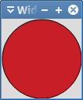
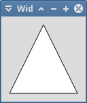
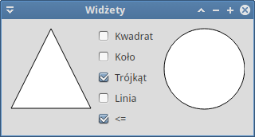
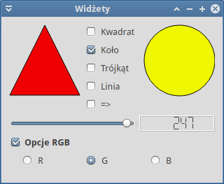
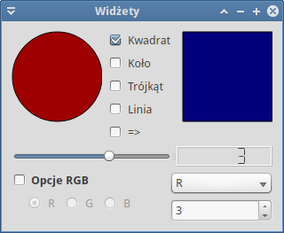
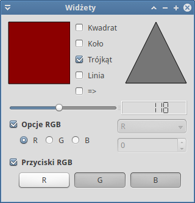
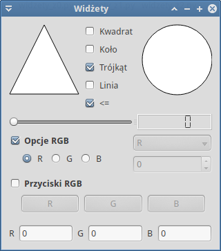

.. _widzety-qt5:

Widżety
###########################

.. highlight:: python

1-okienkowa aplikacja prezentująca zastosowanie większości podstawowych widżetów
dostępnych w bibliotece Qt5 obsługiwanej za pomocą wiązań PyQt5.
Przykład ilustruje również techniki `programowania obiektowego <https://pl.wikipedia.org/wiki/Programowanie_obiektowe>`_ (ang. *Object Oriented Programing*).

.. attention::

    **Wymagana wiedza**:

    	* Znajomość Pythona w stopniu średnim.
    	* Znajomość podstaw projektowania interfejsu z wykorzystaniem bibliotek Qt
    	  (zob. scenariusz :ref:`Kalkulator <kalkulator-qt5>`).

.. contents::
    :depth: 1
    :local:

QPainter – podstawy rysowania
*****************************

Zaczynamy od utworzenia głównego pliku o nazwie :file:`widzety.py` w dowolnym katalogu
za pomocą dowolnego edytora. Wstawiamy do niego poniższy kod:

.. raw:: html

    
Plik <i>widzety.py</i>. Kod nr 

.. highlight:: python
.. literalinclude:: widzety_z0.py
    :linenos:

Podstawową klasą opisującą naszą aplikację będzie klasa ``Widgety``. Umieścimy
w niej głównie logikę aplikacji, czyli powiązania sygnałów i slotów (zob.: :term:`sygnały i sloty`)
oraz implementację tych ostatnich. Klasa ta dziedziczy z zaimportowanej z pliku :file:`gui.py` klasy ``Ui_Widget``
i w swoim konstruktorze (``def __init__(self, parent=None)``) wywołuję odziedziczoną
metodę ``self.setupUi(self)``, aby zbudować interfejs. Pozostała część pliku
tworzy instancję aplikacji, instancję okna głównego, czyli klasy ``Widgety``,
wyświetla je i uruchamia pętlę zdarzeń.

Klasę ``Ui_Widget`` dla przejrzystości umieszczamy we wspomnianym pliku o nazwie :file:`gui.py`.
Tworzymy go i wstawiamy poniższy kod:

.. raw:: html

    
Plik <i>widzety.py</i>. Kod nr 

.. highlight:: python
.. literalinclude:: gui_z0.py
    :linenos:

Klasa pomocnicza ``Ksztalty`` symulować będzie typ wyliczeniowy. Angielskie nazwy
kształtów tworzą dane statyczne (zob. :term:`dana statyczna`) klasy.
Przypisujemy im kolejne wartości całkowite zaczynając od 0.
Kształty, które będziemy rysowali, to:

 * *Rect* – prostokąt, wartość 0;
 * *Ellipse* – elipsa, w tym koło, wartość 1;
 * *Polygon* – linia łamana zamknięta, np. trójkąt, wartość 2;
 * *Line* – linia łącząca dwa punkty, wartość 3.

Określając rodzaj rysowanego kształtu, będziemy używali konstrukcji typu ``Ksztalty.Ellipse``,
tak jak w głównej metodzie klasy ``Ui_Widget`` o nazwie ``setupUi()``. Definiujemy w niej zmienną
wskazującą rysowany kształt (``self.ksztalt = Ksztalty.Ellipse``) oraz jego właściwości,
czyli rozmiar, kolor obramowania i wypełnienia. Kolory opisujemy za pomocą klasy
`QColor <http://doc.qt.io/qt-5/qcolor.html>`_, używając formatu `RGB <https://pl.wikipedia.org/wiki/RGB>`_,
np .: ``self.kolorW = QColor(200, 30, 40)``.

Za rysowanie każdego widżetu, w tym wypadku głównego okna, odpowiada funkcja
`paintEvent() <http://doc.qt.io/qt-5/qwidget.html#paintEvent>`_. Nadpisujemy ją,
tworzymy instancję klasy `QPainter <http://doc.qt.io/qt-5/qpainter.html>`_
umożliwiającej rysowanie różnych kształtów (``qp = QPainter()``). Między metodami ``begin()`` i ``end()``
wywołujemy funkcję ``rysujFigury()``, w której implementujemy właściwy kod rysujący.

Metody ``setPen()`` i ``setBrush()`` pozwalają ustawić kolor odpowiednio obramowania
i wypełnienia. Po sprawdzeniu w instrukcji warunkowej rodzaju rysowanego kształtu
wywołujemy odpowiednią metodę obiektu ``QPainter``:

* ``drawRect()`` – rysuje prostokąty,
* ``drawEllipse()`` – rysuje elipsy.

Obydwie metody jako parametr przyjmują instancję klasy `QRect <http://doc.qt.io/qt-5/qrect.html>`_:
``self.prost = QRect(1, 1, 101, 101)``. Pozwala ona opisywać prostokąt do narysowania
albo służący do wpisania w niego elipsy. Jako argumenty konstruktora podajemy
dwie pary współrzędnych. Pierwsza określa położenie lewego górnego,
druga prawego dolnego rogu prostokąta.

.. attention::

    Początek układu współrzędnych, w odniesieniu do którego definiujemy w Qt pozycję okien,
    widżetów czy punkty opisujące kształty, znajduje się w lewym górnym rogu ekranu
    czy też okna.

**Ćwiczenie**

    * Przetestuj działanie aplikacji wydając w katalogu z plikami źródłowymi polecenie
      w terminalu: ``python widzety.py``.
    * Spróbuj zmienić rodzaj rysowanej figury oraz kolory jej obramowania i wypełnienia.

Klasa *Ksztalt*
***************

Przedstawiony wyżej sposób rysowania ma istotne ograniczenia. Przede wszystkim
rysowanie odbywa się bezpośrednio w oknie głównym, co utrudnia umieszczanie
innych widżetów. Po drugie nie ma wygodnego sposobu dodawania niezależnych
od siebie kształtów. Aby poprawić te niedogodności, stworzymy swój widżet
do rysowania, czyli klasę ``Ksztalt``. Kod umieszczamy w osobnym pliku
o nazwie :file:`ksztalt.py` w katalogu z poprzednimi plikami.
Jego zawartość jest następująca:

.. raw:: html

    
Plik <i>ksztalty.py</i>. Kod nr 

.. highlight:: python
.. literalinclude:: ksztalty.py
    :linenos:

Najważniejsza metoda, tj. ``paintEvent()``, w ogóle się nie zmienia. Natomiast funkcję
``rysujFigury()`` rozbudowujemy o możliwość rysowania kolejnych kształtów:

* ``drawPolygon()`` – pozwala rysować wielokąty, jako argument podajemy listę typu
  `QPolygon <http://doc.qt.io/qt-5/qpolygon.html>`_ punktów typu `QPoint <http://doc.qt.io/qt-5/qpoint.html>`_
  opisujących współrzędne kolejnych wierzchołków; domyślne współrzędne zdefiniowane zostały
  jako atrybut ``punkty`` naszej klasy;
* ``qp.drawLine()`` – pozwala narysować linię wyznaczoną przez współrzędne punktu
  początkowego i końcowego typu ``QPoint``; nasza klasa wykorzystuje tu współrzędne
  lewego górnego (``self.prost.topLeft()``) i prawego dolnego (``self.prost.bottomRight()``)
  rogu domyślnego prostokąta: ``prost = QRect(1, 1, 101, 101)``.

Konstruktor naszej klasy: ``__init__(self, parent, ksztalt=Ksztalty.Rect)`` –
umożliwia opcjonalne przekazanie w drugim argumencie typu rysowanego kształtu. Domyślnie
będzie to prostokąt. Zostanie on przypisany do atrybutu ``self.ksztalt``.
W konstruktorze definiujemy również domyślne kolory obramowania ``self.kolorO``
i wypełnienia ``self.kolorW``.

.. note::

    Warto zrozumieć różnicę pomiędzy **zmiennymi klasy** a **zmiennymi instancji**.
    Zmienne (właściwości) klasy, określane również jako dane statyczne, są wspólne
    dla wszystkich jej instancji. W naszej aplikacji zdefiniowaliśmy w ten sposób dostępne
    kształty, a także zmienne ``prost`` i ``punkty`` klasy *Ksztalt*.

    Zmienne instancji natomiast są inne dla każdego obiektu.
    Definiujemy je w konstruktorze, używając słowa ``self``. Np. każda instancja klasy
    *Ksztalt* może rysować inną figurę zapamiętaną w zmiennej ``self.ksztalt``.
    Zob.: `Class and Instance Variables <https://docs.python.org/3/tutorial/classes.html#class-and-instance-variables>`_

Funkcje ``ustawKsztalt()`` i ``ustawKolorW()`` – jak wskazują nazwy – pozwalają modyfikować
kształt i kolor wypełnienia obiektu kształtu już po jego utworzeniu jako instancji klasy.
Metoda ``self.update()`` wymusza ponowne narysowanie kształtu.

W metodach ``sizeHint()`` i ``minimumSizeHint()`` określamy sugerowany i minimalny
rozmiar naszego kształtu. Są one niezbędne, aby układy (ang. *layouts*), w których
umieścimy kształty, zarezerwowały odpowiednio dużo miejsca na ich wyświetlenie.

Ponieważ wydzieliliśmy klasę opisującą kształty, plik :file:`gui.py` możemy uprościć:

.. raw:: html

    
Plik <i>gui.py</i>. Kod nr 

.. highlight:: python
.. literalinclude:: gui_z1.py
    :linenos:

Tworzymy obiekt ``self.ksztalt`` jako instancję klasy ``Ksztalty()`` i ustawiamy
kolor wypełnienia. Utworzony widżet dodajemy do poziomego układu ``ukladH1.addWidget(self.ksztalt)``,
a układ przypisujemy do okna głównego ``self.setLayout(ukladH1)``.

Plik :file:`widzety.py` pozostaje bez zmian, jego zadaniem jest uruchomienie aplikacji.

**Ćwiczenie**

    * Ponownie przetestuj działanie aplikacji, spróbuj zmienić rodzaj rysowanej figury oraz
      kolor jej wypełnienia.

.. note::

    W kolejnych krokach będziemy umieszczać w oknie głównym widżety różnego typu.
    Kod tworzący te obiekty i ustawiający początkowe ich właściwości umieszczać będziemy
    w pliku :file:`gui.py` w funkcji ``setupUi()``. Dodając nowe widżety, musimy pamiętać
    o zaimportowaniu odpowiedniej klasy Qt na początku pliku.
    Informacje o importach będą umieszczone na początku każdej sekcji.

    Kod wiążący sygnały ze slotami implementować będziemy w pliku :file:`widzety.py`,
    w konstruktorze klasy ``Widgety``. Sloty implementować będziemy jako funkcje
    tej klasy.

Przyciski CheckBox
******************

Wykorzystując klasę *Ksztalt* utworzymy kolejny obiekt do rysowania figur. Dodamy także
przyciski typu `QCheckBox <http://doc.qt.io/qt-5/qcheckbox.html>`_ umożliwiające zmianę
rodzaju wyświetlanej figury.

**Importy** w pliku :file:`gui.py`:

.. code-block:: python

    from PyQt5.QtWidgets import QCheckBox, QButtonGroup, QVBoxLayout

Funkcja ``setupUi()`` przyjmuje następującą postać:

.. raw:: html

    
Plik <i>gui.py</i>. Kod nr 

.. highlight:: python
.. literalinclude:: gui_z2.py
    :linenos:
    :lineno-start: 13
    :lines: 13-
    :emphasize-lines: 16-17, 23

Do tworzenia przycisków wykorzystujemy pętlę ``for``, która odczytuje z tupli
kolejne indeksy i etykiety przycisków. Jeśli masz wątpliwości, jak to działa,
przetestuj następujący kod w terminalu:

.. code-block:: bash

    ~$ python
    >>> for i, v in enumerate(('Kwadrat', 'Koło', 'Trójkąt', 'Linia')):
    ...   print(i, v)

Odczytane etykiety przekazujemy do konstruktora: ``self.chk = QCheckBox(v)``.

Przyciski wyboru kształtu działać mają na zasadzie wyłączności, w danym momencie
powinien zaznaczony być tylko jeden z nich. Tworzymy więc grupę logiczną dzięki
klasie `QButtonGroup <http://doc.qt.io/qt-5/qbuttongroup.html>`_.
Do jej instancji dodajemy przyciski, oznaczając je kolejnymi indeksami:
``self.grupaChk.addButton(self.chk, i)``.

Kod ``self.grupaChk.buttons()[self.ksztaltAktywny.ksztalt].setChecked(True)`` zaznacza
przycisk, który odpowiada aktualnemu kształtowi. Metoda ``buttons()`` zwraca nam listę
przycisków. Ponieważ do oznaczania kształtów używamy kolejnych liczb całkowitych,
możemy użyć ich jako indeksu.

Poza pętlą tworzymy jeszcze jeden przycisk (``self.ksztaltChk = QCheckBox("<=")``),
niezależny od powyższej grupy. Jego stan wskazuje aktywny kształt.
Domyślnie go zaznaczamy: ``self.ksztaltChk.setChecked(True)``, co oznacza,
że aktywną figurą będzie pierwszy kształt. Inicjujemy również odpowiednią zmienną:
``self.ksztaltAktywny = self.ksztalt1``.

Wszystkie elementy interfejsu umieszczamy w układzie poziomym o nazwie ``ukladH1``.
Po lewej stronie znajdzie się ``ksztalt1``, w środku układ przycisków wyboru,
a po prawej ``ksztalt2``.

Teraz zajmiemy się obsługą sygnałów. W pliku :file:`widzety.py` rozbudowujemy klasę ``Widgety``:

.. raw:: html

    
Plik <i>widzety.py</i>. Kod nr 

.. highlight:: python
.. literalinclude:: widzety_z2.py
    :linenos:
    :lineno-start: 9
    :lines: 9-32

Na początku kliknięcie któregokolwiek z przycisków wyboru wiążemy z funkcją ``ustawKsztalt``:
``self.grupaChk.buttonClicked[int].connect(self.ustawKsztalt)``. Zapis ``buttonClicked[int]``
oznacza, że dany sygnał może przekazać do slotu różne dane.
W tym wypadku będzie to indeks klikniętego przycisku, czyli liczba całkowita.
Gdybyśmy chcieli otrzymać tekst przycisku, użylibyśmy konstrukcji ``buttonClicked[str]``.
W slocie ``ustawKsztalt()`` otrzymaną wartość używamy do ustawienia rodzaju rysowanej figury
za pomocą odpowiedniej metody klasy ``Ksztalt``: ``self.ksztaltAktywny.ustawKsztalt(wartosc)``.

Kliknięcie przycisku wskazującego aktywną figurę obsługujemy w kodzie:
``self.ksztaltChk.clicked.connect(self.aktywujKsztalt)``.
Tym razem funkcja ``aktywujKsztalt()`` dostaje wartość logiczną ``True`` lub ``False``,
która określa, czy przycisk został zaznaczony, czy nie. W zależności od tego
ustawiamy jako aktywny odpowiedni obszar rysowania oraz tekst przycisku.

.. note::

    Warto zapamiętać, jak uzyskać dostęp do obiektu, który wygenerował dany sygnał.
    W odpowiednim slocie używamy kodu ``self.sender()``.

**Ćwiczenie**

    Jak zwykle uruchom kilkakrotnie aplikację. Spróbuj zmieniać inicjalne rodzaje domyślnych
    kształtów i kolory wypełnienia figur.

Slider i przyciski RadioButton
******************************

Możemy już manipulować rodzajami rysowanych kształtów na obydwu obszarach rysowania.
Spróbujemy teraz dodać widżety pozwalające je kolorować.

**Importy** w pliku :file:`gui.py`:

.. code-block:: python

    from PyQt5.QtCore import Qt
    from PyQt5.QtWidgets import QSlider, QLCDNumber, QSplitter
    from PyQt5.QtWidgets import QRadioButton, QGroupBox

Teraz rozbudowujemy konstruktor klasy ``Ui_Widget``. Po komentarzu ``# koniec CheckBox ###``
wstawiamy:

.. raw:: html

    
Plik <i>gui.py</i>. Kod nr 

.. highlight:: python
.. literalinclude:: gui_z3.py
    :linenos:
    :lineno-start: 43
    :lines: 43-69
    :emphasize-lines: 15-17

Do zmiany wartości składowych kolorów RGB wykorzystamy instancję klasy `QSlider <http://doc.qt.io/qt-5/qslider.html>`_,
czyli popularny suwak, w tym wypadku poziomy. Po utworzeniu obiektu, ustawiamy za pomocą
metod ``setMinimum()`` i ``setMaximum()`` zakres zmienianych wartości <0-255>. Następnie
tworzymy instancję klasy `QLCDNumber <http://doc.qt.io/qt-5/qlcdnumber.html>`_,
którą wykorzystamy do wyświetlania wartości wybranej za pomocą suwaka.
Obydwa obiekty dodajemy do poziomego układu, rozdzielając je instancją typu
`QSplitter <http://doc.qt.io/qt-5/qsplitter.html>`_. Obiekt tez pozwala płynnie
zmieniać rozmiar otaczających go widżetów.

Przyciski typu `RadioButton <http://doc.qt.io/qt-5/qradiobutton.html>`_ posłużą nam do wskazywania
kanału koloru RGB, którego wartość chcemy zmienić. Tworzymy je w pętli,
wykorzystując odczytane z tupli nazwy kanałów: ``self.radio = QRadioButton(v)``.
Przyciski rozmieszczamy w poziomie (``self.ukladR.addWidget(self.radio)``).

Pierwszy z nich zaznaczamy: ``self.ukladR.itemAt(0).widget().setChecked(True)``.
Metoda ``itemAt(0)`` zwraca nam pierwszy element danego układu jako typ *QLayoutItem*.
Kolejna metoda ``widget()`` przekształca go w obiekt typu *QWidget*,
dzięki czemu możemy wywoływać jego metody.

Układ przycisków dodajemy do grupy typu `QGroupBox <http://doc.qt.io/qt-5/qgroupbox.html>`_:
``self.grupaRBtn.setLayout(self.ukladR)``. Tego typu grupa zapewnia graficzną
ramkę z przyciskiem aktywującym typu CheckBox, który domyślnie zaznaczamy:
``self.grupaRBtn.setCheckable(True)``. Za pomocą metody ``setObjectName()``
grupie nadajemy nazwę *Radio*.

Kończąc zmiany w interfejsie, tworzymy nowy pionowy układ dla elementów głównego
okna aplikacji. Przedostatnią linię ``self.setLayout(ukladH1)`` zastępujemy poniższym kodem:

.. raw:: html

    
Plik <i>gui.py</i>. Kod nr 

.. highlight:: python
.. literalinclude:: gui_z3.py
    :linenos:
    :lineno-start: 71
    :lines: 71-

**Ustawienia wstępne i obsługa zdarzeń**

**Importy** w pliku :file:`widzety.py`:

.. code-block:: python

    from PyQt5.QtGui import QColor

Dalej tworzymy dwie zmienne klasy *Widgety*:

.. raw:: html

    
Plik <i>widzety.py</i>. Kod nr 

.. highlight:: python
.. literalinclude:: widzety_z3.py
    :linenos:
    :lineno-start: 10
    :lines: 10-14

Następnie uzupełniamy konstruktor (``__init__()``), a za nim dopisujemy dwie funkcje:

.. raw:: html

    
Plik <i>widzety.py</i>. Kod nr 

.. highlight:: python
.. literalinclude:: widzety_z3.py
    :linenos:
    :lineno-start: 24
    :lines: 24-47

Ze zmianą stanu przycisków Radio związany jest sygnał ``toggled``. W pętli
``for i in range(self.ukladR.count()):`` wiążemy go dla każdego
przycisku układu z funkcją ``ustawKanalRBtn()``. Otrzymuje ona wartość logiczną.
Zadaniem funkcji jest zresetowanie zbioru kolorów i dodanie do niego
litery opisującej zaznaczony przycisk: ``self.kanaly.add(nadawca.text())``.

Manipulowanie suwakiem wyzwala sygnał ``valueChanged``, który łączymy ze slotem ``zmienKolor()``:
``self.suwak.valueChanged.connect(self.zmienKolor)``. Do funkcji przekazywana jest wartość
wybrana na suwaku, wyświetlamy ją w widżecie LCD: ``self.lcd.display(wartosc)``.
Następnie sprawdzamy aktywne kanały w zbiorze kanałów i zmieniamy
odpowiadającą im wartość składową w kolorze wypełnienia, np.: ``self.kolorW.setRed(wartosc)``.
Na koniec przypisujemy otrzymany kolor wypełnienia aktywnemu kształtowi,
osobno podając składowe RGB.

Przetestuj działanie aplikacji.

ComboBox i SpinBox
******************

Modyfikowane kanały koloru można wybierać z rozwijalnej listy typu
`QComboBox <http://doc.qt.io/qt-5/qcombobox.html>`_, a ich wartości
ustawiać za pomocą widżetu `QSpinBox <http://doc.qt.io/qt-5/qspinbox.html>`_.

**Importy** w pliku :file:`gui.py`:

.. code-block:: python

    from PyQt5.QtWidgets import QComboBox, QSpinBox

Po komentarzu ``# koniec RadioButton ###`` uzupełniamy kod funkcji ``setupUi()``:

.. raw:: html

    
Plik <i>gui.py</i>. Kod nr 

.. highlight:: python
.. literalinclude:: gui_z4.py
    :linenos:
    :lineno-start: 72
    :lines: 72-89
    :emphasize-lines: 4, 8-9

Po utworzeniu obiektu listy za pomocą pętli ``for`` dodajemy kolejne elementy,
czyli litery poszczególnych kanałów: ``self.listaRGB.addItem(v)``.

Obiekt *SpinBox* podobnie jak *Slider* wymaga ustawienia zakresu wartości <0-255>,
wykorzystujemy takie same metody, jak wcześniej, tj. ``setMinimum()`` i ``setMaximum()``.

Obydwa widżety na razie wyłączamy metodą ``setEnabled(False)``. Umieszczamy jeden nad drugim,
a ich układ dodajemy obok przycisków Radio, rozdzielając je odstępem 25 px:
``ukladH3.insertSpacing(1, 25)``.

W pliku :file:`widzety.py` dodajemy do konstruktora kod przechwytujący 3 sygnały
i dopisujemy dwie nowe funkcje:

.. raw:: html

    
Plik <i>widzety.py</i>. Kod nr 

.. highlight:: python
.. literalinclude:: widzety_z4.py
    :linenos:
    :lineno-start: 28
    :lines: 28-45

Po uruchomieniu aplikacji aktywna jest tylko grupa przycisków Radio.
Kliknięcie tej grupy przechwytujemy: ``self.grupaRBtn.clicked.connect(self.ustawStan)``.
Funkcja ``ustawStan()`` w zależności od zaznaczenia grupy lub jego braku
wyłącza (``setEnabled(False)``) lub włącza (``setEnabled(True)``) widżety
*ComboBox* i *SpinBox*. W tym drugim przypadku resetujemy zbiór kanałów
i dodajemy do niego tylko kanał wybrany na liście: ``self.kanaly.add(self.listaRGB.currentText())``.

Drugie wydarzenie, które obsłużymy, to wybranie nowego kanału z listy. Emitowany jest wtedy
sygnał ``activated[str]``, który zawiera tekst wybranego elementu. W slocie ``ustawKanalCBox()``
tekst ten, czyli nazwę składowej koloru, dodajemy do zbioru kanałów.

Zmiana wartości w kontrolce SpinBox, czyli sygnał ``valueChanged[int]``, przekierowujemy
do funkcji ``zmienKolor()``, która obsługuje również zmiany wartości na suwaku.

Uruchom aplikację i sprawdź jej działanie.

Przyciski PushButton
********************

Do tej pory można było zmieniać kolor każdego kanału składowego osobno.
Dodamy teraz grupę przycisków typu `QPushButton <http://doc.qt.io/qt-5/qpushbutton.html>`_,
które zachowywać się będą jak grupa przycisków wielokrotnego wyboru.

**Importy** w pliku :file:`gui.py`:

.. code-block:: python

    from PyQt5.QtWidgets import QPushButton

Następnie po komentarzu ``# koniec ComboBox i SpinBox ###`` dopisujemy kod w funkcji ``setupUi()``:

.. raw:: html

    
Plik <i>gui.py</i>. Kod nr 

.. highlight:: python
.. literalinclude:: gui_z5.py
    :linenos:
    :lineno-start: 92
    :lines: 92-107
    :emphasize-lines: 4, 6-8

Przyciski, jak poprzednio, tworzymy w pętli, podając w konstruktorze litery
składowych koloru RGB: ``self.btn = QPushButton(v)``. Każdy przycisk przekształcamy
na stanowy (może być trwale wciśnięty) za pomocą metody ``setCheckable()``.
Kolejne obiekty dodajemy do grupy logicznej typu `QButtonGroup <http://doc.qt.io/qt-5/qbuttongroup.html>`_:
``self.grupaP.addButton(self.btn)``; oraz do układu poziomego.
Układ przycisków dodajemy do ramki typu `QGropBox <http://doc.qt.io/qt-5/qgroupbox.html>`_ z przyciskiem CheckBox:
``self.grupaPBtn.setCheckable(True)``. Na początku ramkę wyłączamy: ``self.grupaPBtn.setChecked(False)``.

**Uwaga**: na koniec musimy dodać grupę przycisków do głównego układu okna:
``ukladOkna.addWidget(self.grupaPBtn)``. Inaczej nie zobaczymy jej w oknie aplikacji!

W pliku :file:`widzety.py` jak zwykle dopisujemy obsługę sygnałów w konstruktorze
i jedną nową funkcję:

.. raw:: html

    
Plik <i>widzety.py</i>. Kod nr 

.. highlight:: python
.. literalinclude:: widzety_z5.py
    :linenos:
    :lineno-start: 32
    :lines: 32-42

Pętla ``for btn in self.grupaP.buttons():`` odczytuje kolejne przyciski
z grupy ``grupaP``, i kliknięcie każdego wiąże z nową funkcją:
``btn.clicked[bool].connect(self.ustawKanalPBtn)``. Zadaniem funkcji
jest dodawanie kanału do zbioru, jeżeli przycisk został wciśnięty,
i usuwanie ich ze zbioru w przeciwnym razie. Inaczej niż w poprzednich
funkcjach, obsługujących przyciski *Radio* i listę *ComboBox*, nie resetujemy
tu zbioru kanałów.

Przetestuj zmodyfikowaną aplikację.

QLabel i QLineEdit
******************

Dodamy do aplikacji zestaw widżetów wyświetlających aktywne kanały jako etykiety
typu `QLabel <http://doc.qt.io/qt-5/qlabel.html>`_ oraz wartości składowych koloru
jako 1-liniowe pola edycyjne typu `QLineEdit <http://doc.qt.io/qt-5/qlineedit.html>`_.

**Importy** w pliku :file:`gui.py`:

.. code-block:: python

    from PyQt5.QtWidgets import QLabel, QLineEdit

Następnie po komentarzu ``# koniec PushButton ###`` uzupełnij funkcję ``setupUi()``:

.. raw:: html

    
Plik <i>gui.py</i>. Kod nr 

.. highlight:: python
.. literalinclude:: gui_z6.py
    :linenos:
    :lineno-start: 110
    :lines: 110-124
    :emphasize-lines: 10-11

Zaczynamy od utworzenia trzech etykiet i trzech pól edycyjnych dla każdego kanału.
W pętli wykorzystujemy funkcję Pythona
`getattr(obiekt, nazwa) <https://docs.python.org/3/library/functions.html#getattr>`_,
która potrafi zwrócić podany jako ``nazwa`` atrybut ``obiektu``. W tym wypadku
kolejne etykiety i pola edycyjne, które umieszczamy obok siebie w poziomie.
Przy okazji ograniczamy długość wpisywanego w pola edycyjne tekstu do 3 znaków:
``kolor.setMaxLength(3)``.

**Uwaga**: Pamiętajmy, że aby zobaczyć utworzone obiekty w oknie aplikacji, musimy dołączyć
je do głównego układu okna: ``ukladOkna.addLayout(ukladH4)``.

W pliku :file:`widzety.py` rozszerzamy konstruktor klasy ``Widgety`` i dodajemy
funkcję informacyjną:

.. raw:: html

    
Plik <i>widzety.py</i>. Kod nr 

.. highlight:: python
.. literalinclude:: widzety_z6.py
    :linenos:
    :lineno-start: 36
    :lines: 36-57

W pętli, podobnej jak w pliku interfejsu, sygnał zmiany tekstu pola typu *QLineEdit*
wiążemy z dodaną wcześniej funkcją ``zmienKolor()``. Będziemy mogli wpisywać w tych
polach nowe wartości składowych koloru. **Ale uwaga**: do tej pory funkcja ``zmienKolor()``
otrzymywała wartości typu całkowitego z suwaka *QSlider* lub pola *QSpinBox*. Pole edycyjne
zwraca natomiast tekst, który trzeba rzutować na typ całkowity.
Dodaj więc na początku funkcji instrukcję: ``wartosc = int(wartosc)``.

Druga nowa rzecz to funkcja informacyjna ``info()``. Jej zadanie polega na wyróżnieniu
aktywnych kanałów poprzez pogrubienie czcionki etykiet i uaktywnieniu odpowiednich pól edycyjnych.
Jeżeli kanał jest nieaktywny, ustawiamy normalną czcionkę etykiety i wyłączamy pole edycji.
Wszystko dzieje się w pętli wykorzystującej omawiane już funkcje ``getattr()`` oraz ``setEnabled()``.

Na uwagę zasługują operacje na czcionce. Zmieniamy ją dzięki stylom CSS zdefiniowanym na
początku funkcji pod nazwą ``fontB`` i ``fontN``. Później przypisujemy je etykietom
za pomocą metody ``setStyleSheet()``.

Na końcu omawianej funkcji do każdego pola edycyjnego wstawiamy aktualną wartość
odpowiedniej składowej koloru przekształconą na tekst,
np. ``self.kolorR.setText(str(self.kolorW.red()))``.

Wywołanie tej funkcji w postaci ``self.info()`` powinniśmy dopisać przynajmniej
do funkcji ``zmienKolor()``.

Wprowadź omówione zmiany i przetestuj działanie aplikacji.

Dodatki
********

Nasza aplikacja działa, ale można dopracować w niej kilka szczegółów. Poniżej zaproponujemy
kilka zmian, które potraktować należy jako zachętę do samodzielnych ćwiczeń i przeróbek.

1. Po pierwsze pola edycyjne *QLineEdit* dla składowych zielonej i niebieskiej powinny
   być na początku nieaktywne. Dodaj odpowiedni kod do pliku :file:`gui.py`,
   wykorzystaj metodę ``setEnabled()``.
2. Zaznaczenie jednej z grup przycisków powinno wyłączać drugą grupę.
   Jeżeli aktywujemy grupę *Push* dobrze byłoby zaznaczyć przycisk odpowiadający
   ostatniemu aktywnemu kanałowi. W tym celu trzeba uzupełnić funkcję ``ustawStan()``.
   Spróbuj użyć poniższego kodu:

.. highlight:: python
.. code-block:: python

            nadawca = self.sender()
            if nadawca.objectName() == 'Radio':
                self.grupaPBtn.setChecked(False)
            if nadawca.objectName() == 'Push':
                self.grupaRBtn.setChecked(False)
                for btn in self.grupaP.buttons():
                    btn.setChecked(False)
                    if btn.text() in self.kanaly:
                        btn.setChecked(True)

Ponieważ w(y)łączanie ramek z przyciskami obsługujemy w jednym slocie,
musimy wiedzieć, która ramka wysłała sygnał. Metoda ``self.sender()``
zwraca nam nadawcę, a za pomocą metody ``objectName()`` możemy odczytać
jego nazwę.

Jeżeli ramką źródłową jest ta z przyciskami PushButton,
w pętli ``for btn in self.grupaP.buttons():`` na początku odznaczamy
każdy przycisk po to, żeby zaznaczyć go, o ile wskazywany przez niego
kanał jest w zbiorze.

3. Stan pól edycyjnych powinien odpowiadać stanowi przycisków PushButton,
   wciśnięty przycisk to aktywne pole i odwrotnie. Dopisz odpowiedni kod
   do slotu ``ustawKanalPBtn()``. Wykorzystaj funkcję ``getattr``,
   aby uzyskać dostęp do właściwego pola edycyjnego.

4. Funkcja ``zmienKolor()`` nie jest zabezpieczona przed błędnymi danymi
   wprowadzanymi do pól edycyjnych. Prześledź komunikaty w konsoli pojawiające
   się po wpisaniu wartości ujemnych, albo tekstu. Sytuacje takie można obsłużyć
   dopisując na początku funkcji np. taki kod:

.. highlight:: python
.. code-block:: python

        try:
            wartosc = int(wartosc)
        except ValueError:
            wartosc = 0
        if wartosc > 255:
            wartosc = 255

5. Jak zostało pokazane w aplikacji, nic nie stoi na przeszkodzie, żeby podobne
   sygnały obsługiwane były przez jeden slot. Niekiedy jednak wymaga to pewnych
   dodatkowych zabiegów. Można by na przykład spróbować połączyć sloty
   ``ustawKanalRBtn()`` i ``ustawKanalCBox()`` w jeden ``ustawKanal()``,
   który mógłby zostać zaimplementowany tak:

.. highlight:: python
.. code-block:: python

    def ustawKanal(self, wartosc):
        self.kanaly = set()  # resetujemy zbiór kanałów
        try:  # ComboBox
            if len(wartosc) == 1:
                self.kanaly.add(wartosc)
        except TypeError:  # RadioButton
            nadawca = self.sender()
            if wartosc:
                self.kanaly.add(nadawca.text())

6. Dodaj dwa osobne przyciski, które umożliwią kopiowanie koloru i kształtu z jednej figury
   na drugą.

Materiały
***************

1. `Qt Widgets <http://doc.qt.io/qt-5/qtwidgets-index.html>`_
2. `Widgets Tutorial <http://doc.qt.io/qt-5/widgets-tutorial.html>`_
3. `Layout Management <http://doc.qt.io/qt-5/layout.html>`_

**Źródła:**

* :download:`Widżety Qt5 <widzety_qt5.zip>`
