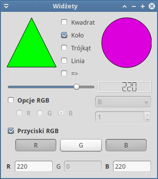
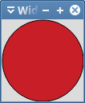
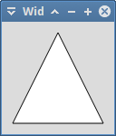
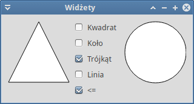
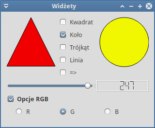
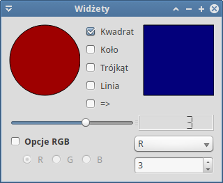
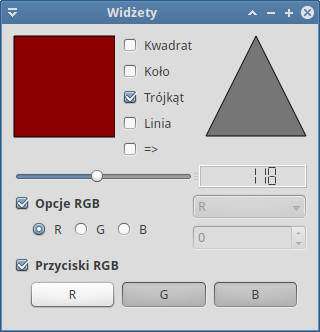
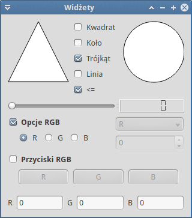

.. _widzety-qt:

Widżety
###########################

.. highlight:: python

Prosta 1-okienkowa aplikacja prezentująca większość podstawowych widżetów dostępnych w bibliotece Qt6
za pomocą Pythona 3 i biblioteki **PyQt6**.
Przykład ilustruje również techniki `programowania obiektowego <https://pl.wikipedia.org/wiki/Programowanie_obiektowe>`_ (ang. *Object Oriented Programing*).



W wybranym katalogu przygotuj :ref:`środowisko wirtualne Pythona <venv>`.
Zainstaluj bibliotekę PyQt6 w aktywowanym środowisku:

.. code-block:: bash

    (.venv) pip install pyqt6

.. attention::

    **Wymagana wiedza**:

    * Znajomość Pythona w stopniu średnim.
    * Znajomość podstaw projektowania interfejsu z wykorzystaniem bibliotek Qt (zob. scenariusz :ref:`Kalkulator <kalkulator-qt>`).
    * Przedstawiona aplikacja składa się z 3 plików, które muszą być zapisane w tym samym katalogu,
      np. :file:`widzety`.

QPainter – podstawy rysowania
*****************************

Zaczynamy od utworzenia głównego pliku aplikacji o nazwie :file:`widzety.py`.
Wstawiamy do niego poniższy kod:

.. raw:: html

    <div class="code_no">Plik <i>widzety.py</i>. Kod nr <script>var code_no = code_no || 1; document.write(code_no++);</script></div>

.. highlight:: python
.. literalinclude:: widzety_z1.py
    :linenos:

Klasa ``Widgety`` posłuży do zdefiniowania głównego okna oraz logiki działania naszej aplikacji.
Dziedziczy z klasy ``QWidget`` – podstawowej klasy biblioteki Qt, która jest bazą dla każdego elementu GUI,
w tym okna głównego. Dziedziczy również z klasy ``UiWidget`` importowanej z pliku :file:`gui.py`,
w którym zdefiniujemy elementy interfejsu graficznego.

W konstruktorze klasy (``__init()__``) wywołujemy konstruktory klas rodziców (``super().__init__()``)
oraz ustawiamy tytuł okna aplikacji (``self.setWindowTitle('Widżety')``).

Pozostały kod tworzy instancję aplikacji w oparciu o klasę ``QApplication``, a także
instancję okna głównego, czyli klasy ``Widgety``, wyświetla je i uruchamia pętlę zdarzeń.

Kod klasy ``UiWidget`` umieszczamy we wspomnianym pliku o nazwie :file:`gui.py`:

.. raw:: html

    <div class="code_no">Plik <i>gui.py</i>. Kod nr <script>var code_no = code_no || 1; document.write(code_no++);</script></div>

.. highlight:: python
.. literalinclude:: gui_z1.py
    :linenos:

W konstruktorze klasy tworzymy widżet ``ksztalt1``, który będzie mógł rysować figury geometryczne.
Widżet jest instancję klasy ``Ksztalt`` zaimportowanej z pliku :file:`ksztalty.py`.
Z tego pliku importujemy również klasę ``Ksztalty``, której właściwości oznaczają rysowane figury,
w tym przypadku prostokąt: ``self.ksztalt1 = Ksztalt(None, Ksztalty.Rect)``

Jeden widżet może zawierać wiele różnych elementów GUI, które trzeba w jakiś sposób porozmieszczać.
Służą do tego układy graficzne (ang. *layouts*). Biblioteka Qt udostępnia układy:

- poziomy (`QHBoxLayout <https://doc.qt.io/qt-6/qhboxlayout.html>`_),
- pionowy (`QVBoxLayout <https://doc.qt.io/qt-6/qvboxlayout.html>`_),
- tabelaryczny (`QGridLayout <https://doc.qt.io/qt-6/qgridlayout.html>`_).

Rysowany kształt dodajemy do układu poziomego za pomocą metody ``addWidget()``.
Następnie sam układ poziomy dodajemy do pionowego układu okna za pomocą metody ``addLayout()``.
Główny układ okna naszego widżetu ustawiamy w metodzie ``setLayout()``.

Klasa *Ksztalt*
***************

W pliku :file:`ksztalty.py` umieszczamy poniższy kod:

.. raw:: html

    <div class="code_no">Plik <i>ksztalty.py</i>. Kod nr <script>var code_no = code_no || 1; document.write(code_no++);</script></div>

.. highlight:: python
.. literalinclude:: ksztalty.py
    :linenos:
    :lines: 1-29

Za pomocą klasy ``Ksztalty`` symulujemy typ wyliczeniowy, tzn. angielskim nazwom kształtów,
które będą dostępne jako dane statyczne klasy, przypisujemy kolejne liczby całkowite zaczynając od 0.
Kształty, które będziemy rysowali, to:

 * *RECT* – prostokąt, wartość 0;
 * *ELLIPSE* – elipsa, w tym koło, wartość 1;
 * *POLYGON* – linia łamana zamknięta, np. trójkąt, wartość 2;
 * *LINE* – linia łącząca dwa punkty, wartość 3.

Klasa ``Ksztalt`` dziedziczy z klasy ``QWidget`` i pozwoli na rysowanie zdefiniowanych
w klasie ``Ksztalty`` figur. W konstruktorze definiujemy właściwości obiektu, który ma być rysowany:

- ``self.ksztalt`` – rysowana figura wskazana w parametrze ``ksztalt``, której domyślna wartość to
  ``Ksztalty.RECT``,
- ``self.kolor_o``, ``self.kolor_w`` – kolory obramowania i wypełnienia.

Kolory tworzymy za pomocą klasy `QColor <https://doc.qt.io/qt-6/qcolor.html>`_,
używając formatu `RGB <https://pl.wikipedia.org/wiki/RGB>`_, np .: ``QColor(0, 0, 0)``.

Do klasy ``Ksztalt`` dodajemy metody odpowiedzialne za rysowanie:

.. raw:: html

    <div class="code_no">Plik <i>ksztalty.py</i>. Kod nr <script>var code_no = code_no || 1; document.write(code_no++);</script></div>

.. highlight:: python
.. literalinclude:: ksztalty.py
    :linenos:
    :lineno-start: 30
    :lines: 30-50

Za rysowanie każdego widżetu odpowiada metoda `paintEvent() <https://doc.qt.io/qt-6/qwidget.html#paintEvent>`_.
Nadpisujemy ją. Tworzymy instancję klasy `QPainter <https://doc.qt.io/qt-6/qpainter.html>`_
umożliwiającej rysowanie różnych kształtów (``qp = QPainter()``). Między metodami ``begin()`` i ``end()``
wywołujemy metodę ``rysuj_figury()``, w której implementujemy kod rysujący poszczególne kształty.

Metoda ``rysuj_figury()`` otrzymuje obiekt klasy ``QPainter``. Jego metody ``setPen()`` i ``setBrush()``
pozwalają ustawić kolor odpowiednio obramowania i wypełnienia. Następnie w instrukcji warunkowej
sprawdzamy rodzaj rysowanego kształtu i wywołujemy metodę rysującą odpowiednią figurę:

* ``drawRect()`` – rysuje prostokąt,
* ``drawEllipse()`` – rysuje elipsę (koło),
* ``qp.drawLine()`` – pozwala narysować linię wyznaczoną przez współrzędne punktu
  początkowego i końcowego typu ``QPoint``; nasza klasa wykorzystuje tu współrzędne
  lewego górnego (``self.prost.topLeft()``) i prawego dolnego (``self.prost.bottomRight()``)
  rogu domyślnego prostokąta ``prost``,
* ``drawPolygon()`` – pozwala rysować wielokąty, jako argument podajemy listę typu
  `QPolygon <https://doc.qt.io/qt-6/qpolygon.html>`_ punktów typu `QPoint <https://doc.qt.io/qt-6/qpoint.html>`_
  opisujących współrzędne kolejnych wierzchołków; domyślne współrzędne zdefiniowane zostały
  jako atrybut ``punkty`` klasy ``Ksztalty``,

.. note::

    Każdy rysowany kształt wpisany jest w prostokąt zdefiniowany jako właściwość statyczna
    klasy ``Ksztalt``: ``prost = QRect(1, 1, 101, 101)``.
    Obiekt ten jest instancją klasy `QRect <https://doc.qt.io/qt-6/qrect.html>`_.
    Dwie pierwsze wartości to współrzędne lewego górnego, a dwie następne prawego dolnego rogu prostokąta
    w 2-wymiarowym układzie współrzędnych.

    Początek układu współrzędnych, w odniesieniu do którego definiujemy w Qt pozycję widżetów
    czy punkty opisujące kształty, znajduje się w lewym górnym rogu obiektu rodzica,
    np. głównego okna aplikacji.

.. note::

    Warto zrozumieć różnicę pomiędzy **zmiennymi klasy** a **zmiennymi instancji**.
    Zmienne (właściwości, atrybuty) klasy, określane również jako dane statyczne, są wspólne
    dla wszystkich jej instancji. W naszej aplikacji zdefiniowaliśmy w ten sposób
    zmienne ``prost`` i ``punkty`` klasy ``Ksztalt``.

    Zmienne instancji natomiast są inne dla każdego obiektu.
    Definiujemy je w konstruktorze, używając słowa ``self``. Np. każda instancja klasy
    ``Ksztalt`` może mieć inną wartość właściwości ``self.ksztalt``.

    Zob.: `Class and Instance Variables <https://docs.python.org/3/tutorial/classes.html#class-and-instance-variables>`_

**Ćwiczenie**

    * Uruchom skrypt :file:`widzety.py`.
    * Spróbuj zmienić rodzaj rysowanej figury oraz kolory jej obramowania i wypełnienia.



Być może zauważysz, że po uruchomieniu naszego skryptu rozmiar okna aplikacji nie jest dopasowany
do rozmiaru rysowanej figury. Spróbujemy to zmienić uzupełniając kod klasy ``Ksztalt``:

.. raw:: html

    <div class="code_no">Plik <i>ksztalty.py</i>. Kod nr <script>var code_no = code_no || 1; document.write(code_no++);</script></div>

.. highlight:: python
.. literalinclude:: ksztalty.py
    :linenos:
    :lineno-start: 51
    :lines: 51-

W nadpisanych metodach ``sizeHint()`` i ``minimumSizeHint()`` określamy sugerowany i minimalny
rozmiar naszego kształtu. Są one niezbędne, aby układy graficzne (ang. *layouts*), w których
umieścimy kształty, zarezerwowały odpowiednio dużo miejsca na ich wyświetlenie.

Kod uzupełniliśmy również o dwie metody ``ustaw_ksztalt()`` i ``ustaw_kolor_w()``, które przydadzą się nam dalej.
Jak wskazują nazwy – pozwolą one zmieniać kształt i jego kolor wypełnienia już po utworzeniu obiektu.
Metoda ``self.update()`` wymusi ponowne narysowanie kształtu.

**Ćwiczenie**

    * Ponownie przetestuj działanie aplikacji, spróbuj zmienić rodzaj rysowanej figury oraz
      kolor jej wypełnienia.



.. note::

    W kolejnych krokach będziemy dodawać widżety różnego typu. Kod tworzący odpowiednie obiekty
    i ustawiający ich początkowe właściwości dopisywać będziemy w pliku :file:`gui.py`
    w konstruktorze klasy ``UiWidget``. Dodając widżety, musimy pamiętać o zaimportowaniu
    odpowiedniej klasy z ``PyQt6.QtWidgets`` na początku pliku.

    Kod wiążący sygnały ze slotami umieścimy w pliku :file:`widzety.py`,
    w konstruktorze klasy ``Widgety``. Sloty implementować będziemy jako funkcje
    tej klasy.

Przyciski CheckBox
******************

Wykorzystując klasę ``Ksztalt`` utworzymy kolejny obiekt do rysowania figur. Dodamy także
przyciski typu `QCheckBox <https://doc.qt.io/qt-6/qcheckbox.html>`_ umożliwiające zmianę
rodzaju wyświetlanej figury.

**Importy** w pliku :file:`gui.py`:

.. code-block:: python

    from PyQt6.QtWidgets import QCheckBox, QButtonGroup

Klasa ``UiWidget`` przyjmuje następującą postać:

.. raw:: html

    <div class="code_no">Plik <i>gui.py</i>. Kod nr <script>var code_no = code_no || 1; document.write(code_no++);</script></div>

.. highlight:: python
.. literalinclude:: gui_z2.py
    :linenos:
    :lineno-start: 6
    :lines: 6-

Dodajemy drugi obiekt ``self.ksztalt2``, domyślnie rysujący elipsę.
Definiujemy też dodatkową właściwość ``self.ksztalt_aktywny``, która przechowywała będzie
aktualnie wybrany kształt, tzn. albo ``ksztal1`` (domyślnie) albo ``ksztalt2``.

Do tworzenia przycisków typu CheckBox wykorzystujemy pętlę ``for``, która odczytuje z krotki
kolejne indeksy i etykiety przycisków. Jeśli masz wątpliwości, jak to działa,
przetestuj następujący kod w konsoli Pythona:

.. code-block:: bash

    >>> for i, v in enumerate(('Kwadrat', 'Koło', 'Trójkąt', 'Linia')):
    ...   print(i, v)

Odczytane etykiety przekazujemy do konstruktora: ``self.chk = QCheckBox(v)``.

Przyciski wyboru kształtu działać mają na zasadzie wyłączności, w danym momencie
powinien być zaznaczony tylko jeden z nich. Tworzymy więc grupę logiczną ``grupa_chk`` na podstawie
klasy `QButtonGroup <https://doc.qt.io/qt-6/qbuttongroup.html>`_.
Do grupy dodajemy przyciski, oznaczając je kolejnymi indeksami:
``self.grupa_chk.addButton(self.chk, i)``.

Metoda ``buttons()`` zwraca listę przycisków, którą zapisujemy w zmiennej ``przyciski``.
Przycisk odpowiadający aktualnemu kształtowi wskazujemy przez indeks ``self.ksztalt_aktywny.ksztalt``
i wywołujemy metodę ``setChecked(True)``, która go zaznacza.

Poza pętlą tworzymy jeszcze jeden przycisk (``self.ksztaltChk = QCheckBox("<=")``),
niezależny od powyższej grupy. Jego stan wskazuje aktywny kształt.
Domyślnie go zaznaczamy: ``self.ksztaltChk.setChecked(True)``, co oznacza,
że aktywną figurą będzie pierwszy kształt.

Wszystkie elementy interfejsu umieszczamy w układzie poziomym o nazwie ``uklad_h1``.
Po lewej stronie znajdzie się ``ksztalt1``, w środku układ przycisków wyboru,
a po prawej ``ksztalt2``.

Obsługa sygnałów
================

Teraz zajmiemy się obsługą sygnałów. Przypomnijmy, że są to wydarzenia zachodzące w obrębie okna
naszej aplikacji (ruch myszy, kliknięcia, naciśnięcia klawiszy itp.) przechwytywane przez
główną pętlę zdarzeń naszej aplikacji. Do ich obsługi używamy slotów, czyli funkcji,
w tym wypadku będą to metody klasy ``Widgety``.

W pliku :file:`widzety.py` rozbudowujemy klasę ``Widgety``:

.. raw:: html

    <div class="code_no">Plik <i>widzety.py</i>. Kod nr <script>var code_no = code_no || 1; document.write(code_no++);</script></div>

.. highlight:: python
.. literalinclude:: widzety_z2.py
    :linenos:
    :lineno-start: 5
    :lines: 5-30

Grupa przycisków ``grupa_chk`` po kliknięciu emituje sygnał ``buttonClicked()```.
Przekazujemy jego obsługę do slotu (metody klasy ``Widgety``) ``ustaw_ksztalt()``.

W slocie ``ustaw_ksztalt()`` używamy metody o tej samej nazwie klasy ``Ksztalt``
do ustawienia nowej figury do narysowania. Jako argument przekazujemy
identyfikator klikniętego przycisku odczytywany za pomocą metody ``checkedId()``.
Jest to liczba całkowita, która wskazuje jedną z figur zdefiniowanych w klasie ``Ksztalty``.

Przypomnijmy (zob. wyżej), że metoda ``ustaw_ksztalt()`` z klasy ``Kształt`` aktualizuje
identyfikator figury i wywołuje metodę ``update()``, która wywołuje metodę
``paintEvent()``, a ta metodę ``rysuj_figury()``, która rysuje nową figurę.

Kliknięcie przycisku checkbox wskazującego aktywną figurę obsługujemy za pomocą
slotu ``aktywuj_ksztalt()``. Jej zadaniem jest ustawienie pierwszego lub drugiego
kształtu jako aktywnego. Jeżeli przekazany do slotu argument ``wartosc`` będzie
miał wartość ``True``, co oznacza, że checkbox został zaznaczony, aktywujemy
``ksztalt1``, w przeciwnym razie ``ksztalt2``. Zmieniamy również odpowiednio
tekst wyświetlany przy przycisku.

.. note::

    Warto zapamiętać, jak uzyskać dostęp do obiektu nadawcy, który wygenerował dany sygnał.
    W odpowiednim slocie używamy kodu ``self.sender()``.

**Ćwiczenie**

Uruchom kilkakrotnie aplikację. Spróbuj zmieniać inicjalne rodzaje domyślnych
kształtów i kolory wypełnienia figur.



Slider i przyciski RadioButton
******************************

Możemy już manipulować rodzajami rysowanych kształtów na obydwu obszarach rysowania.
Spróbujemy teraz dodać widżety pozwalające je kolorować.

W pliku :file:`gui.py` dodajemy importy:

.. code-block:: python

    from PyQt6.QtCore import Qt
    from PyQt6.QtWidgets import QSlider, QLCDNumber, QSplitter
    from PyQt6.QtWidgets import QRadioButton, QGroupBox

Rozbudowujemy konstruktor klasy ``UiWidget``. Po komentarzu ``# koniec CheckBox``
wstawiamy:

.. raw:: html

    <div class="code_no">Plik <i>gui.py</i>. Kod nr <script>var code_no = code_no || 1; document.write(code_no++);</script></div>

.. highlight:: python
.. literalinclude:: gui_z3.py
    :linenos:
    :lineno-start: 41
    :lines: 41-71

Do zmiany wartości składowych kolorów RGB wykorzystamy instancję klasy `QSlider <https://doc.qt.io/qt-6/qslider.html>`_,
czyli popularny suwak, w tym wypadku poziomy. Po utworzeniu obiektu, ustawiamy za pomocą
metod ``setMinimum()`` i ``setMaximum()`` zakres zmienianych wartości ``<0-255>``.

Następnie tworzymy instancję klasy `QLCDNumber <https://doc.qt.io/qt-6/qlcdnumber.html>`_,
którą wykorzystamy do wyświetlania wartości wybranej za pomocą suwaka.
Obydwa obiekty dodajemy do poziomego układu, rozdzielając je instancją typu
`QSplitter <https://doc.qt.io/qt-6/qsplitter.html>`_. Obiekt tez pozwala płynnie
zmieniać rozmiar otaczających go widżetów.

Przyciski typu `RadioButton <https://doc.qt.io/qt-6/qradiobutton.html>`_ posłużą nam do wskazywania
kanału koloru RGB, którego wartość chcemy zmienić. Tworzymy je w pętli,
wykorzystując odczytane z ciągu znaków ``'RGB'`` nazwy kanałów: ``self.radio = QRadioButton(v)``.
Przyciski rozmieszczamy w układzie poziomym (``self.uklad_r.addWidget(self.radio)``).

Pierwszy z nich zaznaczamy: ``self.uklad_r.itemAt(0).widget().setChecked(True)``.
Metoda ``itemAt(0)`` zwraca nam pierwszy element danego układu jako typ ``QLayoutItem``.
Kolejna metoda ``widget()`` przekształca go w obiekt typu ``QWidget``,
dzięki czemu możemy wywoływać jego metody.

Układ przycisków dodajemy do grupy typu `QGroupBox <https://doc.qt.io/qt-6/qgroupbox.html>`_:
``self.grupa_rbb.setLayout(self.uklad_r)``. Tego typu grupa zapewnia graficzną
ramkę z przyciskiem aktywującym typu CheckBox, który domyślnie zaznaczamy:
``self.grupa_rbb.setCheckable(True)``. Za pomocą metody ``setObjectName()``
grupie nadajemy nazwę *Radio*. Grupę dodajemy do układu poziomego.

Wszystkie dodane powyżej widżety zostały umieszczone w układach poziomych,
które należy dodać do głównego układu okna. Dopisz przed wywołaniem metody ``setLayout()``
odpowiedni kod:

.. raw:: html

    <div class="code_no">Plik <i>gui.py</i>. Kod nr <script>var code_no = code_no || 1; document.write(code_no++);</script></div>

.. code-block:: python

        uklad_okna.addWidget(uklad_h2)
        uklad_okna.addLayout(uklad_h3)

Obsługa sygnałów
================

W pliku :file:`widzety.py` dodajemy importy:

.. code-block:: python

    from PyQt6.QtGui import QColor
    from PyQt6.QtWidgets import QRadioButton

Uzupełniamy konstruktor (``__init__()``) klasy ``Widgety``:

.. raw:: html

    <div class="code_no">Plik <i>widzety.py</i>. Kod nr <script>var code_no = code_no || 1; document.write(code_no++);</script></div>

.. highlight:: python
.. literalinclude:: widzety_z3.py
    :linenos:
    :lineno-start: 18
    :lines: 18-25

Zmiana stanu przycisku *RadioButton* emituje sygnał ``toggled``. W pętli
``for i in range(self.uklad_r.count()):`` wiążemy ten sygnał dla każdego
przycisku układu ze slotem ``ustaw_kanal()``.

Przesuwanie suwaka wyzwala sygnał ``valueChanged``, który łączymy ze slotem
``zmien_kolor()``.

Do klasy ``Widget`` dodajemy teraz wspomniane sloty i metodę pomocniczą:

.. raw:: html

    <div class="code_no">Plik <i>widzety.py</i>. Kod nr <script>var code_no = code_no || 1; document.write(code_no++);</script></div>

.. highlight:: python
.. literalinclude:: widzety_z3.py
    :linenos:
    :lineno-start: 41
    :lines: 41-70

Metoda ``ustaw_kanal()`` służy do zapisania w zbiorze kanałów ``self.kanaly`` litery
oznaczającej wybrany kanał. Kanał można wybrać za pomocą różnych widżetów, dlatego na początku
w zmiennej ``nadawca`` zapisujemy obiekt nadawcy. Warunek ``isinstance(nadawca, QRadioButton) and wartosc``
sprawdza za pomocą funkcji wbudowanej ``isinstance(nadawca, QRadioButton)``, czy nadawcą jest przycisk *RadioButton*
i jeżeli tak, czy parametr ``wartosc`` ma wartość ``True``, co oznacza, że przycisk jest zaznaczony.
Jeżeli zostanie spełniony, do zresetowanego wcześniej zbioru kanałów dodajemy literę wybranego kanału:
``self.kanaly.add(nadawca.text())``. Następnie wywołujemy metodę ``wypisz_kanal()``.

Zadaniem metody ``wypisz_kanal()`` jest ustawienie wartości kanału przekazanego w parametrze ``kanal``
w widżecie przekazanym w parametrze ``widzet`` za pomocą metody ``setValue()``. Przekazny kanał wykkrywamy
w złożonej instrukcji warunkowej, składową koloru odczytujemy za pomocą odpowiednich metod, np.:
``self.suwak.setValue(self.kolor_w.red())``.

Metoda ``zmien_kolor()`` wywoływana jest po zmianie wartości, tj. liczby z zakresu ``<0; 255>``,
za pomocą suwaka. Wartość wyświetlamy w widżecie LCD: ``self.lcd.display(wartosc)``.
Następnie sprawdzamy, który ze zmienianych kanałów znajduje się w zbiorze kanały i aktualizujemy
jego wartość w kolorze wypełnienia, np.: ``self.kolor_w.setRed(wartosc)``.

Na koniec składowe koloru wypełnienia ``kolor_w`` przekazujemy do metody
``ustaw_kolor_w()`` aktywnego kształtu. Przypomnijmy, żę metoda ta zdefiniowana w pliku :file:`ksztalty.py`
aktualizuje kolor kształtu i wymusza jego ponowne rysowanie.

Przetestuj działanie aplikacji.



ComboBox i SpinBox
******************

Modyfikowane kanały koloru można również wybierać z rozwijalnej listy typu
`QComboBox <https://doc.qt.io/qt-6/qcombobox.html>`_, a ich wartości
ustawiać za pomocą widżetu `QSpinBox <https://doc.qt.io/qt-6/qspinbox.html>`_.

W pliku :file:`gui.py` dodajemy importy:

.. code-block:: python

    from PyQt6.QtWidgets import QComboBox, QSpinBox

Po komentarzu ``# koniec RadioButton`` uzupełniamy konstruktor klasy ``UiWidget``:

.. raw:: html

    <div class="code_no">Plik <i>gui.py</i>. Kod nr <script>var code_no = code_no || 1; document.write(code_no++);</script></div>

.. highlight:: python
.. literalinclude:: gui_z4.py
    :linenos:
    :lineno-start: 73
    :lines: 73-91

Do listy utworzonej na podstawie klasy ``ComboBox`` dodajemy za pomocą pętli ``for``
litery poszczególnych kanałów: ``self.lista_rgb.addItem(v)``.

Obiekt typu *SpinBox* podobnie jak *Slider* wymaga ustawienia zakresu wartości ``<0-255>``.
Stosujemy takie same metody, jak wcześniej, tj. ``setMinimum()`` i ``setMaximum()``.

Obydwa widżety na początku wyłączamy metodą ``setEnabled(False)``. Umieszczamy jeden nad drugim
w pionowym układzie ``uklad_v1``, a układ dodajemy obok przycisków Radio ``uklad_h3.addLayout(uklad_v1)``,
oddzielając go odstępem 25 px: ``uklad_h3.insertSpacing(1, 25)``.

Obsługa sygnałów
=================

W pliku :file:`widzety.py` dodajemy import:

.. code-block:: python

    from PyQt6.QtWidgets import QRadioButton

Do konstruktora dodajemy kod przechwytujący 3 sygnały:

.. raw:: html

    <div class="code_no">Plik <i>widzety.py</i>. Kod nr <script>var code_no = code_no || 1; document.write(code_no++);</script></div>

.. highlight:: python
.. literalinclude:: widzety_z4.py
    :linenos:
    :lineno-start: 27
    :lines: 27-31

Pierwszy sygnał, tj. kliknięcie przycisku *CheckBox* grupy przycisków *RadioButton*
wiążemy ze slotem ``ustaw_stan()``:

.. raw:: html

    <div class="code_no">Plik <i>widzety.py</i>. Kod nr <script>var code_no = code_no || 1; document.write(code_no++);</script></div>

.. highlight:: python
.. literalinclude:: widzety_z4.py
    :linenos:
    :lineno-start: 81
    :lines: 80-93

Jeżeli metoda ``ustaw_stan()`` w parametrze ``wartosc`` otrzyma ``True``, tzn. przycisk 
jest zaznaczony, wyłączamy widżety *ComboBox* i *SpinBox* (``setEnabled(False)``).
W przeciwnym razie je włączamy (``setEnabled(True)``), a także resetujemy zbiór kanałów
i dodajemy do niego kanał wybrany na liście: ``self.kanaly.add(self.lista_rgb.currentText())``.
Na koniec ustawiamy wartość aktywnego kanału w obiekcie *SpinBox*.

Zmianę kanału na liście *ComboBox*, tj. sygnał ``currentTextChanged`` obsługujemy za pomocą dodanej
wcześniej metody ``ustaw_kanal()``, która przyjmuje następującą postać:

.. raw:: html

    <div class="code_no">Plik <i>widzety.py</i>. Kod nr <script>var code_no = code_no || 1; document.write(code_no++);</script></div>

.. highlight:: python
.. literalinclude:: widzety_z4.py
    :linenos:
    :lineno-start: 46
    :lines: 46-59

Dodajemy warunek ``isinstance(nadawca, QComboBox)`` sprawdzający, czy nadawcą jest obiekt typu ``QComboBox``.
Jeżeli tak, resetujemy zbiór kanałów i dodajemy literę wybranego kanału: ``self.kanaly.add(wartosc)``.
Na koniec ustawiamy wartość tego kanału w obiekcie *SpinBox*: ``self.wypisz_kanal(wartosc, self.spin_rgb)``.

.. note::

    Slot ``ustaw_kanal()`` w przypadku sygnału ``toogled`` obiektu typu ``QRadioButton`` otrzymuje
    w argumencie ``wartosc`` wartość ``True`` lub ``False`` w zależności od tego, czy przycisk jest zaznaczony
    czy nie. W przypadku sygnału ``currentTextChanged`` obiektu typu ``QComboBox``
    argument ``wartosc`` zawiera literę wybranego kanału.

Zmiana wartości w kontrolce *SpinBox*, czyli sygnał ``valueChanged``, przekierowujemy
do dodanego wcześniej slotu ``zmien_lolor()``, który obsługuje również zmiany wartości na suwaku.

Uruchom aplikację i sprawdź jej działanie.



Przyciski PushButton
********************

Za pomocą dodanych do tej pory widżetów możemy zmieniać kolor każdego kanału składowego osobno.
Dodamy teraz możliwość zmiany koloru kilku kanałów jednocześnie. Użyjemy grupy przycisków typu
`QPushButton <https://doc.qt.io/qt-6/qpushbutton.html>`_.

W pliku :file:`gui.py` dodajemy importy:

.. code-block:: python

    from PyQt6.QtWidgets import QPushButton

Następnie po komentarzu ``# koniec ComboBox i SpinBox`` dopisujemy kod w konstruktorze klasy ``UiWidget``:

.. raw:: html

    <div class="code_no">Plik <i>gui.py</i>. Kod nr <script>var code_no = code_no || 1; document.write(code_no++);</script></div>

.. highlight:: python
.. literalinclude:: gui_z5.py
    :linenos:
    :lineno-start: 93
    :lines: 93-109
    :emphasize-lines: 4-8

Przyciski tworzymy podobnie jak wcześniej w pętli za pomocą instrukcji: ``self.btn = QPushButton(v)``.
Każdy przycisk przekształcamy na stanowy, tj. taki który może być trwale wciśnięty,
za pomocą metody ``setCheckable(True)``. Następnie przycisk dodajemy do grupy typu
`QButtonGroup <https://doc.qt.io/qt-6/qbuttongroup.html>`_,
która umożliwi zaznaczenie (wciśnięcie przycisku): ``self.grupa_pb.addButton(self.btn)``.
Każdy przycisk dodawany jest również do układu poziomego ``uklad_pb``.

Wywołanie po pętli metody grupy przycisków ``setExclusive(False)`` umożliwi zaznaczanie (wciskanie) wielu przycisków
na raz, czyli odwrotnie niż w przypadku grupy przycisków *CheckBox*.

Układ przycisków dodajemy do ramki typu `QGroupBox <https://doc.qt.io/qt-6/qgroupbox.html>`_ z przyciskiem *CheckBox*:
``self.grupa_pbb.setCheckable(True)``. Na początku ramkę wyłączamy: ``self.grupaPBtn.setChecked(False)``.

Ramkę z przyciskami musimy dodać do głównego układu okna za pomocą metody ``addWidget()``.
Kod powinien wyglądać następująco:

.. raw:: html

    <div class="code_no">Plik <i>gui.py</i>. Kod nr <script>var code_no = code_no || 1; document.write(code_no++);</script></div>

.. highlight:: python
.. literalinclude:: gui_z5.py
    :linenos:
    :lineno-start: 110
    :lines: 110-116
    :emphasize-lines: 6

Obsługa sygnałów
================

W pliku :file:`widzety.py` dodajemy import:

.. code-block:: python

    from PyQt6.QtWidgets import QPushButton

Obsługę sygnałów dopisujemy w konstruktorze:

.. raw:: html

    <div class="code_no">Plik <i>widzety.py</i>. Kod nr <script>var code_no = code_no || 1; document.write(code_no++);</script></div>

.. highlight:: python
.. literalinclude:: widzety_z5.py
    :linenos:
    :lineno-start: 33
    :lines: 33-37

W pętli odczytujemy kolejne przyciski z grupy ``grupa_pb`` zwracane przez metodę ``buttons()``
i kliknięcie każdego wiążemy ze slotem ``ustaw_kanal()``.

Kod metody ``ustaw_kanal()`` uzupełniamy:

.. raw:: html

    <div class="code_no">Plik <i>widzety.py</i>. Kod nr <script>var code_no = code_no || 1; document.write(code_no++);</script></div>

.. highlight:: python
.. literalinclude:: widzety_z5.py
    :linenos:
    :lineno-start: 65
    :lines: 65-70

Po wykryciu, że nadawca sygnału jest obiektem typu ``QPushButton``, sprawdzamy, czy przycisk został wciśnięty,
tj. argument ``wartosc`` ustawiony jest na ``True``. Jeżeli tak, odpowiedni kanał zostanie dodany
do zbioru ``self.kanaly``, a w przeciwnym razie zostanie ze zbioru usunięty.

Inaczej niż w poprzednich metodach, obsługujących przyciski *Radio* i listę *ComboBox*,
nie resetujemy tu zbioru kanałów.

Przetestuj zmodyfikowaną aplikację.



QLabel i QLineEdit
******************

Dodamy do aplikacji zestaw widżetów typu `QLineEdit <https://doc.qt.io/qt-6/qlineedit.html>`_, tzn. 1-liniowych pól edycyjnych.
Pola będą oznaczone etykietami typu `QLabel <https://doc.qt.io/qt-6/qlabel.html>`_ i będą umożliwiały
ustawienia składowych koloru wypełnienia aktywnego kształtu.

W pliku :file:`gui.py` dodajemy importy:

.. code-block:: python

    from PyQt6.QtWidgets import QLabel, QLineEdit

Następnie po komentarzu ``# koniec PushButton`` uzupełnij konstruktor klasy ``UiWidget``:

.. raw:: html

    <div class="code_no">Plik <i>gui.py</i>. Kod nr <script>var code_no = code_no || 1; document.write(code_no++);</script></div>

.. highlight:: python
.. literalinclude:: gui_z6.py
    :linenos:
    :lineno-start: 111
    :lines: 111-128
    :emphasize-lines: 10-11

Zaczynamy od utworzenia trzech etykiet i trzech pól edycyjnych dla każdego kanału.
W pętli wykorzystujemy funkcję Pythona
`getattr(obiekt, nazwa) <https://docs.python.org/3/library/functions.html#getattr>`_,
która potrafi zwrócić podany jako ``nazwa`` atrybut ``obiektu``. W tym przypadku
kolejne etykiety i pola edycyjne, które umieszczamy obok siebie w poziomie.
Przy okazji ograniczamy długość wpisywanego w pola edycyjne tekstu do 3 znaków:
``edit.setMaxLength(3)``.

Układ ``uklad_h4`` trzeba jeszcze dodać do głównego układu okna:

.. raw:: html

    <div class="code_no">Plik <i>gui.py</i>. Kod nr <script>var code_no = code_no || 1; document.write(code_no++);</script></div>

.. code-block:: python

        uklad_okna.addLayout(uklad_h4)

Obsługa sygnałów
================

W pliku :file:`widzety.py` dodajemy import:

.. code-block:: python

    from PyQt6.QtWidgets import QLineEdit

Obsługę sygnałów dopisujemy w konstruktorze:

.. raw:: html

    <div class="code_no">Plik <i>widzety.py</i>. Kod nr <script>var code_no = code_no || 1; document.write(code_no++);</script></div>

.. highlight:: python
.. literalinclude:: widzety_z6.py
    :linenos:
    :lineno-start: 39
    :lines: 39-44

W pętli, podobnej jak w pliku interfejsu, sygnał zakończenia edycji tekstu w polu typu *QLineEdit*
wiążemy z dodanymi wcześniej slotami ``ustaw_kanal`` i ``zmien_kolor()``.
Będziemy mogli wpisywać w tych polach nowe wartości składowych koloru.

Uzupełniamy metodę ``ustaw_kanal()``:

.. raw:: html

    <div class="code_no">Plik <i>widzety.py</i>. Kod nr <script>var code_no = code_no || 1; document.write(code_no++);</script></div>

.. highlight:: python
.. literalinclude:: widzety_z6.py
    :linenos:
    :lineno-start: 77
    :lines: 77-81

Jeżeli nadawca jest obiektem typu ``QLineEdit``, odczytujemy ostatnią literę z jego nazwy
i zamieniamy na wielką: ``nadawca.objectName()[-1].upper()``. Litera ta oznacza edytowany kanał,
który dodajemy do zbioru kanałów.

Następnie zmieniamy metodę ``zmien_kolor()``, która do tej pory otrzymywała wartości typu całkowitego
z suwaka *QSlider* lub pola *QSpinBox*. Pole edycyjne zwraca liczbę, ale w postaci tekstu, który trzeba
zamienić na typ całkowity. Dodajemy więc na początku metody instrukcję:

.. raw:: html

    <div class="code_no">Plik <i>widzety.py</i>. Kod nr <script>var code_no = code_no || 1; document.write(code_no++);</script></div>

.. highlight:: python
.. literalinclude:: widzety_z6.py
    :linenos:
    :lineno-start: 90
    :lines: 90-93
    :emphasize-lines: 2-3

Natomiast na końcu omawianej metody umieszczamy wywołanie nowej metody: ``self.info()``.

Kod metody ``info()`` dopisujemy do klasy ``Widgety``:

.. raw:: html

    <div class="code_no">Plik <i>widzety.py</i>. Kod nr <script>var code_no = code_no || 1; document.write(code_no++);</script></div>

.. highlight:: python
.. literalinclude:: widzety_z6.py
    :linenos:
    :lineno-start: 119
    :lines: 119-133

Jej zadanie polega na wyróżnieniu kanałów znajdujących się w zbiorze ``kanaly`` poprzez pogrubienie czcionki etykiet
i uaktywnieniu odpowiednich pól edycyjnych. Jeżeli kanał jest nieaktywny, ustawiamy normalną czcionkę etykiety
i wyłączamy pole edycji. Wszystko dzieje się w pętli wykorzystującej omawianą już funkcję ``getattr()``
do uzyskania dostępu do kolejnych obiektów. Na końcu metody wartości poszczególnych kanałów koloru
wpisujemy do odpowiednich pól edycyjnych.

.. note::

    Typ czcionki zmieniamy z pomocą stylów CSS zdefiniowanym na początku funkcji pod nazwą
    ``font_b`` i ``font_n``. Później przypisujemy je etykietom za pomocą metody ``setStyleSheet()``.

Wprowadź omówione zmiany i przetestuj działanie aplikacji.



Dodatki
********

Nasza aplikacja działa, ale można dopracować w niej kilka szczegółów. Poniżej zaproponujemy
kilka zmian, które potraktować należy jako zachętę do samodzielnych ćwiczeń i przeróbek.

1. Pola edycyjne *QLineEdit* dla składowych zielonej i niebieskiej powinny
   być na początku nieaktywne.
2. Zaznaczenie jednej z grup widżetów powinno wyłączać inne grupy, tj. w danym momencie powinna być
   aktywna albo grupa przycisków *Radio* albo lista *Combo* albo grupa przycisków *Push* z polami edycyjnymi.
3. Jeżeli aktywujemy grupę *Push*, należy zaznaczyć (wcisnąć) przycisk odpowiadający
   ostatniemu aktywnemu kanałowi.
4. Stan pól edycyjnych powinien odpowiadać stanowi przycisków *Push*,
   wciśnięty przycisk to aktywne pole i odwrotnie.
5. Funkcja ``zmien_kolor()`` nie jest zabezpieczona przed błędnymi danymi
   wprowadzanymi do pól edycyjnych.
6. Dodaj dwa osobne przyciski, które umożliwią kopiowanie koloru i kształtu z jednej figury
   na drugą.
7. Dodaj etykietę lub pole edycyjne, które będzie wyświetlało aktualnie ustawiony kolor dla aktywnego
   kształtu w formacie szesnastkowym.

Materiały
***************

1. `Qt Widgets <https://doc.qt.io/qt-6/qtwidgets-index.html>`_
2. `Widgets Tutorial <https://doc.qt.io/qt-6/widgets-tutorial.html>`_
3. `Layout Management <https://doc.qt.io/qt-6/layout.html>`_
