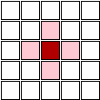

Zasady gry
################

W *Grze robotów* piszesz programy kierujące walczącymi dla Ciebie robotami.
Planszą gry jest siatka o wymiarach 19x19 pól. Celem gry jest
umieszczenie na niej jak największej ilości robotów w ciągu 100 rund
rozgrywki.

.. figure:: img/rules1.png

Czarne kwadraty to pola, na które nie ma wstępu. Wyznaczają kolistą
arenę dla walk robotów.

Zielone kwadraty oznaczają punkty wejścia do gry.
Co **10** rund po **5** robotów każdego gracza rozpoczyna walkę w losowych punktach wejścia
(ang. *spawn points*). Roboty z poprzednich tur pozostające w tych punktach giną.

Każdy robot rozpoczyna grę z 50 punktami HP (ang. *health points*).

Roboty mogą działać (przemieszczać się, atakować itd.) na przyległych
kwdratach w pionie (góra, dół) i w poziomie (lewo, prawo).

W każdej rundzie możliwe są następujące działania robota:

* **Ruch** na przyległy kwadrat. Jeżeli znajduje się tam już robot
  lub inny robot próbuje zająć to samo miejsce, obydwa tracą 5 punktów HP
  z powodu kolizji, a ruch(y) nie dochodzi(ą) do skutku. Jeżeli jednak robot
  chce przejść na pole zajęte przez innego, a ten drugi opuszcza zajmowane pole,
  ruch jest udany.

  Minimum cztery roboty w kwadracie, przemieszczające się zgodnie ze wskazówkami
  zegara, będą mogły się poruszać, podobnie dowolna ilość robotów w kole.
  (Roboty nie mogą bezpośrednio zamieniać się miejscami!)

* **Atak** na przyległy kwadrat. Jeżeli w atakowanym kwadracie znajdzie się robot
  pod koniec rundy, np. robot pozostał w miejscu lub przeszedł na nie,
  robot ten traci od 8 do 10 punktów HP w następstwie uszkodzeń.

* **Samobójstwo** – robot ginie pod koniec rundy, zabierając 15 punktów HP wszystkim
  robotom w sąsiedztwie.

* **Obrona** – robot pozostaje w miejscu, tracąc połowę punktów HP wskutek ataku
  lub samobójstwa, nie odnosi uszkodzeń z powodu kolizji.

W grze nie można uszkodzić własnych robotów. Kolizje, ataki i samobójstwa
wyrządzają szkody tylko przeciwnikom.

Wygrawa gracz, który po 100 rundach ma największą liczbę robotów na planszy.

Zadaniem gracza jest zakodowanie sztucznej inteligencji (ang. AI – *artificial itelligance*),
dla wszystkie swoich robotów. Aby wygrać, roboty gracza muszą ze sobą współpracować,
np. żeby otoczyć przeciwnika.

.. note::

    Niniejsza dokumentacja jest nieautoryzowanym tłumaczeniem oficjalnej dokumentacji
    dostępnej na stonie `RobotGame <https://robotgame.net>`_.
