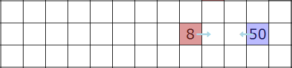

.. _strategia1:

Strategia podstawowa
#####################

Przykład robota
*****************

.. raw:: html

    
Kod nr 

.. highlight:: python
.. literalinclude:: robot_p.py
    :linenos:

Z powyższego kodu wynikają trzy zasady:

* broń się, jeżeli jesteś w środku planszy;
* atakuj przeciwnika, jeżeli jest obok;
* idź do środka.

To pozwala nam rozpocząć grę, ale wiele możemy ulepszyć. Większość usprawnień (ang. *feature*),
które zostaną omówione, to rozszerzenia wersji podstawowej. Konstruując
robota, można je stosować wybiórczo.

Kolejne reguły
***********************

Rozbudujemy przykład podstawowy. Oto lista reguł, które warto rozważyć:

* **Reguła 1: Opuść punkt wejścia.**

Pozostawanie w punkcie wejścia nie jest dobre. Sprawdźmy, czy jesteśmy
w punkcie wejścia i czy powinniśmy z niego wyjść. Nawet wtedy, gdy jest
ktoś do zaatakowania, ponieważ nie chcemy zostać zamknięci w pułapce wejścia.

* **Reguła 2: Uciekaj, jeśli masz zginąć.**

Przykładowy robot atakuje aż do śmierci. Ponieważ jednak wygrana zależy od
liczby pozostałych robotów, a nie ich zdrowia, bardziej opłaca się zachować
robota niż poświęcać go, żeby zadał dodakowe obrażenia przeciwnikowi. Jeżeli
więc jesteśmy zagrożeni śmiercią, uciekamy, a nie giniemy na próżno.

* **Reguła 3: Atakuje przeciwnika o dwa kroki od ciebie.**

Przyjrzyj się grającemu wg reguł robotowi, zauważysz, że kiedy wchodzi na pole
atakowane przez przeciwnika, odnosi obrażenia. Dlatego, jeśli prawdopodobne jest,
że przeciwnik może znaleźć się w naszym sąsiedztwie, trzeba go zatakować.
Dzięki temu nit się do nas bezkarnie nie zbliży.

.. note::

    Połączenie ucieczki i ataku w kierunku przeciwnika naprawdę jest skuteczne.
    Każdy agresywny wróg zanim nas zaatakuje, sam spotyka się z atakiem.
    Jeżeli w porę odskoczysz, zanim się zbliży, działanie takie możesz powtórzyć.
    Technika ta nazywana jest w grach `kiting <http://gaming.stackexchange.com/questions/18903/what-is-kiting>`_,
    a jej działanie ilustruje poniższa animacja:

Zwróć uwagę na słabego robota ze zdrowiem 8 HP, który podchodzi do mocnego robota
z 50 HP, a następnie ucieka. Zbliżając się atakuje pole, na które wchodzi przeciwnik,
ucieka i ponawia działanie. Trwa to do momentu, kiedy silniejszy robot popełni samobójstwo
(co w tym wypadku jest mało przydatne). Wszystko bez uszczerbku na zdrowiu słabszego
robota.

* **Reguła 4: Wchodź tylko na wolne pola.**

Przykładowy robot idzie do środka planszy, ale w wielu wypadkach lepiej zrobić
coś innego. Np. iść tam, gdzie jest bezpiecznie, zamiast narażać się na
bezużyteczne niebezpieczeństwo. Co jest bowiem ryzykowne? Po wejściu na planszę
ruch na pole przeciwnika lub wchodzenie w jego sąsiedztwo. Wiadomo też, że
nie możemy wchodzić na zajęte pola i że możemy zmniejszyć ilość kolizji,
nie wchodząc na pola zajęte przez naszą drużynę.

* **Reguła 5: Idź na wroga, jeżeli go nie ma w zasięgu dwóch kroków.**

Po co iść do środka, skoro mamy inne bezpieczne możliwości? Wprawdzie stanie
w punkcie wejścia jest złe, ale to nie znaczy, że środek planszy jest dobry.
Lepszym wyborem jest ruch w kierunku, ale nie na pole, przeciwnika.
W połączeniu z atakiem daje nam to lepszą kontrolę nad planszą.
Później przekonamy się jeszcze, że są sytuacje, kiedy wejście na
potencjalnie niebezpieczne pole warte jest ryzyka, ale na razie poprzestańmy
na tym, co ustaliliśmy.

Łączenie ulepszeń
*******************

Zapiszmy wszystkie reguły w pseudokodzie. Możemy użyć do tego jednej
rozbudowanej instrukcji warunkowej if/else.

.. code-block:: html

    jeżeli jesteś w punkcie wejścia:
        rusz się bezpiecznie (np. poza wejście)
    jeżeli jeddnak mamy przeciwnika o krok dalej:
        jeżeli możemy umrzeć:
            ruszamy się w bezpieczne miejsce
        w przeciwnym razie:
            atakujemy przeciwnika
    jeżeli jednak mamy przeciwnika o dwa kroki dalej:
        atakujemy w jego kierunku
    jeżeli mamy bezpieczny ruch (i nikogo wokół siebie):
        ruszamy się bezpiecznie, ale w kierunku przeciwnika
    w przeciwnym razie:
        bronimy się w miejscu, bo nie ma gdzie ruszyć się lub atakować

Implementacja
****************

Do zakodowania omówionej logiki potrzebujemy struktury danych gry z jej
ustawieniami i kilku funkcji. Pamiętajmy, że jest wiele sobosobów na zapisanie
kodu w Pythonie. Poniższy w żdanym razie nie jest optymalny, ale działa
jako przykład.

Zbiory zamiast list
********************

Dla ułatwienia użyjemy pythonowych zbiorów razem z funkcją ``set()``
i wyrażeniami zbiorów (ang. *set comprehensions*).

.. note::

    Zbiory i operacje na nich omówiono w `dokumentacji zbiorów <https://docs.python.org/2/library/sets.html>`_,
    podobnie przykłady `wyrażeń listowych i odpowiadających im pętli <https://docs.python.org/2/tutorial/datastructures.html#list-comprehensions>`_.

Podstawowe operacje na zbiorach, których użyjemy to:

* ``|`` lub suma – zwraca zbiór wszystkich elementów zbiorów;
* ``-`` lub różnica – zbiór elementów obecnych tylko w pierwszym zbiorze;
* ``&`` lub iloczyn – zwraca zbiór elementów występujących w obydwu zbiorach.

Załóżmy, że zaczniemy od wygenerowania następujących list:
``drużyna`` – członkowie drużyny, ``wrogowie`` – przeciwnicy,
``wejścia`` – punkty wejścia oraz ``przeszkody`` – położenia zablokowane,
tzn. szare kwadraty.

Zbiory pól
****************************

Aby ułatwić implementację omówionych ulepszeń, przygotujemy kilka zbiorów
reprezentujących pola różnych kategorii na planszy gry. W tym celu
używamy wyrażeń listowych (ang. *list comprehensions*).

.. code-block:: python

    # zbiory pól na planszy

    # wszystkie pola
    wszystkie = {(x, y) for x in xrange(19) for y in xrange(19)}

    # punkty wejścia (spawn)
    wejscia = {loc for loc in wszystkie if 'spawn' in rg.loc_types(loc)}

    # pola zablokowane (obstacle)
    zablokowane = {loc for loc in wszystkie if 'obstacle' in rg.loc_types(loc)}

    # pola zajęte przez nasze roboty
    przyjaciele = {loc for loc in game.robots if game.robots[loc].player_id == self.player_id}

    # pola zajęte przez wrogów
    wrogowie = set(game.robots) - przyjaciele

Warto zauważyć, że zbiór wrogich robotów otrzymujemy jako różnicę zbioru
wszystkich robotów i tych z naszej drużyny.

Wykorzystanie zbiorów
****************************

Przy poruszaniu się i atakowaniu mamy tylko cztery możliwe kierunki, które
zwraca funkcja ``rg.locs_around``. Możemy wykluczyć położenia zablokowane
(ang. *obstacle*), ponieważ nigdy ich nie zajmujemy i nie atakujemy. Iloczyn zbiorów
``sasiednie & wrogowie`` da nam zbiór przeciwników w sąsiedztwie:

.. code-block:: python

    # pola sąsiednie
    sasiednie = set(rg.locs_around(self.location)) - zablokowane

    # pola sąsiednie zajęte przez wrogów
    wrogowie_obok = sasiednie & wrogowie

Aby odnaleźć wrogów oddalonych o dwa kroki, szukamy przyległych kwadratów,
obok których są przeciwnicy. Wyłączamy sąsiednie pola zajęte przez członków drużyny.

.. code-block:: python

    # pola zajęte przez wrogów w odległości 2 kroków
    wrogowie_obok2 = {loc for loc in sasiednie if (set(rg.locs_around(loc)) & wrogowie)} - przyjaciele

Teraz musimy sprawdzić, które z położeń są bezpieczne. Usuwamy pola zajmowane
przez przeciwników w odległości 1 i 2 kroków. Pozbywamy się także punktów
wejścia, nie chcemy na nie wracać. Podobnie, aby zmniejszyć możliwość kolizji,
wyrzucamy pola zajmowane przez drużynę. W miarę komplikowania logiki będzie
można zastąpić to ograniczenie dodatkowym warunkiem, ale na razie to
najlepsze, co możemy zrobić.

.. code-block:: python

    bezpieczne = sasiednie - wrogowie_obok - wrogowie_obok2 - wejscia - przyjaciele

Potrzebujemy funkcji, która wybierze ze zbioru położeń pole najbliższe podanego.
Możemy użyć tej funkcji do znajdowania najbliższego wroga, jak również
do wyboru pola z bezpiecznej listy. Możemy więc wybrać ruch najbardziej
przybliżający nas do założonego celu.

.. code-block:: python

    def mindist(bots, loc):
        return min(bots, key=lambda x: rg.dist(x, loc))

Możemy użyć metody ``pop()`` zbioru, aby pobrać jego dowolny element, np.
przeciwnika, którego zaatakujemy. Żeby dowiedzieć się, czy jesteśmy zagrożeni
śmiercią, możemy pomnożyć liczbę sąsiadujących przeciwników przez średni
poziom uszkodzeń (9 punktów HP) i sprawdzić, czy mamy więcej siły.

Ze względu na sposób napisania funkcji ``minidist()`` trzeba pamiętać
o przekazywaniu jej niepustych zbiorów. Jeśli np. zbiór przeciwników będzie pusty,
funkcja zwróci błąd.

Składamy wszystko razem
************************

Po złożeniu wszystkich kawałków kodu razem otrzymujemy przykładową
implemetację robota wyposażonego we wszystkie założone wyżej właściwości:

.. raw:: html

    
Kod nr 

.. highlight:: python
.. literalinclude:: robot_b.py
   :linenos:

.. raw:: html

    

.. note::

    Niniejsza dokumentacja jest swobodnym i nieautoryzowanym tłumaczeniem materiałów
    dostępnych na stonie `Robotgame basic strategy
    <https://github.com/ramk13/robotgame/blob/master/strategy_guide/robotgame_basic_strategy.md>`_.
