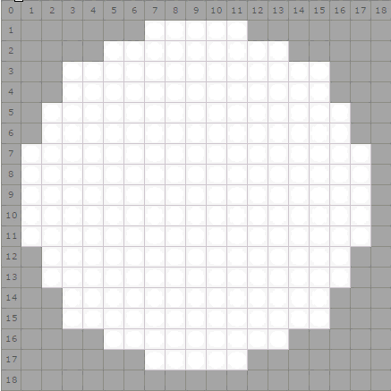

.. _robot-game:

Gra robotów
############

`RobotGame <https://robotgame.net>`_ to gra, w której walczą ze sobą programy – roboty
na planszy o wymiarach 19x19 pól. Celem gry jest umieszczenie na niej
jak największej ilości robotów w ciągu 100 rund rozgrywki.

.. figure:: img/plansza01.png

Czarne pola (ang. *obstacle*) wyznaczają granicę areny walk, zielone pola
(ang. *spawn points*) to punkty wejścia, w których co **10** rund pojawia się
po **5** robotów, każdy z 50 punktami HP (ang. *health points*) na starcie.

W każdej rundzie każdy robot musi wybrać jedno z następujących działań:

* **Ruch** (ang. *move*) na przyległe pole w pionie (góra, dół) lub poziomie
  (lewo, prawo). W przypadku, kiedy w polu docelowym znajduje się lub znajdzie
  się inny robot następuje *kolizja* i utrata po 5 punktów HP.
* **Atak** (ang. *attack*) na przyległe pole, wrogi robot na tym polu traci
  8-10 punktów HP.
* **Samobójstwo** (ang. *suicide*) – robot ginie pod koniec rundy zabierając
  wszystkim wrogim robotom obok po 15 punktów HP.
* **Obrona** (ang. *guard*) – robot pozostaje w miejscu, tracąc połowę punktów
  HP w wyniku ataku lub samobójstwa.

W grze nie można uszkodzić własnych robotów.

**Sztuczna inteligencja**

Zadaniem gracza jest stworzenie sztucznej inteligencji robota, która pozwoli
mu w określonych sytuacjach na arenie wybrać odpowiednie działanie.
Trzeba więc: określić daną sytuację, ustalić działanie robota, zakodować je
i przetestować, np.:

1) Gdzie ma iść robot po po wejściu na arenę?
2) Działanie: "Idź do środka".
3) Jaki kod umożliwi robotowi realizowanie tej reguły?
4) Czy to działa?

Aby ułatwić budowanie robota, przedstawiamy kilka przykładowych reguł
i "klocków", z których można zacząć składać swojego robota. Pokazujemy również,
jak testować swoje roboty. Nie podajemy jednak "przepisu" na robota najlepszego.
Do tego musisz dojść sam.

.. toctree::
    :maxdepth: 2

    rgkit
    klocki01
    klocki02a
    klocki02b
    klocki03b
    dokumentacja/index
