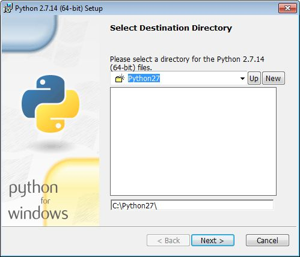
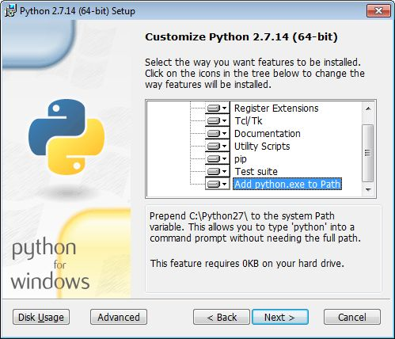
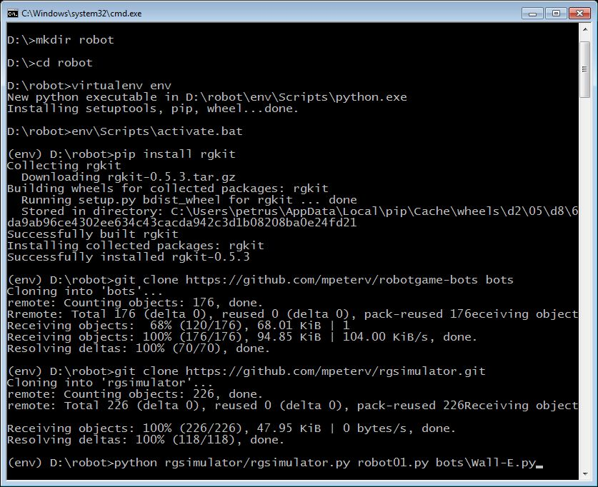

.. _rg-env:

Środowisko testowe
##################

Do budowania i testowania robotów używamy pakietu *rgkit*. Działa on
pod Pythonem 2 i 3, ale symulator, który jest nieocenionym narzędziem
testowania robotów, działa tylko w Pythonie 2. W Linuksie interpreter jest
zainstalowany domyślnie. W MS Windows ze strony `Python Releases <https://www.python.org/downloads/windows/>`_
pobieramy instalator *Windows x86-64 MSI installer* (wersja 64-bitowa)
lub *Windows x86 MSI installer* (wersja 32-bitowa). Podczas instalacji
zaznaczamy opcję "Add python.exe to path".

Środowisko deweloperskie przygotujemy w katalogu :file:`robot`.

.. note::

  W polecanych przez nas dystrybucjach :ref:`Linux Live <linux-live>`
  środowisko testowe jest już przygotowane.

W terminalu wydajemy polecenia:

.. code-block:: bash

    ~$ mkdir robot; cd robot
    ~robot$ virtualenv -p python2.7 env
    ~robot$ source env/bin/activate
    (env):~/robot$ pip install rgkit

.. note::

  W systemie Windows:

  - po instalacji Pythona 2, trzeba doinstalować narzędzie do tworzenia
    wirtualnego środowiska poleceniem w terminalu: ``pip2 install virtualenv``,
  - polecenie aktywujące środowisko wirtualne będzie miało postać ``env\Scripts\activate.bat``.

Dodatkowo instalujemy pakiet zawierający roboty open source, następnie symulator
ułatwiający testowanie, a na koniec tworzymy skrót do jego uruchamiania:

.. code-block:: bash

    (env):~/robot$ git clone https://github.com/mpeterv/robotgame-bots bots
    (env):~/robot$ git clone https://github.com/mpeterv/rgsimulator.git
    (env):~/robot$ ln -s rgsimulator/rgsimulator.py symuluj

Po wykonaniu wszystkich powyższych poleceń i komendy ``ls -l`` powinniśmy zobaczyć:

.. figure:: img/rgkit_env.png

Kolejne wersje robota proponujemy zapisywać w plikach *robot01.py*, *robot02.py*
itd. Będziemy mogli je uruchamiać lub testować za pomocą poleceń:

.. code-block:: bash

    (env)~/robot$ rgrun robot01.py robot02.py
    (env)~/robot$ rgrun bots/stupid26.py robot01.py
    (env)~/robot$ python ./symuluj robot01.py
    (env)~/robot$ python ./symuluj robot01.py robot02.py

Obsługa symulatora
******************

* Klawisz **F**: utworzenie robota-przyjaciela w zaznaczonym polu.
* Klawisz **E**: utworzenie robota-wroga w zaznaczonym polu.
* Klawisze **Delete** or **Backspace**: usunięcie robota z zaznaczonego pola.
* Klawisz **H**: zmiana punktów HP robota.
* Klawisz **C**: wyczyszczenie planszy gry.
* Klawisz **Spacja**: pokazuje planowane ruchy robotów.
* Klawisz **Enter**: uruchomienie rundy.
* Klawisz **G**: tworzy i usuwa roboty w punktach wejścia (ang. *spawn locations*), "generowanie robotów".

.. attention::

    Opisana instalacja zakłada użycie środowiska wirtualnego tworzonego
    przez polecenie *virtualenv*. Przed uruchomieniem rozgrywki
    lub symulacji trzeba pamiętać o wydaniu w katalogu :file:`robot` polecenia
    ``source env/bin/activate`` (Linux) lub ``env\\Scripts\\activate.bat`` (Windows).
    Poleceniem ``deactivate`` opuszczamy środowisko wirtualne.
