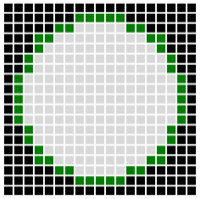
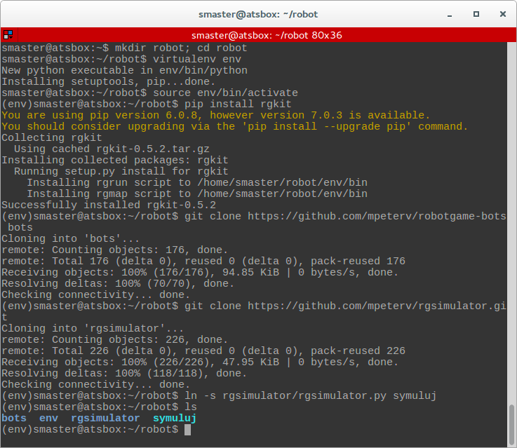

Zasady i zaczynamy
###################

`RobotGame <https://robotgame.net>`_ to gra, w której walczą ze sobą programy – roboty
na planszy o wymiarach 19x19 pól. Celem gry jest umieszczenie na niej
jak największej ilości robotów w ciągu 100 rund rozgrywki.

Czarne pola (ang. *obstacle*) wyznaczają granicę areny walk, zielone pola
(ang. *spawn points*) to punkty wejścia, w których co **10** rund pojawia się
po **5** robotów, każdy z 50 punktami HP (ang. *health points*) na starcie.

W każdej rundzie każdy robot musi wybrać jedno z następujących działań:

* **Ruch** (ang. *move*) na przyległe pole w pionie (góra, dół) lub poziomie
  (lewo, prawo). W przypadku, kiedy w polu docelowym znajduje się lub znajdzie
  się inny robot następuje *kolizja* i utrata po 5 punktów HP.
* **Atak** (ang. *attack*) na przyległe pole, wrogi robot na tym polu traci
  8-10 punktów HP.
* **Samobójstwo** (ang. *suicide*) – robot ginie pod koniec rundy zabierając
  wszystkim wrogim robotom obok po 15 punktów HP.
* **Obrona** (ang. *guard*) – robot pozostaje w miejscu, tracąc połowę punktów
  HP w wyniku ataku lub samobójstwa.

W grze nie można uszkodzić własnych robotów.

Sztuczna inteligencja
**********************

Zadaniem gracza jest stworzenie sztucznej inteligencji robota, która pozwoli
mu w określonych sytuacjach na arenie wybrać odpowiednie działanie.
Trzeba więc: określić daną sytuację, ustalić działanie robota, zakodować je
i przetestować, np.:

1) Gdzie ma iść robot po po wejściu na arenę?
2) Działanie: "Idź do środka".
3) Jaki kod umożliwi robotowi realizowanie tej reguły?
4) Czy to działa?

Aby ułatwić budowanie robota, przedstawiamy kilka przykładowych reguł
i "klocków", z których można zacząć składać swojego robota. Pokazujemy również,
jak testować swoje roboty. Nie podajemy jednak "przepisu" na robota najlepszego.
Do tego musisz dojść sam.

.. _rg-env:

Środowisko testowe
*******************

Do budowania i testowania robotów używamy biblioteki *rg* z pakietu *rgkit*.
Przygotujemy więc środowisko deweloperskie w katalogu :file:`robot`.

.. attention::

    Jeżeli korzystasz z polecanej przez nas na warsztaty dystrybucji *LxPupXenial*,
    środowisko testowe jest już przygotowane w katlogu :file:`~/robot`.

W terminalu wydajemy polecenia:

.. code-block:: bash

    ~$ mkdir robot; cd robot
    ~robot$ virtualenv env
    ~robot$ source env/bin/activate
    (env):~/robot$ pip install rgkit

Dodatkowo instalujemy pakiet zawierający roboty open source, następnie symulator
ułatwiający testowanie, a na koniec tworzymy skrót do jego uruchamiania:

.. code-block:: bash

    (env):~/robot$ git clone https://github.com/mpeterv/robotgame-bots bots
    (env):~/robot$ git clone https://github.com/mpeterv/rgsimulator.git
    (env):~/robot$ ln -s rgsimulator/rgsimulator.py symuluj

Po wykonaniu wszystkich powyższych poleceń i komendy ``ls -l`` powinniśmy zobaczyć:

Kolejne wersje robota proponujemy zapisywać w plikach *robot01.py*, *robot02.py*
itd. Będziemy mogli je uruchamiać lub testować za pomocą poleceń:

.. code-block:: bash

    (env)~/robot$ rgrun robot01.py robot02.py
    (env)~/robot$ rgrun bots/stupid26.py robot01.py
    (env)~/robot$ python ./symuluj robot01.py robot02.py

Obsługa symulatora
******************

* Klawisz **F**: utworzenie robota-przyjaciela w zaznaczonym polu.
* Klawisz **E**: utworzenie robota-wroga w zaznaczonym polu.
* Klawisze **Delete** or **Backspace**: usunięcie robota z zaznaczonego pola.
* Klawisz **H**: zmiana punktów HP robota.
* Klawisz **C**: wyczyszczenie planszy gry.
* Klawisz **Spacja**: pokazuje planowane ruchy robotów.
* Klawisz **Enter**: uruchomienie rundy.
* Klawisz **G**: tworzy i usuwa roboty w punktach wejścia (ang. *spawn locations*), "generowanie robotów".

.. attention::

    Opisana instalacja zakłada użycie środowiska wirtualnego tworzonego
    przez polecenie *virtualenv*, dlatego przed uruchomieniem rozgrywki
    lub symulacji trzeba pamiętać o wydaniu w katalogu :file:`robot` polecenia
    ``source env/bin/activate``. Poleceniem ``deactivate`` opuszczamy
    środowisko wirtualne.
