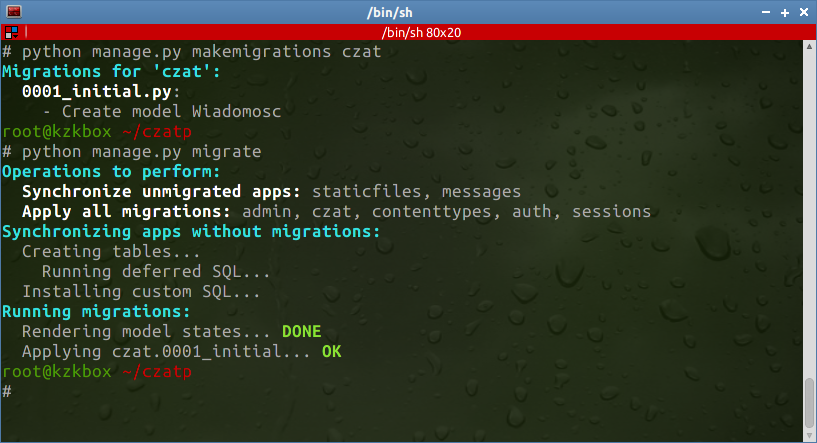
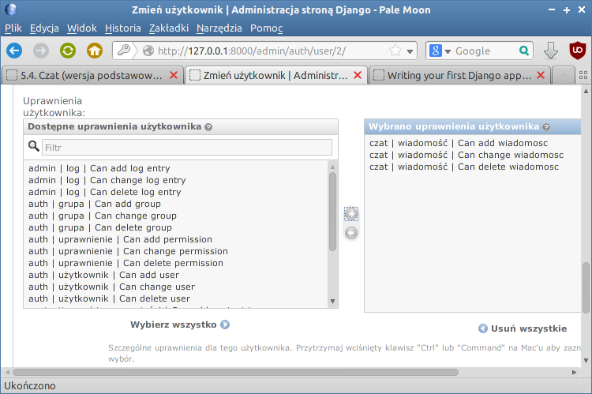
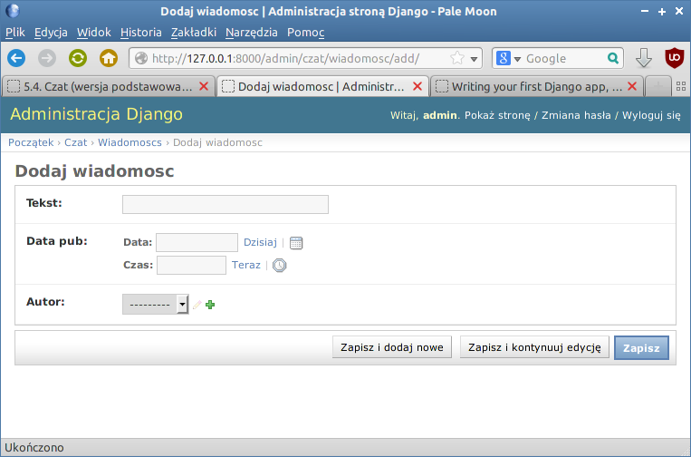
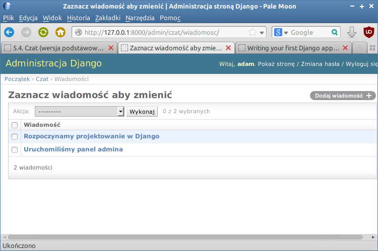
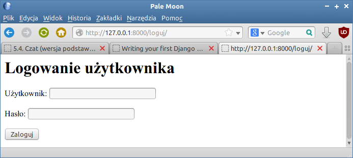
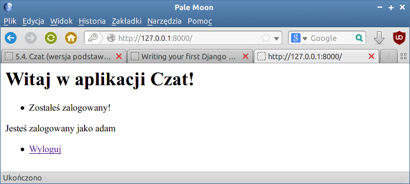
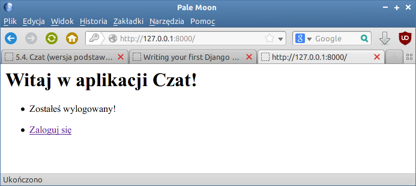
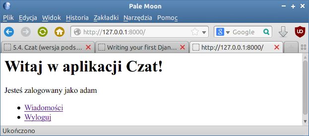
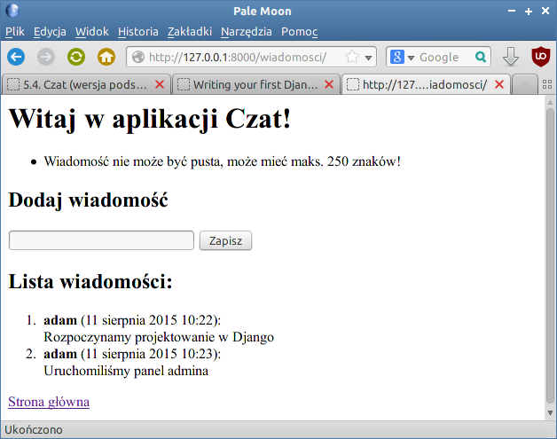

.. _czat-app:

Czat (cz. 1)
###########################

.. highlight:: python

Zastosowanie Pythona i frameworka Django do stworzenia aplikacji internetowej
Czat; prostego czata, w którym zarejestrowani użytkownicy będą mogli wymieniać się
krótkimi wiadomościami.

.. attention::

    **Wymagane oprogramowanie**:

      * Python v. 3.x
      * Django v. 1.11.2
      * Interpreter bazy SQLite3

.. contents::
    :depth: 1
    :local:

Środowisko
==========

W katalogu domowym tworzymy wirtualne środowisko Pythona:

.. raw:: html

    
Terminal nr 

.. code-block:: bash

    ~$ virtualenv -p python3 pve3
    ~$ source pve3/bin/activate
    (pve3) ~$ pip install Django==1.11.2

.. warning::

    Polecenie ``source pve3/bin/activate`` aktywuje wirtualne środowisko Pythona.
    Zawsze wydajemy je przed rozpoczęciem pracy nad projektem. Innymi słowy w terminalu
    ścieżka katalogu musi być poprzedzona prefiksem wirtualnego środowiska: ``(pve3)``.

Projekt i aplikacja
===================

Utworzymy nowy projekt Django. Wydajemy polecenia:

.. raw:: html

    
Terminal nr 

.. code-block:: bash

    (pve3) ~/$ django-admin.py startproject czat1
    (pve3) ~$ cd czat1
    (pve3) ~$ python manage.py migrate

- Opcja ``startproject`` tworzy katalog :file:`czat1` z **podkatalogiem ustawień projektu**
  o takiej samej nazwie (:file:`czat1`).
- Opcja ``migrate`` – tworzy inicjalną bazę danych z tabelami wykorzystywanymi przez Django.

**Struktura plików projektu** – w terminalu wydajemy jedno z poleceń:

.. code-block:: bash

    (.pve) ~/czat1$ tree -L 2
    [lub]
    (.pve) ~/czat1$ ls -R

Zewnętrzny katalog :file:`czat1` to tylko pojemnik na projekt, jego nazwę można zmieniać.
Zawiera on:

    - :file:`manage.py` – skrypt Pythona do zarządzania projektem;
    - :file:`db.sqlite3` – bazę danych w domyślnym formacie SQLite3.

**Katlog projektu** :file:`czat1/czat1` zawiera:

    - :file:`settings.py` – konfiguracja projektu;
    - :file:`urls.py` – lista osbługiwanych adresów URL;
    - :file:`wsgi.py` – plik konfiguracyjny wykorzystywany przez serwery WWW.

Plik :file:`__init__.py` obecny w danym katalogu wskazuje, że dany katalog jest modułem Pythona.

Serwer deweloperski
===================

Serwer uruchamiamy poleceniem w terminalu:

.. code-block:: bash

    (pve3) ~/czat1$ python manage.py runserver

Łączymy się z serwerem wpisując w przeglądarce adres: ``127.0.0.1:8000``.
W terminalu możemy obserwować żądania obsługiwane przez serwer.
Większość zmian w kodzie nie wymaga restartowania serwera.
Serwer zatrzymujemy naciskając w terminalu skrót :kbd:`CTRL+C`.

Aplikacja
=========

W ramach jednego projektu (serwisu internetowego) może działać wiele aplikacji.
Utworzymy teraz naszą aplikację `czat` i zbadamy jej strukturę plików:

.. code-block:: bash

    (.pve) ~/czat1$ python manage.py startapp czat
    (.pve) ~/czat1$ tree czat
    lub:
    (.pve) ~/czat1$ ls -R czat

.. figure:: img/django_03.jpg

**Katalog aplikacji** :file:`czat1/czat` zawiera:

    - :file:`apps.py` – ustawienia aplikacji;
    - :file:`admin.py` – konfigurację panelu administracyjnego;
    - :file:`models.py` – plik definiujący modele danych przechowywanych w bazie;
    - :file:`views.py` – plik zawierający funkcje lub klasy definiujące tzw. *widoki* (ang. *views*), obsługujące żądania klienta przychodzące do serwera.

Ustawienia projektu
===================

Dostosoujemy ustawienia projektu: zarejestrujemy naszą aplikację w projekcie,
ustawimy polską wersję językową oraz zlokalizujemy datę i czas.
Edytujemy plik :file:`czat1/settings.py`:

.. raw:: html

    
Kod nr 

.. code-block:: python

    # czat1/settings.py

    INSTALLED_APPS = (
        'django.contrib.admin',
        'django.contrib.auth',
        'django.contrib.contenttypes',
        'django.contrib.sessions',
        'django.contrib.messages',
        'django.contrib.staticfiles',

        'czat',  # rejestrujemy aplikacje
    )

    LANGUAGE_CODE = 'pl'  # ustawienie jezyka

    TIME_ZONE = 'Europe/Warsaw'  # ustawienie strefy czasowej

Uruchom ponownie serwer deweloperski i sprawdź w przeglądarce, jak wygląda strona powitalna.

Strona domyślna
===============

**Mapowanie adresów URL** aplikacji umieszczamy w nowym pliku :file:`czat/urls.py`:

.. raw:: html

    
Kod nr 

.. highlight:: python
.. literalinclude:: urls-app_01.py
    :linenos:
    :lineno-start: 1
    :lines: 1-
    :emphasize-lines: 3, 5, 7

- Zmienna ``app-name`` określa przestrzeń nazw, w której dostępne będą adresy URL aplikacji.
- Lista ``urlpatterns`` zawiera powiązania adresów URL z widokami zapisanymi w pliku :file:`views.py`,
  który importujemy w drugiej linii.

Funkcja ``url()`` przyporządkowuje adresowi URL widok, który go obsługuje. Pierwszy parametr to wyrażenie
regularne, do którego Django próbuje dopasować adres otrzymany w żądaniu od klienta. Drugi to nazwa widoku.
Trzeci to unikalna nazwa, dzięki której można odwoływać się w aplikacji do zdefiniowanego adresu.

**Konfiguracja adresów URL projektu** zawarta jest w pliku :file:`malybar/urls.py`.
W tym miejscu dołączamy listy adresów URL zdefiniowane przez poszczególne aplikacje.

.. raw:: html

    
Kod nr 

.. highlight:: python
.. literalinclude:: malybar/urls_01.py
    :linenos:
    :lineno-start: 16
    :lines: 16-24
    :emphasize-lines: 3, 6-7

Funkcja ``include()`` jako parametr przyjmuje ścieżkę dostępu do konfiguracji adresów danej
aplikacji. W praktyce jest to nazwa katalogu, w którym znajduje się aplikacja, operator ``.`` (kropka)
oraz domyślna nazwa pliku konfiguracyjnego :file:`urls.py` bez rozszerzenia.

**Widok** definiuje jakiś typ strony WWW, za pomocą którego użytkownik wykonuje w aplikacji
jakieś operacje, np. wyświetla zestawienie danych. Technicznie widok zazwyczaj składa się
z funkcji otrzymującej żądanie klienta i jakiegoś szablonu służącego prezentowaniu danych.

Widok domyślny obsługujący żądania typu GET przychodzące na adres podstawowy serwera
zdefiniujemy w pliku :file:`pizza/views.py`:

.. raw:: html

    
Kod nr 

.. highlight:: python
.. literalinclude:: pizza/views_01.py
    :linenos:
    :lineno-start: 1
    :lines: 1-

.. attention::

    **Zapamiętaj:**

    - linia ``# -*- coding: utf-8 -*-`` to określenie kodowania znaków. Należy umieszczać je w pierwszej linii każdego pliku, w którym zamierzamy używać polskich znaków, czy to w komentarzach czy w kodzie.
    - napisy zawierające polskie znaki poprzedzamy literą `u`, np. ``u'składnik'``.

Nazwa funkcji – ``index()`` – jest umowna. Każdy widok otrzymuje szczegóły żądania wysłanego przez klienta
(obiekt typu ``HttpRequest``) i powinien zwrócić jakąś odpowiedź (``HttpResponse``).
W tym wypadku zwracamy funkcję ``render()`` wywołującą wskazany jako drugi parametr szablon,
który otrzymuje dane w postaci słownika ``kontekst`` (nazwa umowna).

Model danych
============

Budowanie aplikacji w Django nawiązuje do wzorca projektowego :term:`MVC`, czyli
Model-Widok-Kontroler. Więcej informacji na ten temat umieściliśmy w osobnym
materiale :ref:`MVC <mvc_wzorzec>`.

Zaczynamy więc od zdefiniowania modelu (zob. :term:`model`), czyli klasy opisującej tabelę zawierającą
wiadomości. Atrybuty klasy odpowiadają polom tabeli. Instancje tej klasy będą reprezentować wiadomości
utworzone przez użytkowników, czyli rekordy tabeli. Każda wiadomość będzie zwierała treść,
datę dodania oraz wskazanie autora (użytkownika).

W pliku :file:`czat/models.py` wpisujemy:

.. raw:: html

    
Kod nr 

.. highlight:: python
.. literalinclude:: models_z1.py
    :linenos:

Opisując klasę ``Wiadomosc`` podajemy nazwy poszczególnych właściwości (pól)
oraz typy przechowywanych w nich danych.
Po zdefiniowaniu przynajmniej jednego modelu możemy zaktualizować bazę danych,
czyli zmienić/dodać potrzebne tabele:

.. raw:: html

    
Terminal nr 

.. code-block:: bash

    ~/czatpro$ python manage.py makemigrations czat
    ~/czatpro$ python manage.py migrate

.. note::

    Domyślnie Django korzysta z bazy SQLite zapisanej w pliku :file:`db.sqlite3`.
    Warto zobaczyć, jak wygląda. W terminalu wydajemy polecenie ``python manage.py dbshell``,
    które otworzy bazę w interpreterze ``sqlite3``. Następnie:
    * ``.tables`` - pokaże listę tabel;
    * ``.schema czat_wiadomosc`` - pokaże instrukcje SQL-a użyte do utworzenia podanej tabeli
    * ``.quit`` - wyjście z interpretera.

.. figure:: img/czat03.png

Panel administracyjny
**********************

Utworzymy panel administratora dla projektu, dzięki czemu będziemy mogli zacząć
dodawać użytkowników i wprowadzać dane. Otwieramy więc plik :file:`~/czat/czat/admin.py`
i rejestrujemy w nim nasz model jako element panelu:

.. raw:: html

    
Kod nr 

.. highlight:: python
.. literalinclude:: admin.py
    :linenos:
    :emphasize-lines: 5, 8

.. note::

    Warto zapamiętać, że każdy model, funkcję, formularz czy widok, których chcemy użyć,
    musimy najpierw zaimportować za pomocą klauzuli typu ``from <skąd> import <co>``.

Do celów administracyjnych potrzebne nam będzie odpowiednie konto. Tworzymy
je, wydając w terminalu poniższe polecenie. Django zapyta o nazwę, email i hasło administratora.
Podajemy: "admin", "", "admin".

.. raw:: html

    
Terminal nr 

.. code-block:: bash

    ~/czatpro$ python manage.py createsuperuser

Po ewentualnym ponownym uruchomieniu serwera wchodzimy na adres *127.0.0.1:8000/admin/*.
Logujemy się podając dane wprowadzone podczas tworzenia bazy.
Otrzymamy dostęp do panelu administracyjnego, w którym możemy dodawać nowych użytkowników i wiadomości [#]_.

.. [#] Bezpieczna aplikacja powinna dysponować osobnym mechanizmem rejestracji
   użytkowników i dodawania wiadomości, tak by nie trzeba było udostępniać
   panelu administracyjnego osobom postronnym.

.. figure:: img/czat04.png

Ćwiczenie 1
============

Po zalogowaniu na konto administratora dodaj użytkownika "adam".
Na stronie szczegółów, która wyświetli się po jego utworzeniu, zaznacz
opcję "W zespole", następnie w panelu "Dostępne uprawnienia" zaznacz opcje
dodawania (*add*), zmieniania (*change*) oraz usuwania (*del*) wiadomości
(wpisy typu: "czat | wiadomosc | Can add wiadomosc") i przypisz je
użytkownikowi naciskając strzałkę w prawo.

Przeloguj się na konto "adam" i dodaj dwie przykładowe wiadomości.
Następnie utwórz w opisany wyżej sposób kolejnego użytkownika o nazwie "ewa"
i po przelogowaniu się dodaj co najmniej 1 wiadomość.

.. raw:: html

    

Model w panelu
==============

W formularzu dodawania wiadomości widać, że etykiety nie są spolszczone, z kolei
dodane wiadomości wyświetlają się na liście jako "Wiadomosc object".
Aby poprawić te niedoskonałości, uzupełniamy plik :file:`models.py`:

.. raw:: html

    
Kod nr 

.. highlight:: python
.. literalinclude:: models.py
    :linenos:
    :emphasize-lines: 2-3
    :lineno-start: 10
    :lines: 10-21

W definicji każdego pola jako pierwszy argument dopisujemy spolszczoną etykietę,
np. ``u'data publikacji'``. W podklasie ``Meta`` podajemy nazwy modelu w liczbie
pojedynczej i mnogiej. Dodajemy też funkcję ``__unicode__``, której zadaniem
jest "autoprezentacja" klasy, czyli wyświetlenie treści wiadomości.
Po odświeżeniu panelu administracyjnego (np. klawiszem :kbd:`F5`) nazwy zostaną spolszczone.

.. note::

    Prefiks ``u`` wymagany w Pythonie v.2 przed łańcuchami znaków oznacza
    kodowanie w unikodzie (ang. *unicode*) umożliwiające wyświetlanie m.in. znaków narodowych.

.. tip::

    W Pythonie v.3 zamiast nazwy funkcji ``_unicode__`` należy użyć ``str``.

Widoki i szablony
*******************

Panel administracyjny już mamy, ale po wejściu na stronę główną zwykły użytkownik
niczego poza standardowym powitaniem Django nie widzi. Zajmiemy się teraz
stronami po stronie (:-)) użytkownika.

Aby utworzyć stronę główną, zakodujemy pierwszy :term:`widok` (zob. :ref:`więcej »»» <mvc_widok>`),
czyli funkcję o przykładowej nazwie ``index()``, którą powiążemy z adresem URL głównej strony (/).
Najprostszy widok zwraca jakiś tekst: ``return HttpResponse("Witaj w aplikacji Czat!")``.
W pliku :file:`views.py` umieszczamy:

.. raw:: html

    
Kod nr 

.. highlight:: python
.. literalinclude:: views_z1.py
    :linenos:
    :emphasize-lines: 9

Teraz musimy **powiązać widok z adresem url**. Na początku do pliku projektu :file:`czatpro/urls.py`
dopiszemy import ustawień z naszej aplikacji:

.. raw:: html

    
Kod nr 

.. highlight:: python
.. literalinclude:: urls_p1.py
    :linenos:
    :emphasize-lines: 2-3
    :lineno-start: 19
    :lines: 19-

Parametr ``namespace='czat'`` definiuje przestrzeń nazw, w której dostępne będą zdefiniowane
dla naszej aplikacji mapowania między adresami url a widokami.

Następnie **tworzymy (!)** plik :file:`czat/urls.py` o następującej treści:

.. raw:: html

    
Kod nr 

.. highlight:: python
.. literalinclude:: urls_z1.py
    :linenos:
    :emphasize-lines: 5, 8

Podstawową funkcją wiążącą adres z widokiem jest ``url()``. Jako pierwszy parametr przyjmuje wyrażenie
regularne oznaczane ``r`` przed łańcuchem dopasowania. Symbol ``^`` to początek,
``$`` – koniec łańcucha. Zapis ``r'^$'`` to adres główny serwera.
Drugi parametr wskazuje widok (funkcję), która ma obsłużyć dany adres.
Trzeci parametr ``name`` pozwala zapamiętać skojarzenie url-a i widoku pod nazwą,
której będzie można użyć np. do wygenerowania adresu linku.

Przetestujmy nasz widok wywołując adres ``127.0.0.1:8000``. Powinniśmy zobaczyć tekst
podany jako argument funkcji ``HttpResponse()``:

.. figure:: img/czat10.png

.. raw:: html

    

Zazwyczaj odpowiedzią na wywołanie jakiegoś adresu URL będzie jednak jakaś
strona zapisana w języku HTML. **Szablony** takich stron umieszczamy w podkatalogu
``templates/nazwa aplikacji``. Tworzymy więc katalog:

.. raw:: html

    
Terminal nr 

.. code-block:: bash

    ~/czatpro$ mkdir -p czat/templates/czat

Następnie tworzymy szablon :file:`~/czatpro/czat/templates/czat/index.html`, który zawiera:

.. raw:: html

    
Plik <i>index.html</i>. Kod nr 

.. highlight:: html
.. literalinclude:: index_z2.html
    :linenos:

W pliku :file:`views.py` zmieniamy instrukcje odpowiedzi:

.. raw:: html

    
Kod nr 

.. highlight:: python
.. literalinclude:: views_z2.py
    :linenos:
    :emphasize-lines: 1-2, 7-8
    :lineno-start: 4
    :lines: 4-11

Po zaimportowaniu funkcji ``render()`` używamy jej do zwrócenia szablonu.
Jako pierwszy argument podajemy obiekt typu ``HttpRequest`` zawierający informacje o żądaniu,
a jako drugi nazwę szablonu z katalogiem nadrzędnym.

Po uruchomieniu serwera i wpisaniu adresu *127.0.0.1:8000* zobaczymy tekst, który umieściliśmy w szablonie:

.. figure:: img/czat11.png

(Wy)logowanie
********************

Udostępnimy użytkownikom możliwość logowania i wylogowywania się, aby mogli dodawać i przeglądać
wiadomości.

Na początku w pliku :file:`views.py`, jak zawsze, dopisujemy importy wymaganych obiektów,
później dodajemy widoki ``loguj()`` i ``wyloguj()``:

.. raw:: html

    
Kod nr 

.. highlight:: python
.. literalinclude:: views.py
    :linenos:
    :lineno-start: 6
    :lines: 6-9

.. raw:: html

    
Kod nr 

.. highlight:: python
.. literalinclude:: views.py
    :linenos:
    :lineno-start: 20
    :lines: 20-38

Widoki mogą obsługiwać zarówno żądania typu :term:`GET`, kiedy użytkownik chce tylko zobaczyć
jakieś dane na stronie, oraz :term:`POST`, gdy wysyła informacje poprzez formularz, aby np. zostały zapisane.
Typ żądania rozpoznajemy w instrukcji warunkowej ``if request.method == 'POST':``.

W **widoku logowania** korzystamy z wbudowanego w Django formularza ``AuthenticationForm``,
dzięki temu nie musimy "ręcznie" sprawdzać poprawności przesłanych danych. Po wypełnieniu
formularza przesłanymi danymi (``form = AuthenticationForm(request, request.POST)``)
robi to metoda ``is_valid()``. Jeżeli nie zwróci ona błędu,
możemy zalogować użytkownika za pomocą funkcji ``login()``,
której przekazujemy żądanie (obiekt typu ``HttpRequest``) i informację o użytkowniku
zwrócone przez metodę ``get_user()`` formularza.

Tworzymy również informację zwrotną dla użytkownika, wykorzystując system komunikatów:
``messages.error(request, "...")``. Tak utworzone komunikaty możemy odczytać
w każdym szablonie ze zmiennej ``messages``.

Na żądanie wyświetlenia strony (typu GET), widok logowania zwraca szablon :file:`loguj.html`,
któremu w słowniku ``kontekst`` udostępniamy pusty formularz logowania:
``return render(request, 'czat/loguj.html', kontekst)``.

**Wylogowanie** polega na użyciu funkcji ``logout(request)`` – wyloguje ona
użytkownika, którego dane zapisane są w przesłanym żądaniu. Po utworzeniu
informacji zwrotnej podobnie jak po udanym logowaniu przekierowujemy użytkownika
na stronę główną (``return redirect(reverse('index'))``) z żądaniem jej wyświetlenia (typu GET).

Dalej potrzebny nam **szablon logowania** :file:`~/czatpro/czat/templates/czat/loguj.html`:

.. raw:: html

    
Plik <i>loguj.html</i>. Kod nr 

.. highlight:: html
.. literalinclude:: loguj_z3.html
    :linenos:

Na początku widzimy, jak sprawdzić, czy użytkownik jest zalogowany (````),
co pozwala różnicować wyświetlaną treść. Użytkownikom niezalogowanym wyświetlamy
formularz. W tym celu musimy ręcznie wstawić znacznik ``<form>``, zabezpieczenie formularza
```` oraz przycisk typu *submit*.
Natomiast przekazany do szablonu formularz Django potrafi wyświetlić automatycznie,
np. używając znaczników akapitów: ``{{ form.as_p }}``.

Trzeba również zapamiętać, jak wstawiamy odnośniki do zdefiniowanych widoków.
Służy do tego kod typu ```` – w cudzysłowach podajemy
na początku przestrzeń nazw przypisaną do aplikacji w pliku projektu :file:`czatpro/urls.py`
(``namespace='czat'``), a później nazwę widoku zdefiniowaną w pliku aplikacji
:file:`czat/urls.py` (``name='index'``).

**Komunikaty zwrotne** przygotowane dla użytkownika w widokach wyświetlimy po
uzupełnieniu szablonu :file:`index.html`. Po znaczniku ``<h1>`` wstawiamy poniższy kod:

.. raw:: html

    
Plik <i>index.html</i>. Kod nr 

.. highlight:: html
.. literalinclude:: index.html
    :linenos:
    :lineno-start: 7
    :lines: 7-13

Jak widać na przykładach, w szablonach używamy **tagów** ```` pozwalających korzystać
z instrukcji warunkowych ``if``, pętli ``for``, czy instrukcji generujących linki ``url``.
**Tagi** ``{{ }}`` umożliwiają wyświetlanie wartości przekazanych zmiennych,
np. ``{{ komunikat }}`` lub wywoływanie metod obiektów, np. {{ form.as_p }}.
Zwracany tekst można dodatkowo formatować za pomocą filtrów,
np. wyświetlać go z dużej litery ``{{ komunikat|capfirst }}``.

Pozostaje **skojarzenie widoków z adresami URL**. W pliku :file:`czat/urls.py` dopisujemy reguły:

.. raw:: html

    
Kod nr 

.. highlight:: python
.. literalinclude:: urls.py
    :linenos:
    :lineno-start: 9
    :lines: 9-10

Możesz przetestować działanie dodanych funkcji wywołując w przeglądarce adresy:
``127.0.0.1:8000/loguj`` i ``127.0.0.1:8000/wyloguj``. Przykładowy formularz
wygląda tak:

Ćwiczenie 2
=================

Adresów logowania i wylogowywania nikt w serwisach nie wpisuje ręcznie.
Wstaw zatem odpowiednie linki do szablonu strony głównej po bloku wyświetlającym
komunikaty. Użytkownik niezalogowany powinien zobaczyć odnośnik *Zaloguj*,
użytkownik zalogowany – *Wyloguj*. Przykładowe działanie stron może wyglądać tak:

Dodawanie wiadomości
***********************************

Chcemy, by zalogowani użytkownicy mogli dodawać wiadomości,
a także przeglądać wiadomości innych.

Jak zwykle, **zaczynamy od widoku** o nazwie np. ``wiadomosci()`` powiązanego z adresem */wiadomosci*,
który zwróci szablon :file:`wiadomosci.html`. W odpowiedzi na żądanie GET wyświetlimy
formularz dodawania oraz listę wiadomości. Kiedy dostaniemy żądanie typu POST
(tzn. kiedy użytkownik wyśle formularz), spróbujemy zapisać nową wiadomość w bazie.
Do pliku :file:`views.py` dodajemy importy i kod funkcji:

.. raw:: html

    
Kod nr 

.. highlight:: python
.. literalinclude:: views.py
    :linenos:
    :lineno-start: 10
    :lines: 10-11

.. raw:: html

    
Kod nr 

.. highlight:: python
.. literalinclude:: views.py
    :linenos:
    :lineno-start: 41
    :lines: 41-59

Po sprawdzeniu typu żądania wydobywamy treść przesłanej wiadomości
ze słownika ``request.POST`` za pomocą metody ``get('tekst', '')``. Jej pierwszy argument
to nazwa pola formularza użytego w szablonie, które chcemy odczytać.
Drugi argument oznacza wartość domyślną, przydatną, jeśli
pole będzie niedostępne.

Po sprawdzeniu długości wiadomości (``if not 0 < len(tekst) <= 250:``),
możemy ją utworzyć wykorzystując konstruktor naszego modelu, podając
jako nazwane argumenty wartości kolejnych pól:
``Wiadomosc(tekst=tekst, data_pub=timezone.now(), autor=request.user)``.
Zapisanie nowej wiadomości w bazie sprowadza się do polecenia ``wiadomosc.save()``.

Pobranie wszystkich wiadomości z bazy realizuje kod: ``Wiadomosc.objects.all()``.
Widać tu, że używamy systemu ORM, a nie "surowego" SQL-a.
Zwrócony obiekt umieszczamy w słowniku ``kontekst`` i przekazujemy do szablonu.

Zadaniem **szablonu** zapisanego w pliku :file:`~/czat/czat/templates/wiadomosci.html`
będzie wyświetlenie komunikatów zwrotnych, np. błędów, formularza dodawania
i listy wiadomości.

.. raw:: html

    
Plik <i>wiadomosci.html</i>. Kod nr 

.. highlight:: html
.. literalinclude:: wiadomosci_z4.html
    :linenos:

Powyżej widać, że inaczej niż w szablonie logowania formularz przygotowaliśmy ręcznie (``<input type="text" name="tekst" />``),
dalej pokażemy, jak można sprawić, aby framework robił to za nas. Widać również, że możemy
wyświetlać atrybuty przekazanych w kontekście obiektów reprezentujących dane pobrane z bazy,
np. ``{{ wiadomosc.tekst }}``.

Widok ``wiadomosci()`` **wiążemy z adresem** */wiadomosci* w pliku :file:`czat/urls.py`,
nadając mu nazwę *wiadomosci*:

.. raw:: html

    
Kod nr 

.. highlight:: python
.. literalinclude:: urls.py
    :linenos:
    :lineno-start: 11
    :lines: 11

Ćwiczenie 3
=============

* W szablonie widoku strony głównej dodaj link do wiadomości dla zalogowanych użytkowników.
* W szablonie wiadomości dodaj link do strony głównej.
* Zaloguj się i przetestuj wyświetlanie [#]_ i dodawanie wiadomości pod adresem
  *127.0.0.1:8000/wiadomosci/*. Sprawdź, co się stanie po wysłaniu pustej
  wiadomości.

.. [#] Jeżeli nie dodałeś do tej pory żadnej wiadomości, lista na początku
   będzie pusta.

Poniższe zrzuty prezentują efekty naszej pracy:

Przetestuj działanie aplikacji.

Materiały
***************

1. O Django http://pl.wikipedia.org/wiki/Django_(informatyka)
2. Strona projektu Django https://www.djangoproject.com/
3. Co to jest framework? http://pl.wikipedia.org/wiki/Framework
4. Co nieco o HTTP i żądaniach GET i POST http://pl.wikipedia.org/wiki/Http

**Źródła:**

* :download:`czatpro_cz1.zip <czatpro_cz1.zip>`
